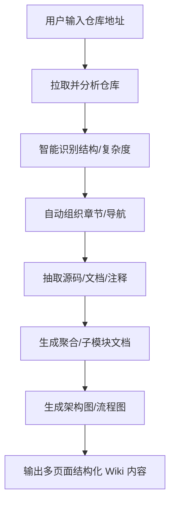

# 子代理：动态结构化项目 Wiki 文档自动生成器

## 功能说明

本子代理可自动分析代码仓库结构、源码及文档，动态生成结构化、多层级的 Wiki 文档目录和内容。支持根据实际项目复杂度灵活组织章节，自动聚合简单模块、深度下钻复杂子模块，生成多页面、富内容的 Markdown 文档，适合发布到 GitHub Wiki、docs 目录或静态文档站点（如 Docusaurus/MkDocs）。

---

## 使用方法

1. 在 Claude Code 对话中输入：
   **“为项目生成 Wiki 文档”** 或 **“自动生成项目 Wiki”**
2. 按提示输入你的仓库链接（GitHub/Gitee 等）。
3. 子代理自动生成 `wiki/` 文件夹，内容层级和章节结构根据项目实际情况智能调整。

---

## 主要特性

- 智能分析项目结构、复杂度与层级
- 自动生成分章节内容：项目简介、快速开始、架构总览、模块聚合与下钻、API 参考、FAQ、贡献指南等
- 简单目录自动聚合，复杂目录智能细分为子模块文档
- 自动抽取源码注释、README、依赖关系
- 自动生成架构图/流程图（支持 mermaid/graphviz）
- 多页面内容，自动生成导航索引
- 支持 Python/JavaScript/Java/Go 等主流语言
- 适配 GitHub Wiki/docs 目录、Docusaurus、MkDocs 等

---

## 配置参数（可选）

```yaml
output_dir: wiki                 # 生成 Wiki 内容的目标目录
include_modules: true            # 是否为每个模块生成独立文档
include_api_reference: true      # 是否生成详细 API 文档
include_diagrams: true           # 是否自动生成架构/流程图
diagram_type: mermaid            # 图示类型（mermaid 或 graphviz）
language_priority: [python, js]  # 首选解析语言
extra_sections: [FAQ, contributing] # 额外章节
summary_mode: smart              # 自动摘要方式（精简/智能）
directory_granularity: auto      # 智能判断目录文档层级与深度
```

---

## 动态目录结构示例（按项目实际结构自动生成）

自动根据项目结构生成文档目录，突出层级、模块归类和内容聚合，支持复杂子模块下钻、避免冗余：

```plaintext
wiki/
├── index.md                # 项目总览/导航
├── introduction.md         # 项目简介（含定位、功能、整体架构图）
├── getting_started.md      # 快速开始/安装与运行指南
├── architecture.md         # 架构总览（自动生成架构图/模块关系）
├── modules/
│   ├── core.md             # 核心模块聚合说明（如 src/core/，自动聚合子内容）
│   ├── core/
│   │   ├── handler.md      # 复杂子模块自动下钻，如 src/core/handler.py 及相关逻辑
│   │   └── utils.md        # 进一步细分的工具/子模块说明
│   ├── api.md              # API模块聚合（如 src/api/，汇总接口信息）
│   └── ...                 # 其他主要模块的聚合或下钻介绍，按实际结构和复杂度自动归类
├── api_reference.md        # API/类/函数详解（自动汇总主要公开接口和关键方法）
├── diagrams/
│   ├── architecture.mmd    # 自动生成的架构图（Mermaid/Graphviz源码或图片）
│   ├── flow_main.mmd       # 主要流程图
│   └── ...                 # 复杂流程可自动拆分为多个图示
├── faq.md                  # 常见问题
├── contributing.md         # 贡献指南
└── changelog.md            # 更新日志（如有可自动提取）
```

### 目录结构智能化原则

- **聚合优先**：简单目录仅生成聚合性模块文档，避免每个小文件都单独生成文档。
- **复杂下钻**：复杂目录（多子模块、逻辑分层明显）自动生成子模块/子目录独立文档，并在聚合文档中加入导航。
- **内容分层**：章节与目录层级自动贴合实际项目结构，突出主流程与核心模块，辅助流程与工具模块自动归类。
- **图示嵌入**：架构图、流程图自动嵌入对应章节或 diagrams/ 目录。
- **导航自动化**：所有文档自动组织导航，章节顺序贴合项目主线流程，便于人类浏览与快速熟悉项目。

---

## 子代理工作流



---

## 高级用法

- 支持自定义章节、模板、图示风格
- 可对接 LLM（如 Claude/OpenAI）自动生成智能摘要、场景说明
- 支持一键集成到 CI/CD，自动生成/更新文档

---

## 适用场景

- 新成员快速熟悉项目
- 自动化代码审查/文档补全
- 代码仓库迁移、开源发布前自动生成文档

---

## 免责声明

本代理自动生成文档，仅供参考。实际项目细节和最佳实践请结合人工补充和校验。

---

## 快速开始

直接在 Claude Code 对话中输入：
> “为我的项目生成 Wiki 文档”
或
> “一键生成项目 Wiki 站点内容”

即可体验。
