# Neovate Code 架构设计

> 深入理解 Neovate Code 的整体架构、核心模块、数据流转和设计模式

- source: [src/](../src/)

## 目录

- [概述](#概述)
- [目录结构](#目录结构)
- [整体架构](#整体架构)
- [核心模块](#核心模块)
- [数据流转](#数据流转)
- [设计模式](#设计模式)
- [关键流程](#关键流程)
- [扩展机制](#扩展机制)

---

## 概述

Neovate Code 是一个基于 AI 的代码助手 CLI 工具，采用模块化架构设计，支持多种 AI 模型、插件扩展和 MCP 协议集成。

### 核心特性

- 🤖 **多模型支持**: OpenAI、Anthropic、Google、DeepSeek 等
- 🔌 **插件系统**: 丰富的钩子机制支持功能扩展
- 🛠️ **工具集成**: Bash、文件操作、网络请求等内置工具
- 💬 **交互模式**: 基于 Ink + React 的终端 UI
- 📝 **会话管理**: 会话持久化与恢复
- 🌐 **MCP 协议**: 支持 Model Context Protocol

### 技术栈

- **运行时**: Bun / Node.js
- **语言**: TypeScript
- **UI 框架**: React + Ink
- **AI SDK**: @openai/agents, AI SDK
- **构建工具**: tsup

---

## 目录结构

```
src/
├── index.ts              # 入口文件
├── cli.ts                # CLI 入口
├── context.ts            # 上下文管理
├── project.ts            # 项目管理
├── session.ts            # 会话管理
├── query.ts              # 查询接口
├── loop.ts               # AI 交互循环
├── model.ts              # 模型管理
├── tool.ts               # 工具系统
├── plugin.ts             # 插件系统
├── config.ts             # 配置管理
├── mcp.ts                # MCP 管理
├── paths.ts              # 路径管理
├── uiBridge.ts           # UI 桥接
├── nodeBridge.ts         # Node 桥接
├── messageBus.ts         # 消息总线
├── commands/             # 子命令
├── tools/                # 内置工具
├── ui/                   # UI 组件
└── utils/                # 工具函数
```

---

## 整体架构

本章节包含三个核心架构图：
- **分层架构图**: 清晰展示从用户层到基础设施层的完整结构
- **数据流程图**: 详细说明消息在各模块间的流转
- **时序图**: 展示交互模式下的完整交互流程

### 架构分层图

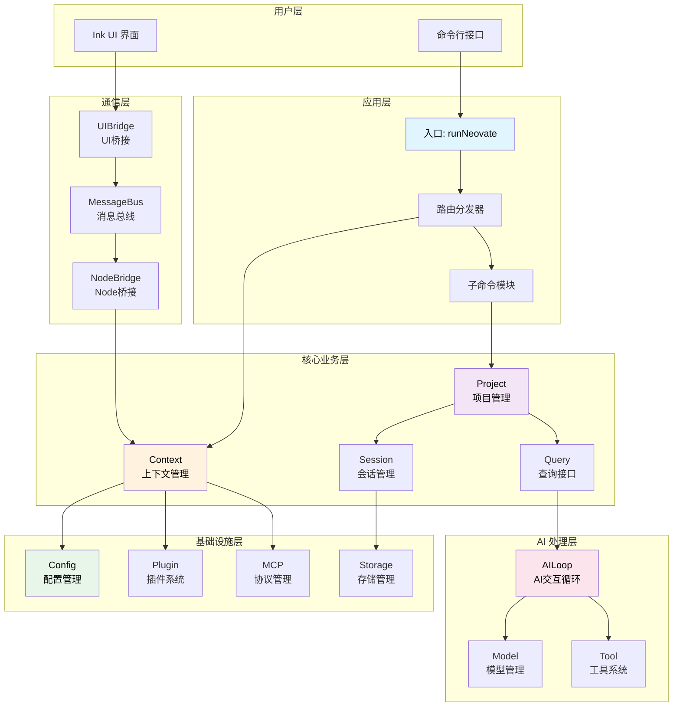

### 数据流向图（完整版）

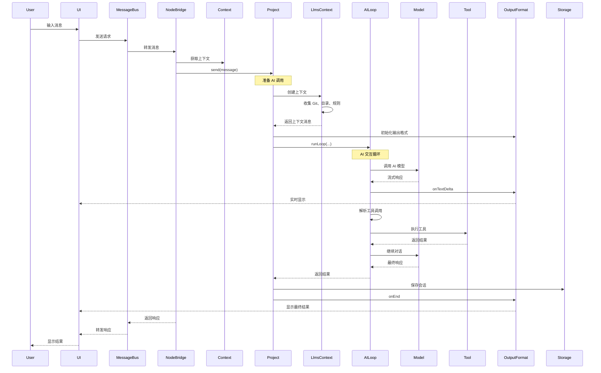

### 简化数据流向图

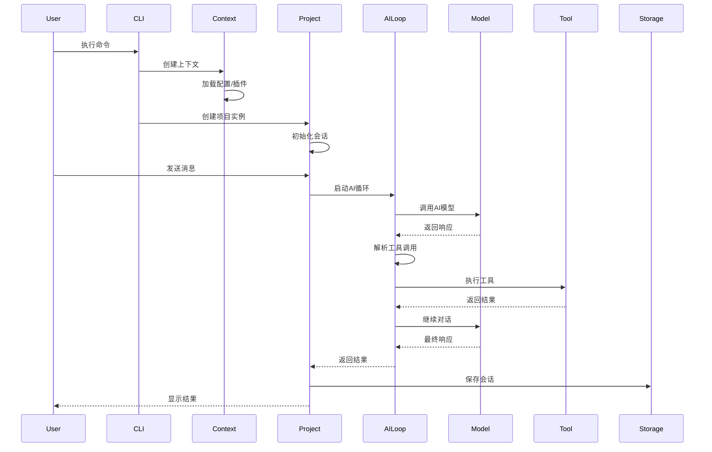

### 架构分层说明

Neovate Code 采用清晰的分层架构，从用户层到基础设施层共6层：

#### **用户层**
- **CLI** - 命令行接口
- **UI** - Ink + React 终端界面

#### **应用层**
- **runNeovate** - 入口函数
- **路由分发器** - 命令路由
- **子命令模块** - config、commit、review 等

#### **通信层** ⭐ NEW

核心职责：实现 UI 进程与业务逻辑进程的双向通信

- **MessageBus** - 消息总线
  - 请求-响应协调
  - 事件订阅分发
  - 消息ID管理
  
- **UIBridge** - UI 桥接
  - 工具审批处理
  - UI 事件监听
  
- **NodeBridge** - Node 桥接  
  - 业务逻辑调用
  - 40+ 消息处理器
  - Context 缓存管理

详见：[Bridge 架构文档](./bridge-architecture.md)

#### **核心业务层**
- **Context** - 上下文管理（配置、插件、MCP）
- **Project** - 项目管理（会话、发送消息）
- **Session** - 会话管理（历史、恢复）
- **Query** - 查询接口（统一入口）

#### **AI 处理层**

核心职责：AI 交互和能力扩展

- **Loop** - AI 交互循环
  - 流式处理
  - 工具调用循环
  - 历史管理
  
- **Model** - 模型管理
  - 多提供商支持
  - 模型解析
  - 配置合并
  
- **Tool** - 工具系统
  - 内置工具集
  - 审批机制
  - 插件扩展

- **LlmsContext** - 上下文组装 ⭐ NEW
  - Git 状态
  - 目录结构
  - 项目规则
  - 环境信息
  
- **OutputFormat** - 输出格式化 ⭐ NEW
  - 流式输出
  - 格式转换
  - 实时显示

#### **基础设施层**
- **Config** - 配置管理（全局/项目/会话）
- **Plugin** - 插件系统（钩子机制）
- **MCP** - 协议管理（Model Context Protocol）
- **Storage** - 存储管理（JSONL 持久化）

## 核心架构组件

### 1. Tool（工具）

作用：提供具体功能实现，是大模型能力的扩展
适用场景：

- 文件操作（读写、编辑）
- 系统命令执行
- 网络请求
- 数据处理
- 任务管理

特点：

- 通过 createTool 工厂函数创建
- 有明确的输入参数和输出格式
- 支持审批机制（read/write/command/network）
- 可以直接调用大模型（如 fetch.ts）

示例：read.ts 提供文件读取功能，支持文本和图像文件

### 2. Plugin（插件）

作用：扩展核心功能，注册工具、命令、输出样式等
适用场景：

- 注册一组相关工具
- 添加斜杠命令
- 自定义输出样式
- 配置模型提供者

特点：

- 通过钩子机制扩展功能
- 可以注册多个工具
- 支持生命周期管理

示例：evaluator.ts 插件注册了 document 和 evaluate 工具

### 3. Slash Command（斜杠命令）

作用：提供用户直接触发的功能入口
适用场景：

- 用户交互命令
- 配置管理
- 系统状态查看
- 特定功能触发

特点：

- 以 / 开头的命令
- 分为内置、用户、项目、插件命令
- 可以调用工具或其他功能

示例：/help 显示所有可用命令，/model 选择模型

### 4. MCP（Model Context Protocol）

作用：连接外部AI服务，扩展工具能力
适用场景：

- 集成第三方AI服务
- 扩展专用工具集
- 提供专业领域能力

特点：

- 支持stdio、SSE、HTTP连接
- 自动转换为本地工具
- 命名前缀 mcp__

### 5. Agent（智能体）

作用：特定任务的智能处理单元
适用场景：

- 代码生成和修复
- 代码审查
- 架构设计
- 专业领域处理

特点：

- 通过专门的系统提示词
- 可以组合多个工具
- 针对特定任务优化

### 6. OutputFormat（输出格式化）

**职责**: 控制 AI 响应的**输出格式**，用于程序化集成

**适用场景**:
- `--quiet` 模式下的结构化输出
- CI/CD 管道集成
- 脚本自动化处理 AI 响应

**支持的格式**:

```typescript
type Format = 'text' | 'stream-json' | 'json';

// text: 纯文本输出，适合人类阅读
// stream-json: 流式 JSON，每个事件一行，适合实时处理
// json: 完整 JSON 数组，包含所有事件，适合批量分析
```

**核心方法**:

```typescript
class OutputFormat {
  onInit(opts) { /* 输出初始化信息 (会话ID、模型、工具列表) */ }
  onMessage(opts) { /* 输出每条消息 (用户、助手、工具结果) */ }
  onEnd(opts) { /* 输出最终结果 (Token 用量、成功/失败) */ }
}
```

**示例输出**:

```bash
# text 格式
neo --quiet -f text "Hello"
# 输出: "Hello! How can I help you today?"

# stream-json 格式
neo --quiet -f stream-json "Hello"
# 输出:
# {"type":"system","subtype":"init","sessionId":"abc123","model":"openai/gpt-4o"}
# {"role":"user","content":"Hello","type":"message"}
# {"role":"assistant","content":"Hello! How can I help?","type":"message"}
# {"type":"result","subtype":"success","usage":{"input_tokens":10,"output_tokens":8}}

# json 格式
neo --quiet -f json "Hello"
# 输出: [{"type":"system",...},{"role":"user",...},{"role":"assistant",...},{"type":"result",...}]
```

**关键区别**:
- ✅ **程序化** - 提供结构化数据供其他程序处理
- ✅ **格式选择** - 通过 `-f` 参数指定输出格式
- ✅ **安静模式** - 与 `--quiet` 配合使用，不显示交互 UI

### 7. OutputStyle（输出风格）

**职责**: 控制 AI 响应的**内容风格**，影响 AI 的输出方式

**适用场景**:
- 调整 AI 的说话风格（简洁/详细/解释性）
- 定制特定场景的输出约定
- 团队统一 AI 输出规范

**内置风格**:

```typescript
interface OutputStyle {
  name: string;              // 风格名称
  description: string;       // 描述
  isCodingRelated: boolean;  // 是否与代码相关
  prompt: string;            // 添加到系统提示词的内容
}

// 内置风格
- Default: 默认风格，简洁明确
- Explanatory: 解释性风格，详细说明
- Miao: 特殊风格（猫娘语气）
```

**使用方式**:

```bash
# 1. 使用内置风格
neo --output-style Explanatory

# 2. 使用文件定义风格
neo --output-style ./custom-style.md

# 3. 使用 JSON 定义风格
neo --output-style '{"prompt":"Be concise and direct."}'

# 4. 通过斜杠命令切换
> /output-style Miao
```

**自定义风格示例**:

```markdown
---
description: Professional Technical Writer
isCodingRelated: true
---

You are a professional technical writer. When responding:

1. Use clear, concise language
2. Structure information with headings and lists
3. Provide code examples when relevant
4. Explain technical concepts simply
5. Always include practical usage tips
```

**加载顺序**:

```
1. 内置风格 (src/output-style/builtin/)
2. 全局风格 (~/.neovate/output-styles/)
3. 项目风格 (.neovate/output-styles/)
4. 插件扩展风格 (outputStyle 钩子)
```

**关键区别**:
- ✅ **内容影响** - 通过修改系统提示词影响 AI 输出内容
- ✅ **用户可见** - 通过 `/output-style` 命令切换
- ✅ **可扩展** - 支持 Markdown 文件和插件扩展

---

## OutputFormat vs OutputStyle 对比

| 维度 | OutputFormat | OutputStyle |
|------|--------------|-------------|
| **职责** | 输出**格式**控制 | 输出**内容风格**控制 |
| **目的** | 程序化集成 | 人类阅读体验 |
| **影响对象** | 输出结构 (text/JSON) | AI 生成内容 |
| **使用场景** | CI/CD、脚本自动化 | 交互式对话 |
| **设置方式** | `-f` 参数 | `--output-style` 参数 |
| **示例** | `-f stream-json` | `--output-style Explanatory` |
| **实现机制** | OutputFormat 类 | 系统提示词修改 |
| **可见性** | 程序处理结果 | 用户看到的内容 |
| **优先级** | 命令行 > 配置 | 参数 > 项目 > 全局 > 内置 |

**典型用法组合**:

```bash
# 1. 交互模式 + 自定义风格
neo --output-style Professional
# 效果: 终端 UI + AI 专业风格输出

# 2. 安静模式 + JSON 格式
neo --quiet -f json "fix bug"
# 效果: 结构化 JSON 输出，无 UI

# 3. 同时使用两者
neo --quiet -f stream-json --output-style Concise "analyze code"
# 效果: JSON 格式 + AI 简洁风格的内容
```

**记忆法则**:
- 📊 **OutputFormat** = **HOW** to output (怎么输出) → 结构/格式
- 🎨 **OutputStyle** = **WHAT** to output (输出什么) → 内容/风格

### 数据流向

典型的数据流转路径：

```
用户输入 → CLI → Context → Project → Loop → AI模型
                                  ↓         ↓
                               工具系统  ← 解析
                                  ↓
                               执行工具
                                  ↓
                            返回结果 → 存储 → 用户
```

---

## 核心模块

🧩 核心模块深度解析

1. 入口模块: runNeovate 的路由分发机制
2. Context: 依赖注入容器和全局管理
3. MessageBus: 消息总线和通信协议 ⭐ NEW
4. Bridge: UI 与业务逻辑的桥接 (UIBridge + NodeBridge)
5. Project: 项目级 AI 交互管理
6. Loop: AI 交互循环的核心逻辑
7. LlmsContext: AI 上下文组装 ⭐ NEW
8. Model: 两层模型解析架构
9. Tool: 工具系统的分类和执行
10. Session: 会话管理和持久化
11. Plugin: 插件系统和钩子机制

### 1. 入口模块 (index.ts)

**职责**: 应用启动、参数解析、路由分发

核心函数 `runNeovate` 的工作流程：

1. 解析命令行参数
2. 准备配置对象
3. 路由分发到不同模式：
   - 服务器模式 (servernext)
   - 子命令模式 (config/commit/mcp/run/update)
   - 安静模式 (--quiet)
   - 交互模式 (默认)

**关键特性**:
- ✅ 懒加载子命令模块
- ✅ 统一配置管理
- ✅ 灵活的路由策略

详见: [runNeovate 详解](./runNeovate.md)

### 2. Context (context.ts)

**职责**: 全局上下文管理、依赖注入容器

Context 是整个应用的依赖注入容器，包含：
- 工作目录 (cwd)
- 配置对象 (config)
- 路径管理 (paths)
- 插件管理器 (pluginManager)
- MCP 管理器 (mcpManager)

**生命周期**:
```
创建 → 初始化插件 → 触发 initialized 钩子 → 使用 → 触发 destroy 钩子 → 销毁
```

**核心方法**:
- `Context.create()` - 创建上下文实例
- `context.apply()` - 触发插件钩子

### 3. MessageBus (messageBus.ts) ⭐ NEW

**职责**: 消息总线、进程间通信协议

MessageBus 是整个通信层的核心,负责协调 UI 进程和业务逻辑进程之间的双向通信。

**核心特性**:
- ✅ **请求-响应模式** - 使用唯一 messageId 匹配请求和响应
- ✅ **事件订阅** - 支持多个订阅者监听同一事件
- ✅ **双向通信** - 基于 DirectTransport 实现进程内通信
- ✅ **超时处理** - 请求自动超时机制

**消息协议**:

```typescript
// 请求消息
type RequestMessage = {
  id: string;          // 唯一消息ID
  type: 'request';
  method: string;      // 方法名(如 'send', 'approve')
  params: any;         // 参数
};

// 响应消息
type ResponseMessage = {
  id: string;          // 对应请求的ID
  type: 'response';
  result?: any;        // 成功结果
  error?: any;         // 错误信息
};

// 事件消息
type EventMessage = {
  type: 'event';
  event: string;       // 事件名(如 'text_delta', 'tool_use')
  data: any;           // 事件数据
};
```

**核心方法**:

```typescript
// 发送请求并等待响应
async request<T>(method: string, params: any): Promise<T>

// 订阅事件
on(event: string, handler: (data: any) => void): () => void

// 发布事件
emit(event: string, data: any): void
```

**关键设计**:
- 📍 **Transport 抽象** - 支持不同传输方式(DirectTransport、WebSocket等)
- 🔗 **Pending Requests** - Map 存储待响应请求,超时自动清理
- 🌿 **事件分发** - 多播模式,一个事件可有多个监听器
- ⚡ **异步友好** - 所有操作返回 Promise

详见: [Bridge 架构文档](./bridge-architecture.md)

### 4. Bridge (uiBridge.ts / nodeBridge.ts)

**职责**: UI 与业务逻辑的桥接层

**UIBridge** - UI 进程侧
- 监听用户交互事件
- 处理工具审批请求
- 转发 AI 响应到 UI

```typescript
// 关键方法
uiBridge.onToolApprove((data) => {
  // 弹出审批 UI
  const approved = await showApprovalModal(data);
  return approved;
});
```

**NodeBridge** - 业务逻辑进程侧
- 管理 40+ 消息处理器
- Context 缓存管理(避免重复创建)
- 协调 Project、Session、Model 等模块

```typescript
// 核心处理器示例
registerHandler('send', async (params) => {
  const context = await getOrCreateContext(params.cwd);
  const project = new Project({ context, sessionId: params.sessionId });
  return project.send(params.message, params);
});
```

**关键特性**:
- ✅ **Context 缓存** - 同一工作目录复用 Context 实例
- ✅ **错误隔离** - 业务逻辑错误不影响 UI 进程
- ✅ **生命周期管理** - 统一管理资源清理

详见: [Bridge 架构文档](./bridge-architecture.md)

### 5. Project (project.ts)

**职责**: 项目级别的 AI 交互管理

Project 管理单个项目的 AI 交互，核心方法：

**send(message, opts)**
1. 解析工具 (resolveTools)
2. 通过插件扩展工具 (tool 钩子)
3. 生成系统提示词
4. 通过插件修改系统提示词 (systemPrompt 钩子)
5. 调用核心发送逻辑

**plan(message, opts)**
- 计划模式：只读工具 + 计划系统提示词

### 6. Loop (loop.ts)

**职责**: AI 交互循环、工具调用管理

Loop 是 AI 交互的核心循环逻辑：

```
初始化 → AI响应 → 解析响应
              ↓
     文本响应 / 工具调用
              ↓
        执行工具 → 添加结果
              ↓
         继续循环 / 结束
```

**循环控制**:
- 最大轮数限制 (默认50)
- 工具审批机制
- 错误处理和重试

详见: [Loop 详解](./loop.md)

### 7. LlmsContext (llmsContext.ts) ⭐ NEW

**职责**: AI 模型上下文组装

LlmsContext 负责为每次 AI 对话生成完整的运行环境信息,包括:

**Context 部分** (项目信息):
- Git 状态(分支、修改文件)
- 目录结构(项目文件树)
- 项目规则(CLAUDE.md、AGENTS.md)
- README 内容

**Environment 部分** (环境信息):
- 工作目录
- 是否为 Git 仓库
- 操作系统平台
- 当前日期

**核心特性**:
- ✅ **动态生成** - 每次对话都重新创建,确保信息最新
- ✅ **可扩展** - 通过 context 和 env 钩子支持插件扩展
- ✅ **结构化** - 使用 XML 标签包装,便于 AI 解析

**创建流程**:

```typescript
// 在 Project.send() 中创建
const llmsContext = await LlmsContext.create({
  context: this.context,
  sessionId: this.session.id,
  userPrompt: message,
});

// 传递给 runLoop
runLoop({
  llmsContexts: llmsContext.messages,  // ['# Context\n...', '# Environment\n...']
  // ...
});
```

**输出示例**:

```xml
# Context
As you answer the user's questions, you can use the following context:
<context name="gitStatus">Current branch: main
Status:
M src/context.ts
</context>
<context name="directoryStructure">Listed 120 files/directories
<directory_structure>
- /path/to/project/
  - package.json
  - src/
    - index.ts
</directory_structure>
</context>
<context name="rules">The codebase follows strict style guidelines...
</context>
```

**Token 消耗**: 约 1000-5000 tokens/对话,取决于项目规模

详见: [LlmsContext 详解](./llmsContext.md)

### 8. Model (model.ts)

**职责**: AI 模型管理、提供商抽象

**两层解析架构**:

1. **resolveModelWithContext** (外层)
   - 处理插件钩子 (provider, modelAlias)
   - 合并配置文件
   - 协调整个解析流程

2. **resolveModel** (内层)
   - 纯粹的模型解析逻辑
   - 别名转换
   - 提供商查找
   - 模型验证
   - 实例创建

**提供商抽象**:
- 统一接口
- 支持多种 AI 服务
- 易于扩展

详见: [模型架构文档](./model-provider-architecture.md)

### 9. Tool (tool.ts)

**职责**: 工具系统、工具执行管理

**工具分类**:

**只读工具** (所有模式)
- Read: 读取文件
- LS: 列出目录
- Glob: 文件匹配
- Grep: 文本搜索
- Fetch: 网络请求

**写入工具** (send 模式)
- Write: 写入文件
- Edit: 编辑文件
- Bash: 执行命令

**管理工具** (可选)
- TodoRead: 读取待办
- TodoWrite: 写入待办

**MCP 工具** (动态加载)
- 外部工具集成

详见: [工具架构文档](./tool-architecture.md)

### 10. Session (session.ts)

**职责**: 会话管理、消息持久化

**会话 ID 格式**: `YYYYMMDD-随机字符串`
- 例如: `20250114-abc123`

**存储结构**:
```
~/.neovate/
  └── projects/
      └── <project-hash>/
          └── sessions/
              ├── 20250114-abc123.jsonl
              └── ...
```

**核心功能**:
- 创建新会话
- 恢复已有会话
- 消息持久化 (JSONL 格式)
- Fork 分支机制

详见: [会话管理详解](./session-management.md)

### 11. Plugin (plugin.ts)

**职责**: 插件系统、钩子管理

**插件钩子类型**:

1. **Series** - 串行执行，不传递结果
2. **SeriesLast** - 串行执行，传递结果
3. **SeriesMerge** - 串行执行，合并数组结果
4. **Parallel** - 并行执行

**内置钩子**:
- `initialized` - 初始化完成
- `provider` - 扩展模型提供商
- `modelAlias` - 扩展模型别名
- `systemPrompt` - 修改系统提示词
- `tool` - 扩展工具
- `context` - 扩展 LlmsContext
- `env` - 扩展环境信息
- `destroy` - 清理资源

---

## 数据流转

### 交互模式完整流程图

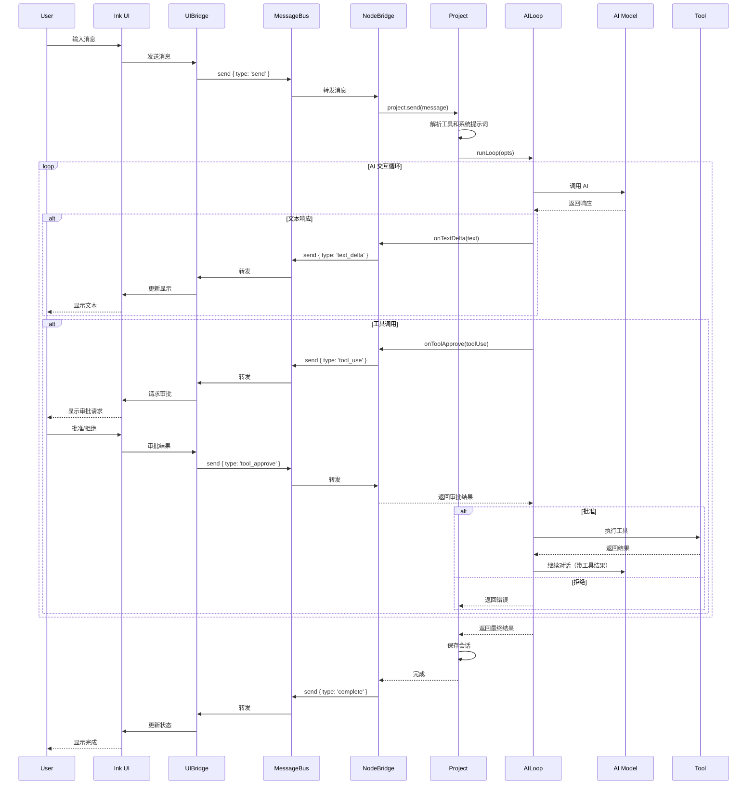

### 安静模式流程图

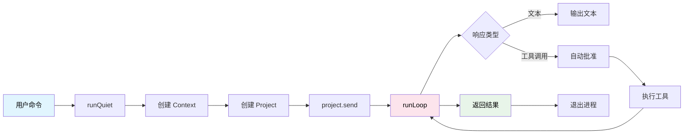

### 配置加载流程图

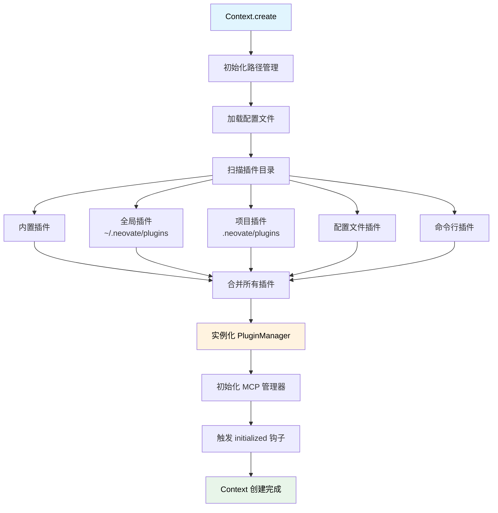

---

## 设计模式

### 1. 策略模式 (Strategy Pattern)

**应用**: 不同的执行模式

根据参数选择不同的执行策略：
- 服务器模式
- 子命令模式
- 安静模式
- 交互模式

### 2. 工厂模式 (Factory Pattern)

**应用**: 模型和工具创建

```typescript
// 模型工厂
provider.createModel(modelId, provider, globalConfigDir)

// 工具工厂
createReadTool({ cwd })
createWriteTool({ cwd })
```

### 3. 桥接模式 (Bridge Pattern)

**应用**: UI 与业务逻辑解耦

通过 MessageBus 连接 UIBridge 和 NodeBridge

### 4. 观察者模式 (Observer Pattern)

**应用**: 插件钩子系统

注册钩子，触发钩子，监听事件

### 5. 依赖注入 (Dependency Injection)

**应用**: Context 作为依赖容器

Context 包含所有核心依赖，注入到各个模块

### 6. 中介者模式 (Mediator Pattern)

**应用**: MessageBus 协调通信

MessageBus 作为中介者协调 UIBridge 和 NodeBridge 的通信

---

## 关键流程

### 1. 应用启动流程

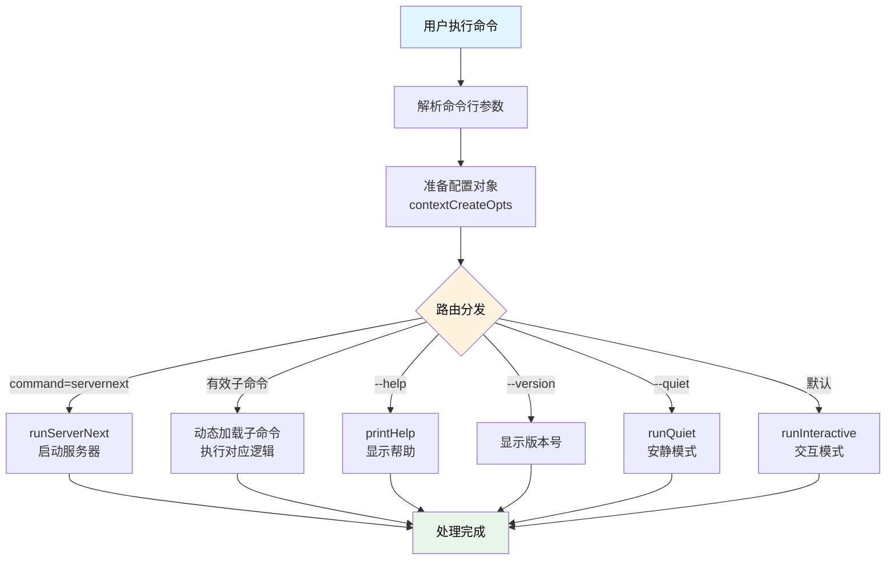

### 2. Context 创建流程

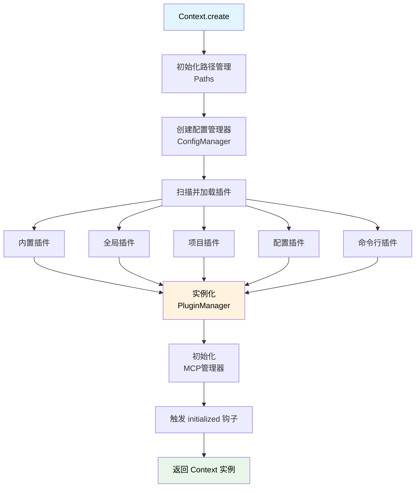

### 3. 消息发送流程

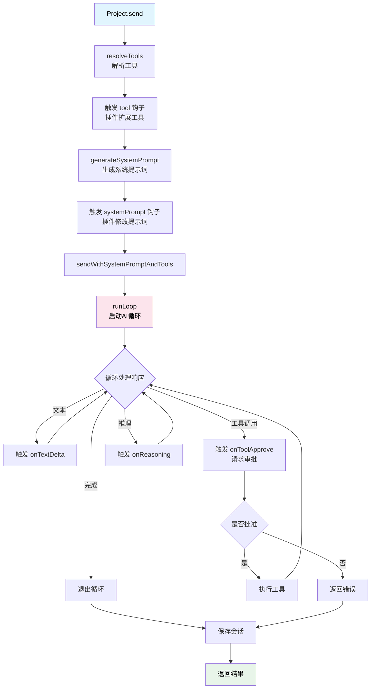

### 4. 工具执行流程

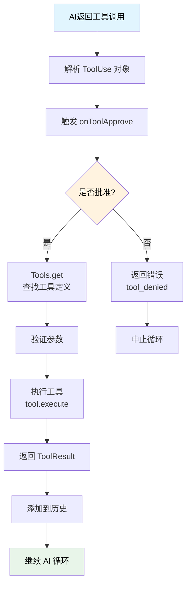

### 5. 模型解析流程

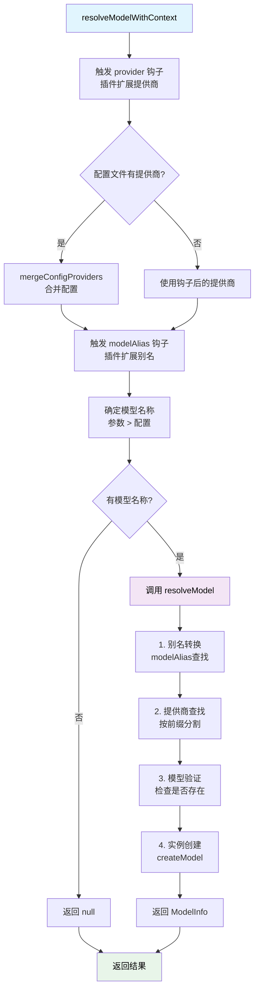

---

## 扩展机制

### 1. 插件开发

创建插件的基本结构：

```typescript
const myPlugin: Plugin = {
  name: 'my-plugin',
  setup(api) {
    // 扩展提供商
    api.addHook('provider', (providers) => {
      return {
        ...providers,
        myProvider: { /* ... */ }
      }
    })

    // 扩展工具
    api.addHook('tool', (tools) => {
      return [...tools, myTool]
    })

    // 修改系统提示词
    api.addHook('systemPrompt', (prompt) => {
      return prompt + '\nCustom instructions'
    })
  }
}
```

### 2. 自定义工具

```typescript
import { createTool } from 'neovate-code'
import { z } from 'zod'

const myTool = createTool({
  name: 'my_tool',
  description: 'My custom tool',
  parameters: z.object({
    input: z.string(),
  }),
  execute: async ({ input }) => {
    const result = await doSomething(input)
    return { success: true, data: result }
  }
})
```

### 3. 自定义提供商

在配置文件中添加：

```typescript
export default {
  provider: {
    'my-provider': {
      env: ['MY_API_KEY'],
      name: 'My Provider',
      api: 'https://api.example.com',
      models: { /* ... */ },
      createModel(name, provider, globalConfigDir) {
        // 创建模型实例
      }
    }
  }
}
```

### 4. MCP 服务器集成

通过命令行：
```bash
neovate --mcp-config '{"mcpServers": {"myServer": {...}}}'
```

通过配置文件：
```typescript
export default {
  mcpServers: {
    myServer: {
      command: 'node',
      args: ['server.js'],
      env: { API_KEY: 'xxx' }
    }
  }
}
```

---

## 性能优化

### 1. 懒加载

子命令使用动态 import，减少启动时间

### 2. 并行插件执行

使用 Parallel 类型并行执行插件钩子

### 3. 历史压缩

自动压缩过长的历史消息

### 4. 流式输出

使用流式输出减少感知延迟

---

## 相关文档

- [入口函数详解](./runNeovate.md)
- [Bridge 架构](./bridge-architecture.md) ⭐ NEW
- [会话管理详解](./session-management.md) ⭐ NEW
- [LlmsContext 详解](./llmsContext.md)
- [Loop 详解](./loop.md)
- [模型架构](./model-provider-architecture.md)
- [工具架构](./tool-architecture.md)
- [智能路由](./smart-routing.md)
- [源码学习](./learn.md)

---

## 总结

Neovate Code 采用模块化、可扩展的架构设计：

### 核心优势

1. ✅ **清晰的分层架构** - 6层架构，各层职责明确，易于理解和维护
2. ✅ **强大的插件系统** - 丰富的钩子机制支持功能扩展
3. ✅ **灵活的模型管理** - 支持多种 AI 服务，易于扩展
4. ✅ **完善的工具系统** - 内置常用工具，支持 MCP 集成
5. ✅ **优雅的桥接模式** - UI 与业务逻辑完全解耦，基于 MessageBus 通信
6. ✅ **会话持久化** - 完整的会话管理和恢复机制，Fork 分支支持
7. ✅ **动态上下文** - 每次对话生成最新 LlmsContext，确保 AI 上下文准确

### 学习建议

1. **从 runNeovate 开始** - 理解应用的入口和路由分发
2. **深入 Context** - 理解依赖注入和配置管理
3. **研究 Loop** - 理解 AI 交互的核心循环
4. **探索插件系统** - 学习如何扩展功能
5. **实践工具开发** - 创建自己的工具和插件

**建议阅读顺序**:
runNeovate → Context → MessageBus → Bridge → Project → Loop → LlmsContext → Model → Tool → Session → Plugin
