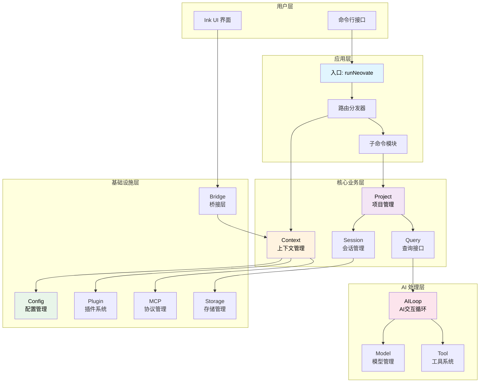

# Neovate Code 架构设计

> 深入理解 Neovate Code 的整体架构、核心模块、数据流转和设计模式

- source: [src/](../src/)

## 目录

- [概述](#概述)
- [目录结构](#目录结构)
- [整体架构](#整体架构)
- [核心模块](#核心模块)
- [数据流转](#数据流转)
- [设计模式](#设计模式)
- [关键流程](#关键流程)
- [扩展机制](#扩展机制)

---

## 概述

Neovate Code 是一个基于 AI 的代码助手 CLI 工具，采用模块化架构设计，支持多种 AI 模型、插件扩展和 MCP 协议集成。

### 核心特性

- 🤖 **多模型支持**: OpenAI、Anthropic、Google、DeepSeek 等
- 🔌 **插件系统**: 丰富的钩子机制支持功能扩展
- 🛠️ **工具集成**: Bash、文件操作、网络请求等内置工具
- 💬 **交互模式**: 基于 Ink + React 的终端 UI
- 📝 **会话管理**: 会话持久化与恢复
- 🌐 **MCP 协议**: 支持 Model Context Protocol

### 技术栈

- **运行时**: Bun / Node.js
- **语言**: TypeScript
- **UI 框架**: React + Ink
- **AI SDK**: @openai/agents, AI SDK
- **构建工具**: tsup

---

## 目录结构

```
src/
├── index.ts              # 入口文件
├── cli.ts                # CLI 入口
├── context.ts            # 上下文管理
├── project.ts            # 项目管理
├── session.ts            # 会话管理
├── query.ts              # 查询接口
├── loop.ts               # AI 交互循环
├── model.ts              # 模型管理
├── tool.ts               # 工具系统
├── plugin.ts             # 插件系统
├── config.ts             # 配置管理
├── mcp.ts                # MCP 管理
├── paths.ts              # 路径管理
├── uiBridge.ts           # UI 桥接
├── nodeBridge.ts         # Node 桥接
├── messageBus.ts         # 消息总线
├── commands/             # 子命令
├── tools/                # 内置工具
├── ui/                   # UI 组件
└── utils/                # 工具函数
```

---

## 整体架构

本章节包含三个核心架构图：
- **分层架构图**: 清晰展示从用户层到基础设施层的完整结构
- **数据流程图**: 详细说明消息在各模块间的流转
- **时序图**: 展示交互模式下的完整交互流程

### 架构分层图



### 数据流向图


### 架构分层说明

Neovate Code 采用清晰的分层架构，从用户层到基础设施层共5层：

**用户层**
- CLI 命令行接口
- Ink UI 界面

**应用层**
- runNeovate 入口
- 路由分发器
- 子命令模块

**核心业务层**
- Context (上下文管理)
- Project (项目管理)
- Session (会话管理)
- Query (查询接口)

**AI 处理层**
- Loop (AI交互循环)
- Model (模型管理)
- Tool (工具系统)

**基础设施层**
- Config (配置管理)
- Plugin (插件系统)
- MCP (协议管理)
- Bridge (桥接层)
- Storage (存储管理)

### 数据流向

典型的数据流转路径：

```
用户输入 → CLI → Context → Project → Loop → AI模型
                                  ↓         ↓
                               工具系统  ← 解析
                                  ↓
                               执行工具
                                  ↓
                            返回结果 → 存储 → 用户
```

---

## 核心模块

🧩 核心模块深度解析

1. 入口模块: runNeovate 的路由分发机制
2. Context: 依赖注入容器和全局管理
3. Project: 项目级 AI 交互管理
4. Loop: AI 交互循环的核心逻辑
5. Model: 两层模型解析架构
6. Tool: 工具系统的分类和执行
7. Session: 会话管理和持久化
8. Plugin: 插件系统和钩子机制
9. Bridge: UI 与业务逻辑的桥接

### 1. 入口模块 (index.ts)

**职责**: 应用启动、参数解析、路由分发

核心函数 `runNeovate` 的工作流程：

1. 解析命令行参数
2. 准备配置对象
3. 路由分发到不同模式：
   - 服务器模式 (servernext)
   - 子命令模式 (config/commit/mcp/run/update)
   - 安静模式 (--quiet)
   - 交互模式 (默认)

**关键特性**:
- ✅ 懒加载子命令模块
- ✅ 统一配置管理
- ✅ 灵活的路由策略

详见: [runNeovate 详解](./runNeovate.md)

### 2. Context (context.ts)

**职责**: 全局上下文管理、依赖注入容器

Context 是整个应用的依赖注入容器，包含：
- 工作目录 (cwd)
- 配置对象 (config)
- 路径管理 (paths)
- 插件管理器 (pluginManager)
- MCP 管理器 (mcpManager)

**生命周期**:
```
创建 → 初始化插件 → 触发 initialized 钩子 → 使用 → 触发 destroy 钩子 → 销毁
```

**核心方法**:
- `Context.create()` - 创建上下文实例
- `context.apply()` - 触发插件钩子

### 3. Project (project.ts)

**职责**: 项目级别的 AI 交互管理

Project 管理单个项目的 AI 交互，核心方法：

**send(message, opts)**
1. 解析工具 (resolveTools)
2. 通过插件扩展工具 (tool 钩子)
3. 生成系统提示词
4. 通过插件修改系统提示词 (systemPrompt 钩子)
5. 调用核心发送逻辑

**plan(message, opts)**
- 计划模式：只读工具 + 计划系统提示词

### 4. Loop (loop.ts)

**职责**: AI 交互循环、工具调用管理

Loop 是 AI 交互的核心循环逻辑：

```
初始化 → AI响应 → 解析响应
              ↓
     文本响应 / 工具调用
              ↓
        执行工具 → 添加结果
              ↓
         继续循环 / 结束
```

**循环控制**:
- 最大轮数限制 (默认50)
- 工具审批机制
- 错误处理和重试

### 5. Model (model.ts)

**职责**: AI 模型管理、提供商抽象

**两层解析架构**:

1. **resolveModelWithContext** (外层)
   - 处理插件钩子 (provider, modelAlias)
   - 合并配置文件
   - 协调整个解析流程

2. **resolveModel** (内层)
   - 纯粹的模型解析逻辑
   - 别名转换
   - 提供商查找
   - 模型验证
   - 实例创建

**提供商抽象**:
- 统一接口
- 支持多种 AI 服务
- 易于扩展

详见: [模型架构文档](./model-provider-architecture.md)

### 6. Tool (tool.ts)

**职责**: 工具系统、工具执行管理

**工具分类**:

**只读工具** (所有模式)
- Read: 读取文件
- LS: 列出目录
- Glob: 文件匹配
- Grep: 文本搜索
- Fetch: 网络请求

**写入工具** (send 模式)
- Write: 写入文件
- Edit: 编辑文件
- Bash: 执行命令

**管理工具** (可选)
- TodoRead: 读取待办
- TodoWrite: 写入待办

**MCP 工具** (动态加载)
- 外部工具集成

详见: [工具架构文档](./tool-architecture.md)

### 7. Session (session.ts)

**职责**: 会话管理、消息持久化

**会话 ID 格式**: `YYYYMMDD-随机字符串`
- 例如: `20250114-abc123`

**存储结构**:
```
~/.neovate/
  └── projects/
      └── <project-hash>/
          └── sessions/
              ├── 20250114-abc123.jsonl
              └── ...
```

**核心功能**:
- 创建新会话
- 恢复已有会话
- 消息持久化 (JSONL 格式)

### 8. Plugin (plugin.ts)

**职责**: 插件系统、钩子管理

**插件钩子类型**:

1. **Series** - 串行执行，不传递结果
2. **SeriesLast** - 串行执行，传递结果
3. **SeriesMerge** - 串行执行，合并数组结果
4. **Parallel** - 并行执行

**内置钩子**:
- `initialized` - 初始化完成
- `provider` - 扩展模型提供商
- `modelAlias` - 扩展模型别名
- `systemPrompt` - 修改系统提示词
- `tool` - 扩展工具
- `destroy` - 清理资源

### 9. Bridge (uiBridge.ts / nodeBridge.ts)

**职责**: UI 与业务逻辑解耦、消息总线通信

**桥接模式**:
```
UI Bridge ←→ MessageBus ←→ Node Bridge
```

**优势**:
- ✅ UI 和业务逻辑完全解耦
- ✅ 支持不同传输方式
- ✅ 易于测试和扩展
- ✅ 统一的消息协议

**消息类型**:
- `send` - 发送消息
- `text_delta` - 文本增量
- `tool_use` - 工具调用
- `tool_approve` - 工具审批
- `complete` - 完成

---

## 数据流转

### 交互模式完整流程图


### 安静模式流程图


### 配置加载流程图


---

## 设计模式

### 1. 策略模式 (Strategy Pattern)

**应用**: 不同的执行模式

根据参数选择不同的执行策略：
- 服务器模式
- 子命令模式
- 安静模式
- 交互模式

### 2. 工厂模式 (Factory Pattern)

**应用**: 模型和工具创建

```typescript
// 模型工厂
provider.createModel(modelId, provider, globalConfigDir)

// 工具工厂
createReadTool({ cwd })
createWriteTool({ cwd })
```

### 3. 桥接模式 (Bridge Pattern)

**应用**: UI 与业务逻辑解耦

通过 MessageBus 连接 UIBridge 和 NodeBridge

### 4. 观察者模式 (Observer Pattern)

**应用**: 插件钩子系统

注册钩子，触发钩子，监听事件

### 5. 依赖注入 (Dependency Injection)

**应用**: Context 作为依赖容器

Context 包含所有核心依赖，注入到各个模块

### 6. 中介者模式 (Mediator Pattern)

**应用**: MessageBus 协调通信

MessageBus 作为中介者协调 UIBridge 和 NodeBridge 的通信

---

## 关键流程

### 1. 应用启动流程


### 2. Context 创建流程


### 3. 消息发送流程


### 4. 工具执行流程


### 5. 模型解析流程


---

## 扩展机制

### 1. 插件开发

创建插件的基本结构：

```typescript
const myPlugin: Plugin = {
  name: 'my-plugin',
  setup(api) {
    // 扩展提供商
    api.addHook('provider', (providers) => {
      return {
        ...providers,
        myProvider: { /* ... */ }
      }
    })

    // 扩展工具
    api.addHook('tool', (tools) => {
      return [...tools, myTool]
    })

    // 修改系统提示词
    api.addHook('systemPrompt', (prompt) => {
      return prompt + '\nCustom instructions'
    })
  }
}
```

### 2. 自定义工具

```typescript
import { createTool } from 'neovate-code'
import { z } from 'zod'

const myTool = createTool({
  name: 'my_tool',
  description: 'My custom tool',
  parameters: z.object({
    input: z.string(),
  }),
  execute: async ({ input }) => {
    const result = await doSomething(input)
    return { success: true, data: result }
  }
})
```

### 3. 自定义提供商

在配置文件中添加：

```typescript
export default {
  provider: {
    'my-provider': {
      env: ['MY_API_KEY'],
      name: 'My Provider',
      api: 'https://api.example.com',
      models: { /* ... */ },
      createModel(name, provider, globalConfigDir) {
        // 创建模型实例
      }
    }
  }
}
```

### 4. MCP 服务器集成

通过命令行：
```bash
neovate --mcp-config '{"mcpServers": {"myServer": {...}}}'
```

通过配置文件：
```typescript
export default {
  mcpServers: {
    myServer: {
      command: 'node',
      args: ['server.js'],
      env: { API_KEY: 'xxx' }
    }
  }
}
```

---

## 性能优化

### 1. 懒加载

子命令使用动态 import，减少启动时间

### 2. 并行插件执行

使用 Parallel 类型并行执行插件钩子

### 3. 历史压缩

自动压缩过长的历史消息

### 4. 流式输出

使用流式输出减少感知延迟

---

## 相关文档

- [入口函数详解](./runNeovate.md)
- [模型架构](./model-provider-architecture.md)
- [工具架构](./tool-architecture.md)
- [智能路由](./smart-routing.md)
- [源码学习](./learn.md)

---

## 总结

Neovate Code 采用模块化、可扩展的架构设计：

### 核心优势

1. ✅ **清晰的分层架构** - 各层职责明确，易于理解和维护
2. ✅ **强大的插件系统** - 丰富的钩子机制支持功能扩展
3. ✅ **灵活的模型管理** - 支持多种 AI 服务，易于扩展
4. ✅ **完善的工具系统** - 内置常用工具，支持 MCP 集成
5. ✅ **优雅的桥接模式** - UI 与业务逻辑完全解耦
6. ✅ **会话持久化** - 完整的会话管理和恢复机制

### 学习建议

1. **从 runNeovate 开始** - 理解应用的入口和路由分发
2. **深入 Context** - 理解依赖注入和配置管理
3. **研究 Loop** - 理解 AI 交互的核心循环
4. **探索插件系统** - 学习如何扩展功能
5. **实践工具开发** - 创建自己的工具和插件

**建议阅读顺序**:
runNeovate → Context → Project → Loop → Model → Tool → Plugin
