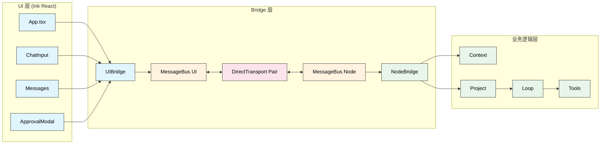
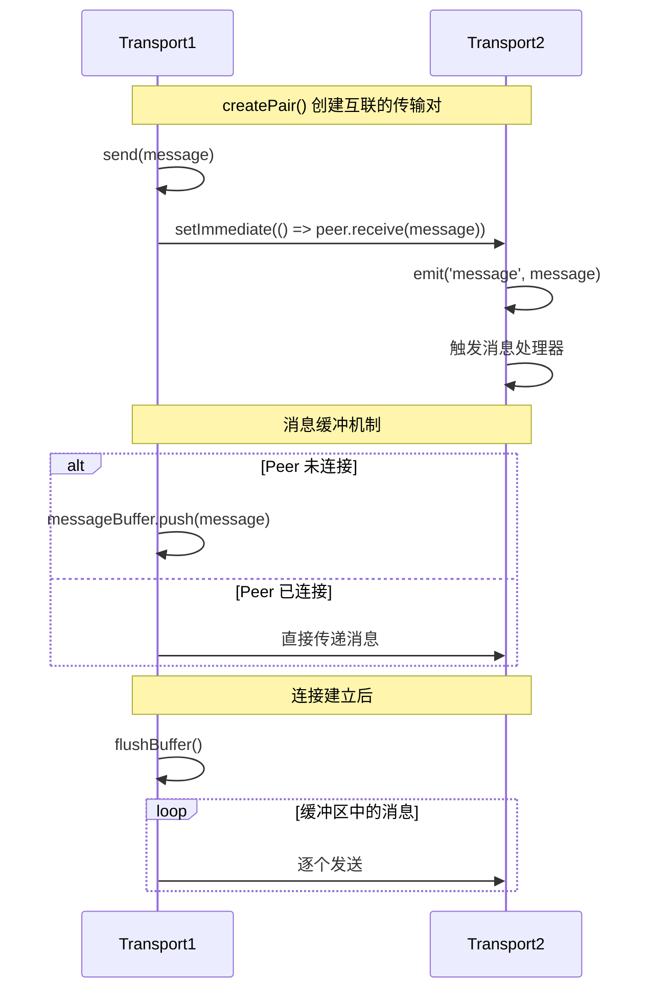
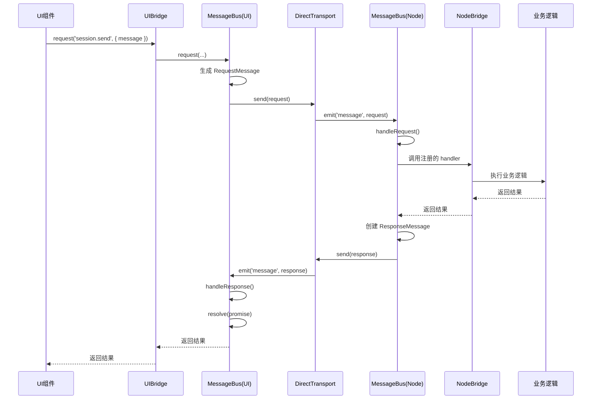
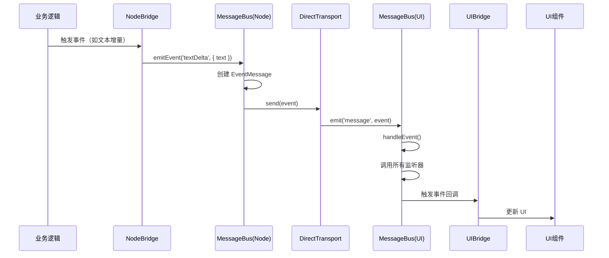
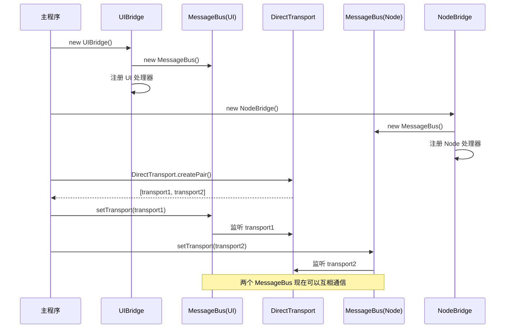

# Bridge 架构与 MessageBus 通信机制

> 深入理解 Neovate Code 的桥接模式设计和进程间通信

- source: [src/messageBus.ts](../src/messageBus.ts), [src/uiBridge.ts](../src/uiBridge.ts), [src/nodeBridge.ts](../src/nodeBridge.ts)

## 目录

- [概述](#概述)
- [设计理念](#设计理念)
- [核心组件](#核心组件)
- [通信协议](#通信协议)
- [工作流程](#工作流程)
- [实现细节](#实现细节)
- [最佳实践](#最佳实践)

---

## 概述

### 什么是 Bridge 架构？

Neovate Code 采用**桥接模式 (Bridge Pattern)** 实现 UI 层与业务逻辑层的完全解耦。这种设计允许:

1. ✅ **UI 和业务逻辑独立演进** - 可以独立修改 UI 或后端逻辑而不影响对方
2. ✅ **统一的消息协议** - 所有通信通过标准化的消息格式进行
3. ✅ **易于测试** - 可以模拟 MessageBus 进行单元测试
4. ✅ **支持多种传输方式** - 可以从进程内通信切换到 WebSocket/IPC 等

### 架构图



---

## 设计理念

### 为什么需要 Bridge 架构？

**问题背景**:
- Ink UI 组件需要调用后端 AI 逻辑
- 后端需要实时通知 UI 更新（如文本增量、工具审批）
- 直接耦合会导致 UI 和业务逻辑难以测试和维护

**解决方案**:
通过 Bridge 模式和 MessageBus 解耦:

```typescript
// ❌ 直接耦合（不推荐）
function ChatInput() {
  const result = await project.send(message); // UI 直接调用业务逻辑
}

// ✅ 通过 Bridge 解耦（推荐）
function ChatInput() {
  const result = await uiBridge.request('session.send', { message }); // 通过消息协议
}
```

### 核心优势

1. **解耦性**: UI 和业务逻辑互不依赖，只依赖消息协议
2. **可测试性**: 可以独立测试 UI 和业务逻辑
3. **可扩展性**: 易于切换传输方式（进程内 → WebSocket → IPC）
4. **类型安全**: TypeScript 保证消息类型正确性

---

## 核心组件

### 1. MessageBus（消息总线）

**职责**: 管理消息的发送、接收和路由

**关键方法**:

```typescript
class MessageBus {
  // 发送请求并等待响应
  async request(method: string, params: any, options?: { timeout?: number }): Promise<any>
  
  // 注册消息处理器
  registerHandler(method: string, handler: (data: any) => Promise<any>): void
  
  // 发送事件（不等待响应）
  async emitEvent(event: string, data: any): Promise<void>
  
  // 监听事件
  onEvent(event: string, handler: (data: any) => void): void
  
  // 设置传输层
  setTransport(transport: MessageTransport): void
}
```

**消息类型**:

```typescript
// 1. 请求消息（需要响应）
type RequestMessage = {
  type: 'request';
  id: string;           // 消息唯一ID
  method: string;       // 方法名（如 'session.send'）
  params: any;          // 参数
  timestamp: number;    // 时间戳
};

// 2. 响应消息
type ResponseMessage = {
  type: 'response';
  id: string;           // 对应请求的ID
  result?: any;         // 成功结果
  error?: any;          // 错误信息
  timestamp: number;
};

// 3. 事件消息（单向通知）
type EventMessage = {
  type: 'event';
  id: string;
  event: string;        // 事件名（如 'textDelta'）
  data: any;            // 事件数据
  timestamp: number;
};
```

### 2. DirectTransport（直接传输）

**职责**: 在同一进程内实现双向消息传输

**关键特性**:

```typescript
class DirectTransport implements MessageTransport {
  // 创建一对互联的 Transport
  static createPair(): [DirectTransport, DirectTransport]
  
  // 发送消息
  async send(message: Message): Promise<void>
  
  // 监听消息
  onMessage(handler: (message: Message) => void): void
  
  // 消息缓冲（最多1000条）
  private messageBuffer: Message[] = [];
}
```

**工作原理**:



### 3. UIBridge（UI 桥接器）

**职责**: 为 UI 组件提供简化的 API 来调用后端功能

**代码位置**: `src/uiBridge.ts:16-33`

```typescript
class UIBridge {
  appStore: AppStore;           // Zustand 状态管理器
  messageBus: MessageBus;       // 消息总线
  
  constructor(opts: { appStore: AppStore }) {
    this.appStore = opts.appStore;
    this.messageBus = new MessageBus();
    new UIHandlerRegistry(this.messageBus, this.appStore);
  }
  
  // 简化 API
  request(method: string, params: any, options?: { timeout?: number }) {
    return this.messageBus.request(method, params, options);
  }
  
  emitEvent(event: string, data: any) {
    return this.messageBus.emitEvent(event, data);
  }
  
  onEvent(event: string, handler: EventHandler) {
    return this.messageBus.onEvent(event, handler);
  }
}
```

**注册的处理器**（UI 端处理）:

```typescript
class UIHandlerRegistry {
  private registerHandlers() {
    // 工具审批处理（唯一需要 UI 处理的请求）
    this.messageBus.registerHandler('toolApproval', async ({ toolUse, category }) => {
      const result = await this.appStore.approveToolUse({ toolUse, category });
      return { approved: result };
    });
  }
}
```

### 4. NodeBridge（业务逻辑桥接器）

**职责**: 处理所有后端业务逻辑，包括 AI 交互、文件操作、配置管理等

**代码位置**: `src/nodeBridge.ts:48-56`

```typescript
class NodeBridge {
  messageBus: MessageBus;
  private contextCreateOpts: any;
  
  constructor(opts: NodeBridgeOpts) {
    this.messageBus = new MessageBus();
    this.contextCreateOpts = opts.contextCreateOpts;
    new NodeHandlerRegistry(this.messageBus, this.contextCreateOpts);
  }
}
```

**注册的处理器**（后端处理）:

NodeBridge 通过 `NodeHandlerRegistry` 注册了大量消息处理器，包括:

1. **配置管理** (`config.*`)
   - `config.get` - 获取配置项
   - `config.set` - 设置配置项
   - `config.remove` - 删除配置项
   - `config.list` - 列出所有配置

2. **MCP 管理** (`mcp.*`)
   - `mcp.getStatus` - 获取 MCP 服务器状态
   - `mcp.reconnect` - 重新连接 MCP 服务器

3. **模型管理** (`models.*`)
   - `models.list` - 列出所有可用模型

4. **会话管理** (`session.*`)
   - `session.initialize` - 初始化会话
   - `session.send` - 发送消息给 AI
   - `session.cancel` - 取消当前请求
   - `session.messages.list` - 列出会话消息
   - `session.compact` - 压缩会话历史

5. **工具函数** (`utils.*`)
   - `utils.query` - 直接查询 AI
   - `utils.getPaths` - 获取文件路径
   - `utils.telemetry` - 发送遥测数据

---

## 通信协议

### 请求-响应模式

**流程**:



**代码示例**:

```typescript
// UI 端发起请求
async function sendMessage() {
  const result = await uiBridge.request('session.send', {
    message: 'Hello AI',
    cwd: '/path/to/project',
    sessionId: 'session-123',
  });
  console.log(result); // { success: true, data: { ... } }
}

// Node 端处理请求
messageBus.registerHandler('session.send', async (data) => {
  const { message, cwd, sessionId } = data;
  const context = await getContext(cwd);
  const project = new Project({ sessionId, context });
  const result = await project.send(message, { ... });
  return result;
});
```

### 事件模式

**流程**:



**代码示例**:

```typescript
// UI 端监听事件
uiBridge.onEvent('textDelta', (data) => {
  console.log('收到文本增量:', data.text);
  appStore.appendText(data.text);
});

// Node 端发送事件
await messageBus.emitEvent('textDelta', {
  text: 'Hello',
});
```

### 超时处理

MessageBus 支持请求超时机制:

```typescript
// 设置5秒超时
try {
  const result = await uiBridge.request('session.send', { message }, { timeout: 5000 });
} catch (error) {
  console.error('请求超时:', error.message);
}
```

**实现原理**:

```typescript
// src/messageBus.ts:216-231
const promise = new Promise<any>((resolve, reject) => {
  const pendingRequest: PendingRequest = {
    id,
    method,
    timestamp: Date.now(),
    resolve,
    reject,
  };
  if (timeout > 0) {
    pendingRequest.timeout = setTimeout(() => {
      this.pendingRequests.delete(id);
      reject(new Error(`Request timeout after ${timeout}ms: ${method}`));
    }, timeout);
  }
  this.pendingRequests.set(id, pendingRequest);
});
```

---

## 工作流程

### 初始化流程

**代码位置**: `src/index.ts:229-241`

```typescript
// 1. 创建 UIBridge 和 NodeBridge
const appStore = useAppStore.getState();
const uiBridge = new UIBridge({ appStore });
const nodeBridge = new NodeBridge({ contextCreateOpts });

// 2. 创建通信通道（桥接模式核心）
const [uiTransport, nodeTransport] = DirectTransport.createPair();

// 3. 设置传输层（建立连接）
uiBridge.messageBus.setTransport(uiTransport);
nodeBridge.messageBus.setTransport(nodeTransport);

// 4. 此时两个 Bridge 可以互相通信
```

**初始化时序图**:



### 消息发送完整流程

以用户发送消息给 AI 为例:

**时序图**:

```mermaid
sequenceDiagram
    participant User as 用户
    participant UI as ChatInput
    participant UIBridge
    participant MBus1 as MessageBus(UI)
    participant Trans as DirectTransport
    participant MBus2 as MessageBus(Node)
    participant NodeBridge
    participant Project
    participant Loop as runLoop
    participant AI as AI模型
    
    User->>UI: 输入消息并回车
    UI->>UIBridge: request('session.send', { message, cwd, sessionId })
    UIBridge->>MBus1: request(...)
    MBus1->>Trans: send(RequestMessage)
    Trans->>MBus2: receive(RequestMessage)
    MBus2->>NodeBridge: 调用 'session.send' handler
    NodeBridge->>Project: project.send(message)
    Project->>Loop: runLoop(...)
    
    loop AI 交互循环
        Loop->>AI: 调用 AI 模型
        AI-->>Loop: 返回文本增量
        Loop->>NodeBridge: onTextDelta(text)
        NodeBridge->>MBus2: emitEvent('textDelta', { text })
        MBus2->>Trans: send(EventMessage)
        Trans->>MBus1: receive(EventMessage)
        MBus1->>UIBridge: 触发 'textDelta' 监听器
        UIBridge->>UI: 更新显示
        UI->>User: 显示文本
    end
    
    Loop-->>Project: 返回结果
    Project-->>NodeBridge: 返回结果
    NodeBridge-->>MBus2: 返回结果
    MBus2->>Trans: send(ResponseMessage)
    Trans->>MBus1: receive(ResponseMessage)
    MBus1-->>UIBridge: resolve(promise)
    UIBridge-->>UI: 返回结果
```

---

## 实现细节

### 1. 消息缓冲机制

**问题**: 如果 Transport 对等体(peer)尚未连接，消息会丢失

**解决**: DirectTransport 维护一个消息缓冲区

```typescript
// src/messageBus.ts:118-131
async send(message: Message) {
  try {
    if (this.peer && this.peer.isConnected()) {
      // 对等体已连接，直接发送
      setImmediate(() => {
        this.peer!.receive(message);
      });
    } else {
      // 对等体未连接，缓冲消息
      this.messageBuffer.push(message);
    }
  } catch (error) {
    this.emit('error', error);
    throw error;
  }
}
```

**缓冲区刷新**:

```typescript
// src/messageBus.ts:135-154
private flushBuffer() {
  if (
    !this.peer ||
    !this.peer.isConnected() ||
    this.messageBuffer.length === 0
  ) {
    return;
  }
  if (this.messageBuffer.length > MAX_BUFFER_SIZE) {
    this.emit('error', new Error('Message buffer overflow'));
    return;
  }
  const messages = [...this.messageBuffer];
  this.messageBuffer.length = 0;
  for (const message of messages) {
    setImmediate(() => {
      this.peer!.receive(message);
    });
  }
}
```

### 2. 请求-响应关联

**问题**: 如何将响应与对应的请求关联起来？

**解决**: 使用 `pendingRequests` Map 存储待处理的请求

```typescript
// src/messageBus.ts:179-180
private pendingRequests = new Map<MessageId, PendingRequest>();

// 发送请求时
const id = randomUUID();
const promise = new Promise((resolve, reject) => {
  this.pendingRequests.set(id, { id, resolve, reject, ... });
});
await this.transport.send(createRequest(id, method, params));
return await promise;

// 接收响应时
const pending = this.pendingRequests.get(message.id);
if (pending) {
  this.pendingRequests.delete(message.id);
  if (message.error) {
    pending.reject(new Error(message.error.message));
  } else {
    pending.resolve(message.result);
  }
}
```

### 3. 事件订阅机制

**问题**: 如何让多个监听器监听同一个事件？

**解决**: 使用 Map + Set 存储事件处理器

```typescript
// src/messageBus.ts:182
private eventHandlers = new Map<string, Set<EventHandler>>();

// 订阅事件
onEvent(event: string, handler: EventHandler) {
  if (!this.eventHandlers.has(event)) {
    this.eventHandlers.set(event, new Set());
  }
  this.eventHandlers.get(event)!.add(handler);
}

// 触发事件
private async handleEvent(message: EventMessage) {
  const { event, data } = message;
  const handlers = this.eventHandlers.get(event);
  if (!handlers || handlers.size === 0) {
    return;
  }
  for (const handler of handlers) {
    try {
      handler(data);
    } catch (error) {
      this.emit('eventHandlerError', error, event, data);
    }
  }
}
```

### 4. Context 缓存机制

**问题**: 每次请求都创建 Context 会很慢

**解决**: NodeBridge 维护 Context 缓存

```typescript
// src/nodeBridge.ts:61
private contexts = new Map<string, Context>();

private async getContext(cwd: string) {
  if (this.contexts.has(cwd)) {
    return this.contexts.get(cwd)!;
  }
  const context = await Context.create({
    cwd,
    ...this.contextCreateOpts,
  });
  this.contexts.set(cwd, context);
  return context;
}
```

---

## 最佳实践

### 1. 命名规范

**消息方法命名**:
- 使用 `<模块>.<操作>` 格式
- 例如: `session.send`, `config.get`, `models.list`

**事件命名**:
- 使用驼峰命名法
- 例如: `textDelta`, `message`, `chunk`

### 2. 错误处理

**在处理器中捕获错误**:

```typescript
messageBus.registerHandler('myMethod', async (data) => {
  try {
    const result = await doSomething(data);
    return { success: true, data: result };
  } catch (error) {
    return {
      success: false,
      error: error instanceof Error ? error.message : String(error),
    };
  }
});
```

**在请求端处理错误**:

```typescript
try {
  const result = await uiBridge.request('myMethod', { ... });
  if (!result.success) {
    console.error('请求失败:', result.error);
  }
} catch (error) {
  console.error('通信错误:', error);
}
```

### 3. 避免循环依赖

**问题**: UIBridge 请求 → NodeBridge 处理 → 触发事件 → UIBridge 监听 → 再次请求

**解决**: 在事件处理器中添加状态检查，避免无限循环

```typescript
uiBridge.onEvent('textDelta', (data) => {
  if (!isProcessing) {  // 状态检查
    appStore.appendText(data.text);
  }
});
```

### 4. 清理资源

**在组件卸载时取消订阅**:

```typescript
useEffect(() => {
  const handler = (data) => console.log(data);
  uiBridge.onEvent('textDelta', handler);
  
  return () => {
    uiBridge.offEvent('textDelta', handler);
  };
}, []);
```

---

## 总结

### Bridge 架构的核心价值

1. **完全解耦** - UI 和业务逻辑互不依赖
2. **统一协议** - 所有通信通过标准化消息
3. **易于测试** - 可以模拟 MessageBus 进行单元测试
4. **灵活扩展** - 易于切换传输方式

### 关键设计模式

1. **桥接模式** - UIBridge 和 NodeBridge 解耦 UI 和业务逻辑
2. **发布-订阅模式** - MessageBus 的事件机制
3. **请求-响应模式** - 异步 RPC 调用
4. **缓存模式** - Context 缓存和消息缓冲

### 与其他模块的关系

```
UIBridge ←→ MessageBus ←→ NodeBridge ←→ Context ←→ Project ←→ Loop
```

- UIBridge 简化 UI 调用
- MessageBus 负责消息传输
- NodeBridge 协调业务逻辑
- Context 管理全局状态
- Project 管理会话
- Loop 执行 AI 交互

---

## 相关文档

- [整体架构](./arch.md)
- [UI 架构](./ui-architecture.md)
- [Loop 详解](./loop.md)
- [Context 详解](./context.md)
