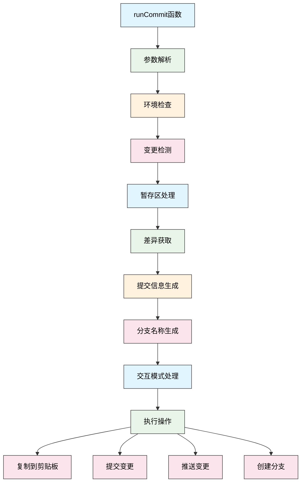
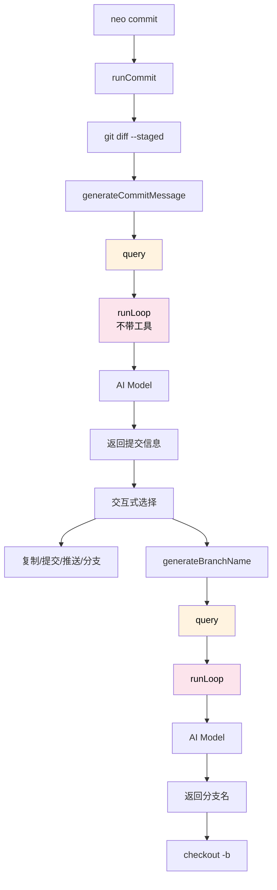

# Commit 命令架构解析

## 概述

`commit.ts` 是 Neovate 的一个专用命令，用于智能生成 Git 提交信息。该命令通过分析暂存区的代码变更，使用 AI 模型生成符合规范的提交信息，并支持自动提交、推送到远程仓库等功能。

## 核心功能

1. **智能提交信息生成** - 基于代码变更自动生成提交信息
2. **分支名称生成** - 根据提交信息生成合适的分支名称
3. **交互式操作** - 提供多种操作选项供用户选择
4. **自动化流程** - 支持一键提交和推送
5. **格式验证** - 确保生成的提交信息符合规范

## 架构图



## 主要组件

### 1. runCommit 函数

这是命令的入口点，负责整个流程的协调：

1. **参数解析** - 使用 yargs-parser 解析命令行参数
2. **环境检查** - 验证 Git 安装、仓库状态和用户配置
3. **变更检测** - 检查是否有待提交的变更
4. **暂存区处理** - 根据参数决定是否自动暂存文件
5. **差异获取** - 获取暂存区的代码差异
6. **提交信息生成** - 调用 AI 模型生成提交信息
7. **操作执行** - 根据参数和用户选择执行相应操作

### 2. 提交信息生成

```typescript
async function generateCommitMessage(opts: GenerateCommitMessageOpts)
```

该函数负责调用 AI 模型生成提交信息：

1. 构造系统提示词（包含提交规范要求）
2. 调用 `query` 函数与 AI 模型交互
3. 验证返回结果的格式

**具体实现**:

```typescript
// src/commands/commit.ts:35-48
const result = await query({
  userPrompt: opts.prompt,        // 代码差异
  systemPrompt,                   // 提交规范
  context: opts.context,          // 上下文（含模型配置）
});
const message = result.success ? result.data.text : null;
```

### 3. 分支名称生成

```typescript
async function generateBranchName(opts: GenerateBranchNameOpts)
```

该函数根据提交信息生成合适的分支名称：

1. 构造系统提示词（包含分支命名规范）
2. 调用 `query` 函数与 AI 模型交互
3. 验证返回结果的格式

**具体实现**:

```typescript
// src/commands/commit.ts:53-64
const result = await query({
  userPrompt: opts.commitMessage,  // 提交信息
  systemPrompt: createBranchSystemPrompt(),
  context: opts.context,
});
const branchName = result.success ? result.data.text : null;
```

### 4. Query 模块交互 ⭐ NEW

**职责**: `query` 是一个简化版的 AI 查询接口，用于**不需要工具调用**的纯文本对话。

**与 Project.send() 的区别**:

| 特性 | query() | Project.send() |
|------|---------|----------------|
| **职责** | 简化版 AI 查询 | 完整功能 AI 交互 |
| **工具调用** | 不支持 | 支持 |
| **审批流程** | 无 | 完整的 7 规则审批 |
| **会话管理** | 无 | 持久化和恢复 |
| **适用场景** | 提交信息、分支名称 | 代码生成、文件操作 |
| **LlmsContext** | 不包含 | 自动添加 Git/目录 |
| **性能** | 轻量级 | 完整功能 |

**核心实现**:

```typescript
// src/query.ts:43-76
export async function query(opts: {
  userPrompt: string;              // 用户输入
  messages?: NormalizedMessage[];  // 历史消息（可选）
  context?: Context;               // 上下文（用于解析模型）
  model?: ModelInfo;               // 模型信息（可选）
  systemPrompt?: string;           // 系统提示词
  onMessage?: (msg) => Promise<void>; // 消息回调
}) {
  // 1. 构造消息列表
  const messages = [
    ...(opts.messages || []),
    {
      role: 'user',
      content: opts.userPrompt,
      // ...
    },
  ];
  
  // 2. 解析模型
  const model = opts.model || 
    (await resolveModelWithContext(null, opts.context!)).model!;
  
  // 3. 调用 runLoop（但**不带工具**）
  return await runLoop({
    input: messages,
    model,
    tools: new Tools([]),          // ← 空工具列表
    cwd: '',
    systemPrompt: opts.systemPrompt || '',
    onMessage: opts.onMessage,
    autoCompact: false,
  });
}
```

**适用场景**:

✅ **适合**:
- Git 提交信息生成 (commit.ts)
- 分支名称生成 (commit.ts)
- 对话历史压缩 (compact.ts)
- 轻量级 AI 集成
- 快速原型开发

❌ **不适合**:
- 需要文件读写操作
- 需要执行系统命令
- 需要工具审批的安全敏感操作
- 需要会话持久化和恢复

**工作流程图**:

```mermaid
sequenceDiagram
    participant Commit as commit.ts
    participant Query as query()
    participant ResolveModel as resolveModel
    participant Loop as runLoop()
    participant Model as AI Model
    
    Commit->>Query: query({ userPrompt, systemPrompt, context })
    Query->>Query: 构造 messages 数组
    Query->>ResolveModel: 解析模型
    ResolveModel-->>Query: ModelInfo
    Query->>Loop: runLoop({ tools: new Tools([]) })
    Note right of Loop: 不包含工具<br/>不进行审批
    Loop->>Model: 调用 AI
    Model-->>Loop: 返回响应
    Loop-->>Query: LoopResult
    Query-->>Commit: { success, data: { text } }
    Commit->>Commit: 验证和使用结果
```

## 交互流程

### Commit 命令与 Query 模块的交互



### 关键交互点

1. **commit.ts 调用 query()**
   - 目的: 生成提交信息和分支名称
   - 特点: 不需要工具调用,只需纯文本响应

2. **query() 调用 runLoop()**
   - 传入 `tools: new Tools([])` - 空工具列表
   - 不包含 LlmsContext (不需要 Git 状态/目录结构)
   - 直接传入 systemPrompt 和 userPrompt

3. **runLoop() 调用 AI Model**
   - 标准的 AI 交互流程
   - 但不会触发工具调用(因为 tools 为空)

## 系统提示词

### 提交信息生成系统提示词（中文翻译）

```md
你是一个专业的软件工程师，根据提供的差异生成简洁的一行 Git 提交信息。

请仔细审查提供的上下文和即将提交到 Git 仓库的差异，为这些更改生成符合规范的提交信息。

## 格式规范

**结构**：\`<type>(<scope>): <description>\`
- scope 可选,表示影响范围(如 auth, api, ui, core)
- 单一文件/模块时建议省略 scope

**类型说明**：
- fix: 修复 bug
- feat: 新功能
- docs: 仅文档变更
- style: 代码格式(不影响逻辑,如空格、分号等)
- refactor: 重构(既非新增功能,也非修复 bug)
- perf: 性能优化
- test: 添加或修改测试
- build: 构建系统或外部依赖变更(如 webpack, npm)
- ci: CI 配置文件和脚本变更
- chore: 其他不修改 src 或测试文件的变更

**书写规则**：
- 语气：命令式现在时("add" 而非 "added" 或 "adds")
- 长度：≤72 字符(超出会被截断显示)
- 格式：小写开头,无句号结尾
${language ? `- 语言：${language}` : ''}

## 示例

✅ 好的示例：
- \`feat(auth): add google oauth login\`
- \`fix: resolve memory leak in data processing\`
- \`docs: update api endpoints in readme\`
- \`refactor(api): simplify error handling logic\`

❌ 避免：
- \`Fixed bug\` (过于笼统)
- \`feat: Added new feature for users.\` (过去式 + 句号)
- \`Update code\` (不明确)

## 输出要求

仅回复一行提交信息，不含引号、反引号、解释或换行符。
特殊情况：若差异为空，返回 \`chore: empty commit\`
```

### 分支名称生成系统提示词（中文翻译）

```text
你是一位专业的软件工程师，负责根据提交信息和代码变更生成有意义的 Git 分支名称。

请查看提供的提交信息并生成一个清晰、描述性的 Git 分支名称。

## 分支命名规则

1. **格式**：适用时使用传统格式：
   - 对于传统提交：`<类型>/<描述>`（例如，"feat/user-authentication"，"fix/memory-leak"）
   - 对于常规提交：`<描述>`（例如，"update-documentation"，"refactor-api"）

2. **字符规则**：
   - 仅使用小写字母、数字和连字符
   - 不要使用空格、特殊字符或下划线
   - 用连字符替换空格
   - 最多 50 个字符
   - 不要有前导或尾随连字符

3. **内容指南**：
   - 描述性但简洁
   - 关注正在实现的主要功能/变更
   - 删除不必要的词语如 "the"、"a"、"an"
   - 适用时使用现在时动词

## 示例

输入："feat: add user authentication system"
输出：feat/add-user-authentication

输入："fix: resolve memory leak in data processing"
输出：fix/resolve-memory-leak

输入："Update API documentation for new endpoints"
输出：update-api-documentation

输入："refactor: simplify database connection logic"
输出：refactor/simplify-database-connection

输入："Add support for dark mode theme"
输出：add-dark-mode-support

## 指令

仅生成分支名称，不要包含任何额外的文本、解释或格式。
分支名称应简洁、专业，并遵循 Git 最佳实践。
```

## 工作流程

1. **初始化检查**
   - 验证 Git 安装
   - 检查是否在 Git 仓库中
   - 验证 Git 用户配置
   - 检查是否有待提交的变更

2. **暂存处理**
   - 如果指定 `-s` 参数，自动暂存所有变更
   - 获取暂存区的差异

3. **提交信息生成**
   - 如果指定 `--follow-style`，分析仓库最近的提交风格
   - 构造包含差异和风格信息的提示词
   - 调用 AI 模型生成提交信息
   - 根据 `--ai` 参数决定是否添加 [AI] 后缀

4. **分支名称生成**
   - 如果指定 `--checkout` 参数，生成分支名称
   - 创建并切换到新分支

5. **操作执行**
   - 交互模式：显示选项供用户选择
   - 非交互模式：根据参数自动执行操作

## 交互模式

在交互模式下，用户可以选择以下操作：

1. **复制到剪贴板** - 将生成的提交信息复制到剪贴板
2. **提交变更** - 执行 Git 提交操作
3. **提交并推送** - 提交后自动推送到远程仓库
4. **创建分支并提交** - 创建新分支并提交变更
5. **编辑提交信息** - 修改生成的提交信息
6. **取消** - 取消操作

## 错误处理

系统包含全面的错误处理机制：

1. **环境错误** - Git 未安装、不在仓库中、用户未配置等
2. **操作错误** - 暂存失败、提交失败、推送失败等
3. **网络错误** - 推送时的网络问题，支持重试
4. **格式错误** - 提交信息或分支名称格式不正确

## 配置选项

命令支持多种参数：

- `-s, --stage` - 自动暂存所有变更
- `-c, --commit` - 自动提交变更
- `-n, --no-verify` - 跳过预提交钩子
- `--language` - 设置提交信息语言
- `--copy` - 复制提交信息到剪贴板
- `--push` - 提交后推送变更
- `--follow-style` - 遵循仓库现有提交风格
- `--ai` - 添加 [AI] 后缀
- `--checkout` - 创建并切换到新分支

## 总结

`commit.ts` 命令通过结合 AI 技术和 Git 操作，为开发者提供了一个智能化的提交信息生成工具。它不仅能够自动生成符合规范的提交信息，还支持完整的提交流程自动化，大大提高了开发效率。
