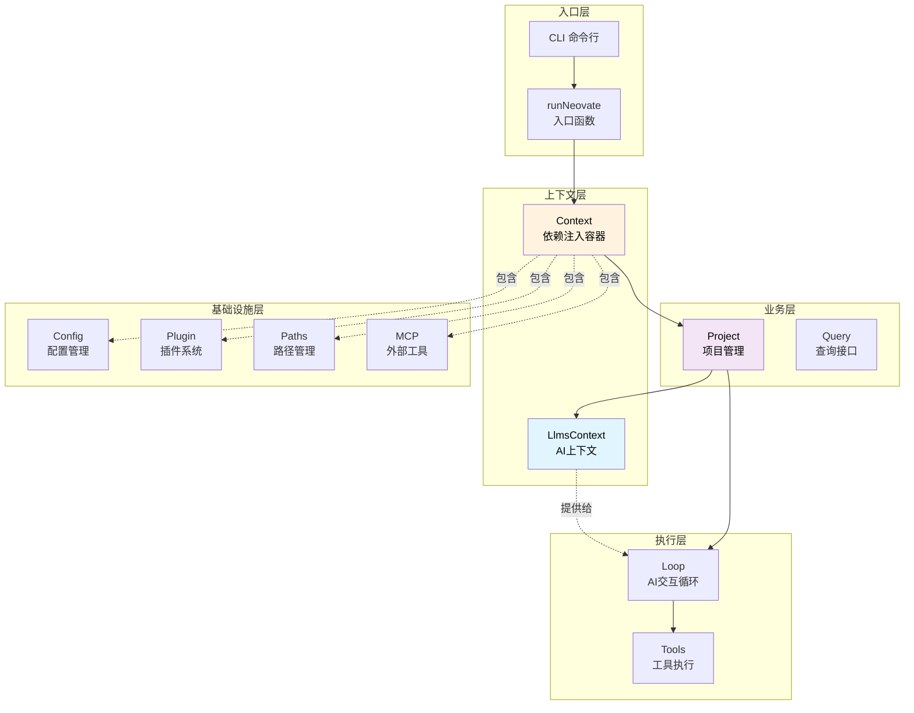
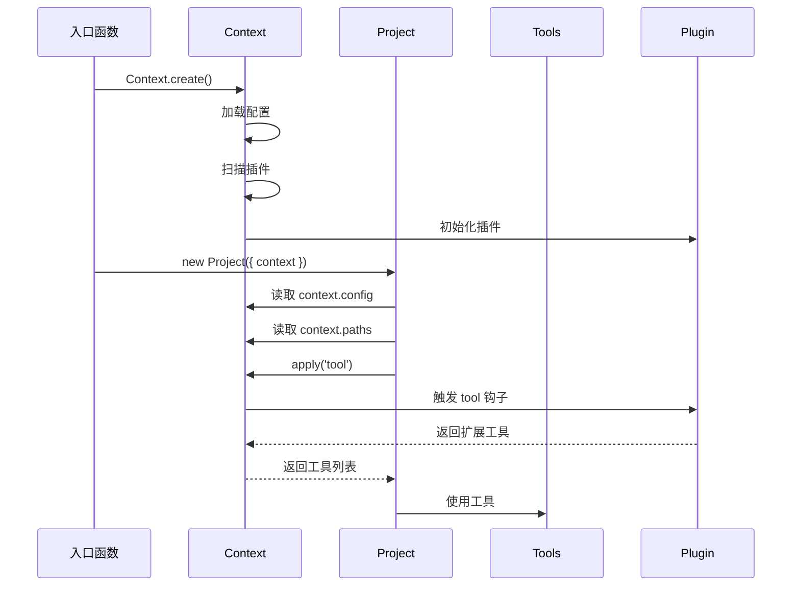
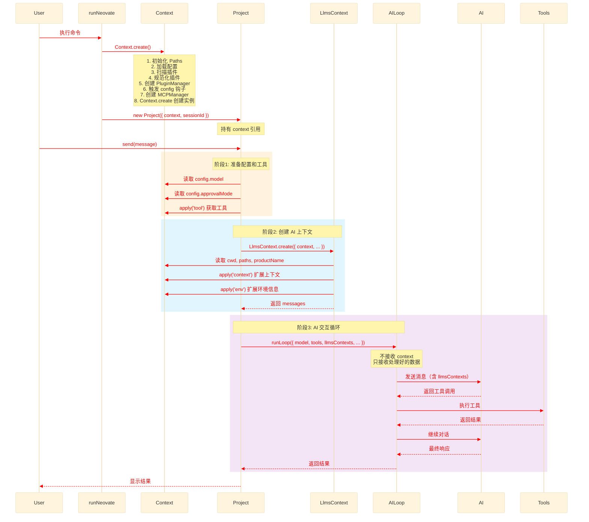
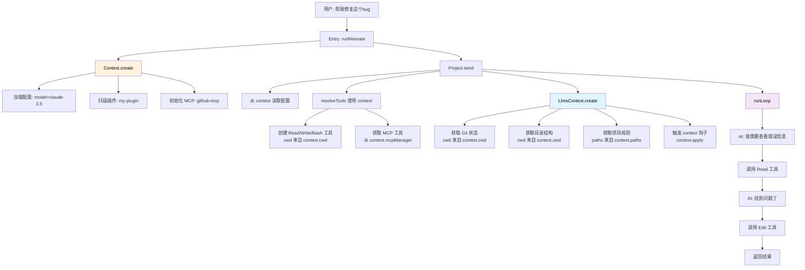
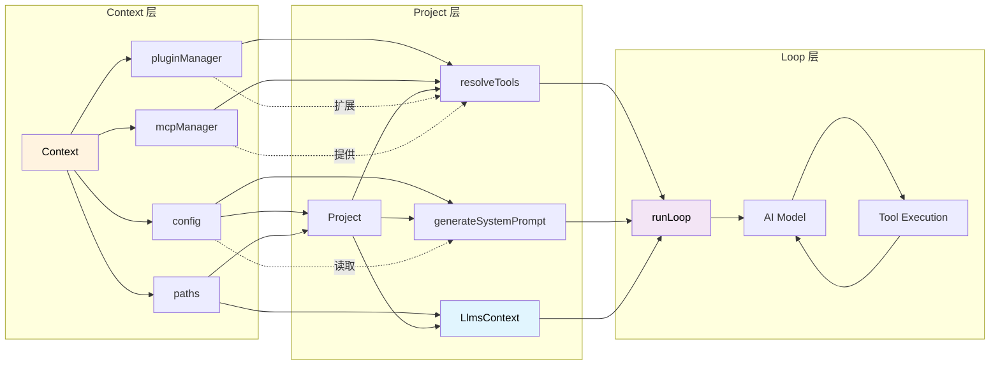

# Context 协作机制详解

> 深入理解 Context 和 LlmsContext 如何与其他模块协作

## 目录

- [整体协作视图](#整体协作视图)
- [Context 的角色定位](#context-的角色定位)
- [LlmsContext 的角色定位](#llmscontext-的角色定位)
- [协作流程详解](#协作流程详解)
- [实战案例分析](#实战案例分析)
- [数据流转追踪](#数据流转追踪)

---

## 整体协作视图

### 架构层次图



### 关键概念

1. **Context 是依赖注入容器**
   - 不做业务逻辑
   - 只负责管理和提供依赖
   - 贯穿整个应用生命周期

2. **LlmsContext 是数据准备器**
   - 收集项目信息
   - 格式化为 AI 可读的上下文
   - 每次对话重新创建

---

## Context 的角色定位

### 1. 作为依赖容器

Context 像一个"工具箱"，其他模块从中获取所需的工具：

```typescript
// Context 的结构（简化）
class Context {
  cwd: string              // 🗂️ 工作目录
  config: Config           // ⚙️ 配置对象
  paths: Paths             // 📁 路径管理器
  pluginManager            // 🔌 插件管理器
  mcpManager: MCPManager   // 🌐 MCP 管理器

  apply(hook)              // 🎣 触发插件钩子
  destroy()                // 🗑️ 清理资源
}
```

### 2. 与各模块的协作方式

#### 协作图



#### 代码示例：Project 使用 Context

```typescript
// src/project.ts
export class Project {
  session: Session;
  context: Context;  // 👈 持有 Context 引用

  constructor(opts: { context: Context }) {
    this.context = opts.context;  // 👈 注入 Context

    // 使用 Context 的 paths 创建 session
    this.session = Session.create({
      logPath: opts.context.paths.getSessionLogPath(sessionId)
    });
  }

  async send(message: string) {
    // 1️⃣ 从 context 读取配置
    const model = this.context.config.model;
    const approvalMode = this.context.config.approvalMode;

    // 2️⃣ 使用 context 触发插件钩子获取工具
    let tools = await resolveTools({
      context: this.context,  // 👈 传递 context
      sessionId: this.session.id,
      write: true,
    });

    // 3️⃣ 通过 context 让插件扩展工具
    tools = await this.context.apply({
      hook: 'tool',
      memo: tools,
      type: PluginHookType.SeriesMerge,
    });

    // 4️⃣ 创建 LlmsContext（下一节详解）
    const llmsContext = await LlmsContext.create({
      context: this.context,  // 👈 传递 context
      sessionId: this.session.id,
      userPrompt: message,
    });

    // 5️⃣ 调用 Loop（不传递 context，只传递处理好的数据）
    return await runLoop({
      model,
      tools,
      llmsContexts: llmsContext.messages,  // 👈 只传数据
      systemPrompt,
      // ...
    });
  }
}
```

**关键点**：
- Project 持有 Context 引用
- Project 从 Context 读取配置、路径等
- Project 使用 Context 触发插件钩子
- Project 将 Context 传递给需要的模块（如 LlmsContext）
- Project **不**将 Context 传递给 Loop（保持 Loop 纯粹）

---

## LlmsContext 的角色定位

### 1. 作为数据准备器

LlmsContext 的职责是**收集和格式化信息**，为 AI 提供上下文：

```typescript
// LlmsContext 的工作流程
LlmsContext.create({
  context,      // 👈 从这里获取工作目录、配置等
  sessionId,
  userPrompt,
})
  ↓
收集项目信息：
  - Git 状态
  - 目录结构
  - 项目规则
  - README
  ↓
触发插件钩子扩展：
  - context.apply('context')
  - context.apply('env')
  ↓
格式化为 AI 可读的消息：
  - "# Context\n<context>...</context>"
  - "# Environment\n<env>...</env>"
  ↓
返回 LlmsContext 实例
  ↓
Project 将 llmsContext.messages 传给 Loop
  ↓
Loop 将其作为系统消息发送给 AI
```

### 2. 与 Context 的协作

```typescript
// src/llmsContext.ts
export class LlmsContext {
  static async create(opts: {
    context: Context;        // 👈 接收 Context
    sessionId: string;
    userPrompt: string | null;
  }) {
    let llmsContext: Record<string, string> = {};

    // 1️⃣ 使用 context.cwd 获取 Git 状态
    const gitStatus = await getGitStatus({
      cwd: opts.context.cwd  // 👈 从 context 读取
    });

    // 2️⃣ 使用 context.cwd 和 context.productName
    if (isProjectDirectory(opts.context.cwd)) {
      const LSTool = createLSTool({
        cwd: opts.context.cwd,              // 👈 从 context 读取
        productName: opts.context.productName,  // 👈 从 context 读取
      });
      const result = await LSTool.execute({ dir_path: '.' });
      llmsContext.directoryStructure = result.data;
    }

    // 3️⃣ 使用 context.paths 获取配置目录
    const rules = getLlmsRules({
      cwd: opts.context.cwd,
      productName: opts.context.productName,
      globalConfigDir: opts.context.paths.globalConfigDir,  // 👈 从 context 读取
    });

    // 4️⃣ 触发插件钩子，允许插件扩展上下文
    llmsContext = await opts.context.apply({  // 👈 使用 context.apply
      hook: 'context',
      memo: llmsContext,
      type: PluginHookType.SeriesMerge,
    });

    // 5️⃣ 同样处理环境信息
    let llmsEnv = {
      'Working directory': opts.context.cwd,  // 👈 从 context 读取
      'Platform': platform,
      "Today's date": new Date().toLocaleDateString(),
    };

    llmsEnv = await opts.context.apply({  // 👈 使用 context.apply
      hook: 'env',
      memo: llmsEnv,
      type: PluginHookType.SeriesMerge,
    });

    // 6️⃣ 返回格式化后的消息
    return new LlmsContext({
      messages: [llmsContextStr, llmsEnvStr]
    });
  }
}
```

**关键点**：
- LlmsContext 从 Context 读取基础信息（cwd、paths 等）
- LlmsContext 通过 Context 触发插件钩子
- LlmsContext 生成的 messages 最终传给 Loop

---

## 协作流程详解

在项目中有两处 `new Project({` 调用，除了在 `runQuiet` 函数中的调用外，另一处在 `NodeBridge` 类的 `session.send` 消息处理器中。

`NodeBridge` 中的 `new Project({` 调用流程如下：

1. 消息触发：当用户在交互模式下发送消息时，UI 层通过 `MessageBus` 发送 `session.send` 消息
2. 上下文获取：`NodeHandlerRegistry` 接收到消息后，调用 `getContext(cwd)` 获取指定工作目录的 `Context`

实例（如果不存在则创建）

1. 项目实例创建：使用获取到的 `context` 和 `sessionId` 创建 `Project` 实例：`new Project({ sessionId, context })`
2. 消息处理：调用 `project.send()` 或 `project.plan()` 方法处理用户消息
3. 结果返回：将处理结果通过 `MessageBus` 返回给 UI 层

与 `runQuiet` 中的调用主要区别：

* `NodeBridge` 中的调用是响应式触发的，而 `runQuiet` 是在程序启动时直接调用
* `NodeBridge` 支持多工作目录的上下文管理，会缓存不同目录的 `Context` 实例
* `NodeBridge` 中的调用支持会话取消功能，通过 `AbortController` 实现
* `NodeBridge` 中的调用通过消息总线与 UI 层通信，而 `runQuiet` 是直接的函数调用

在交互模式下每次发送消息都会创建新的 `Project` 实例。具体流转过程如下：

1. 用户在 UI 中输入消息并发送
2. `UIBridge` 通过 `MessageBus` 发送 `'session.send'` 消息
   1. 流程: uiBridge 交互输入: `onSubmit` -> `useAppStore.send` -> `useAppStore.sendMessage` -> `bridge.request('session.send')` -> nodeBridge: `registerHandler('session.send'` -> `new Project`
3. `NodeBridge` 接收消息，在 `session.send` 处理器中执行：
    * 调用 `getContext(cwd)` 获取当前工作目录的 `Context` 实例（复用已创建的）
    * 使用 `new Project({ sessionId, context })` 创建新的 `Project` 实例
    * 调用 `project.send()` 或 `project.plan()` 处理消息
4. 处理完成后通过 `MessageBus` 将结果发送回 UI 层

关键点：

  * `Context` 实例会被缓存复用（通过 `NodeHandlerRegistry` 的 `contexts` Map）
  * 但 `Project` 实例每次都会重新创建
  * `Session` 实例在 `Project` 构造函数中根据 `sessionId` 恢复或创建

这种设计使得每次交互都基于最新的上下文状态，同时保持了会话的连续性。

### 完整的消息发送流程

> 在 Mermaid 的 sequenceDiagram 中，rect 块本身不支持直接修改内部字体的颜色。rect 只能设置背景色（如 rgb(255, 235, 205)），字体颜色默认继承主题或浏览器样式。可以通过 CSS 注入 或 主题覆盖 的方式间接改变字体颜色，通过 `%%{init: {}}` 注入 CSS（推荐）



### 关键阶段解析

#### 阶段 1: Context 初始化（应用启动时）

```typescript
// src/index.ts
export async function runNeovate(opts) {
  // 1. 创建 Context（只创建一次）
  const context = await Context.create({
    cwd: process.cwd(),
    productName: 'neovate',
    version: '1.0.0',
    argvConfig: parseArgs(),
    plugins: [],
  });

  // 2. 触发 initialized 钩子
  await context.apply({
    hook: 'initialized',
    type: PluginHookType.Series,
  });

  // 3. 创建 Project（传入 context）
  const project = new Project({
    context,  // 👈 注入 context
    sessionId: opts.sessionId
  });

  // 4. 使用 Project
  await project.send(userMessage);

  // 5. 清理
  await context.destroy();
}
```

#### 阶段 2: Project 处理消息（每次对话）

```typescript
// src/project.ts
export class Project {
  async send(message: string) {
    // Step 1: 解析工具
    let tools = await resolveTools({
      context: this.context,  // 👈 传递 context
      sessionId: this.session.id,
      write: true,
    });

    // resolveTools 内部会：
    // - 从 context.cwd 创建文件工具
    // - 从 context.mcpManager 获取 MCP 工具
    // - 使用 context.config.todo 决定是否添加 TODO 工具

    // Step 2: 插件扩展工具
    tools = await this.context.apply({
      hook: 'tool',
      args: [{ sessionId: this.session.id }],
      memo: tools,
      type: PluginHookType.SeriesMerge,
    });

    // Step 3: 生成系统提示词
    let systemPrompt = generateSystemPrompt({
      todo: this.context.config.todo,        // 👈 使用 context
      productName: this.context.productName, // 👈 使用 context
      language: this.context.config.language,// 👈 使用 context
    });

    // Step 4: 插件修改系统提示词
    systemPrompt = await this.context.apply({
      hook: 'systemPrompt',
      memo: systemPrompt,
      type: PluginHookType.SeriesLast,
    });

    // Step 5: 创建 LlmsContext
    const llmsContext = await LlmsContext.create({
      context: this.context,  // 👈 传递 context
      sessionId: this.session.id,
      userPrompt: message,
    });

    // Step 6: 调用 Loop（不传 context）
    return await runLoop({
      model,
      tools,
      systemPrompt,
      llmsContexts: llmsContext.messages,  // 👈 只传数据
      // 注意：不传 context！
    });
  }
}
```

#### 阶段 3: Loop 执行（纯业务逻辑）

```typescript
// src/loop.ts
export async function runLoop(opts: {
  model: any;
  tools: Tools;
  systemPrompt: string;
  llmsContexts: string[];  // 👈 接收 LlmsContext 的 messages
  // 没有 context 参数！
}) {
  // Loop 不依赖 Context
  // 它接收的都是已经处理好的数据

  // 1. 构建系统消息（包含 llmsContexts）
  const systemMessages = [
    { role: 'system', content: opts.systemPrompt },
    ...opts.llmsContexts.map(ctx => ({
      role: 'system',
      content: ctx
    })),
  ];

  // 2. 调用 AI
  const response = await opts.model.chat({
    messages: [...systemMessages, ...userMessages],
    tools: opts.tools.toOpenAIFormat(),
  });

  // 3. 处理工具调用
  if (response.toolCalls) {
    for (const toolCall of response.toolCalls) {
      const result = await opts.tools.execute(toolCall);
      // ...
    }
  }

  return response;
}
```

---

## 实战案例分析

### 案例 1: 用户发送消息 "帮我修复这个 bug"



### 详细步骤

```typescript
// 步骤 1: 创建 Context（包含所有依赖）
const context = await Context.create({
  cwd: '/Users/me/project',
  productName: 'neovate',
  version: '1.0.0',
  argvConfig: { model: 'claude-3.5' },
  plugins: ['my-plugin'],
});

// context 现在包含：
// - config: { model: 'claude-3.5', todo: true, ... }
// - paths: { globalConfigDir: '~/.neovate', projectConfigDir: '.neovate', ... }
// - pluginManager: [my-plugin]
// - mcpManager: [github-mcp]

// 步骤 2: 创建 Project
const project = new Project({ context });

// 步骤 3: 发送消息
await project.send('帮我修复这个bug');

// 内部流程：
// 3.1 resolveTools({ context, ... })
//     → 创建 Read(cwd='/Users/me/project')
//     → 创建 Write(cwd='/Users/me/project')
//     → 从 context.mcpManager 获取 github-mcp 工具

// 3.2 context.apply({ hook: 'tool' })
//     → my-plugin 添加自定义工具

// 3.3 LlmsContext.create({ context, ... })
//     → getGitStatus({ cwd: context.cwd })
//     → createLSTool({ cwd: context.cwd })
//     → getLlmsRules({ globalConfigDir: context.paths.globalConfigDir })
//     → context.apply({ hook: 'context' })
//     → context.apply({ hook: 'env' })
//     → 返回: { messages: ['# Context\n...', '# Environment\n...'] }

// 3.4 runLoop({ llmsContexts: llmsContext.messages, ... })
//     → AI 看到完整的上下文信息
//     → AI 调用 Read 工具查看代码
//     → AI 调用 Edit 工具修复 bug
```

### 案例 2: 插件如何扩展功能

假设我们有一个插件，需要：
1. 添加自定义配置
2. 添加自定义工具
3. 添加自定义上下文信息

```typescript
// my-plugin.ts
const myPlugin: Plugin = {
  name: 'my-plugin',
  setup(api) {
    // 🎯 扩展配置
    api.addHook('config', ({ config, argvConfig }) => {
      return {
        ...config,
        myCustomOption: true,  // 添加自定义配置
      };
    });

    // 🎯 扩展工具
    api.addHook('tool', (tools, { sessionId }) => {
      // 可以访问 pluginContext (Context)
      const context = api.pluginContext;

      return [
        ...tools,
        createCustomTool({
          cwd: context.cwd,  // 👈 使用 context
          config: context.config,  // 👈 使用 context
        }),
      ];
    });

    // 🎯 扩展 AI 上下文
    api.addHook('context', (llmsContext, { sessionId, userPrompt }) => {
      // 可以访问 pluginContext (Context)
      const context = api.pluginContext;

      return {
        ...llmsContext,
        customInfo: getCustomInfo(context.cwd),  // 👈 使用 context
      };
    });
  }
};
```

**执行流程**：

```typescript
// 1. Context.create() 时
const context = await Context.create({
  plugins: [myPlugin],
});
// → 触发 config 钩子
// → myPlugin 扩展配置
// → context.config.myCustomOption === true

// 2. Project.send() 时
await project.send('hello');
// → 触发 tool 钩子
// → myPlugin 添加自定义工具（使用 context.cwd, context.config）

// → LlmsContext.create()
//   → 触发 context 钩子
//   → myPlugin 添加自定义上下文（使用 context.cwd）

// → runLoop()
//   → AI 看到扩展后的工具和上下文
```

---

## 数据流转追踪

### Context 数据流向

```
Context.create()
  ↓
context.config ─────→ Project ────→ generateSystemPrompt
  ↓                    ↓
  └──────────────→ resolveTools ──→ runLoop
  ↓
context.paths ──────→ LlmsContext → runLoop (作为系统消息)
  ↓                    ↓
  └──────────────→ Session.logPath
  ↓
context.pluginManager → context.apply() → 插件钩子
  ↓
context.mcpManager ──→ resolveTools → MCP 工具
```

### LlmsContext 数据流向

```
LlmsContext.create({ context, sessionId, userPrompt })
  ↓
收集信息（使用 context）:
  ├─ getGitStatus(context.cwd)
  ├─ createLSTool(context.cwd, context.productName)
  ├─ getLlmsRules(context.paths.globalConfigDir)
  └─ fs.readFileSync(context.cwd + '/README.md')
  ↓
触发钩子（使用 context）:
  ├─ context.apply({ hook: 'context' })
  └─ context.apply({ hook: 'env' })
  ↓
格式化消息:
  ├─ llmsContextStr: "# Context\n<context>...</context>"
  └─ llmsEnvStr: "# Environment\n<env>...</env>"
  ↓
返回: { messages: [llmsContextStr, llmsEnvStr] }
  ↓
传给 runLoop
  ↓
作为系统消息发送给 AI
```

### 完整的数据流转图



---

## 总结

### Context 的核心作用

1. **依赖注入容器**
   - 持有所有核心依赖（config, paths, pluginManager, mcpManager）
   - 通过构造函数注入到需要的模块
   - 避免模块间的直接依赖

2. **配置中心**
   - 合并多个来源的配置
   - 统一的配置访问接口
   - 通过插件钩子允许动态修改

3. **插件协调器**
   - 管理插件生命周期
   - 提供 apply() 方法触发钩子
   - 允许插件扩展功能

4. **路径管理**
   - 统一管理全局和项目路径
   - 避免路径硬编码

### LlmsContext 的核心作用

1. **信息收集器**
   - 收集项目信息（Git、目录、规则、README）
   - 收集环境信息（平台、日期等）
   - 通过 Context 获取基础信息

2. **数据格式化器**
   - 将信息格式化为 AI 可读的结构
   - 使用 XML 标签包装
   - 生成系统消息

3. **插件扩展点**
   - 允许插件通过 context 钩子扩展上下文
   - 允许插件通过 env 钩子扩展环境信息

### 协作原则

1. **单向依赖**
   - Entry → Context → Project → Loop
   - 低层不依赖高层

2. **数据流动**
   - Context 提供原始数据和配置
   - Project 组装和处理数据
   - Loop 接收处理好的数据

3. **职责分离**
   - Context 不做业务逻辑
   - LlmsContext 只负责数据准备
   - Loop 只负责 AI 交互

4. **可扩展性**
   - 通过插件钩子扩展功能
   - 不修改核心代码

### 学习建议

1. **从 Context 入手**
   - 理解依赖注入模式
   - 查看 Context 包含哪些依赖
   - 理解 apply() 方法的作用

2. **追踪数据流动**
   - 从 runNeovate 开始
   - 看 Context 如何传递到 Project
   - 看 Project 如何使用 Context
   - 看 LlmsContext 如何使用 Context

3. **理解分层架构**
   - Context 层：依赖管理
   - Business 层：业务逻辑
   - Loop 层：纯执行逻辑

4. **实践调试**
   - 在关键位置打断点
   - 查看 context 对象包含什么
   - 查看 llmsContext.messages 的内容
   - 查看传给 Loop 的参数

---

## 相关文档

- [Context 详解](./context.md)
- [整体架构](./arch.md)
- [插件系统](./arch.md#8-plugin-plugints)
- [Project 管理](./arch.md#3-project-projectts)
