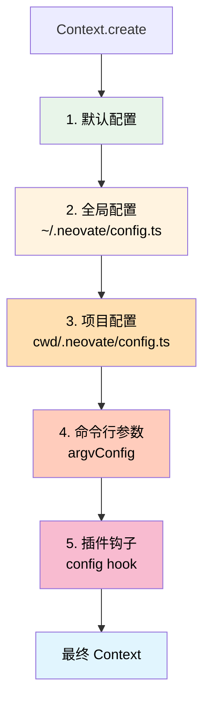

# Context 实例创建分析

> 详解项目中多处 Context.create() 的情况和配置一致性

## 你的疑问

```
虽然代码中多处调用 Context.create()，
但读取的配置应该是一样的？
整个项目的 context 配置是一致的？
```

**答案：部分正确，但有重要的细节差异！**

---

## TL;DR（太长不看版）

```typescript
// ❌ 错误理解：所有 Context 实例配置完全一样
// ✅ 正确理解：配置**基础相同**，但会因为以下因素有差异：

1. 不同的 cwd（工作目录）→ 不同的项目配置和插件
2. 不同的使用场景（子命令、quiet、交互、Web服务器）
3. 可能有不同的命令行参数覆盖
4. Web 服务器模式会缓存 Context 实例（按 cwd 分组）
```

---

## Context.create() 的所有调用位置

根据代码分析，Context.create() 在以下 **4 个场景** 中被调用：

### 场景对比表

| 场景 | 文件位置 | 调用次数 | cwd | 配置来源 | 生命周期 |
|------|---------|---------|-----|---------|---------|
| **子命令模式** | src/index.ts:345 | 每次运行命令 1 次 | 命令行指定或当前目录 | 全局+项目+命令行 | 命令执行完销毁 |
| **安静模式** | src/index.ts:400 | 每次运行 1 次 | 命令行指定或当前目录 | 全局+项目+命令行 | 执行完销毁 |
| **交互模式** | src/ui/App.tsx | 每次运行 1 次 | 命令行指定或当前目录 | 全局+项目+命令行 | 应用退出时销毁 |
| **Web 服务器** | src/nodeBridge.ts:72 | 每个 cwd 1 次（缓存） | 客户端请求的 cwd | 全局+项目+命令行 | 显式调用 clearContext |

---

## 详细场景分析

### 场景 1: 子命令模式（config/commit/mcp/run/update）

```typescript
// src/index.ts:345
if (validCommands.includes(command)) {
  const context = await Context.create({
    cwd,  // 👈 关键：可能是不同的目录
    ...contextCreateOpts,
  });

  // 根据命令执行不同操作
  switch (command) {
    case 'config': await runConfig(context); break;
    case 'commit': await runCommit(context); break;
    // ...
  }
  return;  // 👈 函数返回后，context 会被 GC
}
```

**配置特点**：
- 每次运行子命令创建 1 次
- cwd 可以通过 `--cwd` 参数指定
- 读取：全局配置 + 项目配置（基于 cwd）+ 命令行参数
- 生命周期：命令执行完就结束

**示例**：

```bash
# 在项目 A 中运行
cd /path/to/projectA
neovate config
# → Context.create({ cwd: '/path/to/projectA' })
# → 读取: ~/.neovate/config.ts + /path/to/projectA/.neovate/config.ts

# 在项目 B 中运行
cd /path/to/projectB
neovate commit
# → Context.create({ cwd: '/path/to/projectB' })
# → 读取: ~/.neovate/config.ts + /path/to/projectB/.neovate/config.ts

# 配置不同！因为项目配置不同！
```

### 场景 2: 安静模式（--quiet）

```typescript
// src/index.ts:400
if (argv.quiet) {
  const context = await Context.create({
    cwd,  // 👈 命令行指定或当前目录
    ...contextCreateOpts,
  });

  await context.apply({
    hook: 'initialized',
    args: [{ cwd, quiet: true }],  // 👈 注意 quiet: true
    type: PluginHookType.Series,
  });

  await runQuiet(argv, context);
  // 👈 执行完后 context 会被 GC
}
```

**配置特点**：
- 每次运行创建 1 次
- 与子命令模式类似，但会传递 `quiet: true` 给插件
- 插件可能会根据 quiet 模式调整行为

**示例**：

```bash
# 场景 A: 在项目 A 中安静模式
neovate --quiet "修复这个bug"
# → Context.create({ cwd: '/current/dir' })
# → plugins 看到 quiet: true，可能禁用某些功能

# 场景 B: 在另一个目录安静模式
cd /other/dir
neovate --quiet "生成文档"
# → Context.create({ cwd: '/other/dir' })
# → 读取不同的项目配置！
```

### 场景 3: 交互模式（默认）

```typescript
// src/ui/App.tsx (简化)
export function App(props: { contextCreateOpts: ContextCreateOpts }) {
  const [context, setContext] = useState<Context>();

  useEffect(() => {
    Context.create({
      cwd: process.cwd(),  // 👈 应用启动时的目录
      ...props.contextCreateOpts,
    }).then(setContext);
  }, []);

  // ... 使用 context
}
```

**配置特点**：
- 应用启动时创建 1 次
- 一直使用这个 context，直到应用退出
- cwd 固定为启动时的目录

**关键差异**：
```bash
# 在不同目录启动，context 不同
cd /projectA && neovate
# → cwd = /projectA，读取 /projectA/.neovate/config.ts

cd /projectB && neovate
# → cwd = /projectB，读取 /projectB/.neovate/config.ts
```

### 场景 4: Web 服务器模式（最特殊！）

```typescript
// src/nodeBridge.ts:68
class NodeHandlerRegistry {
  private contexts = new Map<string, Context>();  // 👈 缓存 Map

  private async getContext(cwd: string) {
    // 👉 关键：如果已经有这个 cwd 的 context，直接返回！
    if (this.contexts.has(cwd)) {
      return this.contexts.get(cwd)!;
    }

    // 👉 没有缓存，创建新的
    const context = await Context.create({
      cwd,  // 👈 每个 cwd 一个 context
      ...this.contextCreateOpts,
    });

    // 👉 缓存起来
    this.contexts.set(cwd, context);
    return context;
  }

  private async clearContext(cwd?: string) {
    if (cwd) {
      const context = await this.getContext(cwd);
      await context.destroy();
      this.contexts.delete(cwd);  // 👈 清除缓存
    } else {
      this.contexts.clear();  // 👈 清除所有
    }
  }
}
```

**配置特点**（最复杂！）：
- **按 cwd 缓存**：同一个 cwd 只创建一次 context
- **多项目支持**：可以同时管理多个项目的 context
- **显式销毁**：需要调用 clearContext 才会销毁

**示例场景**：

```typescript
// Web 客户端 A: 在项目 A 中操作
client_A.send({ cwd: '/projectA', message: 'help' })
// → getContext('/projectA')
// → contexts.has('/projectA') ? No
// → Context.create({ cwd: '/projectA' })
// → contexts.set('/projectA', context)

// Web 客户端 B: 在项目 B 中操作
client_B.send({ cwd: '/projectB', message: 'help' })
// → getContext('/projectB')
// → contexts.has('/projectB') ? No
// → Context.create({ cwd: '/projectB' })
// → contexts.set('/projectB', context)

// Web 客户端 A: 再次在项目 A 中操作
client_A.send({ cwd: '/projectA', message: 'continue' })
// → getContext('/projectA')
// → contexts.has('/projectA') ? Yes! 👈 复用已有的！
// → return contexts.get('/projectA')

// 结果：
// - 项目 A 的 context 被复用
// - 项目 B 的 context 独立存在
// - 两个 context 配置不同（因为 cwd 不同）
```

---

## 配置来源和优先级

### 配置的层级结构



### 配置合并示例

```typescript
// 假设有以下配置：

// 1. 默认配置（代码中）
const defaultConfig = {
  model: 'claude-3-5-sonnet-20241022',
  approvalMode: 'manual',
  todo: true,
  language: 'en',
};

// 2. 全局配置 (~/.neovate/config.ts)
export default {
  model: 'gpt-4',  // 覆盖默认
  myGlobalSetting: true,
};

// 3. 项目 A 配置 (/projectA/.neovate/config.ts)
export default {
  language: 'zh',  // 覆盖默认
  projectName: 'MyApp',
};

// 4. 命令行参数
neovate --model claude-3-opus

// 5. 插件钩子（如果有）
api.addHook('config', ({ config }) => ({
  ...config,
  pluginFeature: true,
}));

// 最终在 /projectA 中得到的 context.config：
{
  // 默认配置
  approvalMode: 'manual',
  todo: true,

  // 全局配置覆盖
  myGlobalSetting: true,

  // 项目配置覆盖
  language: 'zh',
  projectName: 'MyApp',

  // 命令行参数覆盖（优先级最高）
  model: 'claude-3-opus',

  // 插件钩子扩展
  pluginFeature: true,
}
```

---

## 关键差异点

### 1. cwd（工作目录）的影响

**这是最重要的差异！**

```typescript
// 在不同目录创建 context
Context.create({ cwd: '/projectA' })
// → paths.projectConfigDir = '/projectA/.neovate'
// → 读取 /projectA/.neovate/config.ts
// → 扫描 /projectA/.neovate/plugins/*.ts

Context.create({ cwd: '/projectB' })
// → paths.projectConfigDir = '/projectB/.neovate'
// → 读取 /projectB/.neovate/config.ts  // 👈 不同！
// → 扫描 /projectB/.neovate/plugins/*.ts  // 👈 不同！
```

**影响**：
- 项目配置不同
- 项目插件不同
- 项目规则不同
- README 内容不同
- Git 仓库不同

### 2. argvConfig（命令行参数）的影响

```typescript
// 场景 1: 没有命令行参数
Context.create({
  cwd: '/project',
  argvConfig: {},  // 👈 空对象
})
// → 使用默认配置和文件配置

// 场景 2: 有命令行参数
Context.create({
  cwd: '/project',
  argvConfig: {
    model: 'gpt-4',  // 👈 覆盖配置文件
    approvalMode: 'yolo',  // 👈 覆盖配置文件
  }
})
// → 命令行参数优先级最高
```

### 3. plugins（插件）的影响

```typescript
// 插件来源（按优先级）：
const pluginsConfigs = [
  ...buildInPlugins,        // 1. 内置（所有 context 相同）
  ...globalPlugins,         // 2. 全局（所有 context 相同）
  ...projectPlugins,        // 3. 项目（根据 cwd 不同）👈 差异！
  ...(config.plugins || []), // 4. 配置（根据 cwd 不同）👈 差异！
  ...(opts.plugins || []),  // 5. 命令行（可能不同）👈 差异！
];
```

**示例**：

```typescript
// 项目 A 的配置
// /projectA/.neovate/config.ts
export default {
  plugins: ['plugin-a', 'plugin-b'],
};

// 项目 B 的配置
// /projectB/.neovate/config.ts
export default {
  plugins: ['plugin-c'],  // 👈 不同的插件！
};

// 结果：
// projectA 的 context 包含: builtin + global + plugin-a + plugin-b
// projectB 的 context 包含: builtin + global + plugin-c
// 配置不同！
```

---

## 实际运行示例

### 示例 1: 同一用户，不同项目

```bash
# 用户目录结构
~/
├── .neovate/
│   ├── config.ts        # model: 'gpt-4'
│   └── plugins/
│       └── global-plugin.ts
├── projectA/
│   └── .neovate/
│       ├── config.ts    # language: 'en'
│       └── plugins/
│           └── project-a-plugin.ts
└── projectB/
    └── .neovate/
        ├── config.ts    # language: 'zh', model: 'claude-3'
        └── plugins/
            └── project-b-plugin.ts
```

**在项目 A 中运行**：

```bash
cd ~/projectA
neovate
```

```typescript
// Context.create({ cwd: '/Users/me/projectA' })
context.config = {
  model: 'gpt-4',     // 来自全局配置
  language: 'en',     // 来自项目配置
  // ...
}
context.plugins = [
  builtin,
  global-plugin,      // 来自全局
  project-a-plugin,   // 来自项目 A
]
```

**在项目 B 中运行**：

```bash
cd ~/projectB
neovate
```

```typescript
// Context.create({ cwd: '/Users/me/projectB' })
context.config = {
  model: 'claude-3',  // 来自项目配置（覆盖全局）👈 不同！
  language: 'zh',     // 来自项目配置 👈 不同！
  // ...
}
context.plugins = [
  builtin,
  global-plugin,      // 来自全局
  project-b-plugin,   // 来自项目 B 👈 不同！
]
```

**结论**：虽然都是同一个用户，但因为 cwd 不同，context 配置不同！

### 示例 2: Web 服务器模式（多项目并发）

```typescript
// Web 服务器启动
const server = new WebServer();

// 客户端 1: 在项目 A 中工作
client1.request({
  cwd: '/Users/me/projectA',
  message: 'help',
});
// → getContext('/Users/me/projectA')
// → Context.create({ cwd: '/Users/me/projectA' })
// → contexts.set('/Users/me/projectA', contextA)

// 客户端 2: 在项目 B 中工作
client2.request({
  cwd: '/Users/me/projectB',
  message: 'help',
});
// → getContext('/Users/me/projectB')
// → Context.create({ cwd: '/Users/me/projectB' })
// → contexts.set('/Users/me/projectB', contextB)

// 客户端 1: 继续在项目 A 中工作
client1.request({
  cwd: '/Users/me/projectA',
  message: 'continue',
});
// → getContext('/Users/me/projectA')
// → contexts.has('/Users/me/projectA') ✅
// → return contextA  // 👈 复用缓存！

// 内存中的状态：
contexts = {
  '/Users/me/projectA': contextA,  // 项目 A 的 context
  '/Users/me/projectB': contextB,  // 项目 B 的 context
}
// 两个 context 配置不同，互不影响！
```

---

## 配置一致性分析

### ✅ 相同的部分

1. **全局配置基础**
   - 所有 context 都读取 `~/.neovate/config.ts`
   - 所有 context 都加载全局插件 `~/.neovate/plugins/*.ts`

2. **默认配置**
   - 代码中的 defaultConfig 对所有 context 相同

3. **内置插件**
   - buildInPlugins 对所有 context 相同

### ❌ 不同的部分

1. **cwd（最重要！）**
   - 不同的 cwd → 读取不同的项目配置
   - 不同的 cwd → 加载不同的项目插件
   - 不同的 cwd → Git 状态、目录结构等都不同

2. **命令行参数**
   - 可能有不同的 `--model`、`--mcp-config` 等参数

3. **生命周期**
   - 子命令：创建 → 使用 → 销毁
   - 交互模式：创建 → 长期使用 → 应用退出时销毁
   - Web 服务器：创建 → 缓存复用 → 显式销毁

---

## 核心结论

### 你的理解修正

```typescript
// ❌ 错误理解
"所有 Context.create() 创建的 context 配置完全一样"

// ✅ 正确理解
"所有 Context.create() 创建的 context 配置**基础相同**，
 但会因为 cwd、命令行参数、使用场景的不同而有差异"
```

### 关键要点

1. **相同用户、相同目录、相同命令行参数 → 配置相同**
   ```bash
   neovate --model gpt-4
   neovate --model gpt-4  # 配置相同
   ```

2. **相同用户、不同目录 → 配置不同**
   ```bash
   cd projectA && neovate  # 读取 projectA 的配置
   cd projectB && neovate  # 读取 projectB 的配置 👈 不同！
   ```

3. **相同目录、不同命令行参数 → 配置不同**
   ```bash
   neovate --model gpt-4
   neovate --model claude-3  # 命令行覆盖 👈 不同！
   ```

4. **Web 服务器模式 → 按 cwd 缓存，多项目隔离**
   ```typescript
   contexts = Map {
     '/projectA' => contextA,  // 独立配置
     '/projectB' => contextB,  // 独立配置
   }
   ```

### 实用建议

1. **理解 cwd 的重要性**
   - cwd 决定了项目配置和插件
   - 切换目录相当于切换 context

2. **命令行参数优先级最高**
   - 需要临时覆盖配置时使用
   - 不会影响配置文件

3. **Web 服务器模式的缓存机制**
   - 同一个项目会复用 context
   - 不同项目的 context 隔离

4. **配置分层思维**
   ```
   全局配置（所有项目共享）
     ↓
   项目配置（当前项目覆盖）
     ↓
   命令行参数（临时覆盖）
     ↓
   插件钩子（动态修改）
   ```

---

## 相关文档

- [Context 详解](./context.md)
- [Context 协作机制](./context-collaboration.md)
- [整体架构](./arch.md)
