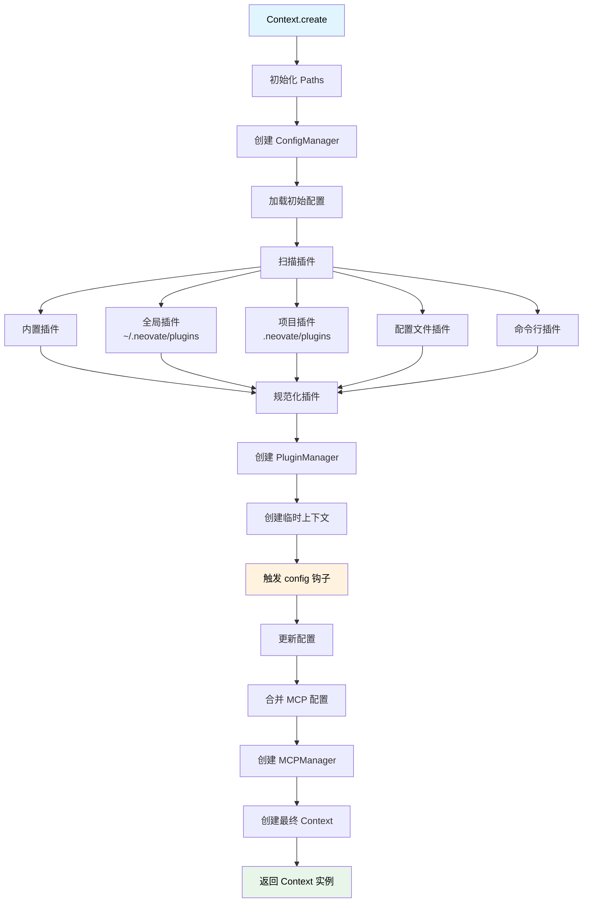
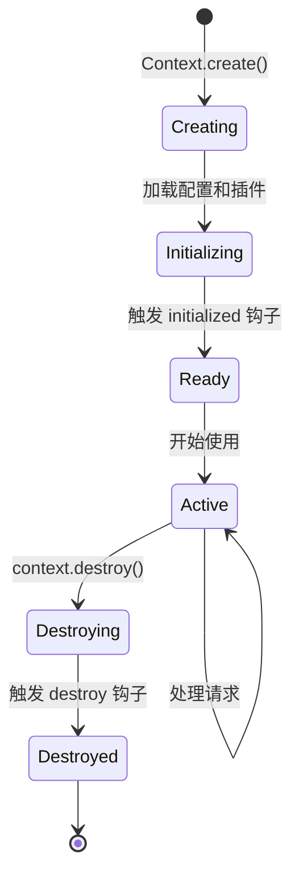
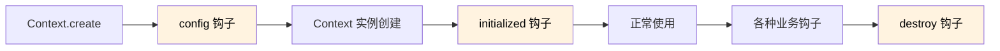

# Context 上下文系统详解

> 深入理解 Neovate Code 的上下文管理、依赖注入和生命周期控制

- source: [src/context.ts](../src/context.ts)

## 目录

- [概述](#概述)
- [Context 核心类](#context-核心类)
- [上下文创建流程](#上下文创建流程)
- [依赖注入机制](#依赖注入机制)
- [生命周期管理](#生命周期管理)
- [插件集成](#插件集成)
- [最佳实践](#最佳实践)

---

## 概述

Neovate Code 的上下文系统由核心类 Context 组成，作为全局上下文管理器和依赖注入容器。

### 设计目标

- ✅ **统一依赖管理**: 作为依赖注入容器，集中管理所有核心依赖
- ✅ **配置集中化**: 合并多个来源的配置（文件、命令行、插件）
- ✅ **插件生命周期**: 协调插件的初始化和销毁
- ✅ **路径管理**: 统一管理全局和项目级别的路径

---

## Context 核心类

### 类定义

```typescript
export class Context {
  cwd: string;                      // 当前工作目录，所有相对路径的基准
  productName: string;              // 产品名称（小写），用于路径和配置文件查找
  productASCIIArt?: string;         // ASCII 艺术字，用于终端显示
  version: string;                  // 版本号，用于显示和兼容性检查
  config: Config;                   // 最终配置对象（合并所有来源）
  paths: Paths;                     // 路径管理器，统一管理全局和项目路径
  argvConfig: Record<string, any>;  // 原始命令行参数，某些场景需要区分命令行配置
  mcpManager: MCPManager;           // MCP 服务器管理器，管理外部工具集成
  #pluginManager: PluginManager;    // 插件管理器（私有），通过 apply() 访问
}
```

### 核心属性

#### 1. 基础信息

- **cwd**: 当前工作目录，所有相对路径的基准
- **productName**: 产品名称（小写），用于路径和配置文件查找
- **version**: 当前版本号，用于显示和兼容性检查
- **productASCIIArt**: 可选的 ASCII 艺术字标题，用于终端显示

#### 2. 配置系统

- **config**: 合并后的最终配置对象
  - 来源：默认配置 + 全局配置文件 + 项目配置文件 + 命令行参数
  - 优先级：命令行 > 项目 > 全局 > 默认
- **argvConfig**: 原始命令行参数（保留用于某些场景）

Config 对象包含以下主要属性：
- `model`: 主要使用的 AI 模型
- `planModel`: 用于计划阶段的 AI 模型
- `language`: 语言设置
- `quiet`: 是否启用安静模式
- `approvalMode`: 工具审批模式（default/autoEdit/yolo）
- `plugins`: 插件列表
- `mcpServers`: MCP 服务器配置
- `provider`: 提供商配置
- `systemPrompt`: 自定义系统提示词
- `todo`: 是否启用待办功能
- `autoCompact`: 是否启用自动对话压缩
- `commit`: 提交配置
- `outputStyle`: 输出样式
- `outputFormat`: 输出格式
- `autoUpdate`: 是否启用自动更新
- `browser`: 是否启用浏览器集成

#### 3. 管理器

- **paths**: 路径管理器，统一管理全局和项目路径
  - `globalConfigDir`: 全局配置目录 (`~/.neovate/`)
  - `projectConfigDir`: 项目配置目录 (`<cwd>/.neovate/`)
  - `getSessionLogPath(sessionId)`: 获取会话日志路径
- **#pluginManager**: 插件管理器（私有），通过 apply() 方法访问
- **mcpManager**: MCP 服务器管理器，管理外部工具集成

### 核心方法

#### 1. apply() - 触发插件钩子

```typescript
async apply(applyOpts: Omit<PluginApplyOpts, 'pluginContext'>) {
  return this.#pluginManager.apply({
    ...applyOpts,
    pluginContext: this,
  });
}
```

**作用**: 触发指定的插件钩子，允许插件修改或扩展行为

Context 与插件交互的核心方法，允许插件：
- 扩展功能（如添加工具、提供商）
- 修改行为（如修改系统提示词、配置）
- 监听事件（如对话完成、查询结束）

**参数说明**:
- `applyOpts.hook`: 钩子名称（如 'tool', 'systemPrompt'）
- `applyOpts.args`: 传递给钩子的参数
- `applyOpts.memo`: 初始值或累积值
- `applyOpts.type`: 钩子类型（First/Series/SeriesLast/SeriesMerge/Parallel）

**钩子类型说明**:
- `First`: 只返回第一个非空结果
- `Series`: 串行执行所有钩子，不关心返回值
- `SeriesLast`: 串行执行，每次将前一个结果作为下一个钩子的第一个参数
- `SeriesMerge`: 串行执行，合并结果（数组连接或对象合并）
- `Parallel`: 并行执行所有钩子

**示例**:
```typescript
// 扩展工具
const tools = await context.apply({
  hook: 'tool',
  args: [{ sessionId: 'abc123' }],
  memo: [],
  type: PluginHookType.SeriesMerge,
});

// 修改系统提示词
const modifiedPrompt = await context.apply({
  hook: 'systemPrompt',
  args: [{ sessionId: 'abc123' }],
  memo: originalPrompt,
  type: PluginHookType.SeriesLast,
});
```

#### 2. destroy() - 销毁上下文

```typescript
async destroy() {
  await this.mcpManager.destroy();
  await this.apply({
    hook: 'destroy',
    args: [],
    type: PluginHookType.Parallel,
  });
}
```

**作用**: 清理资源，触发销毁钩子

**执行顺序**:
1. 销毁 MCP 管理器（关闭所有 MCP 服务器连接）
2. 并行触发所有插件的 destroy 钩子

**使用示例**:
```typescript
try {
  await doWork(context);
} finally {
  await context.destroy();
}
```

#### 3. create() - 静态工厂方法

```typescript
static async create(opts: ContextCreateOpts): Promise<Context>
```

**作用**: 创建 Context 实例（推荐使用方式）

**创建流程**:
1. 初始化 Paths（路径管理器）
2. 创建 ConfigManager，加载和合并配置
3. 扫描插件（内置 → 全局 → 项目 → 配置文件 → 命令行）
4. 规范化插件（字符串路径 → Plugin 对象）
5. 创建 PluginManager
6. 触发 config 钩子，允许插件修改配置
7. 合并 MCP 配置，创建 MCPManager
8. 创建并返回 Context 实例

**参数**:
```typescript
type ContextCreateOpts = {
  cwd: string;                    // 当前工作目录
  productName: string;            // 产品名称
  productASCIIArt?: string;       // ASCII 艺术字标题
  version: string;                // 版本号
  argvConfig: Record<string, any>;// 命令行参数对象
  plugins: (string | Plugin)[];   // 插件列表（路径或对象）
};

**插件扫描顺序**（优先级从低到高）:
1. 内置插件（硬编码的核心插件）
2. 全局插件（`~/.neovate/plugins/*.{js,ts}`）
3. 项目插件（`<cwd>/.neovate/plugins/*.{js,ts}`）
4. 配置文件中的插件
5. 命令行指定的插件（最高优先级）

**使用示例**:
```typescript
const context = await Context.create({
  cwd: process.cwd(),
  productName: 'neovate',
  version: '1.0.0',
  argvConfig: parseArgs(process.argv),
  plugins: ['my-plugin'],
});
```

---

## 上下文创建流程

### 完整流程图



Context.create() 是一个复杂的创建过程，它通过一个"先有鸡还是先有蛋"的问题：
- 需要 context 才能触发钩子
- 需要触发 config 钩子才能得到最终配置
- 需要最终配置才能创建 context

解决方案是创建一个临时的部分 context 来触发 config 钩子，然后使用经过插件处理的配置创建最终的 Context 实例。

### 详细步骤

#### 1. 初始化基础设施

```typescript
const paths = new Paths({
  productName,
  cwd,
});
```

**Paths 提供的路径**:
- `globalConfigDir`: `~/.neovate/`
- `projectConfigDir`: `<cwd>/.neovate/`
- `getSessionLogPath(sessionId)`: 会话日志路径

#### 2. 加载配置

```typescript
const configManager = new ConfigManager(
  cwd,
  productName,
  opts.argvConfig || {},
);
const initialConfig = configManager.config;
```

**配置加载顺序**:
1. 默认配置
2. 全局配置文件 (`~/.neovate/config.ts`)
3. 项目配置文件 (`<cwd>/.neovate/config.ts`)
4. 命令行参数

#### 3. 扫描插件

```typescript
const pluginsConfigs: (string | Plugin)[] = [
  ...buildInPlugins,        // 内置插件
  ...globalPlugins,         // 全局插件
  ...projectPlugins,        // 项目插件
  ...(initialConfig.plugins || []),  // 配置文件插件
  ...(opts.plugins || []),  // 命令行插件
];
```

**插件来源优先级**: 命令行 > 配置文件 > 项目 > 全局 > 内置

#### 4. 规范化插件

```typescript
const plugins = await normalizePlugins(opts.cwd, pluginsConfigs);
```

**规范化过程**:
- 字符串路径 → 使用 jiti 动态导入
- Plugin 对象 → 直接使用

#### 5. 创建插件管理器

```typescript
const pluginManager = new PluginManager(plugins);
```

#### 6. 触发 config 钩子

```typescript
const resolvedConfig = await apply({
  hook: 'config',
  args: [{ config: initialConfig, argvConfig: opts.argvConfig }],
  memo: initialConfig,
  type: PluginHookType.SeriesMerge,
});
```

**作用**: 允许插件修改配置

#### 7. 创建 MCP 管理器

```typescript
const mcpServers = {
  ...(resolvedConfig.mcpServers || {}),
  ...opts.argvConfig.mcpServers,
};
const mcpManager = MCPManager.create(mcpServers);
```

#### 8. 创建最终实例

```typescript
return new Context({
  cwd,
  productName,
  productASCIIArt,
  version,
  pluginManager,
  argvConfig: opts.argvConfig,
  config: resolvedConfig,
  paths,
  mcpManager,
});
```

---

## 依赖注入机制

### 设计模式

Context 实现了 **依赖注入容器** 模式，提供以下优势：

1. **解耦**: 模块不直接依赖具体实现，而是依赖抽象的 Context
2. **可测试**: 可以轻松创建测试用的 Context
3. **可扩展**: 通过插件系统扩展 Context
4. **集中管理**: 所有依赖在一处初始化

Context 作为依赖注入容器，管理所有核心依赖：
- 配置管理（Config）
- 路径管理（Paths）
- 插件管理（PluginManager）
- MCP 服务器管理（MCPManager）
- 命令行参数（argvConfig）

### 使用示例

#### Project 中使用 Context

```typescript
export class Project {
  context: Context;

  constructor(opts: { context: Context }) {
    this.context = opts.context;
  }

  async send(message: string) {
    // 使用 context 中的配置
    const model = this.context.config.model;

    // 使用 context 中的路径
    const logPath = this.context.paths.getSessionLogPath(this.session.id);

    // 触发插件钩子
    const tools = await this.context.apply({
      hook: 'tool',
      args: [{ sessionId: this.session.id }],
      memo: [],
      type: PluginHookType.SeriesMerge,
    });

    // ...
  }
}
```

#### Loop 中使用 Context (通过 Project)

```typescript
export async function runLoop(opts: {
  systemPrompt?: string;
  llmsContexts?: string[];
  // ...
}) {
  // Loop 不直接依赖 Context
  // 而是接收已处理好的数据
}
```

**设计原则**:
- 高层模块（Project）依赖 Context
- 底层模块（Loop）不依赖 Context
- 保持依赖单向流动

---

## 生命周期管理

### 生命周期阶段



Context 的生命周期包括以下几个阶段：
1. **Creating**: 通过 Context.create() 创建实例
2. **Initializing**: 加载配置和插件
3. **Ready**: 触发 initialized 钩子，准备就绪
4. **Active**: 开始使用，处理请求
5. **Destroying**: 调用 context.destroy() 开始销毁
6. **Destroyed**: 触发 destroy 钩子，完成销毁

### 生命周期钩子

#### 1. initialized 钩子

```typescript
// 在 Context 创建完成后立即触发
// 通常在 runNeovate 或 runQuiet 中触发

await context.apply({
  hook: 'initialized',
  args: [],
  type: PluginHookType.Series,
});
```

**用途**:
- 初始化插件状态
- 建立外部连接
- 加载额外资源

#### 2. destroy 钩子

```typescript
// 在 Context 销毁时触发

await context.destroy();
```

**用途**:
- 关闭数据库连接
- 清理临时文件
- 保存状态

### 典型生命周期示例

```typescript
// 1. 创建
const context = await Context.create({
  cwd: process.cwd(),
  productName: 'neovate',
  version: '1.0.0',
  argvConfig: {},
  plugins: [],
});

// 2. 初始化
await context.apply({
  hook: 'initialized',
  args: [],
  type: PluginHookType.Series,
});

// 3. 使用
const project = new Project({ context });
await project.send('Hello');

// 4. 销毁
await context.destroy();
```

---

## 插件集成

### 插件与 Context 的关系

Context 通过 PluginManager 协调所有插件，提供以下能力：

#### 1. 修改配置

```typescript
const myPlugin: Plugin = {
  name: 'my-plugin',
  setup(api) {
    api.addHook('config', ({ config, argvConfig }) => {
      return {
        ...config,
        model: 'custom-model',
      };
    });
  }
};
```

使用 SeriesMerge 类型，插件可以合并配置对象。

#### 2. 扩展工具

```typescript
api.addHook('tool', (tools, { sessionId }) => {
  return [...tools, myCustomTool];
});
```

使用 SeriesMerge 类型，插件可以合并工具数组。

#### 3. 修改系统提示词

```typescript
api.addHook('systemPrompt', (prompt, { sessionId }) => {
  return prompt + '\nAdditional instructions';
});
```

使用 SeriesLast 类型，插件可以修改系统提示词。

#### 4. 扩展上下文信息

```typescript
api.addHook('context', (llmsContext, { sessionId, userPrompt }) => {
  return {
    ...llmsContext,
    projectInfo: getProjectInfo(),
  };
});
```

使用 SeriesMerge 类型，插件可以合并上下文对象。详情请参考 [LlmsContext 文档](./llmsContext.md)。

#### 5. 扩展环境信息

```typescript
api.addHook('env', (llmsEnv, { sessionId, userPrompt }) => {
  return {
    ...llmsEnv,
    'Custom Variable': process.env.CUSTOM_VAR,
  };
});
```

使用 SeriesMerge 类型，插件可以合并环境变量对象。详情请参考 [LlmsContext 文档](./llmsContext.md)。

### 插件钩子执行顺序



---

## 最佳实践

### 1. 始终使用 Context.create()

❌ **错误做法**:
```typescript
const context = new Context({
  cwd: process.cwd(),
  // ... 手动初始化所有依赖
});
```

✅ **正确做法**:
```typescript
const context = await Context.create({
  cwd: process.cwd(),
  productName: 'neovate',
  version: '1.0.0',
  argvConfig: {},
  plugins: [],
});
```

Context.create() 是创建 Context 实例的推荐方式，它会自动处理依赖注入、配置合并和插件初始化。

### 2. 传递 Context 而非拆分属性

❌ **错误做法**:
```typescript
function doSomething(
  cwd: string,
  config: Config,
  paths: Paths,
  pluginManager: PluginManager
) {
  // ...
}
```

✅ **正确做法**:
```typescript
function doSomething(context: Context) {
  // 通过 context 访问所需属性
  const { cwd, config, paths } = context;
  // ...
}
```

### 3. 及时销毁 Context

❌ **错误做法**:
```typescript
const context = await Context.create(opts);
// 使用后不销毁
```

✅ **正确做法**:
```typescript
const context = await Context.create(opts);
try {
  await doSomething(context);
} finally {
  await context.destroy();
}
```

### 4. 插件中使用钩子扩展 Context

❌ **错误做法**:
```typescript
// 直接修改 context 对象
context.config.model = 'new-model';
```

✅ **正确做法**:
```typescript
// 通过钩子修改
api.addHook('config', ({ config }) => {
  return {
    ...config,
    model: 'new-model',
  };
});
```

### 5. LlmsContext 的使用时机

✅ **正确时机**:
```typescript
// 在每次对话开始时创建
const llmsContext = await LlmsContext.create({
  context,
  sessionId: session.id,
  userPrompt: message,
});
```

❌ **错误时机**:
```typescript
// 不要在 Context.create 时创建
// LlmsContext 是动态的，每次对话都会重新创建
```

---

## 总结

### Context 的核心价值

1. **依赖注入容器** - 统一管理所有依赖
2. **配置集中化** - 多源配置合并与优先级控制
3. **插件协调器** - 协调插件生命周期和钩子执行
4. **路径管理器** - 统一管理全局和项目路径
5. **环境隔离** - 提供完整的运行环境信息

Context 是 Neovate Code 的核心组件，作为依赖注入容器管理所有核心依赖，并通过插件系统提供可扩展性。

### LlmsContext 的核心价值

1. **环境信息组装** - 为 AI 提供完整的运行环境
2. **项目上下文** - Git 状态、目录结构、规则等
3. **可扩展性** - 通过插件钩子扩展上下文信息
4. **动态生成** - 每次对话都重新生成，保证信息新鲜

LlmsContext 专为 AI 模型设计，提供结构化的上下文信息，帮助 AI 更好地理解项目环境。

### 学习路径

1. **理解依赖注入** - Context 作为容器的作用
2. **掌握创建流程** - Context.create() 的完整流程
3. **熟悉生命周期** - initialized 和 destroy 钩子
4. **学习插件集成** - 如何通过插件扩展 Context
5. **实践 LlmsContext** - 理解如何为 AI 提供上下文

**推荐阅读顺序**:
Context 基础 → 创建流程 → 生命周期 → 插件集成 → LlmsContext → 实践应用

---

## 相关文档

- [整体架构](./arch.md)
- [插件系统](./arch.md#8-plugin-plugints)
- [配置管理](./arch.md#配置加载流程图)
- [项目管理](./arch.md#3-project-projectts)
