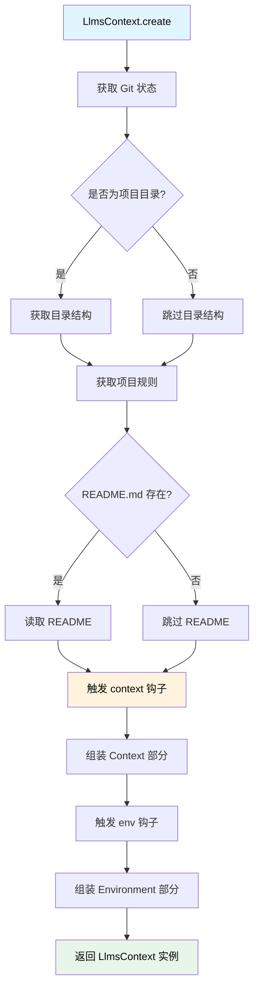
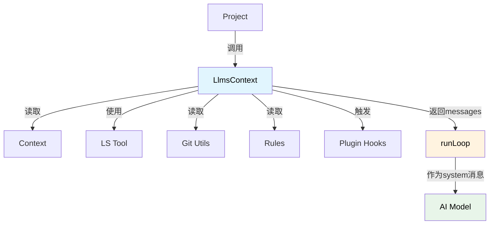

# LlmsContext 上下文系统详解

> 深入理解 Neovate Code 的 AI 模型上下文管理、环境信息组装

- source: [src/llmsContext.ts](../src/llmsContext.ts)

## 目录

- [概述](#概述)
- [LlmsContext 核心类](#llmscontext-核心类)
- [上下文创建流程](#上下文创建流程)
- [上下文信息结构](#上下文信息结构)
- [插件扩展点](#插件扩展点)
- [使用时机](#使用时机)
- [最佳实践](#最佳实践)

---

## 概述

LlmsContext 是 Neovate Code 专门为 AI 模型设计的上下文管理类，负责为 AI 模型提供完整的运行环境信息。

### 设计特点

- ✅ **动态生成**: 每次对话都重新创建，确保信息最新
- ✅ **可扩展**: 通过 context 和 env 钩子支持插件扩展
- ✅ **结构化**: 使用 XML 标签包装，便于 AI 模型解析
- ✅ **环境隔离**: 提供完整的运行环境信息

### 核心职责

为 AI 模型提供完整的运行环境信息，包括：
- Git 状态
- 目录结构
- 项目规则
- README 内容
- 自定义上下文（通过插件扩展）
- 环境变量

---

## LlmsContext 核心类

### 类定义

```typescript
export class LlmsContext {
  messages: string[];  // 上下文消息数组（通常包含 2 个消息：Context 和 Environment）

  static async create(opts: LlmsContextCreateOpts): Promise<LlmsContext>
}
```

### 核心属性

#### messages

上下文消息数组（通常包含 2 个消息：Context 和 Environment）

这两个消息通常会作为系统消息的一部分发送给 AI 模型：
1. Context 部分：包含项目相关信息
2. Environment 部分：包含运行环境信息

### 创建参数

```typescript
type LlmsContextCreateOpts = {
  context: Context; // 全局上下文（包含配置、插件等）
  sessionId: string; // 会话 ID
  userPrompt: string | null; // 用户输入的提示（可能为空，如恢复会话）
};
```

---

## 上下文创建流程

### 完整流程图



LlmsContext.create() 是一个动态创建过程，每次对话都会重新生成最新的上下文信息。

### 详细步骤

1. 获取 Git 状态（如果在 Git 仓库中）
2. 获取并格式化 Git 状态信息
3. 获取目录结构（仅在项目目录中）
4. 获取项目规则（来自全局配置、项目根目录或配置文件）
5. 读取 README.md 内容
6. 触发 context 钩子（允许插件扩展上下文）
7. 组装 Context 部分（使用 XML 标签格式）
8. 准备环境信息（工作目录、是否为 Git 仓库、平台、日期等）
9. 触发 env 钩子（允许插件扩展环境信息）
10. 组装 Environment 部分（使用 XML 标签格式）
11. 返回包含两个消息的 LlmsContext 实例

---

## 上下文信息结构

### 1. 组装 Context 部分

```xml
# Context
As you answer the user's questions, you can use the following context:

<context name="gitStatus">
Current branch: main
Status:
M src/context.ts
M docs/arch.md
</context>

<context name="directoryStructure">
Listed 120 files/directories
<directory_structure>
- /path/to/project/
  - AGENTS.md
  - package.json
  - src/
    - browser.ts
    - cli.ts
    - commands/
      - commit.ts
      - config.ts
</directory_structure>
</context>

<context name="rules">
The codebase follows strict style guidelines shown below. All code changes must strictly adhere to these guidelines to maintain consistency and quality.

<!-- getLlmsRules: 每个 rule 文件读取后(AGENTS.md, CLAUDE.md, <ProductName>.md)，间隔一行 -->
- Always use TypeScript strict mode
- Follow existing code style
...
</context>

<context name="readme">
# Project Name
Project description...
</context>
```

在 `directoryStructure` 中，第一行是 `returnDisplay`（工具执行的简要说明），后面是包含在 `<directory_structure>` 标签中的 `llmContent`（实际的目录结构内容）。

Context 部分包含以下信息：
- `gitStatus`: Git 仓库状态（分支、修改文件等）
- `directoryStructure`: 目录结构（项目文件树）
- `rules`: 项目规则（代码规范、约定等）
- `readme`: README.md 内容
- 自定义上下文（通过 context 钩子扩展）

### 2. 组装 Environment 部分

```xml
# Environment
Here is useful information about the environment you are running in.
<env name="Working directory">/path/to/project</env>
<env name="Is directory a git repo">YES</env>
<env name="Platform">darwin</env>
<env name="Today's date">2025-01-15</env>
```

Environment 部分包含以下信息：
- `Working directory`: 工作目录
- `Is directory a git repo`: 是否为 Git 仓库
- `Platform`: 操作系统平台
- `Today's date`: 当前日期
- 自定义环境信息（通过 env 钩子扩展）

---

## 插件扩展点

### 1. context 钩子

```typescript
api.addHook('context', (llmsContext, { sessionId, userPrompt }) => {
  return {
    ...llmsContext,
    customInfo: 'Custom context information',
  };
});
```

允许插件添加自定义上下文信息，使用 SeriesMerge 类型，插件可以合并对象。

### 2. env 钩子

```typescript
api.addHook('env', (llmsEnv, { sessionId, userPrompt }) => {
  return {
    ...llmsEnv,
    'Custom Env': 'Custom environment variable',
  };
});
```

允许插件添加自定义环境信息，使用 SeriesMerge 类型，插件可以合并对象。

---

## 使用时机和调用链

### 调用链路

```mermaid
sequenceDiagram
    participant User as 用户
    participant CLI as CLI
    participant Project
    participant LlmsContext
    participant Loop as runLoop
    participant AI as AI Model
    
    User->>CLI: neo "fix the bug"
    CLI->>Project: project.send(message)
    
    Note over Project: 每次 send() 都创建新的 LlmsContext
    
    Project->>LlmsContext: LlmsContext.create({
    Note right of LlmsContext: context, sessionId, userPrompt
    Note right of LlmsContext: })
    
    LlmsContext->>LlmsContext: 收集 Git 状态
    LlmsContext->>LlmsContext: 获取目录结构
    LlmsContext->>LlmsContext: 读取规则和 README
    LlmsContext->>LlmsContext: 触发插件钩子
    LlmsContext->>LlmsContext: 组装 Context 和 Environment
    LlmsContext-->>Project: 返回 llmsContext.messages
    
    Project->>Loop: runLoop({
    Note right of Loop: llmsContexts: llmsContext.messages
    Note right of Loop: })
    
    Loop->>Loop: 将 llmsContexts 转为系统消息
    Loop->>AI: 发送请求（包含上下文）
    AI-->>Loop: 响应
    Loop-->>Project: 返回结果
    Project-->>CLI: 输出给用户
```

### 完整调用示例

**代码位置**: `src/project.ts:184-188`

```typescript
// 在 Project.sendWithSystemPromptAndTools 方法中
private async sendWithSystemPromptAndTools(message: string | null, opts: {...}) {
  // 1. 解析模型
  const model = (await resolveModelWithContext(opts.model || null, this.context)).model!;
  
  // 2. 创建 LlmsContext（每次对话都重新创建）
  const llmsContext = await LlmsContext.create({
    context: this.context,
    sessionId: this.session.id,
    userPrompt: message,
  });
  
  // 3. 传递给 runLoop
  return runLoop({
    input: filteredInput,
    model,
    tools: toolsManager,
    cwd: this.context.cwd,
    systemPrompt: opts.systemPrompt,
    llmsContexts: llmsContext.messages,  // ← 这里使用
    // ... 其他参数
  });
}
```

**在 Loop 中的使用**: `src/loop.ts:162-169`

```typescript
// runLoop 函数内部
const llmsContexts = opts.llmsContexts || [];
const llmsContextMessages = llmsContexts.map((llmsContext) => {
  return {
    role: 'system',
    content: llmsContext,
  } as SystemMessageItem;
});

// 包含在输入中，作为系统消息发送给 AI
let agentInput = [...llmsContextMessages, ...history.toAgentInput()];
```

### 时机说明

✅ **正确时机** - 在每次对话开始时创建:
```typescript
// Project.send() 或 Project.plan() 调用时
const llmsContext = await LlmsContext.create({
  context: this.context,
  sessionId: this.session.id,
  userPrompt: message,  // 当前用户输入
});
```

❌ **错误时机** - 不要在这些地方创建:
```typescript
// ❌ 不要在 Context.create 时创建
// LlmsContext 是动态的，每次对话都会重新创建

// ❌ 不要在 Session 初始化时创建
// 会话可能持续很久，上下文信息会过时

// ❌ 不要缓存 LlmsContext 实例
// 项目状态可能变化（Git提交、文件修改等）
```

**为什么每次都要重新创建？**

1. **Git 状态会变化** - 用户可能在对话间进行了提交、切换分支
2. **文件结构会变化** - 用户可能添加、删除、移动了文件
3. **README 可能更新** - 项目文档可能修改
4. **日期会变化** - Environment 中的日期需要是当前日期
5. **插件可能添加动态信息** - 插件钩子可能返回依赖当前状态的信息

---

## 最佳实践

### 1. 动态创建

LlmsContext 是动态生成的，每次对话都应重新创建以确保信息新鲜。

### 2. 插件扩展

通过 context 和 env 钩子来扩展 LlmsContext，而不是直接修改。

### 3. 结构化信息

LlmsContext 使用 XML 标签包装信息，便于 AI 模型解析。

---

## 实际输出示例

### 示例 1: 完整的上下文信息

假设项目结构：
```
/path/to/my-project/
├── README.md
├── package.json
├── CLAUDE.md
└── src/
    ├── index.ts
    └── utils.ts
```

**LlmsContext.messages[0] (Context 部分)**:

```xml
# Context
As you answer the user's questions, you can use the following context:
<context name="gitStatus">Current branch: main
Main branch (you will usually use this for PRs): master

Status:
M src/index.ts
M README.md

Recent commits:
abc1234 feat: add new feature
def5678 fix: resolve bug
</context>
<context name="directoryStructure">Listed 5 files/directories
<directory_structure>
- /path/to/my-project/
  - README.md
  - package.json
  - CLAUDE.md
  - src/
    - index.ts
    - utils.ts
</directory_structure>
</context>
<context name="rules">The codebase follows strict style guidelines shown below. All code changes must strictly adhere to these guidelines to maintain consistency and quality.

- Always use TypeScript strict mode
- Follow ESLint rules
- Write unit tests for new features
</context>
<context name="readme"># My Project

This is a sample project for demonstrating LlmsContext.

## Features
- Feature A
- Feature B
</context>
```

**LlmsContext.messages[1] (Environment 部分)**:

```xml
# Environment
Here is useful information about the environment you are running in.
<env name="Working directory">/path/to/my-project</env>
<env name="Is directory a git repo">YES</env>
<env name="Platform">darwin</env>
<env name="Today's date">2025-01-24</env>
```

### 示例 2: 非 Git 项目

**LlmsContext.messages[0]**:
```xml
# Context
As you answer the user's questions, you can use the following context:
<context name="directoryStructure">Listed 3 files/directories
<directory_structure>
- /path/to/non-git-project/
  - index.js
  - config.json
  - utils.js
</directory_structure>
</context>
```

**LlmsContext.messages[1]**:
```xml
# Environment
Here is useful information about the environment you are running in.
<env name="Working directory">/path/to/non-git-project</env>
<env name="Is directory a git repo">NO</env>
<env name="Platform">linux</env>
<env name="Today's date">2025-01-24</env>
```

### 示例 3: 插件扩展上下文

假设插件添加了自定义信息：

```typescript
// 在插件中
api.addHook('context', (llmsContext, { sessionId, userPrompt }) => {
  return {
    ...llmsContext,
    'dependencies': 'react@18.0.0, typescript@5.0.0',
    'lastBuild': 'Success at 2025-01-24 10:30',
  };
});

api.addHook('env', (llmsEnv, { sessionId, userPrompt }) => {
  return {
    ...llmsEnv,
    'Node Version': 'v20.10.0',
    'CPU Cores': '8',
  };
});
```

**输出结果**:

```xml
# Context
As you answer the user's questions, you can use the following context:
<context name="gitStatus">...</context>
<context name="directoryStructure">...</context>
<context name="rules">...</context>
<context name="readme">...</context>
<context name="dependencies">react@18.0.0, typescript@5.0.0</context>
<context name="lastBuild">Success at 2025-01-24 10:30</context>
```

```xml
# Environment
Here is useful information about the environment you are running in.
<env name="Working directory">/path/to/project</env>
<env name="Is directory a git repo">YES</env>
<env name="Platform">darwin</env>
<env name="Today's date">2025-01-24</env>
<env name="Node Version">v20.10.0</env>
<env name="CPU Cores">8</env>
```

---

## 性能考虑

### Token 消耗

LlmsContext 会消耗一定量的 Token，主要来源：

| 组件 | 典型大小 | 说明 |
|------|---------|------|
| Git Status | 100-500 tokens | 取决于修改文件数量 |
| Directory Structure | 500-2000 tokens | 取决于项目规模 |
| Rules | 200-1000 tokens | 取决于规则文件大小 |
| README | 100-1000 tokens | 取决于 README 长度 |
| Environment | 50-100 tokens | 固定较小 |
| **总计** | **约 1000-5000 tokens** | 每次对话的开销 |

### 优化建议

1. **控制目录结构深度** - LS 工具默认限制深度和文件数
2. **精简 README** - 保持 README 简洁，详细文档放在其他文件
3. **合理使用规则文件** - 避免在 CLAUDE.md 中写过长的规则
4. **插件谨慎添加** - 只添加真正必要的上下文信息

### 缓存机制

⚠️ **注意**: LlmsContext 不使用缓存机制，每次都重新生成。这是设计决策：

- ✅ 优点：信息始终最新，不会出现过时数据
- ⚠️ 缺点：每次对话都要重新读取文件和执行工具

如果性能成为瓶颈，可以考虑：
- 在会话级别缓存 README 和规则（除非文件修改）
- 缓存目录结构（除非检测到文件系统变化）
- 缓存 Git 状态（除非检测到 Git 操作）

---

## 故障排查

### 常见问题

#### 1. 上下文信息不完整

**症状**: AI 回复中没有使用项目信息

**检查点**:
```typescript
// 确认 llmsContext.messages 有内容
const llmsContext = await LlmsContext.create({...});
console.log('Context messages:', llmsContext.messages.length);
console.log('Context content:', llmsContext.messages[0]);
```

**可能原因**:
- 不在 Git 仓库中（gitStatus 为空）
- 不在项目目录中（directoryStructure 为空）
- README.md 不存在
- 规则文件不存在

#### 2. 目录结构过大导致 Token 超限

**症状**: 提示上下文过长错误

**解决方案**:
```typescript
// 在 .neoignore 中排除大目录
node_modules/
dist/
build/
.git/
```

#### 3. 插件钩子没有生效

**检查**:
```typescript
// 确认插件已注册
api.addHook('context', (llmsContext, args) => {
  console.log('context hook called:', args);
  return { ...llmsContext, custom: 'value' };
});
```

#### 4. 日期格式问题

**症状**: "Today's date" 格式不一致

**说明**: `new Date().toLocaleDateString()` 根据系统locale返回不同格式
- US: "1/24/2025"
- UK: "24/01/2025"
- ISO: "2025-01-24" (如果配置了)

---

## 与其他模块的关系



**数据流向**:

```
Project.send()
    ↓
LlmsContext.create()
    ├─ getGitStatus() → Git 状态
    ├─ LSTool.execute() → 目录结构
    ├─ getLlmsRules() → 项目规则
    ├─ fs.readFileSync() → README
    ├─ context.apply('context') → 插件扩展
    └─ context.apply('env') → 环境扩展
    ↓
llmsContext.messages
    ↓
runLoop({ llmsContexts })
    ↓
Agent 输入（作为系统消息）
    ↓
AI Model
```

---

## 总结

### 核心特性

1. ✅ **动态生成** - 每次对话重新创建，确保信息最新
2. ✅ **结构化输出** - 使用 XML 标签，便于 AI 解析
3. ✅ **可扩展** - 通过 context 和 env 钩子支持插件
4. ✅ **完整信息** - 包含 Git、目录、规则、README、环境
5. ✅ **分离关注点** - Context 部分（项目信息）vs Environment 部分（运行环境）

### 设计原则

- **即时性** - 不缓存，每次都获取最新信息
- **完整性** - 提供 AI 需要的所有上下文
- **可读性** - 使用清晰的 XML 结构
- **可扩展性** - 通过插件钩子支持自定义

### 最佳实践

1. **控制信息量** - 避免添加过多上下文导致 Token 浪费
2. **保持文件简洁** - README、规则文件不要过长
3. **合理使用插件** - 只添加真正需要的上下文
4. **每次重新创建** - 不要缓存 LlmsContext 实例

---

## 相关文档

- [Context 上下文系统](./context.md)
- [Loop 交互循环](./loop.md)
- [Project 项目管理](./project.md)
- [整体架构](./arch.md)
- [插件系统](./arch.md#8-plugin-plugints)
