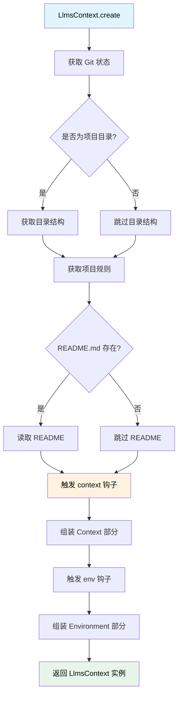

# LlmsContext 上下文系统详解

> 深入理解 Neovate Code 的 AI 模型上下文管理、环境信息组装

- source: [src/llmsContext.ts](../src/llmsContext.ts)

## 目录

- [概述](#概述)
- [LlmsContext 核心类](#llmscontext-核心类)
- [上下文创建流程](#上下文创建流程)
- [上下文信息结构](#上下文信息结构)
- [插件扩展点](#插件扩展点)
- [使用时机](#使用时机)
- [最佳实践](#最佳实践)

---

## 概述

LlmsContext 是 Neovate Code 专门为 AI 模型设计的上下文管理类，负责为 AI 模型提供完整的运行环境信息。

### 设计特点

- ✅ **动态生成**: 每次对话都重新创建，确保信息最新
- ✅ **可扩展**: 通过 context 和 env 钩子支持插件扩展
- ✅ **结构化**: 使用 XML 标签包装，便于 AI 模型解析
- ✅ **环境隔离**: 提供完整的运行环境信息

### 核心职责

为 AI 模型提供完整的运行环境信息，包括：
- Git 状态
- 目录结构
- 项目规则
- README 内容
- 自定义上下文（通过插件扩展）
- 环境变量

---

## LlmsContext 核心类

### 类定义

```typescript
export class LlmsContext {
  messages: string[];  // 上下文消息数组（通常包含 2 个消息：Context 和 Environment）

  static async create(opts: LlmsContextCreateOpts): Promise<LlmsContext>
}
```

### 核心属性

#### messages

上下文消息数组（通常包含 2 个消息：Context 和 Environment）

这两个消息通常会作为系统消息的一部分发送给 AI 模型：
1. Context 部分：包含项目相关信息
2. Environment 部分：包含运行环境信息

### 创建参数

```typescript
type LlmsContextCreateOpts = {
  context: Context; // 全局上下文（包含配置、插件等）
  sessionId: string; // 会话 ID
  userPrompt: string | null; // 用户输入的提示（可能为空，如恢复会话）
};
```

---

## 上下文创建流程

### 完整流程图



LlmsContext.create() 是一个动态创建过程，每次对话都会重新生成最新的上下文信息。

### 详细步骤

1. 获取 Git 状态（如果在 Git 仓库中）
2. 获取并格式化 Git 状态信息
3. 获取目录结构（仅在项目目录中）
4. 获取项目规则（来自全局配置、项目根目录或配置文件）
5. 读取 README.md 内容
6. 触发 context 钩子（允许插件扩展上下文）
7. 组装 Context 部分（使用 XML 标签格式）
8. 准备环境信息（工作目录、是否为 Git 仓库、平台、日期等）
9. 触发 env 钩子（允许插件扩展环境信息）
10. 组装 Environment 部分（使用 XML 标签格式）
11. 返回包含两个消息的 LlmsContext 实例

---

## 上下文信息结构

### 1. Context 部分

```xml
<context name="gitStatus">
Current branch: main
Status:
M src/context.ts
M docs/arch.md
</context>

<context name="directoryStructure">
- src/
  - context.ts
  - project.ts
  ...
</context>

<context name="rules">
- Always use TypeScript strict mode
- Follow existing code style
...
</context>

<context name="readme">
# Project Name
Project description...
</context>
```

Context 部分包含以下信息：
- `gitStatus`: Git 仓库状态（分支、修改文件等）
- `directoryStructure`: 目录结构（项目文件树）
- `rules`: 项目规则（代码规范、约定等）
- `readme`: README.md 内容
- 自定义上下文（通过 context 钩子扩展）

### 2. Environment 部分

```xml
<env name="Working directory">/path/to/project</env>
<env name="Is directory a git repo">YES</env>
<env name="Platform">darwin</env>
<env name="Today's date">2025-01-15</env>
```

Environment 部分包含以下信息：
- `Working directory`: 工作目录
- `Is directory a git repo`: 是否为 Git 仓库
- `Platform`: 操作系统平台
- `Today's date`: 当前日期
- 自定义环境信息（通过 env 钩子扩展）

---

## 插件扩展点

### 1. context 钩子

```typescript
api.addHook('context', (llmsContext, { sessionId, userPrompt }) => {
  return {
    ...llmsContext,
    customInfo: 'Custom context information',
  };
});
```

允许插件添加自定义上下文信息，使用 SeriesMerge 类型，插件可以合并对象。

### 2. env 钩子

```typescript
api.addHook('env', (llmsEnv, { sessionId, userPrompt }) => {
  return {
    ...llmsEnv,
    'Custom Env': 'Custom environment variable',
  };
});
```

允许插件添加自定义环境信息，使用 SeriesMerge 类型，插件可以合并对象。

---

## 使用时机

✅ **正确时机**:
```typescript
// 在每次对话开始时创建
const llmsContext = await LlmsContext.create({
  context,
  sessionId: session.id,
  userPrompt: message,
});
```

❌ **错误时机**:
```typescript
// 不要在 Context.create 时创建
// LlmsContext 是动态的，每次对话都会重新创建
```

LlmsContext 应该在每次对话开始时动态创建，以确保上下文信息是最新的。

---

## 最佳实践

### 1. 动态创建

LlmsContext 是动态生成的，每次对话都应重新创建以确保信息新鲜。

### 2. 插件扩展

通过 context 和 env 钩子来扩展 LlmsContext，而不是直接修改。

### 3. 结构化信息

LlmsContext 使用 XML 标签包装信息，便于 AI 模型解析。

---

## 相关文档

- [Context 上下文系统](./context.md)
- [整体架构](./arch.md)
- [插件系统](./arch.md#8-plugin-plugints)
