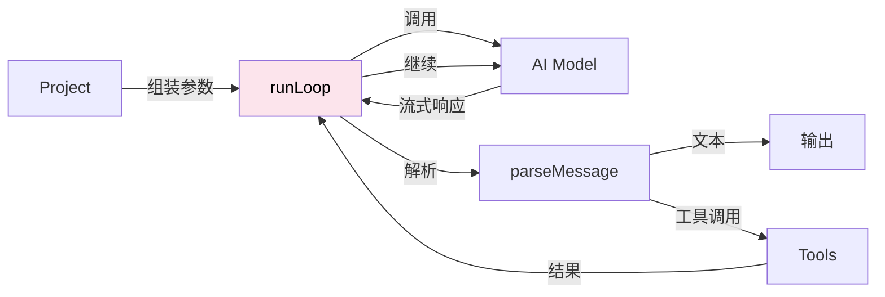
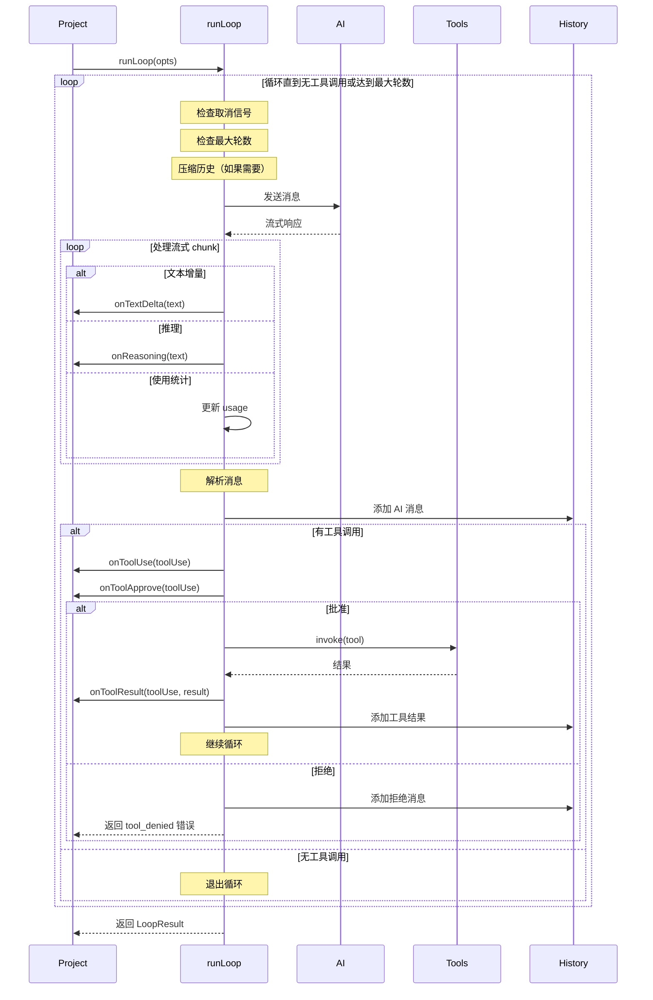
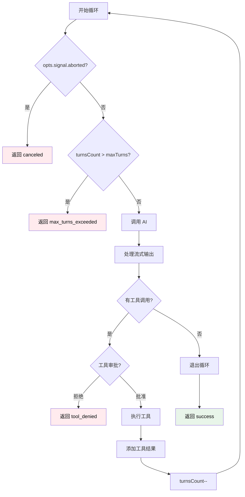
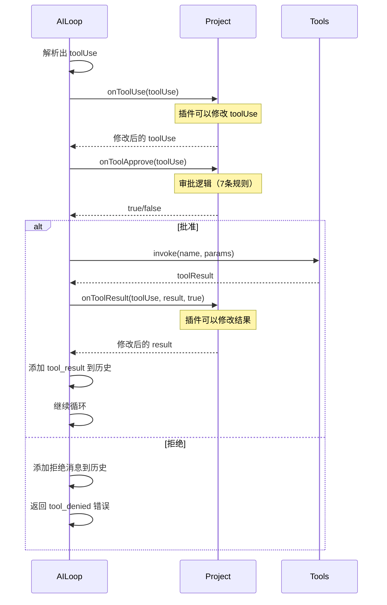
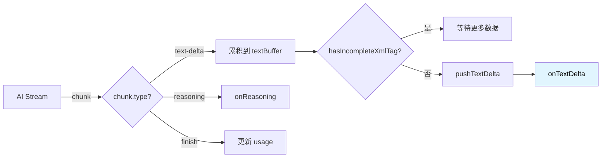

# Loop 模块详解

> 深入理解 AI 交互循环的核心实现

- source: [src/loop.ts](../src/loop.ts)

## 目录

- [概述](#概述)
- [核心流程](#核心流程)
- [数据结构](#数据结构)
- [循环逻辑](#循环逻辑)
- [工具调用处理](#工具调用处理)
- [流式输出](#流式输出)
- [错误处理](#错误处理)
- [性能优化](#性能优化)
- [FAQ](#FAQ)

---

## 概述

### 定位

Loop (runLoop) 是 **AI 交互循环的核心执行引擎**，负责：
- 与 AI 模型进行流式交互
- 解析和执行工具调用
- 管理对话历史
- 处理循环控制（最大轮数、取消等）
- 实时输出文本和推理过程



### 设计特点

1. **纯函数设计** - 不依赖 Context，只接收处理好的数据
2. **流式处理** - 实时输出 AI 响应
3. **自动循环** - 检测工具调用，自动继续对话
4. **错误容错** - 完善的错误处理和取消机制

---

## 核心流程

### 整体流程图



### 简化流程

```
1. 初始化
   ↓
2. While 循环
   ├─ 检查条件（取消、最大轮数）
   ├─ 压缩历史（如果需要）
   ├─ 调用 AI（流式）
   ├─ 处理流式输出
   ├─ 解析消息
   ├─ 添加到历史
   ├─ 检查工具调用
   │  ├─ 有 → 执行工具 → 继续循环
   │  └─ 无 → 退出循环
   ↓
3. 返回结果
```

---

## 数据结构

### RunLoopOpts（输入参数）

```typescript
type RunLoopOpts = {
  // 必需参数
  input: string | NormalizedMessage[];  // 输入消息
  model: ModelInfo;                      // AI 模型信息
  tools: Tools;                          // 工具管理器
  cwd: string;                           // 工作目录

  // 可选配置
  systemPrompt?: string;                 // 系统提示词
  llmsContexts?: string[];               // AI 上下文（来自 LlmsContext）
  maxTurns?: number;                     // 最大轮数（默认 50）
  autoCompact?: boolean;                 // 是否自动压缩历史
  signal?: AbortSignal;                  // 取消信号

  // 回调函数
  onTextDelta?: (text: string) => Promise<void>;           // 文本增量
  onText?: (text: string) => Promise<void>;                // 完整文本
  onReasoning?: (text: string) => Promise<void>;           // 推理过程
  onChunk?: (chunk: any, requestId: string) => Promise<void>;  // 原始 chunk
  onMessage?: OnMessage;                                   // 消息添加
  onToolUse?: (toolUse: ToolUse) => Promise<ToolUse>;     // 工具使用前
  onToolResult?: (toolUse, result, approved) => Promise<ToolResult>;  // 工具结果后
  onToolApprove?: (toolUse: ToolUse) => Promise<boolean>; // 工具审批
  onTurn?: (turn) => Promise<void>;                       // 每轮结束
};
```

### LoopResult（返回结果）

```typescript
type LoopResult =
  | {
      success: true;
      data: {
        text: string;       // AI 的最终文本响应
        history: History;   // 完整的对话历史
        usage: Usage;       // Token 使用统计
      };
      metadata: {
        turnsCount: number;      // 循环轮数
        toolCallsCount: number;  // 工具调用次数
        duration: number;        // 总耗时（毫秒）
      };
    }
  | {
      success: false;
      error: {
        type: 'tool_denied' | 'max_turns_exceeded' | 'api_error' | 'canceled';
        message: string;
        details?: Record<string, any>;
      };
    };
```

### 内部状态

```typescript
// 在 runLoop 函数内维护的状态
let turnsCount = 0;           // 当前轮数
let toolCallsCount = 0;       // 工具调用计数
let finalText = '';           // 最终文本
let lastUsage = Usage.empty(); // 上一轮的 usage
const totalUsage = Usage.empty(); // 总 usage
const history = new History({ messages, onMessage }); // 历史管理器
const abortController = new AbortController(); // 取消控制器
```

---

## 循环逻辑

### While 循环

```typescript
while (true) {
  // =============== 1. 前置检查 ===============

  // 1.1 检查取消信号
  if (opts.signal?.aborted && !abortController.signal.aborted) {
    abortController.abort();
    return createCancelError();
  }

  // 1.2 增加轮数
  turnsCount++;

  // 1.3 检查最大轮数
  if (turnsCount > maxTurns) {
    return {
      success: false,
      error: {
        type: 'max_turns_exceeded',
        message: `Maximum turns (${maxTurns}) exceeded`,
        details: { turnsCount, history, usage: totalUsage },
      },
    };
  }

  // 1.4 自动压缩历史（如果启用）
  if (opts.autoCompact) {
    const compressed = await history.compress(opts.model);
    // 压缩长历史，减少 token 消耗
  }

  // =============== 2. 调用 AI ===============

  // 2.1 创建 Runner 和 Agent
  const runner = new Runner({
    modelProvider: {
      getModel() {
        return opts.model.aisdk;
      },
    },
  });

  const agent = new Agent({
    name: 'code',
    model: opts.model.model.id,
    instructions: `
${opts.systemPrompt || ''}
${opts.tools.length() > 0 ? opts.tools.getToolsPrompt() : ''}
    `,
  });

  // 2.2 准备输入
  const llmsContextMessages = opts.llmsContexts.map(ctx => ({
    role: 'system',
    content: ctx,
  }));
  let agentInput = [...llmsContextMessages, ...history.toAgentInput()];

  // 2.3 处理 @file 和 @directory 引用（At.normalize）
  if (shouldAtNormalize) {
    agentInput = At.normalize({ input: agentInput, cwd: opts.cwd });
    shouldAtNormalize = false;
  }

  // 2.4 调用 AI（流式）
  const result = await runner.run(agent, agentInput, {
    stream: true,
    signal: abortController.signal,
  });

  // =============== 3. 处理流式输出 ===============

  let text = '';
  let textBuffer = '';
  let hasToolUse = false;

  try {
    for await (const chunk of result.toStream()) {
      // 检查取消
      if (opts.signal?.aborted) {
        return createCancelError();
      }

      // 调用 onChunk
      await opts.onChunk?.(chunk, requestId);

      // 处理不同类型的 chunk
      if (chunk.type === 'raw_model_stream_event' &&
          chunk.data.type === 'model') {
        switch (chunk.data.event.type) {
          case 'text-delta':
            // 累积文本，处理不完整的 XML 标签
            const textDelta = chunk.data.event.textDelta;
            textBuffer += textDelta;
            text += textDelta;

            // 检查是否有不完整的 XML 标签
            if (hasIncompleteXmlTag(text)) {
              continue;  // 等待更多数据
            }

            // 推送文本增量
            if (textBuffer) {
              await pushTextDelta(textBuffer, text, opts.onTextDelta);
              textBuffer = '';
            }
            break;

          case 'reasoning':
            // AI 的推理过程（Claude 支持）
            await opts.onReasoning?.(chunk.data.event.textDelta);
            break;

          case 'finish':
            // 使用统计
            lastUsage = Usage.fromEventUsage(chunk.data.event.usage);
            totalUsage.add(lastUsage);
            break;
        }
      }
    }
  } catch (error) {
    // API 错误处理
    return {
      success: false,
      error: {
        type: 'api_error',
        message: error.message,
        details: { code, status, url, error, stack },
      },
    };
  }

  // =============== 4. 解析和记录消息 ===============

  // 4.1 解析消息
  const parsed = parseMessage(text);
  // parsed: [{ type: 'text', content: '...' }, { type: 'tool_use', name: '...', params: {...} }]

  // 4.2 调用 onText
  if (parsed[0]?.type === 'text') {
    await opts.onText?.(parsed[0].content);
    finalText = parsed[0].content;
  }

  // 4.3 添加到历史
  await history.addMessage({
    role: 'assistant',
    content: parsed.map(item => {
      if (item.type === 'text') {
        return { type: 'text', text: item.content };
      } else {
        return {
          type: 'tool_use',
          id: item.callId,
          name: item.name,
          input: item.params,
        };
      }
    }),
    text,
    model: `${opts.model.provider.id}/${opts.model.model.id}`,
    usage: { input_tokens, output_tokens },
  });

  // 4.4 触发 onTurn
  await opts.onTurn?.({ usage: lastUsage, startTime, endTime });

  // =============== 5. 处理工具调用 ===============

  let toolUse = parsed.find(item => item.type === 'tool_use');

  if (toolUse) {
    // 5.1 触发 onToolUse（插件可以修改）
    if (opts.onToolUse) {
      toolUse = await opts.onToolUse(toolUse);
    }

    // 5.2 请求审批
    const approved = opts.onToolApprove
      ? await opts.onToolApprove(toolUse)
      : true;

    if (approved) {
      // 5.3 执行工具
      toolCallsCount++;
      let toolResult = await opts.tools.invoke(
        toolUse.name,
        JSON.stringify(toolUse.params),
      );

      // 5.4 触发 onToolResult（插件可以修改结果）
      if (opts.onToolResult) {
        toolResult = await opts.onToolResult(toolUse, toolResult, approved);
      }

      // 5.5 添加工具结果到历史
      await history.addMessage({
        role: 'user',
        content: [{
          type: 'tool_result',
          id: toolUse.callId,
          name: toolUse.name,
          input: toolUse.params,
          result: toolResult,
        }],
      });

      // 5.6 不计入轮数（工具调用不算）
      turnsCount--;

    } else {
      // 拒绝工具调用
      const message = 'Error: Tool execution was denied by user.';
      let toolResult = { llmContent: message, isError: true };

      if (opts.onToolResult) {
        toolResult = await opts.onToolResult(toolUse, toolResult, approved);
      }

      await history.addMessage({
        role: 'user',
        content: [{
          type: 'tool_result',
          id: toolUse.callId,
          name: toolUse.name,
          input: toolUse.params,
          result: toolResult,
        }],
      });

      // 返回错误
      return {
        success: false,
        error: {
          type: 'tool_denied',
          message,
          details: { toolUse, history, usage: totalUsage },
        },
      };
    }

    hasToolUse = true;
  }

  // =============== 6. 循环控制 ===============

  if (!hasToolUse) {
    break;  // 没有工具调用，退出循环
  }
  // 有工具调用，继续循环
}

// =============== 7. 返回结果 ===============

return {
  success: true,
  data: {
    text: finalText,
    history,
    usage: totalUsage,
  },
  metadata: {
    turnsCount,
    toolCallsCount,
    duration: Date.now() - startTime,
  },
};
```

### 循环控制条件



---

## At.normalize 文件引用处理

### 什么是 At.normalize？

`At.normalize` 是一个特殊的文件引用机制，允许用户通过 `@文件路径` 或 `@目录路径` 语法直接在提示词中引用文件内容。这个功能在第一轮循环开始前执行，将引用的文件内容注入到用户消息中。

**代码位置**: `src/at.ts` 和 `src/loop.ts:171-177`

### 使用语法

```bash
# 引用单个文件
neo "Review @src/utils/helper.ts"

# 引用带空格的文件路径（使用引号）
neo "Explain @\"src/my file.ts\""

# 引用带空格的文件路径（使用反斜杠转义）
neo "Explain @src/my\ file.ts"

# 引用整个目录（自动遍历所有文件）
neo "Refactor @src/utils"

# 同时引用多个文件/目录
neo "Compare @src/old.ts and @src/new.ts"
```

### 工作原理

#### 1. 提取 @ 引用

**代码位置**: `src/at.ts:41-58`

```typescript
private extractAtPaths(prompt: string): string[] {
  const paths: string[] = [];
  const regex = /@("[^"]+"|(?:[^\\ ]|\\ )+)/g;
  let match: RegExpExecArray | null = regex.exec(prompt);
  while (match !== null) {
    let path = match[1];
    // 移除引号
    if (path.startsWith('"') && path.endsWith('"')) {
      path = path.slice(1, -1);
    } else {
      // 反转义空格
      path = path.replace(/\\ /g, ' ');
    }
    paths.push(path);
    match = regex.exec(prompt);
  }
  return [...new Set(paths)]; // 去重
}
```

**正则表达式解析**:
- `@` - 匹配 @ 符号
- `"[^"]+"` - 匹配引号包裹的路径（如 `@"path with spaces"`）
- `(?:[^\\ ]|\\ )+` - 匹配不带引号的路径（支持 `\` 转义空格）

#### 2. 读取文件内容

**代码位置**: `src/at.ts:18-39`

```typescript
getContent() {
  const prompt = this.userPrompt || '';
  const ats = this.extractAtPaths(prompt);
  const files: string[] = [];
  
  for (const at of ats) {
    const filePath = path.resolve(this.cwd, at);
    if (fs.existsSync(filePath)) {
      if (fs.statSync(filePath).isFile()) {
        // 单个文件
        files.push(filePath);
      } else if (fs.statSync(filePath).isDirectory()) {
        // 目录：递归获取所有文件
        const dirFiles = this.getAllFilesInDirectory(filePath);
        files.push(...dirFiles);
      }
    }
  }
  
  if (files.length > 0) {
    return this.renderFilesToXml(files);
  }
  return null;
}
```

**目录遍历规则**（`src/at.ts:97-124`）:
- ✅ 包含所有文件
- ❌ 跳过隐藏目录（`.git`, `.vscode` 等）
- ❌ 跳过常见构建目录（`node_modules`, `dist`, `build`）

#### 3. 格式化为 XML

**代码位置**: `src/at.ts:60-95`

```typescript
renderFilesToXml(files: string[]): string {
  const processedFiles = files
    .filter((fc) => !IMAGE_EXTENSIONS.has(path.extname(fc).toLowerCase()))
    .map((fc) => {
      // 单个文件大小不能超过 10MB
      const stat = fs.statSync(fc);
      if (stat.size > MAX_FILE_SIZE) {
        return {
          content: '// File too large to display',
          metadata: `File size: ${Math.round(stat.size / 1024 / 1024)}MB (skipped)`,
          file: fc,
        };
      }
      
      const content = fs.readFileSync(fc, 'utf-8');
      const result = this.processFileContent(content);
      return {
        content: result.content,
        metadata: result.metadata,
        file: fc,
      };
    });

  const fileContents = processedFiles
    .map(
      (result) =>
        `
      <file>
        <path>${path.relative(this.cwd, result.file)}</path>
        <metadata>${result.metadata}</metadata>
        <content><![CDATA[${result.content}]]></content>
      </file>`,
    )
    .join('');

  return `<files>This section contains the contents of the repository's files.\n${fileContents}\n</files>`;
}
```

**输出示例**:

```xml
<files>This section contains the contents of the repository's files.
  <file>
    <path>src/utils/helper.ts</path>
    <metadata>Complete file (150 lines)</metadata>
    <content><![CDATA[
export function add(a: number, b: number): number {
  return a + b;
}
// ... 完整文件内容
    ]]></content>
  </file>
</files>
```

#### 4. 注入到用户消息

**代码位置**: `src/at.ts:159-191`

```typescript
static normalize(opts: {
  input: AgentInputItem[];
  cwd: string;
}): AgentInputItem[] {
  // 1. 找到最后一条用户消息
  const reversedInput = [...opts.input].reverse();
  const lastUserMessage = reversedInput.find((item) => {
    return 'role' in item && item.role === 'user';
  }) as UserMessageItem;
  
  if (lastUserMessage) {
    let userPrompt = lastUserMessage.content;
    if (Array.isArray(userPrompt)) {
      userPrompt = userPrompt[0]?.type === 'input_text' ? userPrompt[0].text : '';
    }
    
    // 2. 提取并读取文件
    const at = new At({ userPrompt, cwd: opts.cwd });
    const content = at.getContent();
    
    // 3. 注入文件内容到消息末尾
    if (content) {
      if (Array.isArray(lastUserMessage.content)) {
        if (lastUserMessage.content[0]?.type === 'input_text') {
          lastUserMessage.content[0].text += `\n\n${content}`;
        }
      } else {
        lastUserMessage.content += `\n\n${content}`;
      }
      const input = reversedInput.reverse();
      return input;
    }
  }
  return opts.input;
}
```

### 在 Loop 中的调用

**代码位置**: `src/loop.ts:104` 和 `src/loop.ts:171-177`

```typescript
// 在 runLoop 函数开始时初始化
let shouldAtNormalize = true;  // src/loop.ts:104

// 主循环内部
while (true) {
  // ... 其他逻辑
  
  // =============== 2. 首次循环特殊处理 ===============
  if (shouldAtNormalize) {
    agentInput = At.normalize({
      input: agentInput,
      cwd: opts.cwd,
    });
    shouldAtNormalize = false;  // 标记已执行，不再重复
  }
  
  // ... AI 调用和工具处理
}
```

**关键理解：什么是"第一轮"？**

⚠️ **重要澄清**：这里的"第一轮"是指 **每次 `runLoop` 函数调用时的第一个循环迭代**，而不是整个会话的第一次对话。

### 实际行为示例

**场景 1: 连续对话中使用 @**

```bash
# 第1次用户消息
你: "分析 @src/utils/helper.ts"
AI: [At.normalize 执行，文件内容被注入] "这个文件包含..."

# 第2次用户消息
你: "现在看看 @src/api/user.ts"
AI: [At.normalize 再次执行，新文件内容被注入] "这个API文件..."

# 第3次用户消息
你: "对比 @src/old.ts 和 @src/new.ts"
AI: [At.normalize 再次执行，两个文件都被注入] "对比结果..."
```

**每次新的用户消息都会触发新的 `runLoop` 调用，所以 `shouldAtNormalize` 会重新初始化为 `true`。**

### 为什么在循环内部只执行一次？

理解这个设计需要知道 `runLoop` 的循环机制：

```typescript
// 伪代码示例
function runLoop(opts) {
  let shouldAtNormalize = true;  // ← 每次调用 runLoop 都重新初始化
  
  while (true) {
    // 第1轮循环迭代
    if (shouldAtNormalize) {
      // ✅ 执行 At.normalize，注入文件内容
      agentInput = At.normalize(...);
      shouldAtNormalize = false;  // ← 标记已执行
    }
    
    const response = await AI.call(agentInput);
    
    if (response.hasToolCall) {
      // 执行工具
      const toolResult = await executeTool(...);
      // 添加工具结果到历史
      history.add(toolResult);
      
      // 第2轮循环迭代（因为有工具调用）
      continue;  // ← 循环继续，但 shouldAtNormalize 已经是 false
    }
    
    break;  // 没有工具调用，退出循环
  }
}
```

**在同一次 `runLoop` 调用中的多轮循环**：

```
用户消息: "读取 @config.json 并修改端口为 8080"

第1轮循环: 
  ├─ shouldAtNormalize = true
  ├─ 执行 At.normalize (注入 config.json 内容)
  ├─ shouldAtNormalize = false
  ├─ AI 响应: "我需要使用 read 工具"
  └─ 检测到工具调用，继续循环

第2轮循环:
  ├─ shouldAtNormalize = false (已注入，不再重复)
  ├─ 执行 read 工具
  ├─ AI 响应: "我需要使用 edit 工具"
  └─ 检测到工具调用，继续循环

第3轮循环:
  ├─ shouldAtNormalize = false
  ├─ 执行 edit 工具
  ├─ AI 响应: "已完成修改"
  └─ 无工具调用，退出循环
```

### 为什么这样设计？

1. **避免重复注入**
   - 文件内容在第1轮已经注入到上下文中
   - 后续轮次（工具调用循环）会继承这个上下文
   - 重复注入会浪费 Token 且可能导致混乱

2. **@ 语法只用于用户输入**
   - @ 引用是用户消息的一部分
   - AI 的响应和工具结果不会包含 @ 语法
   - 所以只需要在处理用户消息时解析一次

3. **性能优化**
   - 文件读取和XML格式化有性能开销
   - 只在需要时执行一次

### 对比：每次用户消息 vs 循环内部

| 维度 | 每次用户消息 | 同一消息的循环内部 |
|------|------------|-----------------|
| `runLoop` 调用 | ✅ 新调用 | ❌ 同一调用 |
| `shouldAtNormalize` 初始化 | ✅ 重新初始化为 `true` | ❌ 保持 `false` |
| At.normalize 执行 | ✅ 每次都执行 | ❌ 只执行一次 |
| 文件内容注入 | ✅ 每次都注入 | ❌ 只注入一次 |

### 实际测试验证

你可以通过以下方式验证：

```bash
# 启动会话
neo

# 第1次消息
你> 分析 @src/file1.ts
AI> [file1.ts 内容被注入] 这个文件...

# 第2次消息（新的 runLoop 调用）
你> 现在分析 @src/file2.ts
AI> [file2.ts 内容被注入] 这个文件...

# 第3次消息
你> 对比一下 @src/file1.ts 和 @src/file2.ts
AI> [两个文件内容都被注入] 对比结果...
```

**每次新消息都会重新解析 @ 引用，所以你可以在任何时候引入新文件或目录。**

### 限制和约束

**文件大小限制**:
- 单个文件最大 10MB（`MAX_FILE_SIZE`）
- 超过限制的文件会被跳过，显示 "File too large to display"

**行数限制**:
- 最多读取 2000 行（`MAX_LINES_TO_READ`）
- 超过限制的文件只读取前 2000 行

**行长度限制**:
- 单行最长 2000 字符（`MAX_LINE_LENGTH_TEXT_FILE`）
- 超过限制的行会被截断，末尾添加 `... [truncated]`

**文件类型限制**:
- 图片文件（`.png`, `.jpg`, `.gif` 等）会被跳过
- 只处理文本文件

### 使用场景

1. **代码审查**
   ```bash
   neo "Review @src/api/user.ts for security issues"
   ```

2. **重构建议**
   ```bash
   neo "Suggest refactoring for @src/utils"
   ```

3. **对比分析**
   ```bash
   neo "Compare @old/impl.ts and @new/impl.ts"
   ```

4. **文档生成**
   ```bash
   neo "Generate API documentation for @src/api"
   ```

### 注意事项

⚠️ **性能考虑**:
- 引用大目录（如 `@src`）会读取所有文件，可能消耗大量 Token
- 建议只引用必要的文件或子目录

⚠️ **路径解析**:
- 路径相对于当前工作目录（`cwd`）
- 使用相对路径或绝对路径都可以

⚠️ **安全性**:
- 只能读取 `cwd` 及其子目录中的文件
- 无法访问系统敏感路径

---

## onTurn 回调机制

### 什么是 onTurn？

`onTurn` 是一个在每轮 AI 交互结束后触发的回调函数，用于通知上层模块本轮的使用统计（Token 消耗、时间等）。这个机制对于监控、计费和性能分析非常重要。

**代码位置**: `src/loop.ts:305-309`

### 回调时机

```mermaid
sequenceDiagram
    participant Loop as runLoop
    participant AI as AI Model
    participant Callbacks
    
    Loop->>AI: 发送消息
    AI-->>Loop: 流式响应
    Loop->>Loop: 解析消息
    Loop->>Callbacks: onText(text)
    Loop->>Callbacks: onMessage(message)
    
    alt 有工具调用
        Loop->>Callbacks: onToolUse(toolUse)
        Loop->>Callbacks: onToolApprove(toolUse)
        Loop->>Loop: 执行工具
        Loop->>Callbacks: onToolResult(result)
    end
    
    Note over Loop: 一轮结束
    Loop->>Callbacks: onTurn({ usage, startTime, endTime })
    
    alt 还有工具调用
        Note over Loop: 继续下一轮
    else 无工具调用
        Note over Loop: 结束循环
    end
```

### 回调参数

```typescript
type OnTurn = (turn: {
  usage: Usage;          // Token 使用统计
  startTime: Date;       // 本轮开始时间
  endTime: Date;         // 本轮结束时间
}) => Promise<void>;
```

**Usage 结构**:

```typescript
class Usage {
  promptTokens: number;      // 输入 Token 数
  completionTokens: number;  // 输出 Token 数
  totalTokens: number;       // 总 Token 数
  
  // 缓存相关（如果支持）
  cacheReadTokens?: number;
  cacheWriteTokens?: number;
}
```

### 触发代码

**代码位置**: `src/loop.ts:305-309`

```typescript
opts.onTurn?.({
  usage: lastUsage,    // 本轮的 Usage
  startTime,           // 本轮开始时间
  endTime,             // 本轮结束时间
});
```

**关键点**:
- 在每轮循环结束时触发
- 在下一轮循环开始前触发
- 如果没有工具调用，循环结束前也会触发

### 在 Project 中的使用

**代码位置**: `src/project.ts:313-330`

```typescript
onTurn: async (turn: {
  usage: Usage;
  startTime: Date;
  endTime: Date;
}) => {
  await this.context.apply({
    hook: 'query',
    args: [
      {
        startTime: turn.startTime,
        endTime: turn.endTime,
        usage: turn.usage,
        sessionId: this.session.id,
      },
    ],
    type: PluginHookType.Series,
  });
},
```

**流程**:
1. Loop 触发 `onTurn` 回调
2. Project 接收回调，将数据传递给插件系统
3. 插件通过 `query` 钩子处理使用统计

### 使用场景

#### 1. Token 计费

```typescript
let totalCost = 0;

onTurn: async ({ usage }) => {
  const cost = calculateCost(usage, model);
  totalCost += cost;
  console.log(`本轮消耗: ${cost}元，总计: ${totalCost}元`);
}
```

#### 2. 性能监控

```typescript
onTurn: async ({ usage, startTime, endTime }) => {
  const duration = endTime.getTime() - startTime.getTime();
  console.log(`本轮耗时: ${duration}ms`);
  console.log(`Token/秒: ${usage.totalTokens / (duration / 1000)}`);
  
  // 发送到监控系统
  sendMetrics({
    duration,
    tokens: usage.totalTokens,
    timestamp: endTime,
  });
}
```

#### 3. 使用限额控制

```typescript
let sessionTotalTokens = 0;
const MAX_TOKENS = 100000;

onTurn: async ({ usage }) => {
  sessionTotalTokens += usage.totalTokens;
  
  if (sessionTotalTokens > MAX_TOKENS) {
    throw new Error(`超过 Token 限额: ${MAX_TOKENS}`);
  }
  
  console.log(`已使用: ${sessionTotalTokens}/${MAX_TOKENS} tokens`);
}
```

#### 4. 日志记录

```typescript
onTurn: async ({ usage, startTime, endTime }) => {
  logger.info({
    event: 'ai_turn_completed',
    sessionId: session.id,
    usage: usage.toJSON(),
    duration: endTime.getTime() - startTime.getTime(),
    timestamp: endTime.toISOString(),
  });
}
```

### 多轮统计示例

```typescript
let turns: Array<{ usage: Usage; duration: number }> = [];

onTurn: async ({ usage, startTime, endTime }) => {
  turns.push({
    usage,
    duration: endTime.getTime() - startTime.getTime(),
  });
  
  console.log(`\n=== 第 ${turns.length} 轮统计 ===`);
  console.log(`输入 Token: ${usage.promptTokens}`);
  console.log(`输出 Token: ${usage.completionTokens}`);
  console.log(`总计 Token: ${usage.totalTokens}`);
  console.log(`耗时: ${turns[turns.length - 1].duration}ms`);
  
  // 累计统计
  const totalTokens = turns.reduce((sum, t) => sum + t.usage.totalTokens, 0);
  const totalDuration = turns.reduce((sum, t) => sum + t.duration, 0);
  console.log(`\n累计 Token: ${totalTokens}`);
  console.log(`累计耗时: ${totalDuration}ms`);
}
```

### 与其他回调的区别

| 回调 | 触发时机 | 触发次数 | 用途 |
|------|---------|---------|------|
| `onTextDelta` | 收到文本增量 | 多次/轮 | 实时显示 AI 输出 |
| `onReasoning` | 收到推理过程 | 0-多次/轮 | 显示思考过程 |
| `onMessage` | 消息完成 | 1次/轮 | 记录完整消息 |
| `onToolUse` | 检测到工具调用 | 0-1次/轮 | 工具调用前处理 |
| `onToolResult` | 工具执行完成 | 0-1次/轮 | 工具结果后处理 |
| **`onTurn`** | **一轮结束** | **1次/轮** | **统计和监控** |

### 最佳实践

1. **异步处理**
   ```typescript
   onTurn: async ({ usage }) => {
     // 使用 await 确保处理完成
     await saveUsageToDatabase(usage);
   }
   ```

2. **错误处理**
   ```typescript
   onTurn: async ({ usage }) => {
     try {
       await processUsage(usage);
     } catch (error) {
       console.error('处理使用统计失败:', error);
       // 不要抛出错误，避免中断循环
     }
   }
   ```

3. **性能优化**
   ```typescript
   onTurn: async ({ usage }) => {
     // 非关键操作延迟处理
     setImmediate(() => {
       sendMetrics(usage);
     });
   }
   ```

4. **数据持久化**
   ```typescript
   onTurn: async ({ usage, startTime, endTime }) => {
     // 及时保存，避免数据丢失
     await db.insert({
       sessionId,
       usage: usage.toJSON(),
       startTime,
       endTime,
     });
   }
   ```

---

## 工具调用处理

### 解析工具调用

AI 的响应格式：
```
这是文本响应

<use_tool>
<tool_name>Read</tool_name>
<arguments>
{"file_path": "/path/to/file"}
</arguments>
</use_tool>

更多文本
```

使用 `parseMessage()` 解析：
```typescript
const parsed = parseMessage(text);
// [
//   { type: 'text', content: '这是文本响应', partial: false },
//   { type: 'tool_use', name: 'Read', params: { file_path: '...' }, callId: 'xxx' },
//   { type: 'text', content: '更多文本', partial: false },
// ]
```

### 工具执行流程



### 工具结果格式

```typescript
type ToolResult = {
  llmContent: string;   // 给 AI 的文本描述
  isError?: boolean;    // 是否为错误
  // ... 其他元数据
};

// 成功示例
{
  llmContent: "File contents:\n...",
  isError: false,
}

// 错误示例
{
  llmContent: "Error: File not found",
  isError: true,
}
```

---

## 流式输出

### 流式处理机制



### 处理不完整的 XML 标签

为什么需要？
- AI 流式输出时，XML 标签可能被切断
- 例如：`"这是文本<use_to"` ← 标签不完整
- 如果直接输出，用户会看到不完整的标签

解决方案：
```typescript
const INCOMPLETE_PATTERNS = [
  '<use_tool',
  '<tool_name',
  '<arguments',
  '</use_tool',
  '</tool_name',
  '</arguments',
];

function hasIncompleteXmlTag(text: string): boolean {
  // 只检查最后 15 个字符
  text = text.slice(-15);

  for (const pattern of INCOMPLETE_PATTERNS) {
    // 1. 完全匹配模式末尾
    if (text.endsWith(pattern)) {
      return true;
    }

    // 2. 部分匹配模式开头
    if (text.length < pattern.length) {
      if (pattern.startsWith(text.slice(-Math.min(text.length, pattern.length)))) {
        return true;
      }
    } else {
      // 3. 检查是否是模式的前缀
      const maxCheck = Math.min(pattern.length - 1, text.length);
      for (let i = 1; i <= maxCheck; i++) {
        if (text.slice(-i) === pattern.slice(0, i)) {
          return true;
        }
      }
    }
  }

  return false;
}
```

示例：
```typescript
hasIncompleteXmlTag("Hello <use_to")     // true  ← 不完整
hasIncompleteXmlTag("Hello <use_tool>")  // false ← 完整
hasIncompleteXmlTag("Hello <")           // true  ← 可能是标签开始
```

### pushTextDelta 逻辑

```typescript
async function pushTextDelta(
  content: string,
  text: string,
  onTextDelta?: (text: string) => Promise<void>,
): Promise<void> {
  const parsed = parseMessage(text);
  // 只有当第一个部分是文本且标记为 partial（可以继续）时才输出
  if (parsed[0]?.type === 'text' && parsed[0].partial) {
    await onTextDelta?.(content);
  }
}
```

**关键点**：
- `parsed[0].partial === true` → 文本可以继续，安全输出
- `parsed[0].partial === false` → 文本已完整（或后面有工具调用），不输出增量

---

## 错误处理

### 错误类型

```typescript
type ErrorType =
  | 'tool_denied'        // 工具被拒绝
  | 'max_turns_exceeded' // 超过最大轮数
  | 'api_error'          // API 调用错误
  | 'canceled';          // 用户取消
```

### 错误处理策略

#### 1. tool_denied

```typescript
// 当工具审批被拒绝时
return {
  success: false,
  error: {
    type: 'tool_denied',
    message: 'Error: Tool execution was denied by user.',
    details: {
      toolUse,        // 被拒绝的工具
      history,        // 当前历史
      usage: totalUsage,  // 已消耗的 token
    },
  },
};
```

#### 2. max_turns_exceeded

```typescript
// 当循环次数超过 maxTurns 时
if (turnsCount > maxTurns) {
  return {
    success: false,
    error: {
      type: 'max_turns_exceeded',
      message: `Maximum turns (${maxTurns}) exceeded`,
      details: {
        turnsCount,
        history,
        usage: totalUsage,
      },
    },
  };
}
```

#### 3. api_error

```typescript
// 当 AI API 调用失败时
catch (error) {
  return {
    success: false,
    error: {
      type: 'api_error',
      message: error.message,
      details: {
        code: error.data?.error?.code,
        status: error.data?.error?.status,
        url: error.url,
        error,
        stack: error.stack,
      },
    },
  };
}
```

#### 4. canceled

```typescript
// 当用户取消时
if (opts.signal?.aborted) {
  return {
    success: false,
    error: {
      type: 'canceled',
      message: 'Operation was canceled',
      details: {
        turnsCount,
        history,
        usage: totalUsage,
      },
    },
  };
}
```

### 取消机制

```typescript
// 使用两个 AbortController
const abortController = new AbortController();  // Loop 内部
const opts.signal;                               // 外部传入

// 检查外部信号
if (opts.signal?.aborted && !abortController.signal.aborted) {
  abortController.abort();  // 同步内部控制器
  return createCancelError();
}

// 传递给 AI 调用
await runner.run(agent, agentInput, {
  stream: true,
  signal: abortController.signal,  // 使用内部控制器
});
```

**为什么要两个 AbortController？**
- 外部 `opts.signal` - 用户级取消（如点击停止按钮）
- 内部 `abortController` - Loop 内部控制（防止 ReadStream 锁定）

---

## 性能优化

### 1. 历史压缩（autoCompact）

```typescript
if (opts.autoCompact) {
  const compressed = await history.compress(opts.model);
  if (compressed.compressed) {
    debug('history compressed', compressed);
  }
}
```

**作用**：
- 当历史消息过长时，自动压缩老旧消息
- 减少 token 消耗
- 保持 AI 上下文在合理范围

### 2. 只解析一次工具调用

```typescript
// 只接受每条消息中的第一个工具调用
// 如果有多个 </use_tool>，只保留第一个
const parts = text.split('</use_tool>');
if (parts.length > 2 && result.history.length > 0) {
  const lastEntry = result.history[result.history.length - 1];
  if (lastEntry.type === 'message' && lastEntry.content && lastEntry.content[0]) {
    text = parts[0] + '</use_tool>';
    (lastEntry.content[0] as any).text = text;
  }
}
```

**原因**：
- 简化逻辑，避免复杂的并发工具调用
- 保证工具按顺序执行

### 3. @file/@directory 只规范化一次

```typescript
let shouldAtNormalize = true;

// 在循环中
if (shouldAtNormalize) {
  agentInput = At.normalize({
    input: agentInput,
    cwd: opts.cwd,
  });
  shouldAtNormalize = false;  // 只执行一次
}
```

**作用**：
- `At.normalize` 会读取 `@file` 和 `@directory` 引用的内容
- 只需在第一轮执行，后续轮不需要

### 4. 懒加载和流式处理

```typescript
// 不等待完整响应，流式处理
for await (const chunk of result.toStream()) {
  // 实时处理每个 chunk
}
```

**优势**：
- 减少首字节时间（TTFB）
- 用户能立即看到响应
- 减少内存占用

---

## 总结

### Loop 的核心价值

1. **纯执行引擎**
   - 不依赖 Context
   - 只接收处理好的数据
   - 职责单一，易于测试

2. **流式处理**
   - 实时输出 AI 响应
   - 处理不完整的 XML 标签
   - 优秀的用户体验

3. **自动循环**
   - 检测工具调用
   - 自动执行和继续
   - 智能的循环控制

4. **完善的错误处理**
   - 4 种错误类型
   - 取消机制
   - 详细的错误信息

### 关键设计模式

1. **策略模式** - 不同类型的 chunk 处理策略
2. **状态机** - 循环状态的转换
3. **责任链** - 回调函数链式调用

### 学习建议

1. **理解循环逻辑**
   - While 循环的条件
   - 何时继续，何时退出
   - 工具调用不计入轮数

2. **掌握流式处理**
   - chunk 的类型
   - 不完整 XML 标签处理
   - textBuffer 的作用

3. **追踪数据流**
   - 输入 → AI → 解析 → 工具 → 历史 → 循环
   - 各种回调的触发时机

4. **实践调试**
   - 在 while 循环入口打断点
   - 查看 parsed 的结果
   - 观察 history 的变化

### 与 Project 的关系

```
Project 职责：
- 组装参数（tools, systemPrompt, llmsContexts）
- 提供回调（onToolApprove, onToolUse, onToolResult）
- 处理会话和日志

Loop 职责：
- 执行 AI 循环
- 处理流式输出
- 管理工具调用循环
- 返回结果
```

**边界清晰，职责分离**：
- Project 知道 Context，Loop 不知道
- Project 组装，Loop 执行
- 单向数据流，易于理解

---

## FAQ

1. loop 与其他模块是如何结合运行的
   1. loop.ts 是核心交互循环，它使用 History 管理消息历史，通过 Tool 系统执行具体操作，利用 At 处理文件内容注入，并与 Model 进行交互。
2. loop 如何与 大模型交互
   1. 通过创建 Agent 和 Runner 实例，将系统提示词、工具提示和历史消息作为输入传递给大模型，并处理流式响应。
3. loop 响应的操作，如何串联
   1. 通过 History 类管理消息序列，每次交互后将结果添加到历史记录中，形成连续的对话上下文。
4. loop 中大模型给出响应后，会和大模型多轮交互吗，如何执行的
   1. 是的，支持多轮交互。如果模型响应包含工具调用，loop 会执行工具并把结果作为新消息加入历史，然后继续下一轮交互，直到没有更多工具调用为止。
5. tool 是怎么结合的
   1. Tools 类管理所有可用工具，通过 resolveTools 初始化工具集，在 loop 中解析模型返回的工具调用指令，执行对应工具并将结果反馈给模型。

## 相关文档

- [Project 详解](./project.md)
- [Context 协作机制](./context-collaboration.md)
- [工具架构](./tool-architecture.md)
- [整体架构](./arch.md)
