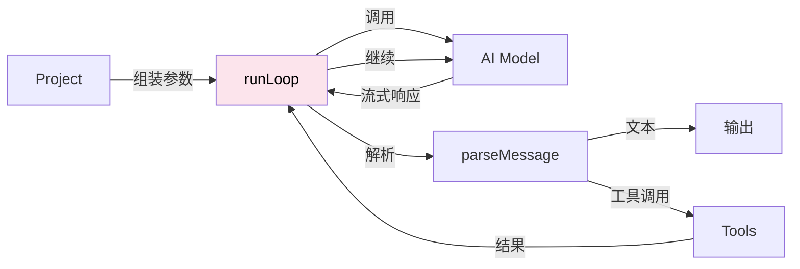
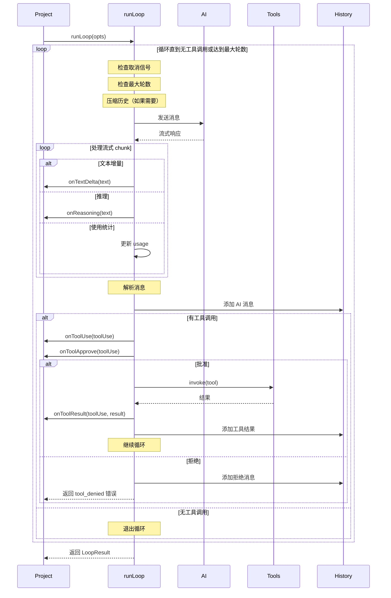
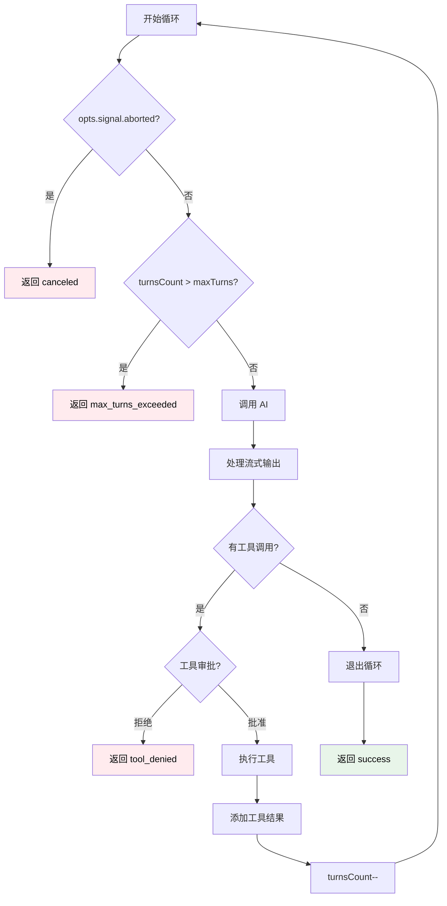
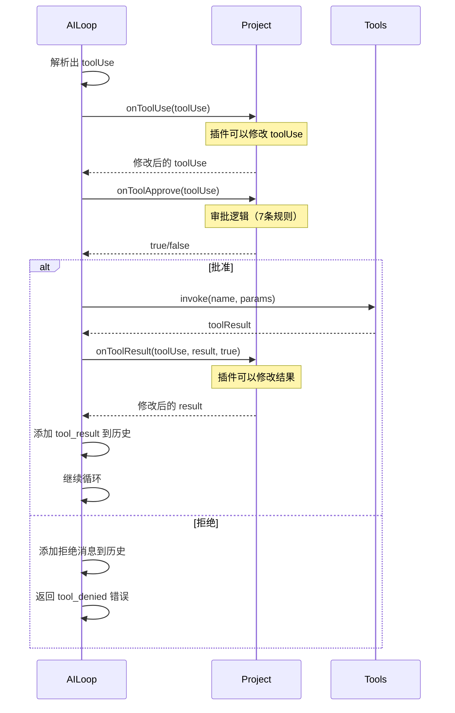
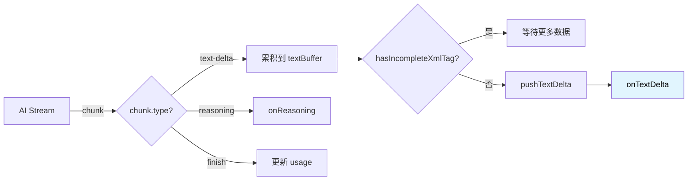

# Loop 模块详解

> 深入理解 AI 交互循环的核心实现

- source: [src/loop.ts](../src/loop.ts)

## 目录

- [概述](#概述)
- [核心流程](#核心流程)
- [数据结构](#数据结构)
- [循环逻辑](#循环逻辑)
- [工具调用处理](#工具调用处理)
- [流式输出](#流式输出)
- [错误处理](#错误处理)
- [性能优化](#性能优化)
- [FAQ](#FAQ)

---

## 概述

### 定位

Loop (runLoop) 是 **AI 交互循环的核心执行引擎**，负责：
- 与 AI 模型进行流式交互
- 解析和执行工具调用
- 管理对话历史
- 处理循环控制（最大轮数、取消等）
- 实时输出文本和推理过程



### 设计特点

1. **纯函数设计** - 不依赖 Context，只接收处理好的数据
2. **流式处理** - 实时输出 AI 响应
3. **自动循环** - 检测工具调用，自动继续对话
4. **错误容错** - 完善的错误处理和取消机制

---

## 核心流程

### 整体流程图



### 简化流程

```
1. 初始化
   ↓
2. While 循环
   ├─ 检查条件（取消、最大轮数）
   ├─ 压缩历史（如果需要）
   ├─ 调用 AI（流式）
   ├─ 处理流式输出
   ├─ 解析消息
   ├─ 添加到历史
   ├─ 检查工具调用
   │  ├─ 有 → 执行工具 → 继续循环
   │  └─ 无 → 退出循环
   ↓
3. 返回结果
```

---

## 数据结构

### RunLoopOpts（输入参数）

```typescript
type RunLoopOpts = {
  // 必需参数
  input: string | NormalizedMessage[];  // 输入消息
  model: ModelInfo;                      // AI 模型信息
  tools: Tools;                          // 工具管理器
  cwd: string;                           // 工作目录

  // 可选配置
  systemPrompt?: string;                 // 系统提示词
  llmsContexts?: string[];               // AI 上下文（来自 LlmsContext）
  maxTurns?: number;                     // 最大轮数（默认 50）
  autoCompact?: boolean;                 // 是否自动压缩历史
  signal?: AbortSignal;                  // 取消信号

  // 回调函数
  onTextDelta?: (text: string) => Promise<void>;           // 文本增量
  onText?: (text: string) => Promise<void>;                // 完整文本
  onReasoning?: (text: string) => Promise<void>;           // 推理过程
  onChunk?: (chunk: any, requestId: string) => Promise<void>;  // 原始 chunk
  onMessage?: OnMessage;                                   // 消息添加
  onToolUse?: (toolUse: ToolUse) => Promise<ToolUse>;     // 工具使用前
  onToolResult?: (toolUse, result, approved) => Promise<ToolResult>;  // 工具结果后
  onToolApprove?: (toolUse: ToolUse) => Promise<boolean>; // 工具审批
  onTurn?: (turn) => Promise<void>;                       // 每轮结束
};
```

### LoopResult（返回结果）

```typescript
type LoopResult =
  | {
      success: true;
      data: {
        text: string;       // AI 的最终文本响应
        history: History;   // 完整的对话历史
        usage: Usage;       // Token 使用统计
      };
      metadata: {
        turnsCount: number;      // 循环轮数
        toolCallsCount: number;  // 工具调用次数
        duration: number;        // 总耗时（毫秒）
      };
    }
  | {
      success: false;
      error: {
        type: 'tool_denied' | 'max_turns_exceeded' | 'api_error' | 'canceled';
        message: string;
        details?: Record<string, any>;
      };
    };
```

### 内部状态

```typescript
// 在 runLoop 函数内维护的状态
let turnsCount = 0;           // 当前轮数
let toolCallsCount = 0;       // 工具调用计数
let finalText = '';           // 最终文本
let lastUsage = Usage.empty(); // 上一轮的 usage
const totalUsage = Usage.empty(); // 总 usage
const history = new History({ messages, onMessage }); // 历史管理器
const abortController = new AbortController(); // 取消控制器
```

---

## 循环逻辑

### While 循环

```typescript
while (true) {
  // =============== 1. 前置检查 ===============

  // 1.1 检查取消信号
  if (opts.signal?.aborted && !abortController.signal.aborted) {
    abortController.abort();
    return createCancelError();
  }

  // 1.2 增加轮数
  turnsCount++;

  // 1.3 检查最大轮数
  if (turnsCount > maxTurns) {
    return {
      success: false,
      error: {
        type: 'max_turns_exceeded',
        message: `Maximum turns (${maxTurns}) exceeded`,
        details: { turnsCount, history, usage: totalUsage },
      },
    };
  }

  // 1.4 自动压缩历史（如果启用）
  if (opts.autoCompact) {
    const compressed = await history.compress(opts.model);
    // 压缩长历史，减少 token 消耗
  }

  // =============== 2. 调用 AI ===============

  // 2.1 创建 Runner 和 Agent
  const runner = new Runner({
    modelProvider: {
      getModel() {
        return opts.model.aisdk;
      },
    },
  });

  const agent = new Agent({
    name: 'code',
    model: opts.model.model.id,
    instructions: `
${opts.systemPrompt || ''}
${opts.tools.length() > 0 ? opts.tools.getToolsPrompt() : ''}
    `,
  });

  // 2.2 准备输入
  const llmsContextMessages = opts.llmsContexts.map(ctx => ({
    role: 'system',
    content: ctx,
  }));
  let agentInput = [...llmsContextMessages, ...history.toAgentInput()];

  // 2.3 处理 @file 和 @directory 引用（At.normalize）
  if (shouldAtNormalize) {
    agentInput = At.normalize({ input: agentInput, cwd: opts.cwd });
    shouldAtNormalize = false;
  }

  // 2.4 调用 AI（流式）
  const result = await runner.run(agent, agentInput, {
    stream: true,
    signal: abortController.signal,
  });

  // =============== 3. 处理流式输出 ===============

  let text = '';
  let textBuffer = '';
  let hasToolUse = false;

  try {
    for await (const chunk of result.toStream()) {
      // 检查取消
      if (opts.signal?.aborted) {
        return createCancelError();
      }

      // 调用 onChunk
      await opts.onChunk?.(chunk, requestId);

      // 处理不同类型的 chunk
      if (chunk.type === 'raw_model_stream_event' &&
          chunk.data.type === 'model') {
        switch (chunk.data.event.type) {
          case 'text-delta':
            // 累积文本，处理不完整的 XML 标签
            const textDelta = chunk.data.event.textDelta;
            textBuffer += textDelta;
            text += textDelta;

            // 检查是否有不完整的 XML 标签
            if (hasIncompleteXmlTag(text)) {
              continue;  // 等待更多数据
            }

            // 推送文本增量
            if (textBuffer) {
              await pushTextDelta(textBuffer, text, opts.onTextDelta);
              textBuffer = '';
            }
            break;

          case 'reasoning':
            // AI 的推理过程（Claude 支持）
            await opts.onReasoning?.(chunk.data.event.textDelta);
            break;

          case 'finish':
            // 使用统计
            lastUsage = Usage.fromEventUsage(chunk.data.event.usage);
            totalUsage.add(lastUsage);
            break;
        }
      }
    }
  } catch (error) {
    // API 错误处理
    return {
      success: false,
      error: {
        type: 'api_error',
        message: error.message,
        details: { code, status, url, error, stack },
      },
    };
  }

  // =============== 4. 解析和记录消息 ===============

  // 4.1 解析消息
  const parsed = parseMessage(text);
  // parsed: [{ type: 'text', content: '...' }, { type: 'tool_use', name: '...', params: {...} }]

  // 4.2 调用 onText
  if (parsed[0]?.type === 'text') {
    await opts.onText?.(parsed[0].content);
    finalText = parsed[0].content;
  }

  // 4.3 添加到历史
  await history.addMessage({
    role: 'assistant',
    content: parsed.map(item => {
      if (item.type === 'text') {
        return { type: 'text', text: item.content };
      } else {
        return {
          type: 'tool_use',
          id: item.callId,
          name: item.name,
          input: item.params,
        };
      }
    }),
    text,
    model: `${opts.model.provider.id}/${opts.model.model.id}`,
    usage: { input_tokens, output_tokens },
  });

  // 4.4 触发 onTurn
  await opts.onTurn?.({ usage: lastUsage, startTime, endTime });

  // =============== 5. 处理工具调用 ===============

  let toolUse = parsed.find(item => item.type === 'tool_use');

  if (toolUse) {
    // 5.1 触发 onToolUse（插件可以修改）
    if (opts.onToolUse) {
      toolUse = await opts.onToolUse(toolUse);
    }

    // 5.2 请求审批
    const approved = opts.onToolApprove
      ? await opts.onToolApprove(toolUse)
      : true;

    if (approved) {
      // 5.3 执行工具
      toolCallsCount++;
      let toolResult = await opts.tools.invoke(
        toolUse.name,
        JSON.stringify(toolUse.params),
      );

      // 5.4 触发 onToolResult（插件可以修改结果）
      if (opts.onToolResult) {
        toolResult = await opts.onToolResult(toolUse, toolResult, approved);
      }

      // 5.5 添加工具结果到历史
      await history.addMessage({
        role: 'user',
        content: [{
          type: 'tool_result',
          id: toolUse.callId,
          name: toolUse.name,
          input: toolUse.params,
          result: toolResult,
        }],
      });

      // 5.6 不计入轮数（工具调用不算）
      turnsCount--;

    } else {
      // 拒绝工具调用
      const message = 'Error: Tool execution was denied by user.';
      let toolResult = { llmContent: message, isError: true };

      if (opts.onToolResult) {
        toolResult = await opts.onToolResult(toolUse, toolResult, approved);
      }

      await history.addMessage({
        role: 'user',
        content: [{
          type: 'tool_result',
          id: toolUse.callId,
          name: toolUse.name,
          input: toolUse.params,
          result: toolResult,
        }],
      });

      // 返回错误
      return {
        success: false,
        error: {
          type: 'tool_denied',
          message,
          details: { toolUse, history, usage: totalUsage },
        },
      };
    }

    hasToolUse = true;
  }

  // =============== 6. 循环控制 ===============

  if (!hasToolUse) {
    break;  // 没有工具调用，退出循环
  }
  // 有工具调用，继续循环
}

// =============== 7. 返回结果 ===============

return {
  success: true,
  data: {
    text: finalText,
    history,
    usage: totalUsage,
  },
  metadata: {
    turnsCount,
    toolCallsCount,
    duration: Date.now() - startTime,
  },
};
```

### 循环控制条件



---

## 工具调用处理

### 解析工具调用

AI 的响应格式：
```
这是文本响应

<use_tool>
<tool_name>Read</tool_name>
<arguments>
{"file_path": "/path/to/file"}
</arguments>
</use_tool>

更多文本
```

使用 `parseMessage()` 解析：
```typescript
const parsed = parseMessage(text);
// [
//   { type: 'text', content: '这是文本响应', partial: false },
//   { type: 'tool_use', name: 'Read', params: { file_path: '...' }, callId: 'xxx' },
//   { type: 'text', content: '更多文本', partial: false },
// ]
```

### 工具执行流程



### 工具结果格式

```typescript
type ToolResult = {
  llmContent: string;   // 给 AI 的文本描述
  isError?: boolean;    // 是否为错误
  // ... 其他元数据
};

// 成功示例
{
  llmContent: "File contents:\n...",
  isError: false,
}

// 错误示例
{
  llmContent: "Error: File not found",
  isError: true,
}
```

---

## 流式输出

### 流式处理机制



### 处理不完整的 XML 标签

为什么需要？
- AI 流式输出时，XML 标签可能被切断
- 例如：`"这是文本<use_to"` ← 标签不完整
- 如果直接输出，用户会看到不完整的标签

解决方案：
```typescript
const INCOMPLETE_PATTERNS = [
  '<use_tool',
  '<tool_name',
  '<arguments',
  '</use_tool',
  '</tool_name',
  '</arguments',
];

function hasIncompleteXmlTag(text: string): boolean {
  // 只检查最后 15 个字符
  text = text.slice(-15);

  for (const pattern of INCOMPLETE_PATTERNS) {
    // 1. 完全匹配模式末尾
    if (text.endsWith(pattern)) {
      return true;
    }

    // 2. 部分匹配模式开头
    if (text.length < pattern.length) {
      if (pattern.startsWith(text.slice(-Math.min(text.length, pattern.length)))) {
        return true;
      }
    } else {
      // 3. 检查是否是模式的前缀
      const maxCheck = Math.min(pattern.length - 1, text.length);
      for (let i = 1; i <= maxCheck; i++) {
        if (text.slice(-i) === pattern.slice(0, i)) {
          return true;
        }
      }
    }
  }

  return false;
}
```

示例：
```typescript
hasIncompleteXmlTag("Hello <use_to")     // true  ← 不完整
hasIncompleteXmlTag("Hello <use_tool>")  // false ← 完整
hasIncompleteXmlTag("Hello <")           // true  ← 可能是标签开始
```

### pushTextDelta 逻辑

```typescript
async function pushTextDelta(
  content: string,
  text: string,
  onTextDelta?: (text: string) => Promise<void>,
): Promise<void> {
  const parsed = parseMessage(text);
  // 只有当第一个部分是文本且标记为 partial（可以继续）时才输出
  if (parsed[0]?.type === 'text' && parsed[0].partial) {
    await onTextDelta?.(content);
  }
}
```

**关键点**：
- `parsed[0].partial === true` → 文本可以继续，安全输出
- `parsed[0].partial === false` → 文本已完整（或后面有工具调用），不输出增量

---

## 错误处理

### 错误类型

```typescript
type ErrorType =
  | 'tool_denied'        // 工具被拒绝
  | 'max_turns_exceeded' // 超过最大轮数
  | 'api_error'          // API 调用错误
  | 'canceled';          // 用户取消
```

### 错误处理策略

#### 1. tool_denied

```typescript
// 当工具审批被拒绝时
return {
  success: false,
  error: {
    type: 'tool_denied',
    message: 'Error: Tool execution was denied by user.',
    details: {
      toolUse,        // 被拒绝的工具
      history,        // 当前历史
      usage: totalUsage,  // 已消耗的 token
    },
  },
};
```

#### 2. max_turns_exceeded

```typescript
// 当循环次数超过 maxTurns 时
if (turnsCount > maxTurns) {
  return {
    success: false,
    error: {
      type: 'max_turns_exceeded',
      message: `Maximum turns (${maxTurns}) exceeded`,
      details: {
        turnsCount,
        history,
        usage: totalUsage,
      },
    },
  };
}
```

#### 3. api_error

```typescript
// 当 AI API 调用失败时
catch (error) {
  return {
    success: false,
    error: {
      type: 'api_error',
      message: error.message,
      details: {
        code: error.data?.error?.code,
        status: error.data?.error?.status,
        url: error.url,
        error,
        stack: error.stack,
      },
    },
  };
}
```

#### 4. canceled

```typescript
// 当用户取消时
if (opts.signal?.aborted) {
  return {
    success: false,
    error: {
      type: 'canceled',
      message: 'Operation was canceled',
      details: {
        turnsCount,
        history,
        usage: totalUsage,
      },
    },
  };
}
```

### 取消机制

```typescript
// 使用两个 AbortController
const abortController = new AbortController();  // Loop 内部
const opts.signal;                               // 外部传入

// 检查外部信号
if (opts.signal?.aborted && !abortController.signal.aborted) {
  abortController.abort();  // 同步内部控制器
  return createCancelError();
}

// 传递给 AI 调用
await runner.run(agent, agentInput, {
  stream: true,
  signal: abortController.signal,  // 使用内部控制器
});
```

**为什么要两个 AbortController？**
- 外部 `opts.signal` - 用户级取消（如点击停止按钮）
- 内部 `abortController` - Loop 内部控制（防止 ReadStream 锁定）

---

## 性能优化

### 1. 历史压缩（autoCompact）

```typescript
if (opts.autoCompact) {
  const compressed = await history.compress(opts.model);
  if (compressed.compressed) {
    debug('history compressed', compressed);
  }
}
```

**作用**：
- 当历史消息过长时，自动压缩老旧消息
- 减少 token 消耗
- 保持 AI 上下文在合理范围

### 2. 只解析一次工具调用

```typescript
// 只接受每条消息中的第一个工具调用
// 如果有多个 </use_tool>，只保留第一个
const parts = text.split('</use_tool>');
if (parts.length > 2 && result.history.length > 0) {
  const lastEntry = result.history[result.history.length - 1];
  if (lastEntry.type === 'message' && lastEntry.content && lastEntry.content[0]) {
    text = parts[0] + '</use_tool>';
    (lastEntry.content[0] as any).text = text;
  }
}
```

**原因**：
- 简化逻辑，避免复杂的并发工具调用
- 保证工具按顺序执行

### 3. @file/@directory 只规范化一次

```typescript
let shouldAtNormalize = true;

// 在循环中
if (shouldAtNormalize) {
  agentInput = At.normalize({
    input: agentInput,
    cwd: opts.cwd,
  });
  shouldAtNormalize = false;  // 只执行一次
}
```

**作用**：
- `At.normalize` 会读取 `@file` 和 `@directory` 引用的内容
- 只需在第一轮执行，后续轮不需要

### 4. 懒加载和流式处理

```typescript
// 不等待完整响应，流式处理
for await (const chunk of result.toStream()) {
  // 实时处理每个 chunk
}
```

**优势**：
- 减少首字节时间（TTFB）
- 用户能立即看到响应
- 减少内存占用

---

## 总结

### Loop 的核心价值

1. **纯执行引擎**
   - 不依赖 Context
   - 只接收处理好的数据
   - 职责单一，易于测试

2. **流式处理**
   - 实时输出 AI 响应
   - 处理不完整的 XML 标签
   - 优秀的用户体验

3. **自动循环**
   - 检测工具调用
   - 自动执行和继续
   - 智能的循环控制

4. **完善的错误处理**
   - 4 种错误类型
   - 取消机制
   - 详细的错误信息

### 关键设计模式

1. **策略模式** - 不同类型的 chunk 处理策略
2. **状态机** - 循环状态的转换
3. **责任链** - 回调函数链式调用

### 学习建议

1. **理解循环逻辑**
   - While 循环的条件
   - 何时继续，何时退出
   - 工具调用不计入轮数

2. **掌握流式处理**
   - chunk 的类型
   - 不完整 XML 标签处理
   - textBuffer 的作用

3. **追踪数据流**
   - 输入 → AI → 解析 → 工具 → 历史 → 循环
   - 各种回调的触发时机

4. **实践调试**
   - 在 while 循环入口打断点
   - 查看 parsed 的结果
   - 观察 history 的变化

### 与 Project 的关系

```
Project 职责：
- 组装参数（tools, systemPrompt, llmsContexts）
- 提供回调（onToolApprove, onToolUse, onToolResult）
- 处理会话和日志

Loop 职责：
- 执行 AI 循环
- 处理流式输出
- 管理工具调用循环
- 返回结果
```

**边界清晰，职责分离**：
- Project 知道 Context，Loop 不知道
- Project 组装，Loop 执行
- 单向数据流，易于理解

---

## FAQ

1. loop 与其他模块是如何结合运行的
   1. loop.ts 是核心交互循环，它使用 History 管理消息历史，通过 Tool 系统执行具体操作，利用 At 处理文件内容注入，并与 Model 进行交互。
2. loop 如何与 大模型交互
   1. 通过创建 Agent 和 Runner 实例，将系统提示词、工具提示和历史消息作为输入传递给大模型，并处理流式响应。
3. loop 响应的操作，如何串联
   1. 通过 History 类管理消息序列，每次交互后将结果添加到历史记录中，形成连续的对话上下文。
4. loop 中大模型给出响应后，会和大模型多轮交互吗，如何执行的
   1. 是的，支持多轮交互。如果模型响应包含工具调用，loop 会执行工具并把结果作为新消息加入历史，然后继续下一轮交互，直到没有更多工具调用为止。
5. tool 是怎么结合的
   1. Tools 类管理所有可用工具，通过 resolveTools 初始化工具集，在 loop 中解析模型返回的工具调用指令，执行对应工具并将结果反馈给模型。

## 相关文档

- [Project 详解](./project.md)
- [Context 协作机制](./context-collaboration.md)
- [工具架构](./tool-architecture.md)
- [整体架构](./arch.md)
