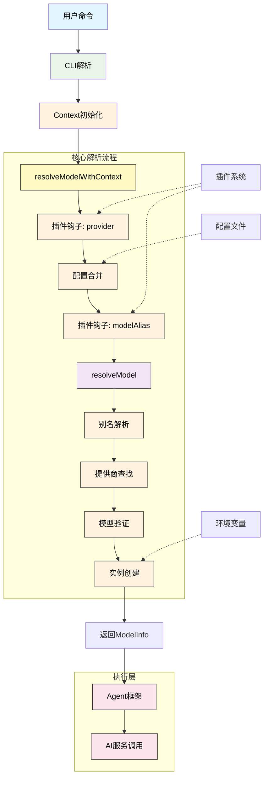
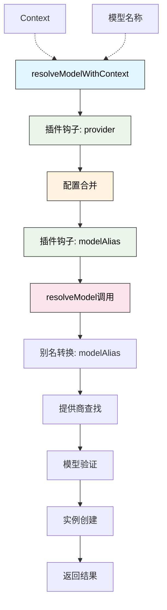

# AI 模型和服务提供商架构设计

- source: [src/model.ts](../src/model.ts)

## 概述

Neovate 采用模块化设计支持多种 AI 模型和服务提供商。核心设计包括：

1. **Model 接口** - 定义模型的元数据和能力
2. **Provider 接口** - 定义服务提供商的配置和模型创建逻辑
3. **模型别名系统** - 简化模型引用
4. **动态解析机制** - 支持插件扩展和配置覆盖

## 整体架构图



### 架构说明

系统采用两层解析机制：

1. **resolveModelWithContext（外层）**：
   - 处理插件扩展（provider 钩子、modelAlias 钩子）
   - 合并用户配置
   - 协调整个解析流程

2. **resolveModel（内层）**：
   - 纯粹的模型解析逻辑
   - 别名查找和转换
   - 提供商和模型验证
   - 创建实际的模型实例

## 核心数据结构

### Model 接口

```typescript
interface Model {
  id: string;                     // 模型 ID
  name: string;                   // 模型名称
  shortName?: string;             // 短名称
  attachment: boolean;            // 是否支持附件
  reasoning: boolean;             // 是否支持推理模式
  temperature: boolean;           // 是否支持温度参数
  tool_call: boolean;             // 是否支持工具调用
  knowledge: string;              // 知识截止日期
  release_date: string;           // 发布日期
  last_updated: string;           // 最后更新日期
  modalities: ModelModalities;    // 输入/输出模态
  open_weights: boolean;          // 是否开源权重
  cost: ModelCost;                // 成本信息
  limit: ModelLimit;              // 限制信息
}
```

### Provider 接口

```typescript
interface Provider {
  id: string;                    // 提供商 ID
  env: string[];                 // 必需的环境变量
  name: string;                  // 提供商名称
  apiEnv?: string[];             // API 地址环境变量
  api?: string;                  // 默认 API 地址
  doc: string;                   // 文档链接
  models: Record<string, Model>; // 支持的模型列表
  createModel(                   // 模型创建函数
    name: string,
    provider: Provider,
    globalConfigDir: string,
  ): Promise<LanguageModelV1> | LanguageModelV1;
  options?: {                   // 额外配置选项
    baseURL?: string;
    apiKey?: string;
    headers?: Record<string, string>;
  };
}
```

### 核心组件说明

1. **模型提供者注册表** - 实现 `Provider` 接口以支持不同 AI 服务
2. **模型元数据** - 定义如上下文限制、工具调用能力等属性
3. **历史压缩与消息转换** - 优化对话上下文
4. **代理框架** - 统一管理模型交互
5. **查询处理管道** - 处理从用户输入到响应生成的完整链路

## 实现细节

### 模型定义

所有内置模型在 `models` 对象中预定义：

```typescript
export const models: ModelMap = {
  'gpt-4o': {
    name: 'GPT-4o',
    attachment: true,
    reasoning: false,
    temperature: true,
    tool_call: true,
    knowledge: '2023-09',
    release_date: '2024-05-13',
    last_updated: '2024-05-13',
    modalities: { input: ['text', 'image'], output: ['text'] },
    open_weights: false,
    limit: { context: 128000, output: 16384 },
  },
  // ... 更多模型
};
```

### 提供商实现

每个提供商实现其特定的 `createModel` 方法：

```typescript
export const providers: ProvidersMap = {
  openai: {
    id: 'openai',
    env: ['OPENAI_API_KEY'],
    name: 'OpenAI',
    doc: 'https://platform.openai.com/docs/models',
    models: {
      'gpt-4o': models['gpt-4o'],
      // ... 更多模型
    },
    createModel: defaultModelCreator,
  },

  'github-copilot': {
    id: 'github-copilot',
    env: [],
    name: 'GitHub Copilot',
    doc: 'https://docs.github.com/en/copilot',
    models: {
      'gpt-4o': models['gpt-4o'],
      // ... 更多模型
    },
    async createModel(name, provider, globalConfigDir) {
      // GitHub Copilot 特殊认证逻辑
      const githubDataPath = path.join(globalConfigDir, 'githubCopilot.json');
      const githubProvider = new GithubProvider({ authFile: githubDataPath });
      const token = await githubProvider.access();
      // ... 创建模型实例
    },
  },
  // ... 更多提供商
};
```

### 工作流程

1. **CLI 解析** - 解析用户命令行参数，包括模型指定
2. **Context 初始化** - 创建应用上下文，整合配置、插件等
3. **Model 解析** - 根据用户指定或默认配置解析模型
4. **Provider 查找** - 根据模型标识符查找对应提供商
5. **模型实例化** - 调用提供商的 `createModel` 方法创建模型实例
6. **Agent 框架** - 使用统一代理框架管理模型交互
7. **AI 服务** - 与实际 AI 服务进行通信

整个流程支持流式事件处理和插件扩展点，确保系统的灵活性和可扩展性。

### GitHub Copilot 认证

GitHub Copilot 使用特殊的设备码认证流程：

1. 获取设备码和用户码
2. 用户在浏览器中完成授权
3. 轮询获取访问令牌
4. 使用访问令牌获取 Copilot API 密钥

```typescript
class GithubProvider {
  async authorize() {
    // 获取设备码
    const response = await fetch(DEVICE_CODE_URL, {
      method: 'POST',
      headers: { /* ... */ },
      body: JSON.stringify({
        client_id: CLIENT_ID,
        scope: 'read:user',
      }),
    });
    // ... 处理响应
  }

  async access(): Promise<string | undefined> {
    // 获取 Copilot API 密钥
    const response = await fetch(COPILOT_API_KEY_URL, {
      headers: {
        Authorization: `Bearer ${this.state.github_token}`,
        // ... 其他头部
      },
    });
    // ... 处理响应并缓存令牌
  }
}
```

## resolveModel 函数详解

`resolveModel` 是纯粹的模型解析函数，负责将模型名称转换为可用的模型实例。它不处理插件和配置，这些由 `resolveModelWithContext` 负责。

### 函数签名

```typescript
async function resolveModel(
  name: string,                              // 模型名称（如 "gpt-4o" 或 "openai/gpt-4o"）
  providers: ProvidersMap,                   // 提供商映射表
  modelAlias: Record<string, string>,        // 别名映射表
  globalConfigDir: string,                   // 全局配置目录
): Promise<ModelInfo>
```

### 解析流程

```typescript
// 1. 别名转换：查找并应用别名
const alias = modelAlias[name];
if (alias) {
  name = alias;  // "gpt-4o" -> "openai/gpt-4o"
}

// 2. 提供商查找：从模型全名中提取提供商
const [providerStr, ...modelNameArr] = name.split('/');
const provider = providers[providerStr];  // 获取 openai 提供商

// 3. 模型验证：检查模型是否在提供商中存在
const modelId = modelNameArr.join('/');
const model = provider.models[modelId] as Model;

// 4. 实例创建：调用提供商的 createModel 方法
model.id = modelId;
let m = provider.createModel(modelId, provider, globalConfigDir);
if (isPromise(m)) {
  m = await m;
}

return {
  provider,                              // 提供商信息
  model,                                 // 模型元数据
  aisdk: aisdk(m as LanguageModelV1),   // AI SDK 封装实例
};
```

### 四个关键步骤

1. **别名转换**
   - 输入：短名称（如 "gpt-4o"）
   - 查找：在 `modelAlias` 表中查找
   - 输出：完整名称（如 "openai/gpt-4o"）
   - 注意：不是钩子，是内部查表操作

2. **提供商查找**
   - 按 `/` 分割模型名称
   - 前缀作为提供商 ID（如 "openai"）
   - 在 `providers` 中查找对应提供商
   - 失败抛出错误并列出有效提供商

3. **模型验证**
   - 剩余部分作为模型 ID（如 "gpt-4o"）
   - 在提供商的 `models` 中查找
   - 失败抛出错误并列出该提供商的有效模型

4. **实例创建**
   - 调用 `provider.createModel()` 方法
   - 传入模型 ID、提供商对象和配置目录
   - 处理同步/异步返回
   - 使用 AI SDK 封装原始模型实例

### 返回值：ModelInfo

```typescript
interface ModelInfo {
  provider: Provider;      // 提供商完整信息
  model: Model;           // 模型元数据（能力、限制等）
  aisdk: AiSdkModel;     // 封装后的可调用模型实例
}
```

### resolveModelWithContext 函数

`resolveModelWithContext` 是模型解析的核心入口函数，集成了插件系统、配置管理和模型解析三大功能模块。

#### 函数签名

```typescript
async function resolveModelWithContext(
  name: string | null,
  context: Context,
): Promise<{
  providers: ProvidersMap;
  modelAlias: ModelAlias;
  model: ModelInfo | null;
}>
```

#### 工作流程



#### 处理步骤

1. **插件钩子处理 - Provider**
   - 通过 `provider` 钩子允许插件扩展或修改提供商定义
   - 使用 `SeriesLast` 类型，以内置 `providers` 为基础
   - 传入工具函数：`models`、`defaultModelCreator`、`createOpenAI`

2. **配置合并 (mergeConfigProviders)**
   - 如果存在 `context.config.provider`，则合并配置到已钩子处理的提供商
   - 使用 `mergeConfigProviders` 函数深度合并
   - 支持覆盖现有提供商或添加新提供商
   - 详见下方 [mergeConfigProviders 详解](#mergeconfigproviders-详解)

3. **插件钩子处理 - ModelAlias**
   - 通过 `modelAlias` 钩子允许插件自定义别名映射
   - 使用 `SeriesLast` 类型，以内置 `modelAlias` 为基础

4. **模型名称确定**
   - 优先使用传入的 `name` 参数
   - 否则使用配置中的 `context.config.model`
   - 如果都没有，则返回 `null`

5. **调用 resolveModel**
   - 传入确定的模型名称、最终提供商列表、别名映射和全局配置目录
   - 返回包含 `provider`、`model` 和 `aisdk` 的 `ModelInfo` 对象

6. **返回完整结果**
   - `providers`: 经过插件钩子和配置合并后的最终提供商映射
   - `modelAlias`: 经过插件钩子处理后的别名映射
   - `model`: 解析后的模型信息（如果有指定模型）

#### 使用示例

```typescript
// 在应用启动时调用
const { providers, modelAlias, model } = await resolveModelWithContext(
  'gpt-4o',  // 或 null 使用默认模型
  context,
);

// model 包含:
// - provider: 提供商信息
// - model: 模型元数据
// - aisdk: AI SDK 封装的模型实例
```

#### 扩展点

此函数提供两个关键扩展点：

1. **provider 钩子** - 位置: src/model.ts:1285-1296
   ```typescript
   context.apply({
     hook: 'provider',
     args: [{ models, defaultModelCreator, createOpenAI }],
     memo: providers,
     type: PluginHookType.SeriesLast,
   })
   ```

2. **modelAlias 钩子** - 位置: src/model.ts:1302-1307
   ```typescript
   context.apply({
     hook: 'modelAlias',
     args: [],
     memo: modelAlias,
     type: PluginHookType.SeriesLast,
   })
   ```

### mergeConfigProviders 详解

`mergeConfigProviders` 是配置合并的核心函数，负责将用户配置与内置提供商定义进行深度合并。

#### 函数签名

**代码位置**: `src/model.ts:1345-1375`

```typescript
function mergeConfigProviders(
  hookedProviders: ProvidersMap,      // 经过插件钩子处理的提供商
  configProviders: Record<string, ProviderConfig>,  // 用户配置的提供商
): ProvidersMap
```

#### 核心逻辑

```typescript
function mergeConfigProviders(hookedProviders, configProviders) {
  const mergedProviders = { ...hookedProviders };
  
  Object.entries(configProviders).forEach(([providerId, config]) => {
    // 1. 获取或创建提供商对象
    let provider = mergedProviders[providerId] || {};
    
    // 2. 深度合并配置（使用 defu 库）
    //    配置优先级：config > provider
    provider = defu(config, provider) as Provider;
    
    // 3. 补充默认 createModel 方法
    if (!provider.createModel) {
      provider.createModel = defaultModelCreator;
    }
    
    // 4. 处理模型引用（字符串 -> 实际模型对象）
    if (provider.models) {
      for (const modelId in provider.models) {
        const model = provider.models[modelId];
        if (typeof model === 'string') {
          // 字符串引用，查找内置模型
          const actualModel = models[model];
          assert(actualModel, `Model ${model} not exists.`);
          provider.models[modelId] = actualModel;
        }
      }
    }
    
    // 5. 补充 id 和 name（如果缺失）
    if (!provider.id) {
      provider.id = providerId;
    }
    if (!provider.name) {
      provider.name = providerId;
    }
    
    // 6. 更新到合并结果
    mergedProviders[providerId] = provider;
  });
  
  return mergedProviders;
}
```

#### 处理步骤详解

##### 1. 获取基础提供商

```typescript
let provider = mergedProviders[providerId] || {};
```

- 如果 `providerId` 已存在于 `hookedProviders`，使用现有定义
- 如果不存在，创建新的空对象（支持添加全新提供商）

##### 2. 深度合并配置

```typescript
provider = defu(config, provider) as Provider;
```

使用 `defu` 库进行深度合并，优先级规则：
- **用户配置优先** - `config` 中的值覆盖 `provider` 中的值
- **递归合并** - 嵌套对象也会深度合并
- **数组替换** - 数组不合并，直接替换

**示例**:

```typescript
// 内置提供商
const provider = {
  id: 'openai',
  env: ['OPENAI_API_KEY'],
  api: 'https://api.openai.com/v1',
  models: {
    'gpt-4o': { /* ... */ },
  },
};

// 用户配置
const config = {
  api: 'https://custom-proxy.com/v1',  // 覆盖 API 地址
  options: {
    baseURL: 'https://custom-proxy.com/v1',
  },
  models: {
    'gpt-4-turbo': 'gpt-4-turbo',  // 添加新模型
  },
};

// 合并结果
// {
//   id: 'openai',
//   env: ['OPENAI_API_KEY'],
//   api: 'https://custom-proxy.com/v1',  // ← 已覆盖
//   options: {
//     baseURL: 'https://custom-proxy.com/v1',  // ← 新增
//   },
//   models: {
//     'gpt-4o': { /* ... */ },
//     'gpt-4-turbo': { /* ... */ },  // ← 新增
//   },
// }
```

##### 3. 补充默认 createModel

```typescript
if (!provider.createModel) {
  provider.createModel = defaultModelCreator;
}
```

- 如果配置中没有提供 `createModel` 方法，使用默认创建器
- `defaultModelCreator` 是通用的模型实例化函数
- 适用于大多数标准 OpenAI 兼容的 API

##### 4. 处理模型引用

```typescript
if (provider.models) {
  for (const modelId in provider.models) {
    const model = provider.models[modelId];
    if (typeof model === 'string') {
      const actualModel = models[model];
      assert(actualModel, `Model ${model} not exists.`);
      provider.models[modelId] = actualModel;
    }
  }
}
```

**字符串引用机制**:

用户可以使用字符串引用内置模型，而不需要完整定义模型元数据：

```typescript
// 配置文件中
{
  "provider": {
    "my-custom-provider": {
      "models": {
        "gpt-4o": "gpt-4o",  // ← 字符串引用
        "claude-3-5-sonnet-20241022": "claude-3-5-sonnet-20241022"
      }
    }
  }
}
```

转换后：

```typescript
{
  models: {
    "gpt-4o": {  // ← 完整的模型对象
      name: "GPT-4o",
      attachment: true,
      reasoning: false,
      // ... 所有元数据
    },
    "claude-3-5-sonnet-20241022": { /* ... */ }
  }
}
```

**优点**:
- 避免重复定义模型元数据
- 确保元数据一致性
- 简化配置文件

##### 5. 补充 ID 和 Name

```typescript
if (!provider.id) {
  provider.id = providerId;
}
if (!provider.name) {
  provider.name = providerId;
}
```

- 使用键名作为默认 ID 和 Name
- 确保每个提供商都有完整的身份信息

#### 使用场景

##### 场景 1: 覆盖 API 地址

```typescript
// config.json
{
  "provider": {
    "openai": {
      "api": "https://openai-proxy.example.com/v1",
      "options": {
        "baseURL": "https://openai-proxy.example.com/v1"
      }
    }
  }
}
```

##### 场景 2: 添加新提供商

```typescript
// config.json
{
  "provider": {
    "my-llm-provider": {
      "env": ["MY_API_KEY"],
      "api": "https://api.my-llm.com/v1",
      "models": {
        "gpt-4o": "gpt-4o",  // 复用内置模型定义
        "my-custom-model": {
          // 自定义模型定义
          "name": "My Custom Model",
          "attachment": false,
          "tool_call": true,
          // ...
        }
      }
    }
  }
}
```

##### 场景 3: 扩展现有提供商

```typescript
// config.json
{
  "provider": {
    "openai": {
      "models": {
        "gpt-4-turbo": "gpt-4-turbo",  // 添加新模型
        "o1-mini": "o1-mini"
      }
    }
  }
}
```

#### 配置优先级

完整的配置优先级（从高到低）：

```
1. 用户配置文件 (config.json 中的 provider 字段)
   ↓
2. 插件钩子 (context.apply({ hook: 'provider' }))
   ↓
3. 内置提供商定义 (src/model.ts 中的 providers)
```

**执行流程**:

```typescript
// 1. 从内置定义开始
let providers = builtinProviders;

// 2. 应用插件钩子
providers = await context.apply({
  hook: 'provider',
  memo: providers,
  type: PluginHookType.SeriesLast,
});

// 3. 合并用户配置
if (context.config.provider) {
  providers = mergeConfigProviders(providers, context.config.provider);
}
```

#### 实际示例

**内置定义**:

```typescript
// src/model.ts
const providers = {
  openai: {
    id: 'openai',
    env: ['OPENAI_API_KEY'],
    api: 'https://api.openai.com/v1',
    models: {
      'gpt-4o': { /* 完整定义 */ },
    },
    createModel: defaultModelCreator,
  },
};
```

**插件扩展**:

```typescript
// 在插件中
api.addHook('provider', (providers) => {
  return {
    ...providers,
    openai: {
      ...providers.openai,
      models: {
        ...providers.openai.models,
        'gpt-4-turbo': models['gpt-4-turbo'],
      },
    },
  };
});
```

**用户配置**:

```json
{
  "provider": {
    "openai": {
      "api": "https://my-proxy.com/v1",
      "models": {
        "o1-preview": "o1-preview"
      }
    }
  }
}
```

**最终结果**:

```typescript
{
  openai: {
    id: 'openai',
    env: ['OPENAI_API_KEY'],
    api: 'https://my-proxy.com/v1',  // ← 用户配置覆盖
    models: {
      'gpt-4o': { /* ... */ },       // ← 内置
      'gpt-4-turbo': { /* ... */ },  // ← 插件添加
      'o1-preview': { /* ... */ },   // ← 用户配置添加
    },
    createModel: defaultModelCreator,
  },
}
```

#### 注意事项

1. **defu 合并行为** - 对象深度合并，数组直接替换
2. **字符串引用必须存在** - 引用的模型名必须在 `models` 对象中有定义
3. **createModel 是可选的** - 如果不提供，会使用 `defaultModelCreator`
4. **支持添加新提供商** - 配置中的新 ID 会创建全新提供商
5. **配置覆盖原则** - 用户配置 > 插件钩子 > 内置定义

### 流式事件处理

系统支持流式事件处理，能够实时处理 AI 服务返回的数据：

1. **文本增量** - 实时显示生成的文本内容
2. **推理过程** - 显示模型的推理步骤
3. **完成事件** - 处理生成完成后的统计信息

### 插件扩展点

系统提供多个插件扩展点，允许开发者自定义功能：

1. **Provider 钩子** - 扩展或修改提供商配置
2. **ModelAlias 钩子** - 自定义模型别名映射
3. **SystemPrompt 钩子** - 修改系统提示词
4. **Tool 钩子** - 扩展工具集

## 扩展机制

1. **插件钩子** - 通过 `provider` 和 `modelAlias` 钩子允许插件扩展
2. **配置覆盖** - 通过配置文件可以覆盖提供商和模型定义
3. **动态加载** - 支持运行时添加新的提供商和模型

这种设计使得 Neovate 能够灵活支持各种 AI 服务，同时保持代码的清晰和可维护性。

## 总结

Neovate 的 AI 模型和服务提供商架构设计具有以下优势：

1. **模块化设计** - 各组件职责清晰，易于维护和扩展
2. **统一接口** - 通过标准化接口简化了新提供商的集成
3. **灵活配置** - 支持多种配置方式，满足不同用户需求
4. **插件支持** - 提供丰富的扩展点，支持功能定制
5. **流式处理** - 支持实时数据处理，提升用户体验

该架构为 Neovate 提供了强大的 AI 能力支撑，能够适应不断发展的 AI 生态环境。
