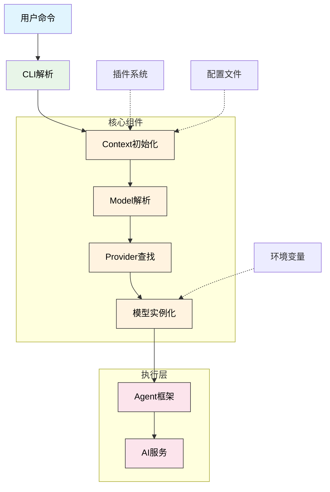
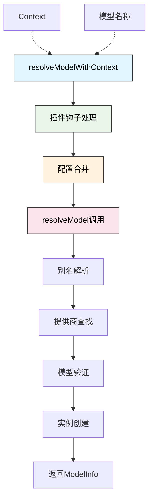

# AI 模型和服务提供商架构设计

## 概述

Neovate 采用模块化设计支持多种 AI 模型和服务提供商。核心设计包括：

1. **Model 接口** - 定义模型的元数据和能力
2. **Provider 接口** - 定义服务提供商的配置和模型创建逻辑
3. **模型别名系统** - 简化模型引用
4. **动态解析机制** - 支持插件扩展和配置覆盖

## 架构图



在模型解析阶段(D)，系统会调用 `resolveModelWithContext` 函数来处理模型解析，该函数会考虑插件钩子和配置合并，然后调用 `resolveModel` 完成具体的模型解析过程。

## 核心数据结构

### Model 接口

```typescript
interface Model {
  id: string;                     // 模型 ID
  name: string;                   // 模型名称
  shortName?: string;             // 短名称
  attachment: boolean;            // 是否支持附件
  reasoning: boolean;             // 是否支持推理模式
  temperature: boolean;           // 是否支持温度参数
  tool_call: boolean;             // 是否支持工具调用
  knowledge: string;              // 知识截止日期
  release_date: string;           // 发布日期
  last_updated: string;           // 最后更新日期
  modalities: ModelModalities;    // 输入/输出模态
  open_weights: boolean;          // 是否开源权重
  cost: ModelCost;                // 成本信息
  limit: ModelLimit;              // 限制信息
}
```

### Provider 接口

```typescript
interface Provider {
  id: string;                    // 提供商 ID
  env: string[];                 // 必需的环境变量
  name: string;                  // 提供商名称
  apiEnv?: string[];             // API 地址环境变量
  api?: string;                  // 默认 API 地址
  doc: string;                   // 文档链接
  models: Record<string, Model>; // 支持的模型列表
  createModel(                   // 模型创建函数
    name: string,
    provider: Provider,
    globalConfigDir: string,
  ): Promise<LanguageModelV1> | LanguageModelV1;
  options?: {                   // 额外配置选项
    baseURL?: string;
    apiKey?: string;
    headers?: Record<string, string>;
  };
}
```

### 核心组件说明

1. **模型提供者注册表** - 实现 `Provider` 接口以支持不同 AI 服务
2. **模型元数据** - 定义如上下文限制、工具调用能力等属性
3. **历史压缩与消息转换** - 优化对话上下文
4. **代理框架** - 统一管理模型交互
5. **查询处理管道** - 处理从用户输入到响应生成的完整链路

## 实现细节

### 模型定义

所有内置模型在 `models` 对象中预定义：

```typescript
export const models: ModelMap = {
  'gpt-4o': {
    name: 'GPT-4o',
    attachment: true,
    reasoning: false,
    temperature: true,
    tool_call: true,
    knowledge: '2023-09',
    release_date: '2024-05-13',
    last_updated: '2024-05-13',
    modalities: { input: ['text', 'image'], output: ['text'] },
    open_weights: false,
    limit: { context: 128000, output: 16384 },
  },
  // ... 更多模型
};
```

### 提供商实现

每个提供商实现其特定的 `createModel` 方法：

```typescript
export const providers: ProvidersMap = {
  openai: {
    id: 'openai',
    env: ['OPENAI_API_KEY'],
    name: 'OpenAI',
    doc: 'https://platform.openai.com/docs/models',
    models: {
      'gpt-4o': models['gpt-4o'],
      // ... 更多模型
    },
    createModel: defaultModelCreator,
  },

  'github-copilot': {
    id: 'github-copilot',
    env: [],
    name: 'GitHub Copilot',
    doc: 'https://docs.github.com/en/copilot',
    models: {
      'gpt-4o': models['gpt-4o'],
      // ... 更多模型
    },
    async createModel(name, provider, globalConfigDir) {
      // GitHub Copilot 特殊认证逻辑
      const githubDataPath = path.join(globalConfigDir, 'githubCopilot.json');
      const githubProvider = new GithubProvider({ authFile: githubDataPath });
      const token = await githubProvider.access();
      // ... 创建模型实例
    },
  },
  // ... 更多提供商
};
```

### 工作流程

1. **CLI 解析** - 解析用户命令行参数，包括模型指定
2. **Context 初始化** - 创建应用上下文，整合配置、插件等
3. **Model 解析** - 根据用户指定或默认配置解析模型
4. **Provider 查找** - 根据模型标识符查找对应提供商
5. **模型实例化** - 调用提供商的 `createModel` 方法创建模型实例
6. **Agent 框架** - 使用统一代理框架管理模型交互
7. **AI 服务** - 与实际 AI 服务进行通信

整个流程支持流式事件处理和插件扩展点，确保系统的灵活性和可扩展性。

### GitHub Copilot 认证

GitHub Copilot 使用特殊的设备码认证流程：

1. 获取设备码和用户码
2. 用户在浏览器中完成授权
3. 轮询获取访问令牌
4. 使用访问令牌获取 Copilot API 密钥

```typescript
class GithubProvider {
  async authorize() {
    // 获取设备码
    const response = await fetch(DEVICE_CODE_URL, {
      method: 'POST',
      headers: { /* ... */ },
      body: JSON.stringify({
        client_id: CLIENT_ID,
        scope: 'read:user',
      }),
    });
    // ... 处理响应
  }

  async access(): Promise<string | undefined> {
    // 获取 Copilot API 密钥
    const response = await fetch(COPILOT_API_KEY_URL, {
      headers: {
        Authorization: `Bearer ${this.state.github_token}`,
        // ... 其他头部
      },
    });
    // ... 处理响应并缓存令牌
  }
}
```

## 模型解析流程

1. **别名解析** - 将简短别名转换为完整模型标识符
2. **提供商查找** - 根据标识符前缀查找对应提供商
3. **模型验证** - 验证模型在提供商中是否存在
4. **实例创建** - 调用提供商的 `createModel` 方法创建模型实例

```typescript
async function resolveModel(
  name: string,
  providers: ProvidersMap,
  modelAlias: Record<string, string>,
  globalConfigDir: string,
): Promise<ModelInfo> {
  // 1. 别名解析
  const alias = modelAlias[name];
  if (alias) {
    name = alias;
  }

  // 2. 提供商查找
  const [providerStr, ...modelNameArr] = name.split('/');
  const provider = providers[providerStr];

  // 3. 模型验证
  const modelId = modelNameArr.join('/');
  const model = provider.models[modelId] as Model;

  // 4. 实例创建
  model.id = modelId;
  let m = provider.createModel(modelId, provider, globalConfigDir);
  if (isPromise(m)) {
    m = await m;
  }

  return {
    provider,
    model,
    aisdk: aisdk(m as LanguageModelV1),
  };
}
```

### resolveModelWithContext 架构



### 流式事件处理

系统支持流式事件处理，能够实时处理 AI 服务返回的数据：

1. **文本增量** - 实时显示生成的文本内容
2. **推理过程** - 显示模型的推理步骤
3. **完成事件** - 处理生成完成后的统计信息

### 插件扩展点

系统提供多个插件扩展点，允许开发者自定义功能：

1. **Provider 钩子** - 扩展或修改提供商配置
2. **ModelAlias 钩子** - 自定义模型别名映射
3. **SystemPrompt 钩子** - 修改系统提示词
4. **Tool 钩子** - 扩展工具集

## 扩展机制

1. **插件钩子** - 通过 `provider` 和 `modelAlias` 钩子允许插件扩展
2. **配置覆盖** - 通过配置文件可以覆盖提供商和模型定义
3. **动态加载** - 支持运行时添加新的提供商和模型

这种设计使得 Neovate 能够灵活支持各种 AI 服务，同时保持代码的清晰和可维护性。

## 总结

Neovate 的 AI 模型和服务提供商架构设计具有以下优势：

1. **模块化设计** - 各组件职责清晰，易于维护和扩展
2. **统一接口** - 通过标准化接口简化了新提供商的集成
3. **灵活配置** - 支持多种配置方式，满足不同用户需求
4. **插件支持** - 提供丰富的扩展点，支持功能定制
5. **流式处理** - 支持实时数据处理，提升用户体验

该架构为 Neovate 提供了强大的 AI 能力支撑，能够适应不断发展的 AI 生态环境。
