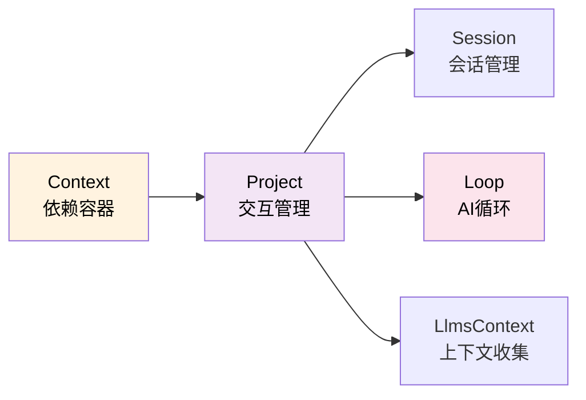
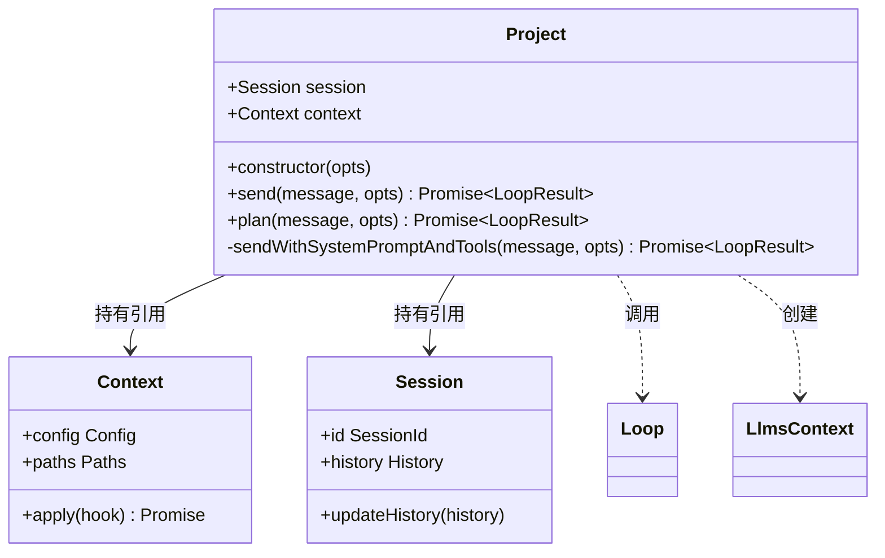
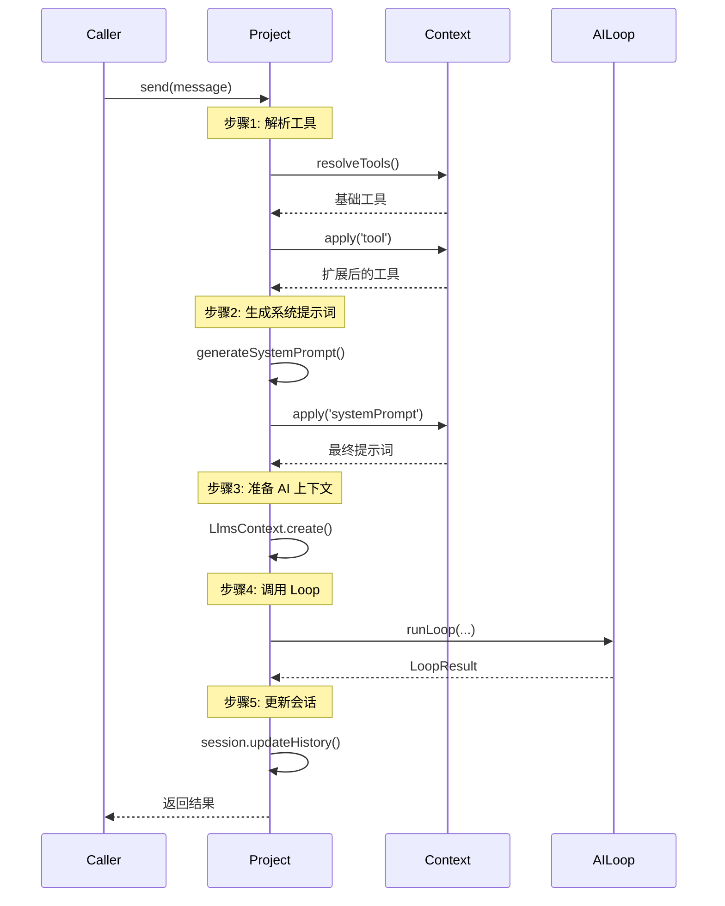
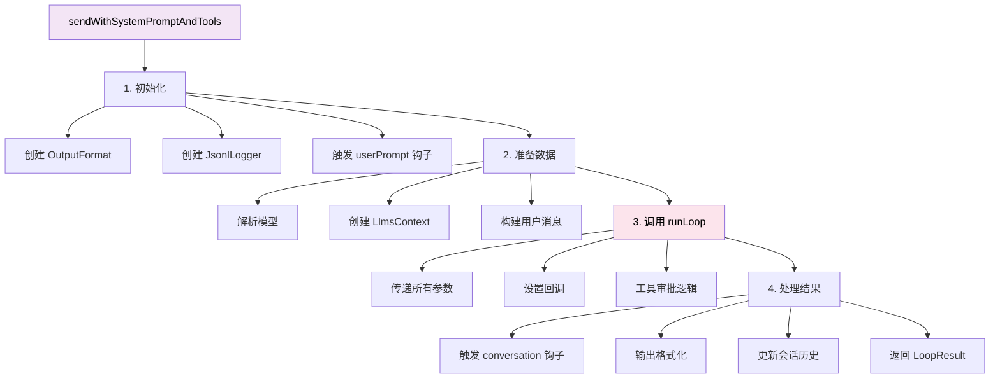
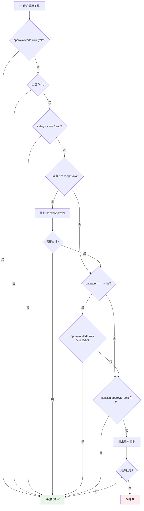
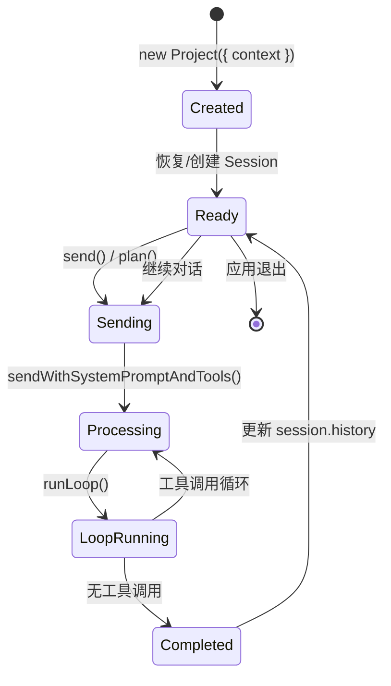

# Project 模块详解

> 深入理解 Project 类的职责、设计和实现

- source: [src/project.ts](../src/project.ts)

## 目录

- [概述](#概述)
- [核心职责](#核心职责)
- [类结构](#类结构)
- [核心方法](#核心方法)
- [工具审批机制](#工具审批机制)
- [生命周期](#生命周期)
- [使用示例](#使用示例)

---

## 概述

### 定位

Project 是 **项目级别的 AI 交互管理器**，负责：
- 管理会话（Session）
- 协调 Context、LlmsContext、Loop 的交互
- 处理工具解析和插件扩展
- 实现工具审批逻辑
- 记录会话日志



### 设计特点

1. **职责单一** - 只负责组装和协调，不直接执行 AI 交互
2. **依赖注入** - 通过 Context 获取所有依赖
3. **状态管理** - 持有 Session，管理对话历史
4. **插件友好** - 在关键节点触发插件钩子

---

## 核心职责

### 1. 会话管理

```typescript
export class Project {
  session: Session;      // 持有会话实例
  context: Context;      // 持有上下文引用

  constructor(opts: { sessionId?: SessionId; context: Context }) {
    // 恢复已有会话或创建新会话
    this.session = opts.sessionId
      ? Session.resume({
          id: opts.sessionId,
          logPath: opts.context.paths.getSessionLogPath(opts.sessionId),
        })
      : Session.create();
    this.context = opts.context;
  }
}
```

**会话的两种模式**：
- **新会话** - `Session.create()` 创建全新的会话
- **恢复会话** - `Session.resume()` 从日志恢复会话历史

### 2. 工具解析和扩展

```typescript
// 解析基础工具
let tools = await resolveTools({
  context: this.context,  // 使用 context 的 cwd、mcpManager 等
  sessionId: this.session.id,
  write: true,            // 是否包含写入工具
  todo: true,             // 是否包含 TODO 工具
});

// 通过插件扩展工具
tools = await this.context.apply({
  hook: 'tool',
  args: [{ sessionId: this.session.id }],
  memo: tools,
  type: PluginHookType.SeriesMerge,
});
```

### 3. 系统提示词生成和扩展

```typescript
// 生成基础系统提示词
let systemPrompt = generateSystemPrompt({
  todo: this.context.config.todo,
  productName: this.context.productName,
  language: this.context.config.language,
  outputStyle,
});

// 允许插件修改系统提示词
systemPrompt = await this.context.apply({
  hook: 'systemPrompt',
  args: [{ sessionId: this.session.id }],
  memo: systemPrompt,
  type: PluginHookType.SeriesLast,  // 串行执行，取最后结果
});
```

### 4. AI 上下文准备

```typescript
const llmsContext = await LlmsContext.create({
  context: this.context,
  sessionId: this.session.id,
  userPrompt: message,
});
// llmsContext.messages 包含：
// - Git 状态
// - 目录结构
// - 项目规则
// - README 内容
// - 环境信息
```

### 5. 协调 Loop 执行

```typescript
const result = await runLoop({
  input: filteredInput,          // 历史消息 + 当前消息
  model,                         // 已解析的模型
  tools: toolsManager,           // 工具管理器
  cwd: this.context.cwd,         // 工作目录
  systemPrompt,                  // 系统提示词
  llmsContexts: llmsContext.messages,  // AI 上下文
  signal: opts.signal,           // 取消信号
  autoCompact: this.context.config.autoCompact,  // 自动压缩历史
  // ... 各种回调
});
```

---

## 类结构

### 类图



### 属性

| 属性 | 类型 | 说明 |
|------|------|------|
| `session` | Session | 会话实例，管理对话历史 |
| `context` | Context | 上下文引用，提供所有依赖 |

---

## 核心方法

### 1. send() - 发送消息（标准模式）

```typescript
async send(
  message: string | null,
  opts: {
    model?: string;
    onMessage?: (opts: { message: NormalizedMessage }) => Promise<void>;
    onToolApprove?: (opts: { toolUse: ToolUse }) => Promise<boolean>;
    onTextDelta?: (text: string) => Promise<void>;
    onChunk?: (chunk: any, requestId: string) => Promise<void>;
    signal?: AbortSignal;
    attachments?: ImagePart[];
  } = {},
)
```

**流程**：



**特点**：
- ✅ 包含**所有工具**（读取 + 写入 + TODO）
- ✅ 支持**工具审批**（根据配置和工具类别）
- ✅ 使用**标准系统提示词**

**使用场景**：
- 交互模式
- 安静模式
- 正常对话

### 2. plan() - 计划模式

```typescript
async plan(
  message: string | null,
  opts: {
    model?: string;
    onMessage?: (opts: { message: NormalizedMessage }) => Promise<void>;
    onTextDelta?: (text: string) => Promise<void>;
    onChunk?: (chunk: any, requestId: string) => Promise<void>;
    signal?: AbortSignal;
    attachments?: ImagePart[];
  } = {},
)
```

**与 send() 的区别**：

| 特性 | send() | plan() |
|------|--------|--------|
| **工具** | 读取 + 写入 + TODO | **只读**工具 |
| **系统提示词** | 标准提示词 | **计划提示词** |
| **模型** | config.model | config.**planModel** |
| **工具审批** | 根据配置 | **自动批准** |

**特点**：
- 🔒 **只读模式** - 不能修改文件、执行命令
- 📋 **计划生成** - AI 只能规划，不能执行
- ⚡ **自动批准** - 所有工具调用自动批准（因为只读）

**使用场景**：
- 用户想先看计划再执行
- 复杂任务的分步规划
- 安全的"预览"模式

**实现**：

```typescript
return this.sendWithSystemPromptAndTools(message, {
  ...opts,
  model: opts.model || this.context.config.planModel,  // 使用计划模型
  tools,                                                // 只读工具
  systemPrompt,                                         // 计划提示词
  onToolApprove: () => Promise.resolve(true),          // 自动批准
});
```

### 3. sendWithSystemPromptAndTools() - 核心发送逻辑（私有）

这是 `send()` 和 `plan()` 共用的底层实现。

**完整流程**：



**关键步骤**：

#### 步骤 1: 初始化

```typescript
const startTime = new Date();
const outputFormat = new OutputFormat({
  format: this.context.config.outputFormat,
  quiet: this.context.config.quiet,
});
const jsonlLogger = new JsonlLogger({
  filePath: this.context.paths.getSessionLogPath(this.session.id),
});
```

#### 步骤 2: 准备数据

```typescript
// 允许插件修改用户输入
message = await this.context.apply({
  hook: 'userPrompt',
  memo: message,
  type: PluginHookType.SeriesLast,
});

// 解析模型
const model = await resolveModelWithContext(
  opts.model || null,
  this.context
);

// 创建 AI 上下文
const llmsContext = await LlmsContext.create({
  context: this.context,
  sessionId: this.session.id,
  userPrompt: message,
});

// 构建用户消息（支持附件）
let content: UserContent = message;
if (opts.attachments?.length) {
  content = [
    { type: 'text', text: message },
    ...opts.attachments,
  ];
}
```

#### 步骤 3: 调用 runLoop

```typescript
const result = await runLoop({
  input: filteredInput,
  model,
  tools: toolsManager,
  cwd: this.context.cwd,
  systemPrompt: opts.systemPrompt,
  llmsContexts: llmsContext.messages,
  signal: opts.signal,
  autoCompact: this.context.config.autoCompact,

  // 回调：消息
  onMessage: async (message) => {
    outputFormat.onMessage({ message });
    jsonlLogger.addMessage({ message });
    await opts.onMessage?.({ message });
  },

  // 回调：工具使用前（插件钩子）
  onToolUse: async (toolUse) => {
    return await this.context.apply({
      hook: 'toolUse',
      memo: toolUse,
      type: PluginHookType.SeriesLast,
    });
  },

  // 回调：工具结果（插件钩子）
  onToolResult: async (toolUse, toolResult, approved) => {
    return await this.context.apply({
      hook: 'toolResult',
      memo: toolResult,
      type: PluginHookType.SeriesLast,
    });
  },

  // 回调：工具审批（核心逻辑）
  onToolApprove: async (toolUse) => {
    // 见下一节详解
  },
});
```

#### 步骤 4: 处理结果

```typescript
// 触发对话完成钩子
await this.context.apply({
  hook: 'conversation',
  args: [{ userPrompt: message, result, startTime, endTime }],
  type: PluginHookType.Series,
});

// 输出格式化
outputFormat.onEnd({ result, sessionId: this.session.id });

// 更新会话历史
if (result.success && result.data.history) {
  this.session.updateHistory(result.data.history);
}

return result;
```

---

## 工具审批机制

这是 Project 最复杂的逻辑之一，决定了工具是否需要用户审批。

### 审批流程图



### 审批规则详解

```typescript
onToolApprove: async (toolUse) => {
  const tool = toolsManager.get(toolUse.name);

  // ✅ 规则 1: YOLO 模式（全部自动批准）
  if (this.context.config.approvalMode === 'yolo') {
    return true;
  }

  // ✅ 规则 2: 工具不存在（让 invoke 处理错误）
  if (!tool) {
    return true;
  }

  // ✅ 规则 3: 只读工具（自动批准）
  if (tool.approval?.category === 'read') {
    return true;
  }

  // ✅ 规则 4: 工具自定义审批逻辑
  const needsApproval = tool.approval?.needsApproval;
  if (needsApproval) {
    const needsApprovalResult = await needsApproval({
      toolName: toolUse.name,
      params: toolUse.params,
      approvalMode: this.context.config.approvalMode,
      context: this.context,
    });
    if (!needsApprovalResult) {
      return true;  // 工具决定不需要审批
    }
  }

  // ✅ 规则 5: autoEdit 模式（写入工具自动批准）
  const sessionConfigManager = new SessionConfigManager({
    logPath: this.context.paths.getSessionLogPath(this.session.id),
  });
  if (tool.approval?.category === 'write') {
    if (
      sessionConfigManager.config.approvalMode === 'autoEdit' ||
      this.context.config.approvalMode === 'autoEdit'
    ) {
      return true;
    }
  }

  // ✅ 规则 6: 会话级别的审批白名单
  if (sessionConfigManager.config.approvalTools.includes(toolUse.name)) {
    return true;
  }

  // ❓ 规则 7: 请求用户审批
  return (await opts.onToolApprove?.({
    toolUse,
    category: tool.approval?.category,
  })) ?? false;
}
```

### 审批模式

| 模式 | 只读工具 | 写入工具 | 说明 |
|------|---------|---------|------|
| **manual** | ✅ 自动 | ❓ 询问 | 默认模式 |
| **yolo** | ✅ 自动 | ✅ 自动 | 全自动 |
| **autoEdit** | ✅ 自动 | ✅ 自动 | 自动批准写入 |

### 工具分类

```typescript
type ApprovalCategory = 'read' | 'write';

// 只读工具（自动批准）
{
  approval: {
    category: 'read',
  }
}

// 写入工具（需要审批）
{
  approval: {
    category: 'write',
    needsApproval: async ({ toolName, params, approvalMode, context }) => {
      // 自定义逻辑决定是否需要审批
      return true; // 需要审批
    }
  }
}
```

---

## 生命周期

### 创建 → 使用 → 销毁



### 完整示例

```typescript
// 1. 创建 Context
const context = await Context.create({
  cwd: process.cwd(),
  productName: 'neovate',
  version: '1.0.0',
  argvConfig: {},
  plugins: [],
});

// 2. 创建 Project
const project = new Project({ context });

// 3. 发送消息
const result = await project.send('帮我写一个函数', {
  onMessage: async ({ message }) => {
    console.log('Message:', message);
  },
  onToolApprove: async ({ toolUse }) => {
    console.log('Approve tool:', toolUse.name);
    return true;
  },
  onTextDelta: async (text) => {
    process.stdout.write(text);
  },
});

// 4. 继续对话（复用 project 和 session）
const result2 = await project.send('现在添加单元测试');

// 5. 清理
await context.destroy();
```

---

## 使用示例

### 示例 1: 基本使用（安静模式）

```typescript
async function runQuiet(argv: any, context: Context) {
  const project = new Project({ context });

  const result = await project.send(argv._[0], {
    model: argv.model,
    onTextDelta: async (text) => {
      process.stdout.write(text);
    },
  });

  if (!result.success) {
    console.error('Error:', result.error.message);
    process.exit(1);
  }
}
```

### 示例 2: 交互模式（带审批）

```typescript
async function runInteractive(context: Context) {
  const project = new Project({ context });

  const result = await project.send(userInput, {
    onToolApprove: async ({ toolUse, category }) => {
      if (category === 'read') {
        return true;  // 只读自动批准
      }
      // 询问用户
      return await promptUser(`Approve ${toolUse.name}?`);
    },
    onTextDelta: async (text) => {
      displayInUI(text);
    },
  });

  return result;
}
```

### 示例 3: 计划模式

```typescript
async function showPlan(context: Context, task: string) {
  const project = new Project({ context });

  // 使用计划模式（只读工具）
  const planResult = await project.plan(task, {
    onTextDelta: async (text) => {
      console.log(text);
    },
  });

  if (planResult.success) {
    console.log('\n\n计划已生成，是否执行？');
    const execute = await promptYesNo();

    if (execute) {
      // 切换到执行模式
      const result = await project.send('开始执行计划');
      return result;
    }
  }
}
```

### 示例 4: 恢复会话

```typescript
async function resumeSession(context: Context, sessionId: string) {
  // 恢复已有会话
  const project = new Project({
    context,
    sessionId  // 提供 sessionId
  });

  // 查看历史
  console.log('会话历史:', project.session.history.messages.length);

  // 继续对话
  const result = await project.send('继续刚才的任务');
  return result;
}
```

### 示例 5: 带附件的消息

```typescript
async function sendWithImages(context: Context, message: string) {
  const project = new Project({ context });

  const imageData = fs.readFileSync('screenshot.png');

  const result = await project.send(message, {
    attachments: [
      {
        type: 'image',
        source: {
          type: 'base64',
          media_type: 'image/png',
          data: imageData.toString('base64'),
        },
      },
    ],
  });

  return result;
}
```

---

## 总结

### Project 的核心价值

1. **协调者角色**
   - 不直接执行 AI 交互
   - 组装所有必要组件
   - 协调 Context、Session、Loop

2. **插件友好**
   - 在关键节点触发钩子
   - 允许插件扩展功能
   - 提供灵活的审批机制

3. **状态管理**
   - 持有 Session
   - 管理对话历史
   - 支持会话恢复

4. **职责分离**
   - Project: 组装和协调
   - AILoop: AI 交互循环
   - Tools: 工具执行
   - LlmsContext: 上下文准备

### 关键设计模式

1. **依赖注入** - 通过 Context 获取依赖
2. **策略模式** - send() vs plan() 不同策略
3. **模板方法** - sendWithSystemPromptAndTools 作为模板
4. **观察者模式** - 各种回调和钩子

### 学习建议

1. **理解职责边界**
   - Project 只组装，不执行
   - Loop 只执行，不知道 Context

2. **掌握审批机制**
   - 7 条审批规则
   - 工具分类（read/write）
   - 审批模式（manual/yolo/autoEdit）

3. **追踪数据流**
   - Context → Project → Loop
   - 单向流动，不回传 Context

4. **实践调试**
   - 在 send() 入口打断点
   - 查看 tools 的组装过程
   - 观察 onToolApprove 的执行

---

## 相关文档

- [Loop 详解](./loop.md)
- [Context 详解](./context.md)
- [Context 协作机制](./context-collaboration.md)
- [整体架构](./arch.md)
