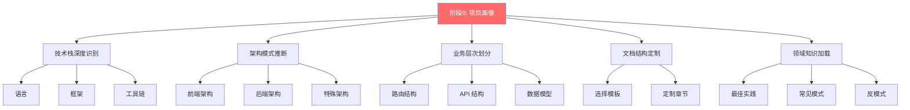
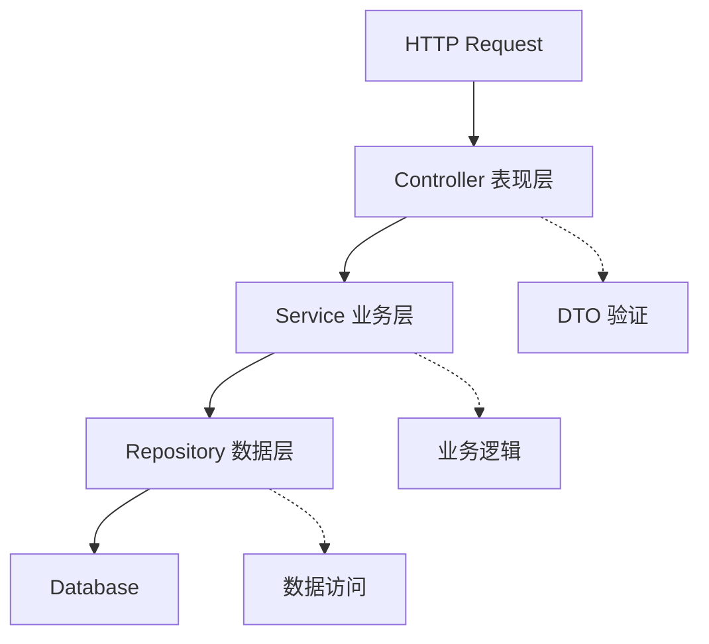
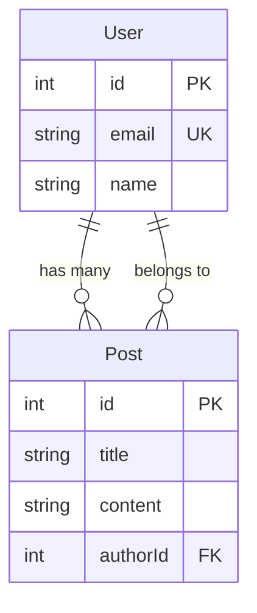

# 阶段0: 项目画像与上下文建立 (补充文档)

> 本文档是《智能代码仓库文档自动生成方案》的补充,详细说明阶段0的设计和实现
> 主文档: [wiki-auto-generation-plan.md](./wiki-auto-generation-plan.md)
> 版本: v2.0
> 创建日期: 2025-10-24

---

## 📋 阶段0 概述

**时长**: 15-20分钟
**目标**: 深度理解项目技术栈、架构模式和业务特征,为后续分析和文档生成提供完整上下文,确保生成的文档贴合项目特点
**输出**: 项目画像 JSON + 人类可读报告

---

## 🎯 为什么需要阶段0?

### 问题

原方案从"结构分析"开始,存在以下不足:

1. ❌ **技术栈识别浅显** - 只识别语言,不识别框架和架构模式
2. ❌ **缺少业务理解** - 没有理解路由、页面、API 等业务结构
3. ❌ **文档结构固定** - 没有根据项目特点动态调整
4. ❌ **缺少领域知识** - 没有结合技术栈的最佳实践

### 解决方案

新增**阶段0: 项目画像**,从以下维度建立完整上下文:



---

## 🔍 Step 0.1: 技术栈深度识别

### 三层识别体系

#### 第1层: 语言识别

通过配置文件识别项目语言:

```bash
# Node.js/TypeScript
if [ -f "package.json" ] || [ -f "tsconfig.json" ]; then
  echo "Node.js/TypeScript 项目"
fi

# Python
if [ -f "pyproject.toml" ] || [ -f "requirements.txt" ]; then
  echo "Python 项目"
fi

# Go
if [ -f "go.mod" ]; then
  echo "Go 项目"
fi

# Java
if [ -f "pom.xml" ] || [ -f "build.gradle" ]; then
  echo "Java 项目"
fi

# Rust
if [ -f "Cargo.toml" ]; then
  echo "Rust 项目"
fi
```

#### 第2层: 框架识别

##### 前端框架

```bash
# 检测 React
if grep -q '"react"' package.json; then
  if [ -f "next.config.js" ] || [ -f "next.config.ts" ]; then
    echo "框架: Next.js"
    if [ -d "app" ] && grep -q '"next": "^14' package.json; then
      echo "架构: App Router"
    elif [ -d "pages" ]; then
      echo "架构: Pages Router"
    fi
  elif [ -f "remix.config.js" ]; then
    echo "框架: Remix"
  elif [ -f "gatsby-config.js" ]; then
    echo "框架: Gatsby"
  else
    echo "框架: React (基础)"
  fi
fi

# 检测 Vue
if grep -q '"vue"' package.json; then
  if [ -f "nuxt.config.ts" ]; then
    echo "框架: Nuxt"
  else
    echo "框架: Vue"
  fi
fi

# 检测 Angular
if grep -q '"@angular/core"' package.json && [ -f "angular.json" ]; then
  echo "框架: Angular"
fi
```

##### 跨端框架

```bash
# Taro
if grep -q '"@tarojs/' package.json && [ -f "project.config.json" ]; then
  echo "跨端框架: Taro"
  # 检测支持的平台
  if [ -f "project.config.json" ]; then
    platforms=$(grep -o '"weapp"\|"alipay"\|"h5"' project.config.json)
    echo "支持平台: $platforms"
  fi
fi

# Uni-app
if [ -f "pages.json" ] && [ -f "manifest.json" ]; then
  echo "跨端框架: Uni-app"
fi

# React Native
if grep -q '"react-native"' package.json; then
  echo "跨端框架: React Native"
fi
```

##### 后端框架

```bash
# NestJS
if grep -q '"@nestjs/core"' package.json && [ -f "src/main.ts" ]; then
  echo "后端框架: NestJS"
fi

# Express
if grep -q '"express"' package.json; then
  echo "后端框架: Express"
fi

# Django
if grep -q 'Django' requirements.txt && [ -f "manage.py" ]; then
  echo "后端框架: Django"
fi

# FastAPI
if grep -q 'fastapi' requirements.txt; then
  echo "后端框架: FastAPI"
fi
```

##### CLI 工具

```bash
# Commander.js
if grep -q '"commander"' package.json && [ -d "bin" ]; then
  echo "CLI 工具: Commander.js"
fi

# Ink (终端 UI)
if grep -q '"ink"' package.json; then
  echo "CLI UI: Ink"
fi

# Oclif
if grep -q '"@oclif/core"' package.json; then
  echo "CLI 框架: Oclif"
fi
```

##### Monorepo 工具

```bash
# Turborepo
if [ -f "turbo.json" ]; then
  echo "Monorepo: Turborepo"
  packages=$(find packages apps -maxdepth 1 -type d | wc -l)
  echo "包数量: $packages"
fi

# Nx
if [ -f "nx.json" ]; then
  echo "Monorepo: Nx"
fi

# pnpm workspace
if [ -f "pnpm-workspace.yaml" ]; then
  echo "Monorepo: pnpm workspace"
fi
```

#### 第3层: 架构模式识别

```bash
# 前端架构
# 检测文件路由
if [ -d "app" ] || [ -d "pages" ]; then
  echo "路由模式: 文件路由 (File-based)"
fi

# 检测配置路由
if [ -f "src/router/index.ts" ] || [ -f "src/routes.tsx" ]; then
  echo "路由模式: 配置路由 (Config-based)"
fi

# 检测 Atomic Design
if [ -d "src/components/atoms" ] && [ -d "src/components/molecules" ]; then
  echo "组件架构: Atomic Design"
fi

# 后端架构
# 检测三层架构
if [ -d "src/controllers" ] && [ -d "src/services" ] && [ -d "src/repositories" ]; then
  echo "后端架构: 三层架构 (Three-tier)"
fi

# 检测 DDD
if [ -d "src/domain/entities" ] && [ -d "src/domain/services" ]; then
  echo "后端架构: DDD (领域驱动设计)"
fi
```

### 输出: 项目画像数据结构

```typescript
interface ProjectProfile {
  // 基础信息
  name: string;
  type: 'frontend' | 'backend' | 'fullstack' | 'cli' | 'library' | 'mobile' | 'desktop';

  // 技术栈 (三层)
  tech_stack: {
    // 层1: 语言
    languages: {
      primary: string;              // "TypeScript"
      others: string[];             // ["JavaScript"]
    };

    // 层2: 框架
    frameworks: {
      runtime?: string;             // "Node.js"
      frontend?: string;            // "React"
      backend?: string;             // "NestJS"
      meta?: string;                // "Next.js"
      cross_platform?: string;      // "Taro"
      ui?: string[];                // ["Tailwind CSS"]
      state?: string[];             // ["Zustand"]
      testing?: string[];           // ["Jest", "Playwright"]
    };

    // 构建工具
    build_tools: string[];          // ["Vite"]

    // Monorepo
    monorepo?: {
      tool: string;                 // "Turborepo"
      packages: number;
    };
  };

  // 架构模式 (层3)
  architecture: {
    pattern: string;
    frontend_pattern?: string;
    backend_pattern?: string;
    module_organization: string;
  };

  // 业务特征
  business: {
    domain?: string;
    has_routing: boolean;
    routing_type?: 'file-based' | 'config-based';
    routes_count?: number;
    has_api: boolean;
    api_style?: 'REST' | 'GraphQL' | 'tRPC';
    api_endpoints_count?: number;
    has_database: boolean;
    database?: string[];
    has_auth: boolean;
    auth_method?: string;
  };

  // 项目规模
  scale: {
    files_count: number;
    loc: number;
    contributors: number;
    commits: number;
    maturity: 'early' | 'growing' | 'mature';
  };

  // 代码质量
  quality?: {
    has_tests: boolean;
    test_coverage?: number;
    has_linter: boolean;
    has_ci: boolean;
  };

  // 文档策略
  documentation_strategy: string;   // "frontend-nextjs"
}
```

---

## 🏗️ Step 0.2: 架构模式深度推断

### 前端架构模式

#### 1. 路由架构

**文件路由 (File-based Routing)**

检测特征:
```bash
# Next.js App Router
if [ -d "app" ]; then
  echo "路由方式: Next.js App Router (文件路由)"

  # 提取所有路由
  find app -name "page.tsx" -o -name "route.ts" | \
    sed 's|app/||; s|/page.tsx||; s|/route.ts||; s|^|/|'
fi

# Next.js Pages Router
if [ -d "pages" ]; then
  echo "路由方式: Next.js Pages Router (文件路由)"

  find pages -name "*.tsx" -not -name "_*" | \
    sed 's|pages/||; s|\.tsx$||; s|/index$||; s|^|/|'
fi

# Nuxt
if [ -d "pages" ] && [ -f "nuxt.config.ts" ]; then
  echo "路由方式: Nuxt (文件路由)"
fi
```

生成文档:
```markdown
## 路由结构

### 路由映射表

| 路由 | 文件 | 类型 | 功能描述 |
|------|------|------|----------|
| / | app/page.tsx | 页面 | 首页 |
| /about | app/about/page.tsx | 页面 | 关于页面 |
| /blog/[slug] | app/blog/[slug]/page.tsx | 动态页面 | 博客详情 |
| /api/users | app/api/users/route.ts | API | 用户 API |

### 特殊路由约定

- `[slug]` - 动态路由段
- `[...slug]` - 捕获所有路由
- `[[...slug]]` - 可选的捕获所有路由
- `(group)` - 路由组 (不影响 URL)
- `@folder` - 并行路由
```

**配置路由 (Config-based Routing)**

检测特征:
```bash
# React Router
if [ -f "src/router.tsx" ] || [ -f "src/routes.tsx" ]; then
  echo "路由方式: React Router (配置路由)"

  # 提取路由配置
  grep -o "path: ['\"].*['\"]" src/router.tsx
fi

# Vue Router
if [ -f "src/router/index.ts" ]; then
  echo "路由方式: Vue Router (配置路由)"
fi
```

#### 2. 状态管理模式

```bash
# Redux
if grep -q '"redux"' package.json; then
  if [ -d "src/store" ] && [ -d "src/actions" ]; then
    echo "状态管理: Redux (传统模式)"
  elif grep -q '"@reduxjs/toolkit"' package.json; then
    echo "状态管理: Redux Toolkit"
  fi
fi

# Zustand
if grep -q '"zustand"' package.json; then
  echo "状态管理: Zustand (轻量级)"
fi

# Jotai
if grep -q '"jotai"' package.json; then
  echo "状态管理: Jotai (原子化)"
fi

# React Query / TanStack Query
if grep -q '"@tanstack/react-query"' package.json; then
  echo "服务端状态: React Query"
fi
```

#### 3. 组件架构

```bash
# Atomic Design
if [ -d "src/components/atoms" ] && \
   [ -d "src/components/molecules" ] && \
   [ -d "src/components/organisms" ]; then
  echo "组件架构: Atomic Design"
fi

# Feature-based
if [ -d "src/features" ]; then
  echo "组件架构: 功能模块化"
fi
```

### 后端架构模式

#### 1. 三层架构

```bash
if [ -d "src/controllers" ] && \
   [ -d "src/services" ] && \
   [ -d "src/repositories" ]; then
  echo "后端架构: 三层架构"
  echo "- 表现层: controllers/"
  echo "- 业务层: services/"
  echo "- 数据层: repositories/"
fi
```

生成文档:
```markdown
## 三层架构



### 层次职责

| 层级 | 目录 | 职责 |
|------|------|------|
| 表现层 | controllers/ | 处理 HTTP 请求,参数验证,响应格式化 |
| 业务层 | services/ | 业务逻辑,事务管理,领域模型 |
| 数据层 | repositories/ | 数据访问,ORM 操作,缓存 |
```

#### 2. DDD (领域驱动设计)

```bash
if [ -d "src/domain/entities" ] && \
   [ -d "src/domain/services" ] && \
   [ -d "src/application" ]; then
  echo "后端架构: DDD (领域驱动设计)"
  echo "- 领域层: domain/"
  echo "- 应用层: application/"
  echo "- 基础设施层: infrastructure/"
fi
```

---

## 📊 Step 0.3: 业务层次自动划分

### 前端业务结构

#### 1. 路由层次提取

**Next.js 示例**:
```bash
# 提取所有路由并生成表格
echo "| 路由 | 文件 | 类型 |"
echo "|------|------|------|"

find app -name "page.tsx" | while read file; do
  route=$(echo "$file" | sed 's|app/||; s|/page.tsx||; s|^|/|')
  type="页面"
  echo "| $route | $file | $type |"
done

find app -name "route.ts" | while read file; do
  route=$(echo "$file" | sed 's|app/||; s|/route.ts||; s|^|/api|')
  type="API"
  echo "| $route | $file | $type |"
done
```

#### 2. 组件层次树

```bash
# 生成组件依赖树
# 从 App.tsx 开始递归分析 import

function analyze_component() {
  local file=$1
  local depth=$2
  local indent=$(printf '%*s' $((depth * 2)) '')

  echo "${indent}├── $(basename $file .tsx)"

  # 提取 import 的组件
  grep "^import.*from ['\"]\\." "$file" | \
    sed -n "s/.*from ['\"]\\.\\(.*\\)['\"].*/\\1/p" | \
    while read import_path; do
      # 递归分析
      analyze_component "$import_path.tsx" $((depth + 1))
    done
}

# 从根组件开始
analyze_component "src/App.tsx" 0
```

### 后端业务结构

#### 1. API 路由提取

**Express 示例**:
```bash
# 提取路由定义
grep -rn "router\\.\\(get\\|post\\|put\\|delete\\)" src/routes/ | \
  sed -n "s/.*router\\.\\([a-z]*\\)(['\"]\\/\\([^'\"]*\\)['\"].*/\\1 \\/\\2/p" | \
  sort -u
```

**NestJS 示例**:
```bash
# 从控制器提取路由
find src -name "*.controller.ts" | while read file; do
  controller_path=$(grep -o "@Controller(['\"].*['\"])" "$file" | \
                    sed "s/@Controller(['\"]\\(.*\\)['\"])/\\1/")

  echo "控制器: $controller_path"

  grep -o "@\\(Get\\|Post\\|Put\\|Delete\\)(['\"].*['\"])" "$file" | \
    sed "s/@\\([A-Z][a-z]*\\)(['\"]\\(.*\\)['\"])/  \\1 \\/$controller_path\\/\\2/"
done
```

生成 API 文档表:
```markdown
## API 端点

| 方法 | 路径 | 控制器 | 功能 | 认证 |
|------|------|--------|------|------|
| GET | /api/users | UsersController.findAll | 获取用户列表 | 需要 |
| GET | /api/users/:id | UsersController.findOne | 获取单个用户 | 需要 |
| POST | /api/users | UsersController.create | 创建用户 | 管理员 |
| PUT | /api/users/:id | UsersController.update | 更新用户 | 所有者 |
| DELETE | /api/users/:id | UsersController.remove | 删除用户 | 管理员 |
```

#### 2. 数据模型提取

**Prisma Schema**:
```bash
# 提取模型定义
grep "^model " prisma/schema.prisma | \
  sed 's/model \\(.*\\) {/\\1/'
```

生成 ER 图:


### CLI 工具业务结构

#### 1. 命令树提取

```bash
# 扫描 commands 目录
find commands -name "*.ts" | \
  sed 's|commands/||; s|.ts$||; s|/|:|g' | \
  sort
```

生成命令树:
```
neo
├── commit
│   ├── --stage
│   ├── --push
│   └── --no-verify
├── config
│   ├── get <key>
│   └── set <key> <value>
└── mcp
    ├── list
    └── add <name>
```

---

## 📚 Step 0.4: 文档结构动态定制

### 模板选择逻辑

```typescript
function selectDocumentationTemplate(profile: ProjectProfile): string {
  // 前端项目
  if (profile.type === 'frontend') {
    const meta = profile.tech_stack.frameworks.meta;
    if (meta === 'Next.js') return 'frontend-nextjs';
    if (meta === 'Nuxt') return 'frontend-nuxt';
    if (meta === 'Remix') return 'frontend-remix';

    const frontend = profile.tech_stack.frameworks.frontend;
    if (frontend === 'React') return 'frontend-react';
    if (frontend === 'Vue') return 'frontend-vue';
    if (frontend === 'Angular') return 'frontend-angular';
  }

  // 后端项目
  if (profile.type === 'backend') {
    const backend = profile.tech_stack.frameworks.backend;
    if (backend === 'NestJS') return 'backend-nestjs';
    if (backend === 'Express') return 'backend-express';
    if (backend === 'Django') return 'backend-django';
    if (backend === 'FastAPI') return 'backend-fastapi';
  }

  // CLI 工具
  if (profile.type === 'cli') {
    return 'cli-tool';
  }

  // Monorepo
  if (profile.tech_stack.monorepo) {
    const tool = profile.tech_stack.monorepo.tool;
    return `monorepo-${tool.toLowerCase()}`;
  }

  // 跨端项目
  if (profile.tech_stack.frameworks.cross_platform) {
    const platform = profile.tech_stack.frameworks.cross_platform;
    return `cross-platform-${platform.toLowerCase()}`;
  }

  return 'generic';
}
```

### 文档模板定义

#### 模板 1: frontend-nextjs

```markdown
repowiki/
├── 01-overview.md
├── 02-tech-stack.md
├── 03-quick-start.md
├── architecture/
│   ├── overview.md
│   ├── app-router.md              # ⭐ Next.js 特有
│   ├── server-components.md       # ⭐ Server Components
│   ├── data-fetching.md           # ⭐ 数据获取策略
│   ├── caching.md                 # ⭐ 缓存策略
│   └── routing.md                 # 路由设计
├── pages/                         # 页面文档
│   ├── _overview.md               # 路由映射表
│   ├── home.md
│   ├── about.md
│   └── ...
├── components/
│   ├── server/                    # ⭐ 服务端组件
│   │   ├── Layout.md
│   │   └── ...
│   └── client/                    # ⭐ 客户端组件
│       ├── Button.md
│       └── ...
├── api/                           # ⭐ API Routes
│   ├── overview.md
│   └── endpoints/
│       ├── users.md
│       └── ...
├── guides/
│   ├── server-vs-client.md        # ⭐ SC vs CC
│   ├── streaming.md               # ⭐ 流式渲染
│   └── seo.md                     # ⭐ SEO 优化
└── deployment/
    ├── vercel.md                  # ⭐ Vercel 部署
    └── docker.md
```

#### 模板 2: backend-nestjs

```markdown
repowiki/
├── 01-overview.md
├── 02-tech-stack.md
├── 03-quick-start.md
├── architecture/
│   ├── overview.md
│   ├── modules.md                 # ⭐ 模块系统
│   ├── dependency-injection.md    # ⭐ DI 容器
│   ├── guards.md                  # ⭐ 守卫
│   ├── interceptors.md            # ⭐ 拦截器
│   ├── pipes.md                   # ⭐ 管道
│   └── middleware.md              # ⭐ 中间件
├── modules/                       # ⭐ 模块文档
│   ├── users-module.md
│   ├── auth-module.md
│   └── ...
├── api/
│   ├── overview.md
│   └── endpoints/
│       ├── auth.md
│       ├── users.md
│       └── ...
├── database/
│   ├── schema.md
│   ├── migrations.md
│   └── seeding.md
└── guides/
    ├── testing.md                 # ⭐ NestJS 测试
    ├── microservices.md           # ⭐ 微服务
    └── graphql.md                 # ⭐ GraphQL
```

#### 模板 3: cli-tool

```markdown
repowiki/
├── 01-overview.md
├── 02-installation.md             # ⭐ CLI 安装
├── 03-quick-start.md
├── architecture/
│   ├── overview.md
│   ├── command-pattern.md         # ⭐ 命令模式
│   ├── plugin-system.md
│   └── config-system.md
├── commands/                      # ⭐ 命令文档
│   ├── _overview.md               # 命令树
│   ├── commit.md
│   ├── config.md
│   └── ...
├── workflows/                     # ⭐ 工作流程
│   ├── basic-usage.md
│   ├── advanced-usage.md
│   └── troubleshooting.md
└── api/                           # 如果是库
    └── ...
```

#### 模板 4: monorepo-turborepo

```markdown
repowiki/
├── 00-monorepo-overview.md        # ⭐ Monorepo 总览
├── 01-architecture.md
├── 02-getting-started.md
├── packages/                      # ⭐ 包文档
│   ├── _overview.md               # 包依赖图
│   ├── ui.md
│   ├── utils.md
│   └── ...
├── apps/                          # ⭐ 应用文档
│   ├── web.md
│   ├── docs.md
│   └── ...
├── development/
│   ├── workspace.md               # ⭐ 工作区
│   ├── tasks.md                   # ⭐ Turbo 任务
│   ├── caching.md                 # ⭐ 缓存
│   └── pipeline.md                # ⭐ 管道
└── guides/
    ├── adding-packages.md
    └── versioning.md
```

---

## 🎓 Step 0.5: 领域知识库加载

### 知识库结构

```typescript
interface TechKnowledgeBase {
  framework: string;
  version?: string;

  // 最佳实践
  best_practices: {
    title: string;
    description: string;
    examples?: string[];
  }[];

  // 常见模式
  common_patterns: {
    name: string;
    description: string;
    use_cases: string[];
    code_example?: string;
  }[];

  // 反模式
  anti_patterns: {
    pattern: string;
    why_bad: string;
    alternative: string;
  }[];

  // 性能优化
  performance_tips: string[];

  // 安全考虑
  security_considerations: string[];

  // 典型结构
  typical_structure: Record<string, string>;

  // 常见问题
  common_issues: {
    problem: string;
    solution: string;
  }[];
}
```

### 示例知识库

#### Next.js 14 App Router

```typescript
const nextjs14Knowledge: TechKnowledgeBase = {
  framework: "Next.js",
  version: "14",

  best_practices: [
    {
      title: "优先使用 Server Components",
      description: "默认组件是服务端组件,减少客户端 JavaScript",
      examples: [
        "数据获取直接在组件中进行",
        "只在需要交互时使用 'use client'"
      ]
    },
    {
      title: "使用 App Router 的文件约定",
      description: "利用 loading.tsx, error.tsx, not-found.tsx",
    }
  ],

  common_patterns: [
    {
      name: "数据获取模式",
      description: "Server Components 中直接 fetch",
      use_cases: ["SSR 数据预取", "API 路由"],
      code_example: `
async function Page() {
  const data = await fetch('https://api.example.com/data');
  return <div>{data.title}</div>;
}
      `
    }
  ],

  anti_patterns: [
    {
      pattern: "在 Server Component 中使用 useState",
      why_bad: "Server Component 不支持客户端 Hooks",
      alternative: "添加 'use client' 或使用 Server Actions"
    }
  ],

  performance_tips: [
    "使用 next/image 的 priority 优化 LCP",
    "使用 loading.tsx 提供加载反馈",
    "使用 Suspense 边界流式渲染"
  ],

  security_considerations: [
    "环境变量以 NEXT_PUBLIC_ 开头才暴露给客户端",
    "Server Actions 自动包含 CSRF 保护"
  ],

  common_issues: [
    {
      problem: "useState can only be used in Client Components",
      solution: "在文件顶部添加 'use client' 指令"
    }
  ]
};
```

### 知识库应用

在文档中整合知识库内容:

```markdown
# Next.js 架构总览

## 最佳实践 ⭐ (从知识库)

### 1. 优先使用 Server Components
默认组件是服务端组件,减少客户端 JavaScript...

[从知识库加载的内容]

## 常见模式 ⭐ (从知识库)

### 数据获取模式
[代码示例从知识库加载]

## ⚠️ 应避免的反模式 ⭐ (从知识库)

- ❌ 在 Server Component 中使用 useState
  - 原因: ...
  - 替代: ...
```

---

## 📊 Step 0.6: 生成项目画像报告

### 输出 1: JSON 格式

**文件**: `repowiki/00-project-profile.json`

```json
{
  "name": "MyAwesomeApp",
  "type": "frontend",
  "tech_stack": {
    "languages": {
      "primary": "TypeScript",
      "others": ["JavaScript"]
    },
    "frameworks": {
      "runtime": "Node.js",
      "frontend": "React",
      "meta": "Next.js 14",
      "ui": ["Tailwind CSS", "shadcn/ui"],
      "state": ["Zustand"],
      "testing": ["Jest", "Playwright"]
    },
    "build_tools": ["Turbopack", "TypeScript"]
  },
  "architecture": {
    "pattern": "App Router + Server Components",
    "frontend_pattern": "File-based Routing",
    "module_organization": "feature-based"
  },
  "business": {
    "domain": "电商",
    "has_routing": true,
    "routing_type": "file-based",
    "routes_count": 25,
    "has_api": true,
    "api_style": "REST",
    "api_endpoints_count": 15,
    "has_database": true,
    "database": ["PostgreSQL", "Redis"],
    "has_auth": true,
    "auth_method": "NextAuth.js"
  },
  "scale": {
    "files_count": 234,
    "loc": 18500,
    "contributors": 8,
    "commits": 456,
    "maturity": "growing"
  },
  "quality": {
    "has_tests": true,
    "test_coverage": 78,
    "has_linter": true,
    "has_ci": true
  },
  "documentation_strategy": "frontend-nextjs",
  "knowledge_base": "nextjs-14-app-router"
}
```

### 输出 2: Markdown 报告

**文件**: `repowiki/00-project-profile.md`

```markdown
# 项目画像报告

> 生成时间: 2025-10-24 14:30:00
> 分析耗时: 3.2 秒

## 📊 项目概览

- **项目名称**: MyAwesomeApp
- **项目类型**: 前端应用
- **业务领域**: 电商
- **项目成熟度**: 成长期 (456 commits, 8 contributors)

## 🛠️ 技术栈

### 核心技术
- **语言**: TypeScript (主要), JavaScript
- **运行时**: Node.js
- **前端框架**: React
- **元框架**: Next.js 14 (App Router)
- **UI 库**: Tailwind CSS, shadcn/ui
- **状态管理**: Zustand
- **构建工具**: Turbopack

### 测试
- **单元测试**: Jest
- **E2E 测试**: Playwright
- **测试覆盖率**: 78%

## 🏗️ 架构特征

### 架构模式
- **主架构**: App Router + Server Components
- **路由方式**: 文件路由 (File-based Routing)
- **模块组织**: 功能模块化 (feature-based)

### 路由结构
- **页面数量**: 25 个路由
- **API 端点**: 15 个

### 数据层
- **数据库**: PostgreSQL (主), Redis (缓存)
- **认证方式**: NextAuth.js

## 📁 项目规模

- **文件数量**: 234
- **代码行数**: 18,500
- **贡献者**: 8 人
- **提交数**: 456

## 📚 文档策略

基于项目特征,选择文档模板: **frontend-nextjs**

将生成以下文档结构:
- ✅ Next.js App Router 架构说明
- ✅ Server Components 使用指南
- ✅ 文件路由映射表
- ✅ API Routes 文档
- ✅ 数据获取模式说明
- ✅ 认证流程说明

## 🎓 知识库

已加载知识库: **nextjs-14-app-router**

将在文档中整合:
- ✅ Next.js 14 最佳实践
- ✅ 常见模式和反模式
- ✅ 性能优化建议
- ✅ 安全考虑事项
- ✅ 常见问题解答
```

---

## 🔄 与后续阶段的集成

阶段0 的输出将被后续阶段使用:

### 阶段1: 结构分析
- 使用 `documentation_strategy` 选择分析重点
- 基于 `architecture.pattern` 调整分析方法

### 阶段2: 深度挖掘
- 基于 `business` 信息决定挖掘重点(路由/API/数据模型)
- 使用 `knowledge_base` 补充分析

### 阶段3: 文档生成
- 使用选定的文档模板
- 整合知识库内容
- 根据项目规模调整文档详细程度

---

## 📈 效果对比

### 改进前
```
repowiki/
├── architecture.md         # 通用架构文档
├── modules/                # 所有模块一视同仁
└── api/                    # 简单的 API 列表
```

### 改进后
```
repowiki/
├── 00-project-profile.json          # ⭐ 项目画像
├── 00-project-profile.md            # ⭐ 可读报告
├── architecture/
│   ├── overview.md
│   ├── app-router.md                # ⭐ Next.js 特有
│   ├── server-components.md         # ⭐ 特定架构
│   └── best-practices.md            # ⭐ 从知识库
├── pages/
│   ├── _overview.md                 # ⭐ 路由映射表
│   └── ...
├── api/
│   ├── overview.md                  # ⭐ API 总览
│   └── endpoints/                   # ⭐ 按模块分类
└── guides/
    ├── server-vs-client.md          # ⭐ 框架特定
    └── performance.md               # ⭐ 优化建议
```

---

## 💡 扩展方向

### 1. 多维度特征提取

```markdown
## 业务领域识别
通过依赖和代码特征:
- **电商**: payment, order, cart
- **内容管理**: post, article, category
- **社交**: user, post, comment, like

## 团队规模推断
```bash
git shortlog -sn | wc -l  # 贡献者
git log --all --oneline | wc -l  # 提交数
```

影响:
- 小团队(<5): 简化文档
- 大团队(>20): 详细文档
```

### 2. 代码质量分析

```bash
# 测试覆盖率
npm run test:coverage | grep "All files"

# 代码注释率
cloc --by-file src/ | grep "comment"

# TypeScript 错误
tsc --noEmit 2>&1 | grep "error TS"
```

### 3. 性能指标

```bash
# Bundle 大小
npm run build | grep "Size"

# 依赖数量
npm list --depth=0 | wc -l
```

---

## 📚 参考资料

- [Next.js 最佳实践](https://nextjs.org/docs/app/building-your-application)
- [NestJS 架构指南](https://docs.nestjs.com/fundamentals)
- [Clean Architecture](https://blog.cleancoder.com/uncle-bob/2012/08/13/the-clean-architecture.html)
- [DDD 领域驱动设计](https://martinfowler.com/bliki/DomainDrivenDesign.html)

---

## ✅ 总结

**阶段0: 项目画像** 是整个文档生成流程的基础,通过:

1. **三层技术栈识别** - 语言 → 框架 → 架构
2. **架构模式推断** - 识别设计模式和组织方式
3. **业务层次划分** - 提取路由、API、数据模型
4. **文档结构定制** - 根据项目类型选择最佳模板
5. **领域知识加载** - 整合最佳实践和常见模式

确保生成的文档:
- ✅ **贴合项目特点** - 不是通用模板
- ✅ **包含最佳实践** - 结合技术栈知识
- ✅ **结构合理** - 符合项目架构
- ✅ **价值更高** - 不仅是文档,还是学习资料
