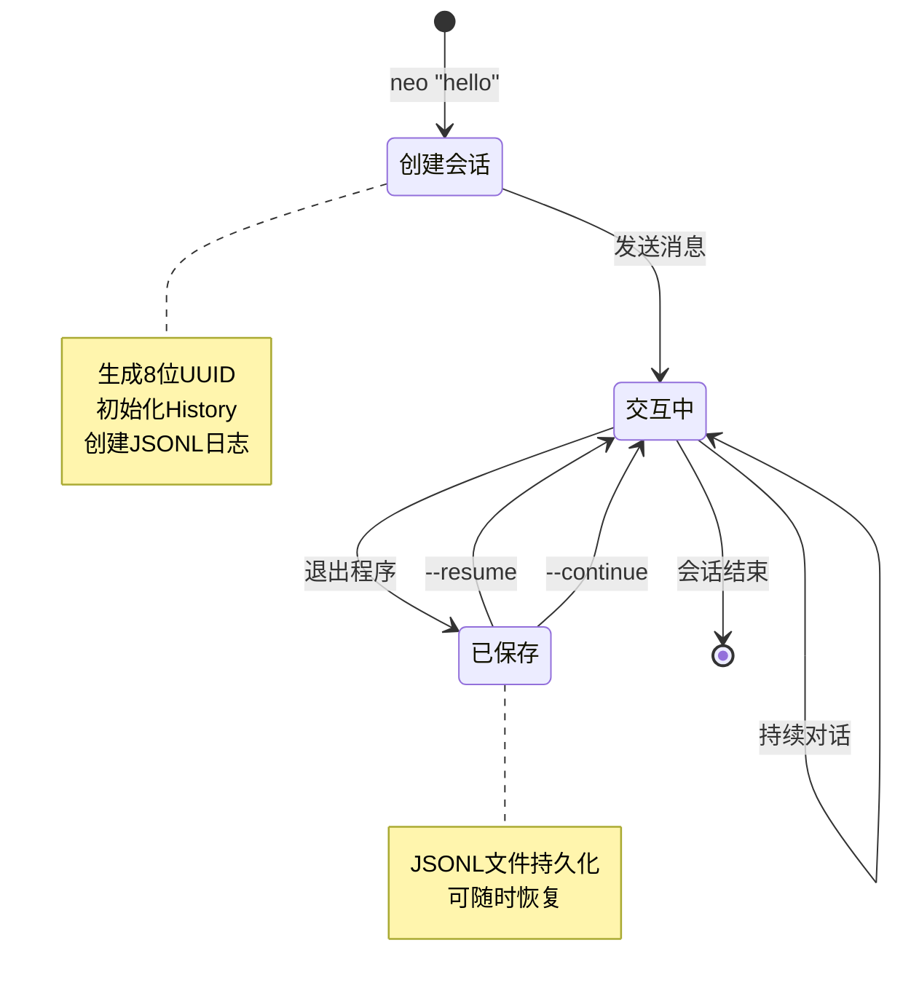
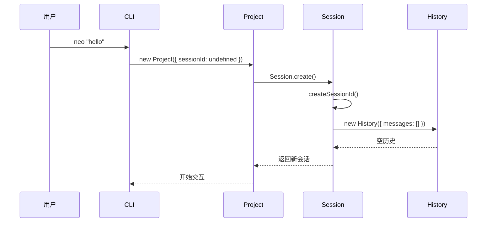
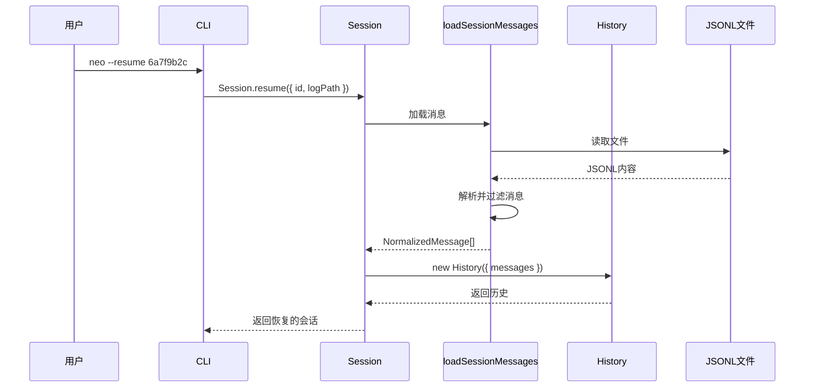
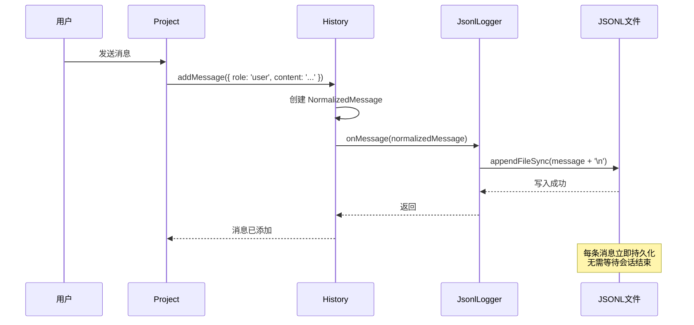
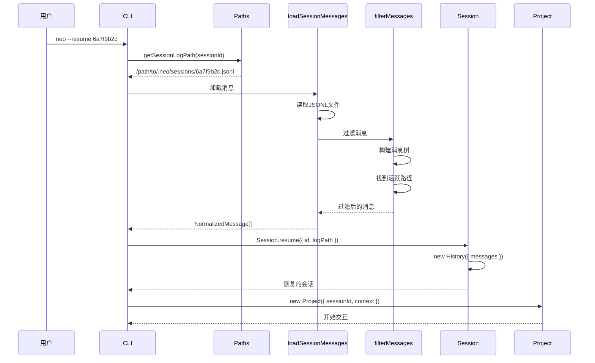
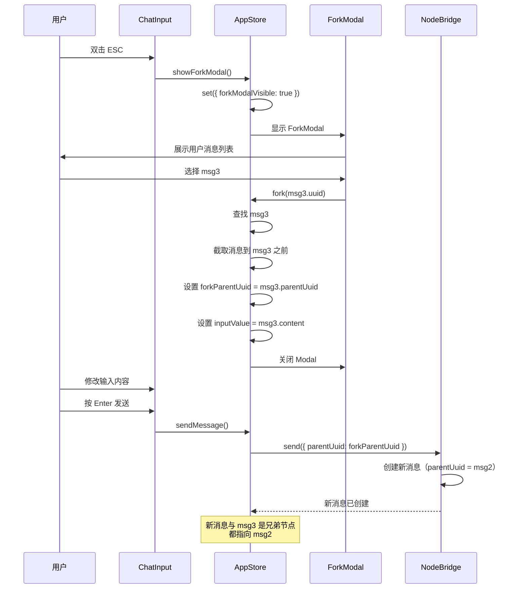

# 会话管理系统

> 深入理解 Neovate Code 的会话创建、恢复、持久化和历史管理机制

- source: [src/session.ts](../src/session.ts), [src/history.ts](../src/history.ts), [src/jsonl.ts](../src/jsonl.ts)

## 目录

- [概述](#概述)
- [核心概念](#核心概念)
- [Session 类详解](#session-类详解)
- [History 类详解](#history-类详解)
- [SessionConfig 详解](#sessionconfig-详解)
- [消息持久化机制](#消息持久化机制)
- [会话恢复流程](#会话恢复流程)
- [消息过滤与分支](#消息过滤与分支)
  - [Fork 功能](#fork-功能)
  - [filterMessages 函数](#filtermessages-函数)
  - [Fork 分支机制详解](#fork-分支机制详解)
    - [什么是 Fork？](#什么是-fork)
    - [Fork 触发方式](#fork-触发方式)
    - [Fork UI 界面](#fork-ui-界面)
    - [Fork 执行逻辑](#fork-执行逻辑)
    - [Fork 后发送消息](#fork-后发送消息)
    - [Fork 示例场景](#fork-示例场景)
    - [Fork 数据结构](#fork-数据结构)
    - [Fork 的限制和注意事项](#fork-的限制和注意事项)
    - [Fork 流程图](#fork-流程图)
    - [Fork 与 filterMessages 的关系](#fork-与-filtermessages-的关系)
- [历史压缩机制](#历史压缩机制)
- [最佳实践](#最佳实践)

---

## 概述

### 什么是会话(Session)？

在 Neovate Code 中，**会话(Session)** 是用户与 AI 交互的一个完整生命周期。每个会话包含:

1. ✅ **唯一标识符** - 8位随机UUID
2. ✅ **消息历史** - 用户和AI的完整对话记录
3. ✅ **使用统计** - Token使用量、请求次数等
4. ✅ **会话配置** - 审批模式、工具白名单等
5. ✅ **分支支持** - Fork机制实现消息树和多路径探索

### 会话的生命周期



---

## 核心概念

### Session vs History vs SessionConfig

```typescript
// Session：会话的顶层容器
class Session {
  id: SessionId;           // 会话ID
  usage: Usage;            // 使用统计
  history: History;        // 消息历史
}

// History：管理消息序列和格式转换
class History {
  messages: NormalizedMessage[];   // 消息列表
  onMessage?: OnMessage;           // 消息回调
  
  // 核心方法
  addMessage(message: Message): Promise<void>
  toAgentInput(): AgentInputItem[]
  compress(model: ModelInfo): Promise<{compressed: boolean; summary?: string}>
}

// SessionConfig：会话级别的配置
type SessionConfig = {
  approvalMode?: ApprovalMode;           // 审批模式
  approvalTools: string[];               // 工具白名单
  summary?: string;                      // 会话摘要
  pastedTextMap?: Record<string, string>;   // 粘贴文本映射
  pastedImageMap?: Record<string, string>;  // 粘贴图片映射
};
```

### 消息树结构

**核心数据结构**:

```typescript
type NormalizedMessage = {
  uuid: string;                // 消息唯一ID
  parentUuid: string | null;   // 父消息ID（Fork的关键）
  role: 'user' | 'assistant' | 'system';
  content: string | ContentPart[];
  type: 'message';
  timestamp: string;
};
```

**消息树示例**:

```
Root (null)
  └─ msg1 (parentUuid: null)          ← 根消息
     └─ msg2 (parentUuid: msg1)       ← 子消息
        ├─ msg3 (parentUuid: msg2)    ← 分支A
        │  └─ msg4 (parentUuid: msg3)
        └─ msg5 (parentUuid: msg2)    ← 分支B（兄弟节点）
           └─ msg6 (parentUuid: msg5) ← 活跃路径末端
```

**关键特性**:

- 📍 **单根树** - 第一条消息的 `parentUuid` 为 `null`
- 🔗 **链式回溯** - 通过 `parentUuid` 可回溯到任意祖先节点
- 🌿 **多分支** - 同一 `parentUuid` 可有多个子节点（兄弟关系）
- ⚡ **活跃路径** - 从最后一条消息回溯到根的链即为当前活跃分支
- 💾 **完整保存** - JSONL 文件包含所有分支的所有消息

### 会话ID生成规则

**代码位置**: `src/session.ts:54-56`

```typescript
static createSessionId() {
  return randomUUID().slice(0, 8);
}
```

**示例**:
```
6a7f9b2c  ← 8位UUID
3e4d5f6a  ← 每个会话唯一
```

**为什么选择8位？**
- ✅ 足够短，易于在终端显示
- ✅ 碰撞概率极低（16^8 = 4,294,967,296种可能）
- ✅ 适合在命令行参数中使用

---

## Session 类详解

### 创建新会话

**代码位置**: `src/session.ts:44-48`

```typescript
static create() {
  return new Session({
    id: Session.createSessionId(),
  });
}
```

**调用流程**:



### 恢复已有会话

**代码位置**: `src/session.ts:65-74`

```typescript
static resume(opts: { id: SessionId; logPath: string }) {
  const messages = loadSessionMessages({ logPath: opts.logPath });
  const history = new History({ messages });
  return new Session({
    id: opts.id,
    history,
  });
}
```

**调用流程**:



### 会话使用示例

```typescript
// 1. 创建新会话
const session = Session.create();
console.log(session.id); // "6a7f9b2c"

// 2. 添加消息
await session.history.addMessage({
  role: 'user',
  content: 'Hello AI',
});

// 3. 更新历史（从AI Loop返回）
session.updateHistory(newHistory);

// 4. 保存会话（通过JSONL日志自动持久化）
```

---

## History 类详解

### 核心职责

**History类负责**:
1. ✅ 管理消息序列
2. ✅ 消息格式转换（NormalizedMessage → AgentInputItem）
3. ✅ 消息分支和过滤
4. ✅ 历史压缩

### 消息结构

**NormalizedMessage** (内部格式):

```typescript
type NormalizedMessage = {
  uuid: string;              // 消息唯一ID
  parentUuid: string | null; // 父消息ID（用于分支）
  role: 'user' | 'assistant' | 'system';
  content: string | ContentPart[];
  type: 'message';
  timestamp: string;         // ISO格式时间戳
  sessionId?: string;        // 会话ID
  uiContent?: string;        // UI显示内容
  text?: string;             // 助手消息文本
  usage?: Usage;             // Token使用统计
};
```

**消息树结构**:

```
        ┌─ msg1 (uuid: aaa1)
        │   └─ msg2 (uuid: bbb2, parentUuid: aaa1)
Root ───┤       ├─ msg3 (uuid: ccc3, parentUuid: bbb2)  ← 当前活跃路径
        │       └─ msg4 (uuid: ddd4, parentUuid: bbb2)  ← 分支（未激活）
        └─ msg5 (uuid: eee5, parentUuid: null)          ← 另一个根
```

### 添加消息

**代码位置**: `src/history.ts:33-44`

```typescript
async addMessage(message: Message, uuid?: string): Promise<void> {
  const lastMessage = this.messages[this.messages.length - 1];
  const normalizedMessage: NormalizedMessage = {
    parentUuid: lastMessage?.uuid || null,  // 链接到最后一条消息
    uuid: uuid || randomUUID(),
    ...message,
    type: 'message',
    timestamp: new Date().toISOString(),
  };
  this.messages.push(normalizedMessage);
  await this.onMessage?.(normalizedMessage);  // 触发回调（用于持久化）
}
```

### 消息格式转换

**为什么需要转换？**
- 内部使用 `NormalizedMessage` 格式存储
- AI SDK 需要 `AgentInputItem` 格式

**代码位置**: `src/history.ts:79-160`

```typescript
toAgentInput(): AgentInputItem[] {
  return this.messages.map((message) => {
    if (message.role === 'user') {
      // 处理用户消息：工具结果、文本、图像
      const content = (() => {
        // ... 复杂的格式转换逻辑
      })();
      return { role: 'user', content } as UserMessageItem;
    } else if (message.role === 'assistant') {
      // 处理助手消息
      return {
        role: 'assistant',
        content: [{ type: 'output_text', text: message.text }],
      } as AssistantMessageItem;
    } else if (message.role === 'system') {
      // 处理系统消息
      return {
        role: 'system',
        content: message.content,
      } as SystemMessageItem;
    }
  });
}
```

**转换示例**:

```typescript
// 输入（NormalizedMessage）
{
  uuid: 'abc123',
  parentUuid: null,
  role: 'user',
  content: [
    { type: 'text', text: 'Read file.txt' },
    { type: 'tool_result', name: 'read', input: {...}, result: {...} }
  ],
  type: 'message',
  timestamp: '2025-01-15T10:00:00Z',
}

// 输出（UserMessageItem）
{
  role: 'user',
  content: [
    { type: 'input_text', text: 'Read file.txt' },
    { type: 'input_text', text: '[read for {...}] result: \n<function_results>\n...\n</function_results>' }
  ]
}
```

### 获取消息分支

**代码位置**: `src/history.ts:46-73`

```typescript
getMessagesToUuid(uuid: string): NormalizedMessage[] {
  // 1. 构建消息映射表（O(1)查找）
  const messageMap = new Map<string, NormalizedMessage>();
  for (const message of this.messages) {
    messageMap.set(message.uuid, message);
  }

  // 2. 找到目标消息
  const targetMessage = messageMap.get(uuid);
  if (!targetMessage) return [];

  // 3. 从目标消息向上回溯到根
  const pathUuids = new Set<string>();
  let current: NormalizedMessage | undefined = targetMessage;
  while (current) {
    pathUuids.add(current.uuid);
    if (current.parentUuid === null) break;
    const parent = messageMap.get(current.parentUuid);
    if (!parent) break;
    current = parent;
  }

  // 4. 过滤消息，只保留路径上的消息
  return this.messages.filter((msg) => pathUuids.has(msg.uuid));
}
```

**使用场景**: Fork 功能（从历史消息分支）

---

## SessionConfig 详解

### 配置结构

**代码位置**: `src/session.ts:77-90`

```typescript
type SessionConfig = {
  approvalMode?: ApprovalMode;           // 'default' | 'autoEdit' | 'yolo'
  approvalTools: string[];               // ['bash', 'edit'] 等
  summary?: string;                      // 会话摘要
  pastedTextMap?: Record<string, string>;   // 粘贴文本映射
  pastedImageMap?: Record<string, string>;  // 粘贴图片映射
};

const DEFAULT_SESSION_CONFIG: SessionConfig = {
  approvalMode: 'default',
  approvalTools: [],
  pastedTextMap: {},
  pastedImageMap: {},
};
```

### SessionConfigManager 类

**职责**: 管理会话配置的读写

**代码位置**: `src/session.ts:96-168`

```typescript
class SessionConfigManager {
  logPath: string;
  config: SessionConfig;

  constructor(opts: { logPath: string }) {
    this.logPath = opts.logPath;
    this.config = this.load(opts.logPath);
  }

  // 从JSONL日志加载配置
  load(logPath: string): SessionConfig {
    if (!fs.existsSync(logPath)) {
      return DEFAULT_SESSION_CONFIG;
    }
    // 读取JSONL文件，查找 type: 'config' 的行
    const content = fs.readFileSync(logPath, 'utf-8');
    const lines = content.split('\n').filter(Boolean);
    for (const line of lines) {
      const parsed = JSON.parse(line);
      if (parsed.type === 'config') {
        return parsed.config;
      }
    }
    return DEFAULT_SESSION_CONFIG;
  }

  // 写入配置到JSONL日志
  write() {
    const configLine = JSON.stringify({ type: 'config', config: this.config });
    // 读取现有内容，过滤掉旧的config行，添加新的config行到开头
    const content = fs.readFileSync(this.logPath, 'utf-8');
    const lines = content.split('\n');
    const filteredLines = lines.filter((line) => {
      if (!line) return false;
      const parsed = JSON.parse(line);
      return parsed.type !== 'config';
    });
    const newContent = [configLine, ...filteredLines].join('\n');
    fs.writeFileSync(this.logPath, newContent + '\n', 'utf-8');
  }
}
```

### 配置使用示例

```typescript
// 1. 加载配置
const sessionConfigManager = new SessionConfigManager({
  logPath: paths.getSessionLogPath(sessionId),
});

// 2. 修改配置
sessionConfigManager.config.approvalMode = 'autoEdit';
sessionConfigManager.config.approvalTools.push('bash');

// 3. 保存配置
sessionConfigManager.write();

// 4. 读取配置
const approvalMode = sessionConfigManager.config.approvalMode;
```

---

## 消息持久化机制

### JSONL格式

**什么是JSONL？**
- JSON Lines，每行一个独立的JSON对象
- 易于追加写入，无需重写整个文件
- 易于流式读取，逐行解析

**JSONL日志示例**:

```jsonl
{"type":"config","config":{"approvalMode":"default","approvalTools":[]}}
{"uuid":"aaa1","parentUuid":null,"role":"user","content":[{"type":"text","text":"Hello"}],"type":"message","timestamp":"2025-01-15T10:00:00Z","sessionId":"6a7f9b2c"}
{"uuid":"bbb2","parentUuid":"aaa1","role":"assistant","content":"Hi!","text":"Hi!","type":"message","timestamp":"2025-01-15T10:00:05Z","sessionId":"6a7f9b2c","usage":{"promptTokens":10,"completionTokens":5,"totalTokens":15}}
{"uuid":"ccc3","parentUuid":"bbb2","role":"user","content":[{"type":"text","text":"Read file.txt"}],"type":"message","timestamp":"2025-01-15T10:01:00Z","sessionId":"6a7f9b2c"}
```

### JsonlLogger 类

**代码位置**: `src/jsonl.ts`

```typescript
class JsonlLogger {
  filePath: string;

  constructor(opts: { filePath: string }) {
    this.filePath = opts.filePath;
  }

  // 添加消息（追加到文件末尾）
  addMessage(opts: { message: NormalizedMessage }) {
    const line = JSON.stringify(opts.message);
    fs.appendFileSync(this.filePath, line + '\n', 'utf-8');
    return opts.message;
  }

  // 添加用户消息的快捷方法
  addUserMessage(text: string, sessionId: string) {
    const message: NormalizedMessage = {
      uuid: randomUUID(),
      parentUuid: this.getLatestUuid(),
      role: 'user',
      content: [{ type: 'text', text }],
      type: 'message',
      timestamp: new Date().toISOString(),
      sessionId,
    };
    return this.addMessage({ message });
  }

  // 获取最后一条消息的UUID
  getLatestUuid(): string | null {
    if (!fs.existsSync(this.filePath)) return null;
    const content = fs.readFileSync(this.filePath, 'utf-8');
    const lines = content.split('\n').filter(Boolean);
    for (let i = lines.length - 1; i >= 0; i--) {
      const parsed = JSON.parse(lines[i]);
      if (parsed.type === 'message') {
        return parsed.uuid;
      }
    }
    return null;
  }
}
```

### 持久化流程



---

## 会话恢复流程

### --resume 参数

**用法**:
```bash
neo --resume 6a7f9b2c
```

**完整流程**:



### --continue 参数

**用法**:
```bash
neo --continue
```

**与 --resume 的区别**:
- `--resume <id>`: 恢复指定会话
- `--continue`: 恢复最近的会话（自动查找）

**实现**:

```typescript
// src/index.ts:252-262
const sessionId = (() => {
  if (argv.resume) {
    return argv.resume;
  }
  if (argv.continue) {
    return paths.getLatestSessionId() || Session.createSessionId();
  }
  return Session.createSessionId();
})();
```

---

## 消息过滤与分支

### Fork 功能

**什么是 Fork？**
- 从历史消息的某个点创建新分支
- 原分支保留，新分支独立演进

**使用场景**:
- 尝试不同的回答方式
- 回退到历史某个点重新开始
- 探索多种可能性

**消息树示例**:

```
Root (null)
  ├─ msg1 (uuid: aaa1, parentUuid: null)
  │   └─ msg2 (uuid: bbb2, parentUuid: aaa1)
  │       ├─ msg3 (uuid: ccc3, parentUuid: bbb2)  ← Fork点
  │       │   └─ msg4 (uuid: ddd4, parentUuid: ccc3)  ← 原路径
  │       └─ msg5 (uuid: eee5, parentUuid: ccc3)      ← 新分支
```

### filterMessages 函数

**职责**: 从JSONL日志中过滤出当前活跃路径的消息

**代码位置**: `src/session.ts:171-211`

```typescript
export function filterMessages(
  messages: NormalizedMessage[],
): NormalizedMessage[] {
  // 1. 只保留 type: 'message' 的行
  const messageTypeOnly = messages.filter((message) => {
    return message.type === 'message';
  });

  if (messageTypeOnly.length === 0) return [];

  // 2. 构建消息映射表（O(1)查找）
  const messageMap = new Map<string, NormalizedMessage>();
  for (const message of messageTypeOnly) {
    messageMap.set(message.uuid, message);
  }

  // 3. 从最后一条消息开始，向上回溯构建活跃路径
  const activePath = new Set<string>();
  let currentMessage = messageTypeOnly[messageTypeOnly.length - 1];

  while (currentMessage) {
    activePath.add(currentMessage.uuid);
    if (currentMessage.parentUuid === null) break;
    const parentMessage = messageMap.get(currentMessage.parentUuid);
    if (!parentMessage) break;
    currentMessage = parentMessage;
  }

  // 4. 只保留活跃路径上的消息
  return messageTypeOnly.filter((message) => activePath.has(message.uuid));
}
```

**为什么需要过滤？**
- JSONL文件包含所有分支的消息
- 恢复会话时只需要当前活跃路径
- Fork后会有多个分支，但只有一个是活跃的

### Fork 分支机制详解

#### 什么是 Fork？

**Fork(分支)** 是 Neovate Code 提供的一个强大功能，允许您从对话历史的任意点创建新的分支路径，探索不同的对话方向。

**核心概念对比**:

| 概念 | Git | Neovate Code 会话 |
|------|-----|-------------------|
| 分支点 | commit hash | message.uuid |
| 父节点 | parent commit | message.parentUuid |
| 活跃分支 | HEAD | 最后一条消息的回溯路径 |
| 未激活分支 | 其他分支 | activePath 之外的消息 |
| 切换分支 | git checkout | 双击 ESC 选择 fork 点 |

**✅ 确认您的理解**：
- ✅ "当前活跃路径" = 从最后一条消息回溯到根的路径（类似 Git 的 HEAD）
- ✅ "未激活" = 消息树中存在但不在活跃路径上的分支（类似其他 Git 分支）
- ✅ **可以从任意层级分叉** - 选择任何历史用户消息作为分叉点
- ✅ Fork 是**手动操作** - 通过双击 ESC 触发，程序不会自动分叉
- ❌ **不支持子代理独立演化** - 当前没有多 AI 代理并行运行的机制

#### Fork 触发方式

**代码位置**: `src/ui/ChatInput.tsx:177-179`

```typescript
onDoubleEscape={() => {
  showForkModal();  // 双击 ESC 键触发 Fork 模态框
}}
```

**操作步骤**:
1. 在输入框按 `ESC` 两次
2. 弹出 `ForkModal` 选择界面
3. 使用 ↑/↓ 键选择要分叉的历史消息
4. 按 `Enter` 确认，按 `ESC` 取消

#### Fork UI 界面

**代码位置**: `src/ui/ForkModal.tsx`

```typescript
export function ForkModal({ messages, onSelect, onClose }: ForkModalProps) {
  const [selectedIndex, setSelectedIndex] = React.useState(0);

  // 只显示用户消息，并按时间倒序（最新的在前）
  const userMessages = messages.filter((m) => m.role === 'user').reverse();

  useInput((input, key) => {
    if (key.escape) {
      onClose();  // ESC 取消
    } else if (key.upArrow) {
      setSelectedIndex((prev) => Math.max(0, prev - 1));
    } else if (key.downArrow) {
      setSelectedIndex((prev) => Math.min(userMessages.length - 1, prev + 1));
    } else if (key.return) {
      if (userMessages[selectedIndex]) {
        onSelect(userMessages[selectedIndex].uuid!);  // 选择分叉点
      }
    }
  });

  // ... 渲染消息列表
}
```

**界面特点**:
- 只显示**用户消息**（因为通常从用户提问开始新分支）
- 按时间**倒序排列**（最近的在上面）
- 显示消息预览（前80个字符）
- 显示时间戳

#### Fork 执行逻辑

**代码位置**: `src/ui/store.ts:845-882`

```typescript
fork: async (targetMessageUuid: string) => {
  const { bridge, cwd, sessionId, messages } = get();

  // 1. 查找目标消息
  const targetMessage = messages.find(
    (m) => (m as NormalizedMessage).uuid === targetMessageUuid,
  );
  if (!targetMessage) {
    get().log(`Fork error: Message ${targetMessageUuid} not found`);
    return;
  }

  // 2. 截取消息历史到目标消息之前
  const messageIndex = messages.findIndex(
    (m) => (m as NormalizedMessage).uuid === targetMessageUuid,
  );
  const filteredMessages = messages.slice(0, messageIndex);
  //    ^^^^^^^^^^^^^^^^
  //    重要：不包含目标消息本身，只保留它之前的消息

  // 3. 提取目标消息的文本内容
  let contentText = '';
  if (typeof targetMessage.content === 'string') {
    contentText = targetMessage.content;
  } else if (Array.isArray(targetMessage.content)) {
    const textParts = targetMessage.content
      .filter((part) => part.type === 'text')
      .map((part) => part.text);
    contentText = textParts.join('');
  }

  // 4. 更新 store 状态
  set({
    messages: filteredMessages,           // 回退到分叉点之前
    forkParentUuid: (targetMessage as NormalizedMessage).parentUuid,
    //              ^^^^^^^^^^^^^^^^^^^
    //              重要：设置 parentUuid 为目标消息的父节点
    inputValue: contentText,              // 填充目标消息的内容到输入框
    inputCursorPosition: contentText.length,
    forkModalVisible: false,
  });
}
```

#### Fork 后发送消息

**代码位置**: `src/ui/store.ts:587-590`

```typescript
// 发送消息时使用 forkParentUuid
const response = await bridge.send({
  message: input,
  model: opts.model,
  attachments,
  parentUuid: get().forkParentUuid || undefined,  // 关键：使用 fork 设置的 parentUuid
});
```

**流程**:
1. 用户选择 fork 点（比如选择 msg3）
2. Store 设置 `forkParentUuid = msg3.parentUuid`（即 msg2）
3. 用户修改输入框内容（原本是 msg3 的内容）
4. 发送新消息时，`parentUuid` 设置为 `msg2`
5. 新消息成为 msg2 的另一个子节点，与 msg3 并列

#### Fork 示例场景

**场景 1: 尝试不同的提问方式**

```
初始对话:
msg1: "帮我写一个排序函数"
  └─ msg2: [AI 回复快速排序]
     └─ msg3: "改用冒泡排序"
        └─ msg4: [AI 回复冒泡排序]

Fork 操作: 选择 msg3 作为 fork 点
结果:
msg1: "帮我写一个排序函数"
  └─ msg2: [AI 回复快速排序]
     ├─ msg3: "改用冒泡排序"      ← 原分支（未激活）
     │  └─ msg4: [AI 回复冒泡排序]
     └─ msg5: "改用归并排序"      ← 新分支（活跃）
        └─ msg6: [AI 回复归并排序]
```

**场景 2: 从早期对话重新开始**

```
长对话后发现方向不对，想回到早期:
msg1: "分析这个API设计"
  └─ msg2: [AI 分析]
     └─ msg3: "添加认证功能"
        └─ msg4: [AI 添加认证]
           └─ msg5: "添加缓存"
              └─ msg6: [AI 添加缓存]  ← 发现这里走偏了

Fork 操作: 选择 msg3，重新规划
结果:
msg1: "分析这个API设计"
  └─ msg2: [AI 分析]
     ├─ msg3: "添加认证功能"      ← 原路径（未激活）
     │  └─ msg4: [AI 添加认证]
     │     └─ msg5: "添加缓存"
     │        └─ msg6: [AI 添加缓存]
     └─ msg7: "重构成微服务架构"  ← 新方向（活跃）
        └─ msg8: [AI 微服务方案]
```

#### Fork 数据结构

**消息树在 JSONL 中的存储**:

```jsonl
{"uuid":"msg1","parentUuid":null,"role":"user","content":"帮我写排序函数","type":"message","timestamp":"2025-01-01T10:00:00Z"}
{"uuid":"msg2","parentUuid":"msg1","role":"assistant","content":"好的，这是快速排序...","type":"message","timestamp":"2025-01-01T10:00:05Z"}
{"uuid":"msg3","parentUuid":"msg2","role":"user","content":"改用冒泡排序","type":"message","timestamp":"2025-01-01T10:01:00Z"}
{"uuid":"msg4","parentUuid":"msg3","role":"assistant","content":"冒泡排序实现...","type":"message","timestamp":"2025-01-01T10:01:10Z"}
{"uuid":"msg5","parentUuid":"msg2","role":"user","content":"改用归并排序","type":"message","timestamp":"2025-01-01T10:02:00Z"}
{"uuid":"msg6","parentUuid":"msg5","role":"assistant","content":"归并排序实现...","type":"message","timestamp":"2025-01-01T10:02:15Z"}
```

**注意**: 
- msg3 和 msg5 的 `parentUuid` 都是 msg2（它们是兄弟节点）
- JSONL 文件按时间追加，包含所有分支
- `filterMessages` 只提取活跃路径（最后一条消息的回溯链）

#### Fork 的限制和注意事项

**当前实现的限制**:

1. ❌ **不支持自动分叉** - 必须手动触发（双击 ESC）
2. ❌ **不支持子代理独立演化** - 没有多个 AI 代理并行运行的机制
3. ❌ **不支持分支合并** - 无法将两个分支的内容合并
4. ❌ **不支持分支可视化** - 没有图形化的分支树视图
5. ⚠️ **只能 fork 用户消息** - ForkModal 只显示用户消息作为选项

**为什么不支持自动分叉？**

代码中没有任何自动创建分支的逻辑。Fork 的触发点只有两个：
1. 用户双击 ESC 打开 ForkModal
2. 用户在 ForkModal 中选择消息并按 Enter

**为什么不支持子代理独立演化？**

- 当前架构是单一 `runLoop` + 单一 `History` 实例
- 没有多个并行的 AI 会话管理
- `forkParentUuid` 只是一个临时状态，发送消息后就清空
- 如果要支持子代理，需要：
  - 多个 History 实例管理不同分支
  - 多个 runLoop 并发执行
  - 分支间的通信和协调机制

#### Fork 流程图



#### Fork 与 filterMessages 的关系

**问题**: JSONL 包含所有分支，如何知道哪个是活跃的？

**答案**: `filterMessages` 通过回溯最后一条消息的 `parentUuid` 链来确定活跃路径。

```typescript
// 示例消息树
const messages = [
  { uuid: 'msg1', parentUuid: null },
  { uuid: 'msg2', parentUuid: 'msg1' },
  { uuid: 'msg3', parentUuid: 'msg2' },  // 分支A
  { uuid: 'msg4', parentUuid: 'msg3' },
  { uuid: 'msg5', parentUuid: 'msg2' },  // 分支B
  { uuid: 'msg6', parentUuid: 'msg5' },  // ← 最后一条消息
];

// filterMessages 执行过程:
// 1. 从 msg6 开始回溯
// 2. msg6 -> msg5 -> msg2 -> msg1
// 3. activePath = Set(['msg6', 'msg5', 'msg2', 'msg1'])
// 4. 过滤结果 = [msg1, msg2, msg5, msg6]
//    注意：msg3 和 msg4 被排除（它们在分支A，不活跃）
```

**恢复会话时的行为**:

```bash
neo --resume 6a7f9b2c
```

1. 读取 JSONL 文件（包含所有分支）
2. 调用 `filterMessages(allMessages)`
3. 只加载活跃路径的消息到 History
4. 用户继续对话，新消息添加到活跃路径末尾
5. 如果用户想切换到其他分支，使用 fork 功能

---

## 历史压缩机制

### 为什么需要压缩？

**问题**:
- 长对话会消耗大量 Token
- 超过模型上下文限制会导致错误
- 历史消息越多，成本越高

**解决**:
- 当 Token 使用量接近限制时，自动压缩历史
- 生成摘要替换原始消息
- 保留关键信息，减少 Token 消耗

### 压缩时机判断

**代码位置**: `src/history.ts:162-208`

```typescript
#shouldCompress(model: ModelInfo, usage: Usage): boolean {
  // 1. Token使用量太少，不需要压缩
  if (usage.totalTokens < MIN_TOKEN_THRESHOLD) {
    return false;
  }

  // 2. 根据上下文窗口大小计算压缩阈值
  const { context: contextLimit, output: outputLimit } = model.model.limit;
  const COMPRESSION_RESERVE_TOKENS = {
    MINI_CONTEXT: 10_000,    // 32K  -> 保留10K
    SMALL_CONTEXT: 27_000,   // 64K  -> 保留27K
    MEDIUM_CONTEXT: 30_000,  // 128K -> 保留30K
    LARGE_CONTEXT: 40_000,   // 200K -> 保留40K
  };

  // 3. 计算最大允许大小
  let maxAllowedSize = contextLimit;
  switch (contextLimit) {
    case 32768:
      maxAllowedSize = contextLimit - COMPRESSION_RESERVE_TOKENS.MINI_CONTEXT;
      break;
    case 65536:
      maxAllowedSize = contextLimit - COMPRESSION_RESERVE_TOKENS.SMALL_CONTEXT;
      break;
    // ... 其他情况
  }

  // 4. 计算压缩阈值（上下文限制 - 输出限制）* 压缩比例
  const COMPRESSION_RATIO = 0.9;
  const effectiveOutputLimit = Math.min(outputLimit, 32_000);
  const compressThreshold = Math.max(
    (contextLimit - effectiveOutputLimit) * COMPRESSION_RATIO,
    maxAllowedSize,
  );

  // 5. 判断是否需要压缩
  return usage.totalTokens >= compressThreshold;
}
```

### 压缩流程

**代码位置**: `src/history.ts:241-288`

```typescript
async compress(model: ModelInfo) {
  if (this.messages.length === 0) {
    return { compressed: false };
  }

  // 1. 获取最后一次AI响应的Token使用量
  const usage = this.#getLastAssistantUsage();

  // 2. 判断是否需要压缩
  const shouldCompress = this.#shouldCompress(model, usage);
  if (!shouldCompress) {
    return { compressed: false };
  }

  // 3. 调用 compact 函数生成摘要
  let summary: string | null = null;
  try {
    const result = await compact({
      messages: this.messages,
      model,
    });
    summary = result.summary;
  } catch (error) {
    throw new Error(`History compaction failed: ${error.message}`);
  }

  if (!summary || summary.trim().length === 0) {
    throw new Error('Generated summary is empty');
  }

  // 4. 清空原始消息，用摘要替换
  this.messages = [];

  // 5. 添加摘要消息
  this.onMessage?.({
    parentUuid: null,
    uuid: randomUUID(),
    role: 'user',
    content: [{ type: 'text', text: summary }],
    uiContent: COMPACT_MESSAGE,  // UI显示特殊标记
    type: 'message',
    timestamp: new Date().toISOString(),
  });

  return {
    compressed: true,
    summary,
  };
}
```

### 压缩示例

**压缩前** (10条消息，15000 tokens):
```
User: 创建一个登录页面
Assistant: 我会为你创建登录页面...
User: 添加表单验证
Assistant: 已添加验证逻辑...
...
```

**压缩后** (1条摘要消息，1500 tokens):
```
User: [历史摘要] 用户请求创建登录页面，包含表单验证、错误处理和响应式布局。已实现基本功能和样式。
```

---

## 最佳实践

### 1. 会话命名建议

虽然系统使用随机UUID，但可以通过 `summary` 配置为会话添加描述：

```typescript
const sessionConfigManager = new SessionConfigManager({ logPath });
sessionConfigManager.config.summary = '实现用户认证功能';
sessionConfigManager.write();
```

### 2. 定期备份会话

```bash
# 会话日志位置
~/.neo/sessions/*.jsonl

# 备份所有会话
cp -r ~/.neo/sessions ~/backup/neo-sessions-$(date +%Y%m%d)
```

### 3. 清理旧会话

```bash
# 删除30天前的会话
find ~/.neo/sessions -name "*.jsonl" -mtime +30 -delete
```

### 4. 手动压缩历史

```bash
# 使用 /compact 命令手动触发压缩
neo --resume 6a7f9b2c
> /compact
```

### 5. Fork 最佳实践

**何时使用 Fork：**

1. **尝试不同方案** - 在技术选型阶段，fork 后尝试不同实现方式
   ```
   原路径: 使用 React + Redux
   Fork: 尝试 Vue + Pinia
   ```

2. **回退重做** - 发现当前方向不对时，回到历史节点重新开始
   ```
   发现架构问题 → Fork 到早期设计讨论 → 重新规划
   ```

3. **A/B 对比** - 同时探索多个解决方案
   ```
   性能优化: Fork 后分别尝试缓存策略 vs 数据库索引
   ```

4. **安全实验** - 在不影响主路径的情况下尝试危险操作
   ```
   主路径: 稳定的生产代码
   Fork: 重构实验（不影响主路径）
   ```

**Fork 操作技巧：**

- 📍 **选择有意义的 fork 点** - 选择用户消息（不是 AI 响应）
- ✏️ **修改提示词** - Fork 后修改输入内容以探索不同方向
- 🏷️ **添加标记** - 在新分支首条消息中标注分支目的
- 🔄 **及时切换** - 通过双击 ESC 在分支间切换

**Fork 限制注意：**

- ⚠️ **无可视化** - 当前没有分支树图，需要记住分支结构
- ⚠️ **单向操作** - Fork 后无法合并分支，只能选择一条路径继续
- ⚠️ **手动管理** - 所有分支都保存在 JSONL 中，需手动清理

**示例工作流：**

```
1. 正常对话：
   User: "帮我设计一个用户认证系统"
   AI: "建议使用 JWT + Redis..."

2. Fork 尝试其他方案：
   双击 ESC → 选择第一条消息 → 修改为：
   User: "帮我设计一个用户认证系统（使用 Session + PostgreSQL）"

3. 对比两个方案：
   - 分支A: JWT + Redis 方案
   - 分支B: Session + PostgreSQL 方案

4. 选择最佳方案：
   继续最优分支的对话，另一分支自动变为未激活状态
```

---

## 总结

### 核心特性

1. ✅ **唯一标识** - 8位UUID，易于引用
2. ✅ **自动持久化** - JSONL格式，每条消息立即写入
3. ✅ **快速恢复** - 通过 --resume 或 --continue 恢复会话
4. ✅ **分支支持** - Fork功能实现消息树
5. ✅ **自动压缩** - 接近Token限制时自动压缩历史
6. ✅ **配置灵活** - 会话级别的审批模式和工具白名单

### Fork 机制核心要点

#### 数据结构设计

```typescript
// 消息树通过 uuid 和 parentUuid 构建
type NormalizedMessage = {
  uuid: string;                // 唯一标识
  parentUuid: string | null;   // 父消息ID（Fork的关键）
  role: 'user' | 'assistant';
  content: string | ContentPart[];
  type: 'message';
  timestamp: string;
};
```

#### Fork 触发和执行

| 阶段 | 操作 | 代码位置 |
|------|------|---------|
| **触发** | 双击 ESC | `src/ui/ChatInput.tsx:177-179` |
| **选择** | ForkModal 显示用户消息列表 | `src/ui/ForkModal.tsx:15-99` |
| **执行** | 回退历史 + 设置 forkParentUuid | `src/ui/store.ts:845-882` |
| **发送** | 新消息携带 parentUuid | `src/ui/store.ts:587-590` |

#### 活跃路径识别

```typescript
// filterMessages 算法核心
// 1. 从最后一条消息开始
// 2. 通过 parentUuid 链回溯到根节点
// 3. 路径上的消息 = 活跃分支
// 4. 其他消息 = 未激活分支（仍保存在JSONL中）

lastMessage → parent → parent → ... → root
     ↓
activePath = Set([lastMessage, parent1, parent2, ..., root])
```

#### 分支关系示例

```
Root (null)
  └─ msg1 (parentUuid: null)
     └─ msg2 (parentUuid: msg1)
        ├─ msg3 (parentUuid: msg2)  ← 分支A（未激活）
        │  └─ msg4 (parentUuid: msg3)
        └─ msg5 (parentUuid: msg2)  ← 分支B（活跃）
           └─ msg6 (parentUuid: msg5)  ← 最后一条消息

活跃路径: msg6 → msg5 → msg2 → msg1
未激活: msg3, msg4
```

#### Fork 的本质

- **类比 Git 分支** - uuid = commit hash, parentUuid = parent commit
- **手动操作** - 必须双击 ESC 触发，无自动分叉
- **单路径执行** - 同一时间只有一条活跃路径
- **完整保存** - 所有分支都在 JSONL 中，可随时切换

#### 当前限制

| 特性 | 支持情况 | 原因 |
|------|---------|------|
| 从任意层级分叉 | ✅ 支持 | 通过 parentUuid 实现 |
| 手动触发 Fork | ✅ 支持 | 双击 ESC 触发 |
| 自动分叉 | ❌ 不支持 | 无自动触发逻辑 |
| 子代理独立演化 | ❌ 不支持 | 单一 runLoop 实例 |
| 分支合并 | ❌ 不支持 | 无合并算法 |
| 分支可视化 | ❌ 不支持 | 无图形界面 |

### 关键设计模式

1. **组合模式** - Session 包含 History 和 Usage
2. **策略模式** - 不同的压缩策略根据模型选择
3. **观察者模式** - History.onMessage 回调通知持久化
4. **树形结构** - 消息树支持分支和回溯（通过 parentUuid）
5. **回溯算法** - filterMessages 从叶子节点回溯到根节点

### 与其他模块的关系

```
CLI → Project → Session → History → Messages
                     ↓
                SessionConfig
                     ↓
               JsonlLogger → JSONL文件
```

---

## 相关文档

- [整体架构](./arch.md)
- [Loop 详解](./loop.md)
- [Context 详解](./context.md)
- [Bridge 架构](./bridge-architecture.md)
