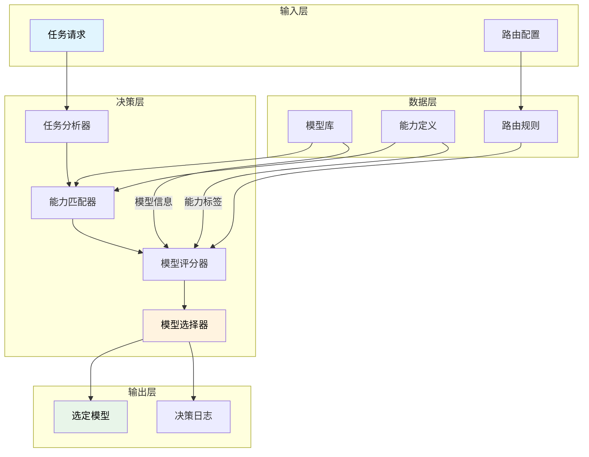
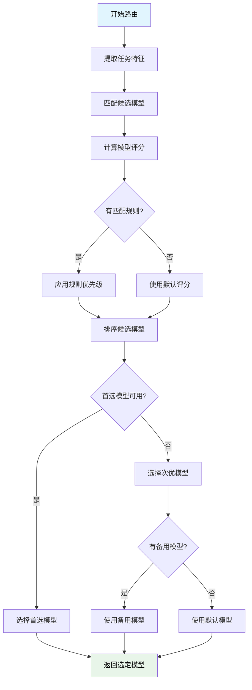
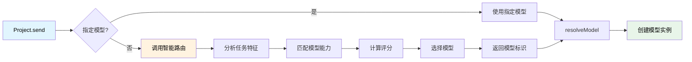

# 智能路由系统设计文档

> 基于模型能力和场景需求的智能模型选择与路由机制

## 目录

- [概述](#概述)
- [设计目标](#设计目标)
- [核心概念](#核心概念)
- [架构设计](#架构设计)
- [配置格式](#配置格式)
- [路由算法](#路由算法)
- [实现细节](#实现细节)
- [使用示例](#使用示例)
- [扩展机制](#扩展机制)

---

## 概述

智能路由系统是 Neovate Code 的核心组件之一，负责根据任务特征和模型能力自动选择最合适的 AI 模型。该系统通过分析任务需求（如上下文长度、处理速度、推理能力等）与模型能力（capabilities）的匹配度，实现智能化的模型路由。

### 解决的问题

1. **模型选择复杂性**: 开发者无需手动选择模型，系统根据任务特征自动选择
2. **资源优化**: 避免在简单任务上使用高性能但昂贵的模型
3. **性能平衡**: 在成本、速度和质量之间找到最佳平衡点
4. **可扩展性**: 支持自定义路由规则和模型能力定义

---

## 设计目标

### 核心目标

1. ✅ **自动化**: 根据任务特征自动选择最佳模型
2. ✅ **可配置**: 支持灵活的路由规则配置
3. ✅ **可扩展**: 易于添加新的路由策略和模型能力
4. ✅ **高性能**: 路由决策快速且准确
5. ✅ **透明性**: 路由决策过程可追踪和调试

### 非功能性需求

- **低延迟**: 路由决策应在毫秒级完成
- **高可用**: 路由系统不应成为性能瓶颈
- **向后兼容**: 与现有模型配置和使用方式兼容
- **易于调试**: 提供详细的路由决策日志

---

## 核心概念

### 1. 模型能力 (Model Capabilities)

模型能力是描述模型特性的标签，用于路由决策。已在 `Model` 接口中定义：

```typescript
export type ModelCapability =
  | 'fast'           // 快速响应
  | 'reasoning'      // 推理能力
  | 'coding'         // 编程能力
  | 'chat'          // 对话能力
  | 'creative'       // 创造性任务
  | 'precise'        // 精确性任务
  | 'long_context'   // 长上下文处理
  | 'multimodal'     // 多模态处理
  | 'low_cost'       // 低成本
  | 'high_performance'; // 高性能
```

### 2. 任务特征 (Task Characteristics)

任务特征是描述待处理任务需求的属性：

- **上下文长度**: 任务所需的上下文大小
- **处理速度**: 任务对响应时间的要求
- **准确度要求**: 任务对结果准确性的要求
- **任务类型**: 任务的性质（编码、对话、推理等）
- **成本敏感度**: 对成本的敏感程度

### 3. 路由规则 (Routing Rules)

路由规则定义在特定场景下如何选择模型：

- **场景映射**: 将任务映射到预定义场景
- **优先级排序**: 为不同场景定义模型优先级
- **条件匹配**: 基于任务特征的条件匹配规则

---

## 架构设计

### 系统架构图



### 核心组件

#### 1. 任务分析器 (TaskAnalyzer)

分析输入任务，提取特征：
- 上下文长度分析
- 任务类型识别
- 性能要求评估

#### 2. 能力匹配器 (CapabilityMatcher)

匹配任务需求与模型能力：
- 能力标签匹配
- 上下文长度验证
- 模型可用性检查

#### 3. 模型评分器 (ModelScorer)

为候选模型打分：
- 基于能力匹配度评分
- 考虑成本因素
- 考虑性能因素
- 考虑配置规则

#### 4. 模型选择器 (ModelSelector)

选择最终模型：
- 根据评分排序
- 应用路由规则
- 处理异常情况

---

## 配置格式

### 路由配置结构

路由配置支持两种定义方式：全局默认规则和场景特定规则。

```json
{
  "Router": {
    "default": "provider/model",
    "rules": [
      {
        "name": "场景名称",
        "condition": {
          "taskType": "任务类型",
          "contextLength": "上下文长度条件",
          "requiredCapabilities": ["必需能力"],
          "preferredCapabilities": ["优先能力"]
        },
        "models": [
          {
            "model": "provider/model",
            "priority": 1,
            "weight": 1.0
          }
        ],
        "fallback": "备用模型"
      }
    ]
  }
}
```

### 配置示例

基于 `config.jsonl` 的路由配置示例：

```json
{
  "Router": {
    "default": "deepseek,deepseek-chat",
    "rules": [
      {
        "name": "推理任务",
        "condition": {
          "requiredCapabilities": ["reasoning"],
          "preferredCapabilities": ["high_performance"]
        },
        "models": [
          { "model": "deepseek,deepseek-reasoner", "priority": 1 },
          { "model": "openrouter,anthropic/claude-3.7-sonnet:thinking", "priority": 2 }
        ],
        "fallback": "deepseek,deepseek-chat"
      },
      {
        "name": "编码任务",
        "condition": {
          "taskType": "coding",
          "requiredCapabilities": ["coding"],
          "preferredCapabilities": ["precise"]
        },
        "models": [
          { "model": "modelscope,Qwen/Qwen3-Coder-480B-A35B-Instruct", "priority": 1 },
          { "model": "dashscope,qwen3-coder-plus", "priority": 2 }
        ],
        "fallback": "deepseek,deepseek-chat"
      },
      {
        "name": "长上下文任务",
        "condition": {
          "contextLength": { "min": 50000 },
          "requiredCapabilities": ["long_context"]
        },
        "models": [
          { "model": "openrouter,google/gemini-2.5-pro-preview", "priority": 1 }
        ],
        "fallback": "deepseek,deepseek-chat"
      },
      {
        "name": "快速响应任务",
        "condition": {
          "requiredCapabilities": ["fast", "low_cost"],
          "preferredCapabilities": ["chat"]
        },
        "models": [
          { "model": "gemini,gemini-2.5-flash", "priority": 1 },
          { "model": "ollama,qwen2.5-coder:latest", "priority": 2 }
        ],
        "fallback": "deepseek,deepseek-chat"
      }
    ]
  }
}
```

### 兼容现有配置

为了保持向后兼容，系统也支持简化的路由配置：

```json
{
  "Router": {
    "default": "deepseek,deepseek-chat",
    "think": "deepseek,deepseek-reasoner",
    "longContext": "openrouter,google/gemini-2.5-pro-preview",
    "longContextThreshold": 60000,
    "webSearch": "gemini,gemini-2.5-flash"
  }
}
```

---

## 路由算法

### 1. 任务特征提取

```typescript
interface TaskFeatures {
  contextLength: number;
  taskType: 'coding' | 'chat' | 'reasoning' | 'creative' | 'analysis';
  speedRequirement: 'low' | 'medium' | 'high';
  accuracyRequirement: 'low' | 'medium' | 'high';
  costSensitivity: 'low' | 'medium' | 'high';
  requiredCapabilities: ModelCapability[];
  preferredCapabilities: ModelCapability[];
}
```

### 2. 模型匹配评分

评分算法考虑以下因素：

1. **能力匹配度** (40%权重)
   - 必需能力匹配：+10分/项
   - 优先能力匹配：+5分/项
   - 缺少必需能力：-20分/项

2. **性能匹配度** (30%权重)
   - 上下文长度满足：+10分
   - 响应速度匹配：+5分
   - 处理能力匹配：+5分

3. **成本效益** (20%权重)
   - 低成本优先：+5分
   - 性价比高：+5分

4. **配置优先级** (10%权重)
   - 规则优先级：+10分/级别
   - 模型权重：动态调整

### 3. 模型选择策略



---

## 实现细节

### 核心接口定义

```typescript
interface RoutingRule {
  name: string;
  condition: {
    taskType?: string;
    contextLength?: { min?: number; max?: number };
    requiredCapabilities?: ModelCapability[];
    preferredCapabilities?: ModelCapability[];
  };
  models: Array<{
    model: string;
    priority: number;
    weight?: number;
  }>;
  fallback?: string;
}

interface RouterConfig {
  default: string;
  rules?: RoutingRule[];
  // 兼容旧配置
  [key: string]: any;
}

interface SmartRouter {
  route(task: TaskRequest, context: Context): Promise<string>;
  addRule(rule: RoutingRule): void;
  removeRule(name: string): void;
  setDefault(model: string): void;
  getDecisionLog(): RoutingDecision[];
}

interface RoutingDecision {
  taskId: string;
  taskFeatures: TaskFeatures;
  candidateModels: Array<{
    model: string;
    score: number;
    matchedCapabilities: ModelCapability[];
  }>;
  selectedModel: string;
  reason: string;
  timestamp: Date;
}
```

### 路由决策流程

```typescript
async function route(task: TaskRequest, context: Context): Promise<string> {
  // 1. 提取任务特征
  const features = extractTaskFeatures(task);
  
  // 2. 获取可用模型
  const availableModels = await getAvailableModels(context);
  
  // 3. 匹配路由规则
  const matchedRules = matchRules(features, routerConfig.rules);
  
  // 4. 计算模型评分
  const scoredModels = scoreModels(
    availableModels, 
    features, 
    matchedRules
  );
  
  // 5. 选择最佳模型
  const selectedModel = selectBestModel(scoredModels, routerConfig);
  
  // 6. 记录决策
  logDecision({
    taskId: task.id,
    taskFeatures: features,
    candidateModels: scoredModels,
    selectedModel,
    reason: getSelectionReason(scoredModels, selectedModel)
  });
  
  return selectedModel;
}
```

### 集成到现有架构

智能路由系统将集成到模型解析流程中：



---

## 使用示例

### 1. 基本使用

```typescript
// 在项目中使用智能路由
const project = new Project(context);

// 不指定模型，使用智能路由
const response = await project.send({
  role: 'user',
  content: '帮我写一个快速排序算法'
});

// 系统会自动选择适合编码任务的模型
```

### 2. 自定义任务特征

```typescript
// 明确指定任务特征
const response = await project.send({
  role: 'user',
  content: '分析这段代码的性能瓶颈'
}, {
  taskType: 'analysis',
  requiredCapabilities: ['reasoning', 'coding'],
  preferredCapabilities: ['precise']
});
```

### 3. 配置文件使用

在 `config.jsonl` 中配置路由规则：

```json
{
  "Router": {
    "default": "deepseek,deepseek-chat",
    "rules": [
      {
        "name": "代码审查",
        "condition": {
          "taskType": "coding",
          "requiredCapabilities": ["coding", "precise"]
        },
        "models": [
          { "model": "modelscope,Qwen/Qwen3-Coder-480B-A35B-Instruct", "priority": 1 }
        ]
      }
    ]
  }
}
```

### 4. 插件扩展

通过插件扩展路由规则：

```typescript
// 在插件中添加路由规则
const myPlugin: Plugin = {
  name: 'my-routing-plugin',
  setup(api) {
    api.addHook('router', (router) => {
      router.addRule({
        name: '我的特殊任务',
        condition: {
          taskType: 'special',
          requiredCapabilities: ['creative']
        },
        models: [
          { model: 'openrouter,anthropic/claude-sonnet-4', priority: 1 }
        ],
        fallback: 'deepseek,deepseek-chat'
      });
      return router;
    });
  }
}
```

---

## 扩展机制

### 1. 自定义评分算法

```typescript
interface ScoringAlgorithm {
  name: string;
  calculate(
    model: ModelInfo, 
    features: TaskFeatures, 
    rule?: RoutingRule
  ): number;
}

// 注册自定义评分算法
router.registerScoringAlgorithm('my-algorithm', {
  name: 'My Custom Algorithm',
  calculate(model, features, rule) {
    // 自定义评分逻辑
    return score;
  }
});
```

### 2. 动态规则管理

```typescript
// 运行时添加规则
router.addRule({
  name: '临时规则',
  condition: {
    taskType: 'urgent',
    requiredCapabilities: ['fast']
  },
  models: [
    { model: 'gemini,gemini-2.5-flash', priority: 1 }
  ]
});

// 运行时移除规则
router.removeRule('临时规则');
```

### 3. 决策日志和监控

```typescript
// 获取路由决策日志
const decisions = router.getDecisionLog();

// 实时监控路由决策
router.on('decision', (decision) => {
  console.log(`选择模型: ${decision.selectedModel}`);
  console.log(`原因: ${decision.reason}`);
});
```

### 4. 与插件系统集成

```typescript
// 插件中扩展路由功能
const routingPlugin: Plugin = {
  name: 'advanced-routing',
  setup(api) {
    api.addHook('router', (router) => {
      // 添加新的能力标签
      router.addCapability('specialized', {
        description: '专业领域知识',
        match: (task) => task.domain === 'specialized'
      });
      
      // 添加新的评分因子
      router.addScoringFactor('domainExpertise', 0.15);
      
      return router;
    });
  }
}
```

---

## 性能优化

### 1. 缓存机制

- 缓存模型能力信息
- 缓存路由决策结果
- 缓存评分计算结果

### 2. 预计算

- 预计算模型评分
- 预匹配常用规则
- 预加载模型信息

### 3. 异步处理

- 异步加载模型信息
- 并行计算多个模型评分
- 异步更新缓存

---

## 测试策略

### 1. 单元测试

```typescript
// 测试能力匹配
it('should match required capabilities', () => {
  const model = { capabilities: ['coding', 'precise'] };
  const features = { requiredCapabilities: ['coding'] };
  expect(matchCapabilities(model, features)).toBe(true);
});

// 测试评分算法
it('should calculate correct score', () => {
  const score = calculateScore(model, features, rule);
  expect(score).toBeGreaterThan(80);
});
```

### 2. 集成测试

```typescript
// 测试完整路由流程
it('should route to correct model for coding task', async () => {
  const model = await router.route({
    content: 'Write a function to sort array',
    taskType: 'coding'
  }, context);
  
  expect(model).toContain('coder');
});
```

### 3. 性能测试

- 路由决策时间 < 10ms
- 内存占用 < 1MB
- 支持 1000+ 并发路由请求

---

## 相关文档

- [模型架构](./model-provider-architecture.md)
- [配置管理](./config.md)
- [插件系统](./plugin.md)

---

## 总结

智能路由系统通过以下方式提升 Neovate Code 的智能化水平：

1. ✅ **自动化模型选择** - 减少开发者负担
2. ✅ **资源优化配置** - 降低使用成本
3. ✅ **性能动态调优** - 提升处理效率
4. ✅ **灵活可扩展** - 支持自定义规则
5. ✅ **决策透明可追溯** - 便于调试优化

该系统与现有架构无缝集成，保持向后兼容的同时提供了强大的智能化能力。
