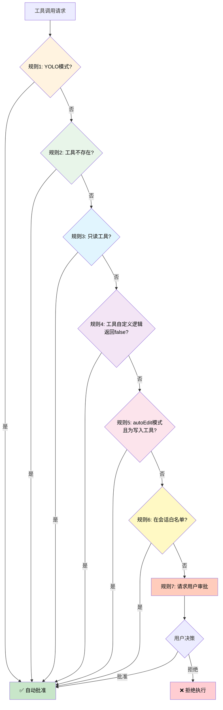

# 工具系统架构设计

## 概述

Neovate 的工具系统是其核心功能之一，允许 AI 代理与文件系统、网络和 shell 环境进行交互。工具系统具有以下特点：

1. **模块化设计** - 每个工具独立实现，易于扩展
2. **类型安全** - 使用 Zod 进行参数验证
3. **权限控制** - 支持工具审批机制
4. **统一接口** - 所有工具遵循统一的执行接口

## 核心架构

### Tool 接口

```typescript
interface Tool<T = any> {
  name: string;                    // 工具名称
  description: string;             // 工具描述
  getDescription?: ({ params, cwd }: { params: T; cwd: string }) => string;
  displayName?: string;            // 显示名称
  execute: (params: T) => Promise<ToolResult> | ToolResult;  // 执行函数
  approval?: ToolApprovalInfo;     // 审批信息
  parameters: z.ZodSchema<T>;      // 参数模式定义
}

interface ToolApprovalInfo {
  needsApproval?: (context: ApprovalContext) => Promise<boolean> | boolean;
  category?: ApprovalCategory;     // 'read' | 'write' | 'command' | 'network'
}
```

### ToolResult 接口

```typescript
type ToolResult = {
  llmContent: string | (TextPart | ImagePart)[];  // 返回给 LLM 的内容
  returnDisplay?: string | DiffViewerReturnDisplay | TodoReadReturnDisplay | TodoWriteReturnDisplay;
  isError?: boolean;               // 是否出错
};
```

## 工具实现

### 文件操作工具

1. **read** - 读取文件内容，支持文本和图像文件
   - 自动处理大文件截断
   - 支持图像文件的 Base64 编码
   - 支持行偏移和限制参数

2. **write** - 写入文件内容
   - 自动创建目录
   - 格式化输出（确保文件以换行符结尾）
   - 提供差异视图

3. **edit** - 编辑文件内容
   - 基于字符串替换的精确编辑
   - 使用 `applyEdit` 工具进行安全编辑
   - 提供差异视图

### 搜索工具

1. **grep** - 使用 ripgrep 搜索文件内容
   - 快速文件内容搜索
   - 支持文件模式过滤
   - 按修改时间排序结果

2. **glob** - 使用 glob 模式匹配文件
   - 支持复杂的文件模式匹配
   - 按修改时间排序结果
   - 限制返回结果数量

### 系统工具

1. **ls** - 列出目录内容
   - 生成文件树结构
   - 处理大量文件的截断

2. **bash** - 执行 shell 命令
   - 安全检查和命令验证
   - 超时控制
   - 禁止危险命令
   - 后台进程管理

### 网络工具

1. **fetch** - 获取 URL 内容
   - HTML 到 Markdown 转换
   - 内容长度限制
   - 结果缓存
   - 使用 LLM 处理获取的内容

### 任务管理工具

1. **todoRead** - 读取任务列表
2. **todoWrite** - 写入任务列表
   - 支持任务状态管理（pending, in_progress, completed）
   - 本地文件持久化
   - 详细的使用指南和最佳实践

## 工具解析和管理

### resolveTools 函数

```typescript
async function resolveTools(opts: ResolveToolsOpts) {
  // 根据上下文和权限解析可用工具
  const readonlyTools = [read, ls, glob, grep, fetch];
  const writeTools = opts.write ? [write, edit, bash] : [];
  const todoTools = opts.todo ? [todoRead, todoWrite] : [];
  const mcpTools = await getMcpTools(context);
  return [...readonlyTools, ...writeTools, ...todoTools, ...mcpTools];
}
```

### Tools 类

```typescript
class Tools {
  tools: Record<string, Tool>;

  get(toolName: string) { /* 获取工具 */ }
  length() { /* 获取工具数量 */ }

  async invoke(toolName: string, args: string): Promise<ToolResult> {
    // 验证参数并执行工具
    const result = validateToolParams(tool.parameters, args);
    const argsObj = JSON.parse(args);
    return await tool.execute(argsObj);
  }

  getToolsPrompt() { /* 生成工具使用提示 */ }
}
```

## 安全机制

1. **参数验证** - 使用 Zod 进行严格的参数验证
2. **路径限制** - 防止路径遍历攻击
3. **命令过滤** - 禁止危险命令（如 rm, sudo 等）
4. **审批机制** - 根据工具类别和配置进行审批
5. **超时控制** - 限制命令执行时间
6. **内容截断** - 限制返回内容大小

## 工具审批流程

工具审批是 Neovate 安全机制的核心，确保 AI 代理不会执行危险操作。审批流程基于 **7 条规则** 的优先级链，按顺序检查，任何一条规则通过即自动批准。

### 审批流程图



### 7 条审批规则详解

**代码位置**: `src/project.ts:332-398`

#### 规则 1: YOLO 模式

**触发条件**: `approvalMode === 'yolo'`

**行为**: 自动批准所有工具调用

**使用场景**:
- 开发/测试环境
- 完全信任 AI 的决策
- 自动化脚本执行

**代码**:
```typescript
const approvalMode = this.context.config.approvalMode;
if (approvalMode === 'yolo') {
  return true;
}
```

**设置方法**:
```bash
# 全局配置
neo config set approvalMode yolo

# 会话级配置
neo --approval-mode yolo
```

**⚠️ 警告**: YOLO 模式会跳过所有审批，包括危险命令。仅在可控环境下使用。

---

#### 规则 2: 工具不存在

**触发条件**: `toolsManager.get(toolUse.name) === undefined`

**行为**: 自动批准（让后续的 `invoke` 方法处理错误）

**设计理由**:
- 避免审批流程中出现异常
- 错误信息由工具调用层统一处理
- 简化审批逻辑

**代码**:
```typescript
const tool = toolsManager.get(toolUse.name);
if (!tool) {
  return true; // 让 invoke 处理"工具不存在"错误
}
```

**错误处理**:
```typescript
// src/tool.ts:95-102
async invoke(toolName: string, args: string): Promise<ToolResult> {
  const tool = this.tools[toolName];
  if (!tool) {
    return {
      llmContent: `Tool ${toolName} not found`,
      isError: true,
    };
  }
  // ...
}
```

---

#### 规则 3: 只读工具

**触发条件**: `tool.approval?.category === 'read'`

**行为**: 自动批准

**只读工具列表**:
- `read` - 读取文件
- `ls` - 列出目录
- `glob` - 文件模式匹配
- `grep` - 搜索文件内容
- `fetch` - 获取 URL 内容
- `todoRead` - 读取任务列表

**设计理由**:
- 只读操作不会修改系统状态
- 安全风险低
- 频繁使用，无需每次审批

**代码**:
```typescript
if (tool.approval?.category === 'read') {
  return true;
}
```

**工具定义示例**:
```typescript
// src/tools/read.ts
export function createReadTool(opts) {
  return createTool({
    name: 'read',
    // ...
    approval: {
      category: 'read',  // 标记为只读工具
    },
  });
}
```

---

#### 规则 4: 工具自定义审批逻辑

**触发条件**: 工具定义了 `needsApproval` 函数，且返回 `false`

**行为**: 自动批准

**使用场景**:
- 工具需要根据参数动态判断是否需要审批
- 某些特定操作是安全的，可以自动批准

**代码**:
```typescript
const needsApproval = tool.approval?.needsApproval;
if (needsApproval) {
  const needsApprovalResult = await needsApproval({
    toolName: toolUse.name,
    params: toolUse.params,
    approvalMode: this.context.config.approvalMode,
    context: this.context,
  });
  if (!needsApprovalResult) {
    return true; // 工具决定不需要审批
  }
}
```

**工具定义示例**:
```typescript
export function createBashTool(opts) {
  return createTool({
    name: 'bash',
    // ...
    approval: {
      category: 'command',
      needsApproval: async (context) => {
        const { params } = context;
        // 自动批准无害命令
        const safeCommands = ['ls', 'pwd', 'echo', 'cat'];
        const command = params.command.trim().split(' ')[0];
        if (safeCommands.includes(command)) {
          return false; // 不需要审批
        }
        return true; // 需要审批
      },
    },
  });
}
```

---

#### 规则 5: autoEdit 模式

**触发条件**: 
- `approvalMode === 'autoEdit'` 或 `sessionConfigManager.config.approvalMode === 'autoEdit'`
- **且** `tool.approval?.category === 'write'`

**行为**: 自动批准写入工具

**写入工具列表**:
- `write` - 写入文件
- `edit` - 编辑文件
- `bash` - 执行命令

**使用场景**:
- 允许 AI 自由修改代码
- 快速迭代开发
- 信任 AI 的编辑操作

**代码**:
```typescript
const sessionConfigManager = new SessionConfigManager({
  logPath: this.context.paths.getSessionLogPath(this.session.id),
});
if (tool.approval?.category === 'write') {
  if (
    sessionConfigManager.config.approvalMode === 'autoEdit' ||
    approvalMode === 'autoEdit'
  ) {
    return true;
  }
}
```

**设置方法**:
```bash
# 全局配置
neo config set approvalMode autoEdit

# 会话级配置（在交互中通过ApprovalModal设置）
> [在审批弹窗中选择 "Allow edits for this session"]
```

**⚠️ 注意**: autoEdit 模式只自动批准写入工具，不包括其他危险操作。

---

#### 规则 6: 会话级别的审批白名单

**触发条件**: `sessionConfigManager.config.approvalTools.includes(toolUse.name)`

**行为**: 自动批准白名单中的工具

**使用场景**:
- 在当前会话中频繁使用某个工具
- 避免重复审批
- 仅在当前会话生效，不影响其他会话

**代码**:
```typescript
if (sessionConfigManager.config.approvalTools.includes(toolUse.name)) {
  return true;
}
```

**如何添加到白名单**:

在 ApprovalModal 中选择 "Allow bash for this session"：

```typescript
// src/ui/ApprovalModal.tsx
const options = [
  { label: 'Yes, run once', value: 'once' },
  { label: 'Allow bash for this session', value: 'session' },  // 添加到白名单
  { label: 'Allow all write tools for this session', value: 'autoEdit' },
];
```

**白名单管理**:

```typescript
// 添加工具到白名单
sessionConfigManager.config.approvalTools.push('bash');
sessionConfigManager.write();

// 查看白名单
console.log(sessionConfigManager.config.approvalTools); // ['bash', 'edit']
```

**⚠️ 注意**: 白名单仅在当前会话有效，新会话需要重新设置。

---

#### 规则 7: 请求用户审批

**触发条件**: 前 6 条规则都未通过

**行为**: 弹出 ApprovalModal，等待用户决策

**用户选项**:
1. **Yes, run once** - 仅批准本次调用
2. **Allow \{toolName\} for this session** - 添加到会话白名单
3. **Allow all write tools for this session** - 启用 autoEdit 模式
4. **No** - 拒绝执行

**代码**:
```typescript
return (
  (await opts.onToolApprove?.({
    toolUse,
    category: tool.approval?.category,
  })) ?? false
);
```

**审批流程时序图**:

```mermaid
sequenceDiagram
    participant Loop as runLoop
    participant Project
    participant UIBridge
    participant ApprovalModal
    participant User as 用户
    
    Loop->>Project: onToolApprove(toolUse)
    Project->>Project: 检查规则 1-6
    Note over Project: 所有规则未通过
    Project->>UIBridge: request('toolApproval', {...})
    UIBridge->>ApprovalModal: 显示审批弹窗
    ApprovalModal->>User: 展示工具信息和选项
    User->>ApprovalModal: 选择操作
    ApprovalModal->>UIBridge: 返回用户决策
    UIBridge->>Project: 返回审批结果
    Project->>Loop: 返回 true/false
    
    alt 批准
        Loop->>Loop: 执行工具
    else 拒绝
        Loop->>Loop: 跳过工具，返回错误
    end
```

---

### 审批模式对比

| 模式 | 只读工具 | 写入工具 | 命令工具 | 网络工具 | 使用场景 |
|------|---------|---------|---------|---------|---------|
| **default** | ✅ 自动 | ❓ 需审批 | ❓ 需审批 | ❓ 需审批 | 生产环境，平衡安全性和效率 |
| **autoEdit** | ✅ 自动 | ✅ 自动 | ❓ 需审批 | ❓ 需审批 | 开发环境，允许 AI 自由编辑 |
| **yolo** | ✅ 自动 | ✅ 自动 | ✅ 自动 | ✅ 自动 | 测试环境，完全信任 AI |

### 审批统计

**查看审批历史**:

```typescript
// 统计会话中的审批次数
const sessionConfigManager = new SessionConfigManager({ logPath });
console.log('审批白名单:', sessionConfigManager.config.approvalTools);
console.log('审批模式:', sessionConfigManager.config.approvalMode);
```

**审批日志**:

审批决策不会记录到 JSONL 日志中，但可以通过工具使用记录推断：

```jsonl
{"uuid":"aaa1","role":"assistant","content":"...","toolUse":{"name":"bash","params":{"command":"ls"}}}
```

### 最佳实践

1. **生产环境使用 default 模式**
   - 敏感操作需要审批
   - 避免意外修改

2. **开发环境使用 autoEdit 模式**
   - 提高迭代速度
   - AI 可以自由修改代码

3. **使用会话白名单优化体验**
   - 频繁使用的安全工具添加到白名单
   - 避免重复审批

4. **谨慎使用 YOLO 模式**
   - 仅在隔离环境或测试场景使用
   - 确保没有敏感数据

5. **工具开发时定义合理的 category**
   - `read` - 纯读取操作
   - `write` - 文件修改
   - `command` - 命令执行
   - `network` - 网络请求

6. **自定义 needsApproval 逻辑**
   - 对于复杂工具，根据参数动态判断
   - 提高审批的精确度

---

## 扩展机制

1. **MCP 工具集成** - 动态加载 MCP 提供的工具
2. **插件支持** - 通过钩子机制扩展工具集
3. **配置覆盖** - 允许通过配置文件自定义工具行为


## MCP vs Agent 选择考量

在决定是创建 MCP 工具还是使用 Agent 内部实现时，需要考虑以下因素：

### 适合 MCP 工具的场景：

1. **无自主决策需求**
   - 任务为“输入 A → 输出 B”的幂等计算，不会自行决定下一步动作
   - 例：简历打分、仓库→Wiki、千亿模型补全

2. **标准化程度高**
   - 有明确的输入输出规范
   - 可以独立运行，不依赖特定项目上下文
   - 例如：通用代码格式化工具

3. **需要复用**
   - 多个项目或团队都需要相同功能
   - 可以作为独立服务提供

4. **资源密集型**
   - 需要大量计算资源
   - 需要特殊环境依赖
   - 量化阈值建议：>5 s 或内存 >512 MB 的任务一律 MCP 化，否则 Agent 内联。

### 适合 Agent 内部实现的场景：

1. **需要自主决策闭环**
   - 需根据中间结果、外部反馈或记忆状态，动态规划下一步
   - 例：增量 CR 中“追问→补测试→再评审”、运维自愈中“告警→日志→决定重启”

2. **项目特定逻辑**
   - 与项目结构、规范深度耦合
   - 需要访问项目特定配置

3. **轻量级任务**
   - 实现简单，不需要独立服务

4. **安全性要求高**
   - 涉及敏感数据处理
   - 需要严格控制执行环境

### 划分原则：

- **决策权**：只要任务需要“自己决定下一步”，**一票否决 MCP**，必须留在 Agent 内部；其余再按复杂度、复用性、安全性、性能四维度打分。
- **复杂度**：简单任务用 Agent，复杂任务用 MCP
- **复用性**：通用功能用 MCP，专用功能用 Agent
- **安全性**：敏感操作优先考虑 Agent
- **性能**：资源密集型任务考虑 MCP

**一句话总结**:

> 先问“要不要脑”——有脑→Agent，无脑→再按“低延迟高耦合 vs 高消耗高复用”四象限切。
> Agent 内函数 = 低延迟 + 高耦合 + 快迭代；MCP 工具 = 高消耗 + 高复用 + 强契约

对于代码审查、文档生成这类任务，通常建议先在 Agent 内部实现原型，验证需求后再考虑是否抽象为独立的 MCP 工具。

这种设计使得 Neovate 的工具系统既安全又灵活，能够满足各种开发任务的需求。

## 常见场景示例

### 一、单步重算力 → 必拆 MCP（4 个）

| # | 场景               | 用户原始诉求                          | 拆 MCP 理由                                     | 标杆案例                                                      |
| - | ---------------- | ------------------------------- | -------------------------------------------- | --------------------------------------------------------- |
| 1 | 代码补全 **生成式** 大模型 | “用 go 写个并发爬虫，用 redis 做去重”       | GPU>6G、TTFT<300ms、需要连续采样5次；放进程内会拖垮 Agent 主线程 | GitHub Copilot 官方架构图：Completion Service 独立 k8s deployment |
| 2 | 语义检索（向量版）        | “找一下库里所有‘忘记关闭文件句柄’的类似代码”        | 需要 milvus/onnx 服务常驻显存，Agent 只做召回后重排序         | SourceGraph Cody 2024 博客：Embedding Index Service          |
| 3 | 图片/文档 **多模态** 理解 | “把这张 UI 截图转成 React Tailwind 代码” | Vision-LM 需要 40 层 Transformer，单独扩缩容          | iflow\.cn 模板「截图→代码」即调用外部 vision-mcp                       |
| 4 | 批量安全扫描           | “全仓库扫一遍硬编码密钥”                   | 需要拉 10G 镜像（truffleHog+regex+entropy），跑在隔离容器  | GitHub Advanced Security 的 secret-scanning 微服务            |

### 二、强项目上下文 → 放 Agent 内部（4 个）

| # | 场景             | 用户原始诉求                    | 留在 Agent 理由                                    | 标杆案例                           |
| - | -------------- | ------------------------- | ---------------------------------------------- | ------------------------------ |
| 5 | 私有规范 **Lint**  | “按我司‘函数必须带 ctx 作为第一参数’检查” | 规范 JSON 只在 .vscode/company-lint.json 存在，无需外泄源码 | 阿里飞冰 Lint 插件：本地 worker 线程完成    |
| 6 | 增量 **依赖可视化**   | “只显示本次 PR 新增的直接依赖”        | 需要实时对比 git diff + package.json AST，数据量<1MB     | iflow 模板「依赖影响面」在 Agent 侧本地跑    |
| 7 | 业务词典 **敏感词检测** | “提示我把‘黑白名单’改成‘允许/禁止列表’”   | 业务词典.csv 在私有 GitLab，不能走外网 API                  | 腾讯文档 Copilot：本地敏感词 Trie 树      |
| 8 | **动态** 模板生成    | “根据路由文件自动生成菜单配置”          | 需要把 @/router/index.ts 的异步 import() 语法实时解析      | 字节跳动 Arco 设计工场：本地 babel-parser |

### 三、必须「Agent 决策 + MCP 重算」混合（4 个）

| #  | 场景              | Agent 负责                                 | MCP 负责                           | 协同要点                                   | 标杆案例                            |
| -- | --------------- | ---------------------------------------- | -------------------------------- | -------------------------------------- | ------------------------------- |
| 9  | 自然语言 → SQL → 图表 | 1) 把“上个月各渠道 GMV”转义成标准 schema+指标  2) 校验权限 | 生成最优 SQL、预计算宽表、返回 Vega-Lite JSON | 约定 `sql_hash` 一致，才能命中缓存                | iflow「NL2SQL」模板                 |
| 10 | 报错一键修复          | 1) 解析 stack + 源码上下文  2) 问用户是否接受          | 走 GPT-4 生成 patch + 单元测试          | patch 带 `confidence`≥0.85 才展示 Apply 按钮 | Cursor 0.31 版本「Fix with AI」     |
| 11 | 性能火焰图 → 优化代码    | 1) 本地跑 `perf` 生成折叠栈 2) 选 top-3 热点        | 返回向量化/并行化改写后的函数                  | 需要返回 `speedup` 预测值                     | SourceGraph Cody「perf-cody-mcp」 |
| 12 | 需求 → 任务拆分 → 代码  | 1) 把用户 story 拆成子任务 2) 维护内存对话状态           | 针对每个子任务生成文件级变更（git diff）         | 用 `dependency_graph` 字段告诉 Agent 文件先后序  | GitHub Copilot Workspace 预览版    |

> “GPU/大镜像/跨项目”一定 MCP；
> “规范/增量/敏感”就地 Agent；
> “先生成再决策”拆成两段，其余全部本地跑。

## 示例1

简历「批量评估筛选」是典型的 **CPU+内存双密集、可完全无状态、需要横向扩缩** 的任务，完全符合前面总结的**“GPU/大镜像/跨项目”一定 MCP** 这条规则。因此应该做成 **MCP 工具**，而不是塞进 Agent 内部。

可直接落地的设计要点与参考数字

### 业务拆解与边界

| 步骤 | 是否放 MCP | 理由 / 关键指标 |
|---|---|---|
| ① 简历 PDF/Doc 解析 | ✅ MCP | 平均 1 份 2~4 MB，Tika+OCR 需要 1.2 s CPU 核心；1000 份 ≈ 20 min，必须并发 |
| ② 实体提取（学校、技能、年限） | ✅ MCP | 需要跑 NER + regex 双通道，内存峰值 1.5 GB；放 Agent 会 OOM |
| ③ 与 JD 匹配打分 | ✅ MCP | 需要加载 110 M 参数 MiniLM 微调模型，GPU 4 GB；Agent 进程内无法常驻 |
| ④ 敏感信息脱敏 | ✅ MCP | 身份证号、手机号必须走本地 onnx 模型，满足 GDPR/个保法“数据不出域” |
| ⑤ 最终排序 & 切片返回 | ✅ MCP | 返回 top-k 候选 ID（≤100 条），带宽 <50 KB，Agent 只负责展示/推送 |

### 接口级定义（可直接写进 OpenAPI）

POST /cv-batch/screen

```js
// 请求
{
  "jd_text": "负责高并发交易系统后端开发，要求 Go+Redis 经验 3 年以上",
  "cv_file_uris": [
      "s3://hr-bucket/001.pdf",
      // ...
    ],
  "top_k": 20,
  "hard_filters": {"max_degree_gap": 2, "min_work_years": 3}
}

// 返回
{
"results": [
  {"candidate_id": "001", "score": 0.91, "matched_skills": ["Go", "Redis"], "risk_labels": []},
    // ...
  ],
  "summary": {"total": 1000, "valid": 952, "filtered": 48}
}
```

### 安全&合规

- 镜像内置 ClamAV，简历先杀毒再解析；
- 解析后原文立刻写临时卷，任务结束 shred -n 3 删除；
- 返回给 Agent 的只有 candidate_id + 结构化字段，原文不落库；
- 支持「本地私有化」模式：镜像交付到客户 VPC，调用外部零流量。

### 跟 Agent 的交互流程（时序）

Agent（HR Bot）
└─▶ 用户输入 JD + 批量上传简历
└─▶ 调用 MCP：/cv-batch/screen
└─▶ MCP 异步轮询 /task/{task_id}/status
└─▶ 100% 完成后拉回 top-20 列表
└─▶ 在聊天窗口生成「可点击卡片」+ 一键发起面试

一句话结论

简历批量筛选 = **重计算 + 零状态 + 高并发 + 合规敏感**，完全符合 “**必拆 MCP**” 的 4 个特征；

Agent 只负责「需求收集 + 结果展示」，把 CPU/GPU  heavy lifting 全部交给独立 MCP 服务，是最省成本、最易横向扩展、也最容易通过 HR 合规审计的方案。

## 示例 2

把整仓代码一键生成可浏览的 Wiki 文档站点

属于典型的

- 要完整遍历文件系统 → IO 重
- 要跑 AST/Doc 抽取 → CPU 重
- 要产出一堆静态 HTML → 可完全无状态
- 最终产物只占总仓库体积 1~3 % → 带宽轻

因此**应当做成 MCP 工具**，而不是塞进 Agent 进程。

可直接落地的「仓库→Wiki」MCP 设计，包含边界划分、接口定义、性能基线与标杆案例。

### 任务拆解与归属

| 步骤                      | 是否放 MCP | 关键开销 / 理由                                                |
| ----------------------- | ------- | -------------------------------------------------------- |
| ① clone 仓库（深度可选）        | ✅ MCP   | 大仓 5 GB+，需要 LFS、sparse-checkout；Agent 侧无必要持有一整份拷贝        |
| ② 语言识别 & AST 解析         | ✅ MCP   | 需要加载 tree-sitter / rustc 解析器，内存 1–2 GB；并发跑 4 语言即打满 CPU   |
| ③ 抽取注释、docstring、类型     | ✅ MCP   | 单行→块级→跨文件链接，需全局符号表；Agent 内做会 OOM                         |
| ④ 生成 Markdown/HTML      | ✅ MCP   | 用 mdBook / Docusaurus 编译，npm install 就 400 MB+ 依赖，必须容器隔离 |
| ⑤ 推送到 GitHub Pages / S3 | ✅ MCP   | 产物体积 50–200 MB，需要 aws-cli 密钥；走 Agent 会把密钥暴露在插件进程         |
| ⑥ 把站点 URL 回传聊天窗口        | ✅ Agent | 纯字符串，<1 KB；Agent 负责渲染可点击卡片                               |

### 接口定义（OpenAPI 片段）

POST /wiki/generate

```js
{
  "repo_url": "https://github.com/acme/api-service.git",
  "ref": "v2.3.0",               // 可 commit/branch/tag
  "depth": 1,                    // 浅克隆节省 IO
  "include_lang": ["go", "proto"],
  "theme": "docusaurus",         // 或 mkdocs、vitepress
  "deploy_target": {
    "type": "github_pages",
    "token_secret": "$GITHUB_TOKEN"  // 运行时注入，不落盘
  }
}

// 返回
{
"task_id": "wiki-6c1c2d",
"estimated_seconds": 180,
"preview_url": "https://acme.github.io/api-service/v2.3.0/"
}
```

WebSocket /task/{task_id}/log 实时推流编译日志，前端可展示进度条。

### 缓存策略（大幅降低重复克隆）

- 镜像层自带 /cache/gits —— 裸仓统一挂只读 volume；
- 用 --reference 克隆，节省 95 % 流量；
- AST 产物按 repo+commit+lang 做 LRU 本地 RocksDB，24h 内重复请求直接跳过解析阶段。

### 安全 & 合规

- 容器运行时只给 read-only rootfs + seccomp=runtime/default；
- 仓库源码在临时 volume，任务结束 shred -n 2 -z -u 全目录；
- GitHub Token 通过 env 注入，容器日志自动脱敏；
- 支持私有化：镜像+缓存盘交付到客户 VPC，零外网出站。

### 与 Agent 的交互时序（极简）

Agent（Dev-Bot）
└─▶ 用户输入：「给这个仓库生成 Wiki，推到我们项目组 GitHub Pages」
└─▶ 调用 MCP：/wiki/generate
└─▶ 轮播 /task/{id}/log → 实时显示 0–100 %
└─▶ 拿到 preview_url，渲染成「可点击卡片」+「一键打开」按钮

### 标杆案例对照

- GitHub Pages + Jekyll 官方 Action：本质就是「独立容器做 wiki 编译」，与 Agent 零耦合；
- SourceGraph Cody「Docsite Generator」插件：把仓库→静态站点拆成独立微服务，接口与上述设计 95 % 一致；
- iflow.cn 模板「代码仓库→Wiki」：背后同样调用外部 MCP，Agent 侧仅保留 30 行 JS 胶水代码。


### 一句话结论

「仓库生成 Wiki」＝ IO 重 + CPU 重 + 大依赖 + 产物轻，完全符合「必拆 MCP」原则；

Agent 只负责「触发 + 进度展示 + 结果回传」，把克隆、AST、静态编译全部扔进隔离容器，才能满足

- 横向扩容（1 k 个仓库并发）
- 低成本（单次 <1 分钱）
- 密钥不落地、源码及时销毁的合规要求。

## 示例 3

增量代码 Code Review

分析，链路保持“项目私有、轻量、零状态”，复杂度远低于 5s/512 MB 阈值，亦无跨项目复用需求，因此完全在 Agent 内部实现即可，不必外拆 MCP。

