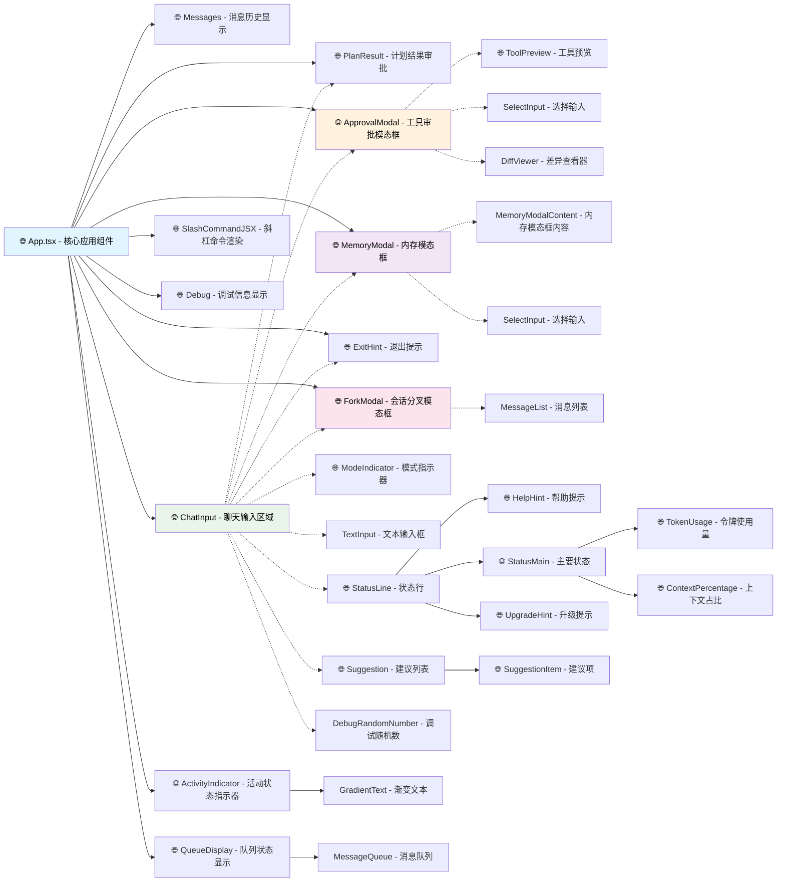

# UI 架构文档

## App.tsx - 核心 UI 组件

`App.tsx` 文件是 Neovate Code 中编排所有主要 UI 元素的核心 UI 组件。它作为终端 React 应用程序的根组件。

### 组件结构

App 组件使用 Ink 框架构建终端 UI，具有以下结构：

1. **布局**：垂直 Box 容器，堆叠所有子组件
2. **状态管理**：使用基于 Zustand 的 `useAppStore` 进行全局状态管理
3. **按键处理**：通过 useTerminalRefresh 集成终端输入处理

### 核心子组件

- `<Messages />` - 显示对话消息历史
- `<PlanResult />` - 显示和处理计划审批
- `<ActivityIndicator />` - 显示处理状态指示器
- `<QueueDisplay />` - 显示消息队列状态
- `<ChatInput />` - 用户输入区域
- `<SlashCommandJSX />` - 处理斜杠命令的 JSX 渲染
- `<ApprovalModal />` - 工具审批模态框
- `<ForkModal />` - 会话分叉模态框
- `<ExitHint />` - 退出提示
- `<Debug />` - 调试信息显示

## UI 组件交互架构图

NOTE:
- 使用emoji标识符（🌐）来标识与全局状态管理相关的组件
- 使用虚线(--)表示条件渲染的组件
- 使用点划线(-.-)表示模态框组件
- 组件按页面实际渲染顺序排列

#### Messages
渲染对话历史记录，包括用户消息、助手响应和工具结果。

#### PlanResult
显示生成的计划并处理用户审批工作流：
- 在带边框的容器中显示计划内容
- 提供是/否选择以批准计划
- 通过 store 操作处理计划批准/拒绝
- 条件渲染：仅在计划结果存在时显示

#### ActivityIndicator
在 AI 操作期间显示处理状态和进度指示器。

#### QueueDisplay
在处理过程中排队消息时显示消息队列状态。

#### ChatInput
具有高级功能的主要用户输入区域：
- 多行输入支持
- 历史导航
- 文本和图像粘贴处理
- 模式指示器（bash、内存模式）
- 斜杠命令建议
- 文件路径建议
- 条件渲染：在特定状态下隐藏（计划审批、工具审批、内存模态框、分叉模态框、退出状态）

#### SlashCommandJSX
渲染从返回 React 组件的斜杠命令中获取的 JSX 输出。

#### ApprovalModal
显示工具审批请求并处理用户对工具执行权限的响应：
- ToolPreview 子组件显示工具详情
- DiffViewer 子组件显示文件编辑差异
- 提供多种审批选项（单次、会话内、工具类型）

#### MemoryModal
处理内存管理功能，允许用户选择项目或全局内存：
- MemoryModalContent 子组件实现具体逻辑
- 选择输入组件提供内存类型选项

#### ForkModal
处理会话分叉功能，允许用户从以前的消息分支：
- 直接实现消息列表和导航逻辑
- 不包含独立的导航子组件

#### ExitHint
显示退出说明和警告。

#### Debug
启用调试模式时显示调试信息。

### 状态管理

组件与 `useAppStore` 集成，管理以下内容：

- 应用程序状态（空闲、处理中、计划中等）
- 消息历史记录和当前消息
- 模型配置和提供者
- 计划模式和 bash 模式状态
- 审批工作流
- 输入状态和历史记录
- 粘贴的文本和图像存储
- 会话和日志信息

### 关键特性

1. **计划审批工作流**：带有用户批准的交互式计划审查
2. **会话分叉**：基于模态框的会话分支界面
3. **工具审批系统**：工具执行的权限处理
4. **终端输入处理**：具有粘贴检测的高级输入处理
5. **动态组件渲染**：基于应用程序状态的条件渲染
6. **错误处理**：优雅的错误显示和恢复

### 渲染逻辑

组件使用条件渲染根据应用程序状态显示适当的 UI 元素：
- 在计划审批期间隐藏输入组件
- 在需要审批或分叉时显示模态框
- 在用户请求退出时显示退出状态
- 激活时渲染斜杠命令 JSX

这种架构提供了清晰的关注点分离，同时通过共享状态管理在组件之间保持紧密集成。
