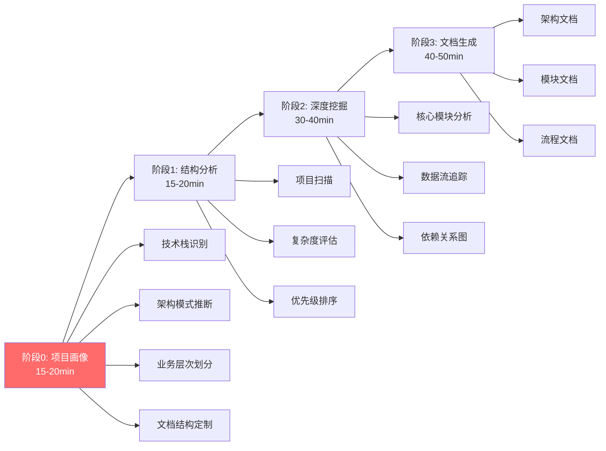

# 智能代码仓库文档自动生成方案

> 版本: v2.0
> 创建日期: 2025-10-24
> 更新日期: 2025-10-24
> 状态: 方案设计阶段 - 已增强项目画像功能

## 📢 重要更新 (v2.0)

**新增阶段0: 项目画像与上下文建立** ⭐

为了生成更贴合项目特点的文档,新增阶段0进行:
- 三层技术栈识别 (语言→框架→架构)
- 架构模式推断 (MVC/DDD/微服务等)
- 业务层次划分 (路由/API/数据模型)
- 文档结构定制 (6种项目类型模板)
- 领域知识库加载 (最佳实践/反模式)

**详细说明**: 请查看 [01-phase0-project-profile.md](./01-phase0-project-profile.md)

## 📋 方案概述

基于 Neovate Code 文档优化实践经验,设计一套**通用的、自动化的、高质量的代码仓库文档生成系统**,确保:
- ✅ 重点内容不遗漏
- ✅ 核心逻辑有架构图
- ✅ 重要流程有流程图
- ✅ 文档内容高价值
- ✅ 逻辑准确可追溯

---

## 🎯 核心设计理念

### 1. 四阶段渐进式生成 ⭐ v2.0



**关键改进**:
- ✅ 新增阶段0进行项目画像,建立完整上下文
- ✅ 根据技术栈和架构特点定制文档结构
- ✅ 整合框架最佳实践和领域知识

**阶段0详情**: 见 [01-phase0-project-profile.md](./01-phase0-project-profile.md)

### 2. 质量保证机制

- ✅ **自动检查清单** - 确保不遗漏关键内容
- ✅ **代码实证** - 所有结论都引用源码位置
- ✅ **图示优先** - 复杂逻辑必须配流程图
- ✅ **交叉验证** - 多角度验证架构理解

---

## 🎨 阶段0: 项目画像与上下文建立 (15-20分钟) ⭐ 新增

> **重要**: 阶段0 是 v2.0 的核心改进,为后续阶段提供完整的项目上下文
> **详细文档**: [01-phase0-project-profile.md](./01-phase0-project-profile.md)

### 概述

**目标**: 深度理解项目技术栈、架构模式和业务特征

**输出**:
- `wikirepo/00-project-profile.json` - 项目画像数据
- `wikirepo/00-project-profile.md` - 人类可读报告

### 核心步骤

#### Step 0.1: 技术栈深度识别

三层识别体系:
1. **语言层**: TypeScript, Python, Go, Java...
2. **框架层**: React, Next.js, NestJS, Django...
3. **架构层**: MVC, DDD, 微服务, 文件路由...

#### Step 0.2: 架构模式推断

自动识别:
- 前端: 文件路由/配置路由, Atomic Design, 状态管理模式
- 后端: 三层架构/DDD/微服务, RESTful/GraphQL
- CLI: 命令模式, 交互式 UI

#### Step 0.3: 业务层次划分

提取:
- 前端: 路由结构, 页面功能, 组件层次树
- 后端: API 端点, 数据模型, 服务调用链
- CLI: 命令树, 交互流程

#### Step 0.4: 文档结构定制

根据项目类型选择模板:
- `frontend-nextjs` - Next.js 专用 (App Router/Server Components)
- `backend-nestjs` - NestJS 专用 (模块/DI/守卫)
- `cli-tool` - CLI 工具专用 (命令树/工作流)
- `monorepo-turborepo` - Monorepo 专用 (包依赖/缓存)
- `cross-platform-taro` - 跨端专用 (多端架构/平台差异)

#### Step 0.5: 领域知识库加载

整合技术栈知识:
- 最佳实践 (如: Next.js 优先用 Server Components)
- 常见模式 (如: 数据获取模式)
- 反模式警告 (如: Server Component 中用 useState)
- 性能优化建议
- 安全考虑事项

### 价值体现

#### 改进前
```
wikirepo/
├── architecture.md         # 通用架构文档
├── modules/                # 所有模块一视同仁
└── api/                    # 简单 API 列表
```

#### 改进后
```
wikirepo/
├── 00-project-profile.json          # ⭐ 项目画像
├── architecture/
│   ├── overview.md
│   ├── app-router.md                # ⭐ Next.js 特有
│   ├── server-components.md         # ⭐ 架构特定
│   └── best-practices.md            # ⭐ 从知识库
├── pages/
│   ├── _overview.md                 # ⭐ 路由映射表
│   └── ...
└── guides/
    ├── server-vs-client.md          # ⭐ 框架特定
    └── performance.md               # ⭐ 优化建议
```

### 与后续阶段的关系

阶段0 的输出将指导:
- **阶段1**: 使用 `documentation_strategy` 选择分析重点
- **阶段2**: 基于 `business` 信息决定挖掘重点
- **阶段3**: 使用选定的文档模板和知识库内容

**完整说明**: 请查看 [01-phase0-project-profile.md](./01-phase0-project-profile.md)

---

## 📊 阶段1: 智能结构分析 (15-20分钟)

> **注意**: 阶段1 在阶段0 完成后执行,基于项目画像进行针对性分析

### 目标
快速建立项目全局认知,识别核心模块和优先级

### 执行步骤

#### Step 1.1: 项目元信息收集

```markdown
任务清单:
- [ ] 读取 package.json/pyproject.toml/go.mod 识别项目类型
- [ ] 读取 README.md 理解项目定位
- [ ] 检查 CHANGELOG.md 了解演进历史
- [ ] 分析 .gitignore 识别技术栈
- [ ] 统计代码规模 (文件数、代码行数、贡献者)
```

#### Step 1.2: 目录结构智能分析

```typescript
// 生成结构分析报告
输出格式:
{
  "项目类型": "CLI工具 / Web应用 / 库 / 框架",
  "技术栈": ["TypeScript", "React", "Node.js"],
  "核心目录": {
    "src/": "源码主目录",
    "src/commands/": "命令系统",
    "src/tools/": "工具系统"
  },
  "复杂度评分": {
    "文件数": 150,
    "代码行数": 15000,
    "目录层级": 4,
    "评级": "中等复杂度"
  }
}
```

#### Step 1.3: 核心模块识别

```markdown
基于以下规则自动识别核心模块:

优先级算法:
1. **入口文件权重 x3** (index.ts, main.ts, app.ts)
2. **被引用次数权重 x2** (import统计)
3. **代码行数权重 x1** (LOC > 300的文件)
4. **关键词匹配** (含 core/engine/manager/controller)
5. **配置文件指向** (tsconfig paths, webpack entry)

输出: Top 10 核心模块列表 + 优先级评分
```

#### Step 1.4: 复杂度评估与文档规划

```markdown
| 模块 | 文件数 | LOC | 引用数 | 复杂度 | 文档深度 |
|------|--------|-----|--------|--------|----------|
| src/loop.ts | 1 | 450 | 15 | ⭐⭐⭐⭐⭐ | 深度详解 |
| src/context.ts | 1 | 280 | 32 | ⭐⭐⭐⭐ | 核心架构 |
| src/tools/ | 25 | 3200 | 8 | ⭐⭐⭐ | 分类概览 |

文档规划:
- 深度详解 (5+ 页): 架构图 + 流程图 + 代码解析 + 示例
- 核心架构 (3页): 设计原理 + 关键代码 + 使用方式
- 分类概览 (1-2 页): 功能列表 + 典型示例
```

### 输出产物

```
wikirepo/
├── 00-analysis-report.md          # 结构分析报告
├── 00-module-priority.md          # 模块优先级列表
└── 00-documentation-plan.md       # 文档生成计划
```

---

## 🔍 阶段2: 深度模块挖掘 (30-40分钟)

### 目标
对核心模块进行深度分析,提取架构设计和关键流程

### 执行步骤

#### Step 2.1: 核心模块代码分析

针对每个高优先级模块:

```markdown
分析检查清单:

✅ 类/函数职责识别
- [ ] 导出的类/函数列表
- [ ] 每个类的职责 (单一职责原则验证)
- [ ] 公开API vs 内部实现

✅ 依赖关系分析
- [ ] 依赖了哪些模块 (import语句)
- [ ] 被哪些模块依赖 (反向搜索)
- [ ] 循环依赖检测

✅ 设计模式识别
- [ ] 使用的设计模式 (单例/工厂/观察者/桥接等)
- [ ] 为什么使用该模式
- [ ] 模式实现的关键代码

✅ 核心流程提取
- [ ] 主要方法的执行流程
- [ ] 异步调用链
- [ ] 错误处理机制
```

#### Step 2.2: 数据流追踪

```markdown
目标: 追踪关键数据在系统中的流转

方法:
1. 识别核心数据结构 (interface/type定义)
2. 追踪数据的创建点
3. 追踪数据的转换点 (mapping/transform)
4. 追踪数据的消费点

输出: 数据流图 (Mermaid Sequence Diagram)
```

#### Step 2.3: 架构模式提取

```markdown
架构分析问题清单:

1. **分层架构**
   - 是否有明确的分层? (UI/业务/数据)
   - 各层职责是什么?
   - 层间如何通信?

2. **模块化设计**
   - 模块划分原则是什么?
   - 模块间耦合度如何?
   - 是否支持插件化?

3. **关键抽象**
   - 核心接口/抽象类有哪些?
   - 抽象的目的是什么?
   - 实现类有哪些?

输出: 架构图 (Mermaid Graph)
```

#### Step 2.4: 关键流程图生成

```markdown
必须生成流程图的场景:

1. **用户操作流程** (用户视角)
   - 用户输入 → 系统处理 → 输出结果

2. **核心业务流程** (业务视角)
   - 订单创建 → 支付 → 发货 → 完成

3. **技术实现流程** (技术视角)
   - 请求接收 → 路由分发 → 业务处理 → 响应返回

流程图类型选择:
- 简单流程: Mermaid Flowchart
- 复杂交互: Mermaid Sequence Diagram
- 状态机: Mermaid State Diagram
```

### 输出产物

```
wikirepo/analysis/
├── core-modules/
│   ├── loop-analysis.md           # Loop模块深度分析
│   ├── context-analysis.md        # Context模块深度分析
│   └── ...
├── data-flow-diagrams/
│   ├── user-message-flow.mmd      # 用户消息流转
│   └── tool-execution-flow.mmd    # 工具执行流程
└── architecture-patterns.md        # 架构模式总结
```

---

## 📝 阶段3: 结构化文档生成 (40-50分钟)

### 目标
基于前两阶段分析,生成高质量、结构化的文档库

### 文档体系设计

```
wikirepo/
├── README.md                       # 文档导航首页
├── index.md                        # 项目总览
├── quick-start/
│   ├── installation.md             # 安装指南
│   ├── basic-usage.md              # 基础使用
│   └── first-example.md            # 第一个示例
├── architecture/
│   ├── overview.md                 # 架构总览 ⭐
│   ├── design-principles.md        # 设计原则
│   ├── layered-structure.md        # 分层结构
│   ├── data-flow.md                # 数据流转 ⭐
│   └── patterns.md                 # 设计模式
├── core-modules/                   # 核心模块 (按优先级排序)
│   ├── 01-loop.md                  # AI循环 ⭐⭐⭐⭐⭐
│   ├── 02-context.md               # 上下文 ⭐⭐⭐⭐
│   ├── 03-project.md               # 项目管理 ⭐⭐⭐⭐
│   └── ...
├── subsystems/                     # 子系统
│   ├── tool-system.md              # 工具系统
│   ├── plugin-system.md            # 插件系统
│   └── session-management.md       # 会话管理
├── workflows/                      # 流程文档
│   ├── user-interaction.md         # 用户交互流程
│   ├── tool-approval.md            # 工具审批流程
│   └── ai-loop.md                  # AI循环流程
├── api-reference/
│   ├── classes/                    # 类文档
│   ├── functions/                  # 函数文档
│   └── types/                      # 类型文档
├── guides/
│   ├── development.md              # 开发指南
│   ├── testing.md                  # 测试指南
│   ├── debugging.md                # 调试指南
│   └── best-practices.md           # 最佳实践
├── faq.md                          # 常见问题
└── glossary.md                     # 术语表
```

### 核心文档模板

#### 模板1: 架构文档 (architecture/overview.md)

```markdown
# 架构总览

> 本文档基于代码分析自动生成,覆盖 [模块数] 个核心模块

## 一、架构层次

[Mermaid 分层架构图]

### 各层职责

| 层级 | 职责 | 核心模块 |
|------|------|----------|
| ... | ... | ... |

## 二、核心组件

[Mermaid 组件关系图]

### 组件说明

#### 1. [组件名]
- **文件位置**: `src/xxx.ts:行号`
- **职责**: ...
- **关键设计**: ...
- **依赖关系**: ...

## 三、数据流

[Mermaid Sequence Diagram]

### 关键流程说明

1. **阶段1**: ...
2. **阶段2**: ...

## 四、设计特点

- ✅ 特点1: ...
- ✅ 特点2: ...

## 五、扩展机制

...

## 六、相关文档

- [模块1详解](../core-modules/01-xxx.md)
- [流程1说明](../workflows/xxx.md)
```

#### 模板2: 核心模块文档 (core-modules/01-loop.md)

```markdown
# [模块名] 详解

> 源码位置: [`src/loop.ts`](../src/loop.ts)
> 优先级: ⭐⭐⭐⭐⭐ (核心模块)
> 复杂度: 高 (450LOC, 被15个模块引用)

## 目录
- [概述](#概述)
- [核心职责](#核心职责)
- [设计原理](#设计原理)
- [关键流程](#关键流程)
- [代码解析](#代码解析)
- [使用示例](#使用示例)
- [常见问题](#常见问题)

---

## 概述

### 定位
[一句话说明模块定位]

### 在系统中的位置
[Mermaid 图示该模块在整体架构中的位置]

### 关键指标
- 代码行数: 450
- 导出函数: 3
- 依赖模块: 5
- 被依赖次数: 15

---

## 核心职责

1. **职责1**: ...
2. **职责2**: ...
3. **职责3**: ...

---

## 设计原理

### 为什么需要这个模块?
...

### 设计目标
- ✅ 目标1: ...
- ✅ 目标2: ...

### 使用的设计模式
[识别并说明: 单例/工厂/观察者/策略等]

---

## 关键流程

### 主流程图
[Mermaid Flowchart]

### 流程说明

#### 阶段1: [名称]
```typescript
// 关键代码片段,标注行号
// src/loop.ts:100-120
```

#### 阶段2: [名称]
...

---

## 代码解析

### 核心类/函数

#### 1. `functionName()`
**签名**:
```typescript
function functionName(params): ReturnType
```

**职责**: ...

**实现要点**:
1. 要点1: ...
2. 要点2: ...

**源码位置**: `src/loop.ts:150-200`

---

## 使用示例

### 基础用法
```typescript
// 示例代码
```

### 高级用法
```typescript
// 高级示例
```

---

## 常见问题

### Q1: [问题]?
A: ...

---

## 相关文档
- [架构总览](../architecture/overview.md)
- [相关模块](./02-context.md)
```

#### 模板3: 流程文档 (workflows/tool-approval.md)

```markdown
# [流程名称] 流程详解

> 涉及模块: `project.ts`, `tool.ts`
> 流程类型: 审批流程
> 触发场景: AI尝试调用工具时

## 一、流程概览

[Mermaid Sequence Diagram - 完整流程]

## 二、触发条件

- 条件1: ...
- 条件2: ...

## 三、详细步骤

### 步骤1: [名称]
**代码位置**: `src/project.ts:330-340`

**逻辑**:
```typescript
// 关键代码
```

**判断条件**:
- 如果 X, 则 Y
- 否则 Z

### 步骤2: [名称]
...

## 四、决策树

[Mermaid Flowchart - 决策逻辑]

## 五、特殊情况处理

### 情况1: [场景]
处理方式: ...

## 六、相关配置

| 配置项 | 默认值 | 说明 |
|--------|--------|------|
| ... | ... | ... |

## 七、示例

### 示例1: 自动通过
...

### 示例2: 需要用户审批
...
```

---

## 🤖 自动化提示词设计

### 主提示词 (Main Prompt)

```markdown
# 角色定义
你是一个专业的代码架构分析师和技术文档工程师,擅长:
- 深度理解复杂代码库的架构设计
- 识别核心模块和关键流程
- 生成结构化、高价值的技术文档

# 任务目标
为 [项目名称] 生成完整的 Wiki 文档库,确保:
1. ✅ 核心架构清晰呈现
2. ✅ 关键模块深度解析
3. ✅ 重要流程配有图示
4. ✅ 所有结论有代码实证
5. ✅ 文档逻辑正确完整

# 工作流程
按照三阶段执行:

## 阶段1: 结构分析 (20分钟)
目标: 建立项目全局认知

### 步骤1: 项目扫描
- [ ] 读取 package.json/README.md 理解项目定位
- [ ] 统计代码规模 (使用 `find` 和 `wc` 命令)
- [ ] 分析目录结构 (使用 `ls` 和 `tree` 命令)
- [ ] 识别技术栈和框架

输出文件: `wikirepo/00-analysis-report.md`

### 步骤2: 核心模块识别
使用以下规则自动评分:
```
模块优先级 = 入口文件权重×3 + 被引用次数×2 + 代码行数×1 + 关键词匹配
```

- [ ] 扫描 src/ 目录找出所有 .ts/.js 文件
- [ ] 统计每个文件的被import次数 (使用 `grep` 命令)
- [ ] 计算每个文件的代码行数
- [ ] 按优先级排序,选出Top 10

输出文件: `wikirepo/00-module-priority.md`

### 步骤3: 文档规划
根据复杂度制定文档深度:
- 复杂度 ⭐⭐⭐⭐⭐: 生成 5+ 页深度文档
- 复杂度 ⭐⭐⭐⭐: 生成 3 页核心文档
- 复杂度 ⭐⭐⭐: 生成 1-2 页概览文档

输出文件: `wikirepo/00-documentation-plan.md`

---

## 阶段2: 深度挖掘 (40分钟)
目标: 对核心模块进行深度分析

对于每个高优先级模块,执行:

### 步骤1: 代码分析
- [ ] 读取模块源码 (使用 Read 工具)
- [ ] 识别导出的类/函数/接口
- [ ] 分析依赖关系 (import 语句)
- [ ] 识别设计模式

### 步骤2: 流程提取
- [ ] 找到核心方法 (通常是 public 方法或 exported 函数)
- [ ] 追踪方法调用链 (使用 Grep 工具搜索调用点)
- [ ] 识别异步流程 (async/await, Promise)
- [ ] 绘制流程图 (Mermaid Sequence Diagram)

### 步骤3: 架构理解
- [ ] 该模块在整体架构中的位置
- [ ] 与其他模块的交互方式
- [ ] 使用的架构模式 (分层/事件驱动/插件化等)
- [ ] 绘制架构图 (Mermaid Graph)

输出文件: `wikirepo/analysis/[模块名]-analysis.md`

---

## 阶段3: 文档生成 (50分钟)
目标: 生成高质量结构化文档

### 步骤1: 架构文档
基于阶段2的分析,生成:
- `wikirepo/architecture/overview.md` - 架构总览
- `wikirepo/architecture/data-flow.md` - 数据流转
- `wikirepo/architecture/patterns.md` - 设计模式

每个文档必须包含:
✅ Mermaid 图示
✅ 代码位置引用
✅ 设计原理说明

### 步骤2: 模块文档
为每个核心模块生成独立文档:
- `wikirepo/core-modules/01-[模块名].md`

文档结构:
1. 概述 (定位、职责、关键指标)
2. 设计原理 (为什么、怎么设计)
3. 关键流程 (流程图 + 代码解析)
4. 使用示例 (基础 + 高级)
5. 常见问题

### 步骤3: 流程文档
为关键流程生成专门文档:
- `wikirepo/workflows/[流程名].md`

必须包含:
✅ Sequence Diagram (完整交互流程)
✅ Flowchart (决策逻辑)
✅ 代码位置 (精确到行号)

### 步骤4: API 文档
生成 API 参考:
- `wikirepo/api-reference/classes/[类名].md`
- `wikirepo/api-reference/functions/[函数名].md`

---

# 质量检查清单

在完成所有文档后,执行以下检查:

## 完整性检查
- [ ] 所有核心模块都有专门文档
- [ ] 所有关键流程都有流程图
- [ ] 架构文档包含完整的层次说明
- [ ] API 文档覆盖所有公开接口

## 准确性检查
- [ ] 所有代码引用都准确 (文件名、行号)
- [ ] 流程图与实际代码逻辑一致
- [ ] 架构图反映真实的模块关系
- [ ] 示例代码可以实际运行

## 可读性检查
- [ ] 文档结构清晰,标题层次分明
- [ ] 技术术语有解释或链接到术语表
- [ ] 每个复杂概念都有示例说明
- [ ] 图表清晰易懂

## 价值检查
- [ ] 新人能通过文档快速上手
- [ ] 经验开发者能深入理解架构
- [ ] 维护者能定位到具体代码位置
- [ ] 文档内容与实际代码同步

---

# 输出规范

## 目录结构
严格按照以下结构组织:
```
wikirepo/
├── README.md                # 导航首页
├── 00-analysis-report.md        # 分析报告
├── quick-start/                 # 快速开始
├── architecture/                # 架构文档
├── core-modules/                # 核心模块 (按优先级编号)
├── workflows/                   # 流程文档
├── api-reference/               # API 参考
├── guides/                      # 指南
└── assets/                      # 图片和图表
```

## 文件命名
- 使用小写字母和连字符: `user-interaction-flow.md`
- 核心模块按优先级编号: `01-loop.md`, `02-context.md`
- 流程文档以流程类型开头: `workflow-tool-approval.md`

## 内容格式
- 使用 Markdown
- 代码块指定语言: ```typescript
- 图表使用 Mermaid
- 表格对齐
- 链接使用相对路径

## 代码引用格式
```markdown
**源码位置**: `src/loop.ts:150-200`
```

## 图表规范
- 流程图: Mermaid Flowchart
- 交互图: Mermaid Sequence Diagram
- 架构图: Mermaid Graph TD/LR
- 状态机: Mermaid State Diagram

---

# 特殊场景处理

## 场景1: 超大型项目 (文件数 > 1000)
策略: 分批处理
1. 先分析顶层架构
2. 选择 Top 20 核心模块
3. 其他模块生成简化文档

## 场景2: 缺少注释的项目
策略: 代码推理
1. 通过函数名推断职责
2. 通过调用关系推断流程
3. 通过测试代码理解用法
4. 文档中标注"基于代码分析推断"

## 场景3: 多语言混合项目
策略: 按语言分类
1. 识别主要语言
2. 按语言生成独立文档章节
3. 说明语言间的交互方式

---

# 开始执行

现在开始执行阶段1: 结构分析

请按照以下顺序执行:
1. 读取项目根目录的 package.json 和 README.md
2. 使用 `find src -name "*.ts" -o -name "*.js" | wc -l` 统计文件数
3. 使用 `ls -R src/` 分析目录结构
4. 生成 `wikirepo/00-analysis-report.md`

执行完成后,等待我的确认再进入阶段2。
```

---

## 🚀 增强功能设计

### 1. 增量更新机制

```markdown
## 增量更新流程

### 检测变更
```bash
# 记录当前 commit
git rev-parse HEAD > wikirepo/.last-commit

# 下次运行时对比
LAST_COMMIT=$(cat wikirepo/.last-commit)
CURRENT_COMMIT=$(git rev-parse HEAD)

# 获取变更文件
git diff --name-only $LAST_COMMIT $CURRENT_COMMIT
```

### 智能更新策略
- 文件变更 < 10%: 只更新相关模块文档
- 文件变更 10-30%: 更新模块文档 + 架构文档
- 文件变更 > 30%: 重新全量生成
```

### 2. 文档质量评分

```markdown
## 质量评分系统

每份文档自动评分 (0-100):

- 完整性 (30分)
  - 包含所有必需章节: 10分
  - 有代码示例: 10分
  - 有图表说明: 10分

- 准确性 (30分)
  - 代码引用准确: 15分
  - 技术描述正确: 15分

- 可读性 (20分)
  - 结构清晰: 10分
  - 语言流畅: 10分

- 实用性 (20分)
  - 包含使用示例: 10分
  - 包含常见问题: 10分

生成质量报告: `wikirepo/quality-report.md`
```

### 3. 交互式补充

```markdown
## 人机协作模式

在自动生成后,询问用户:

1. "以下模块文档需要补充业务背景,请选择:"
   - [ ] src/payment.ts
   - [ ] src/order.ts

2. "以下流程图需要确认,请验证:"
   - [ ] 支付流程
   - [ ] 订单创建流程

3. "是否需要添加以下章节:"
   - [ ] 部署指南
   - [ ] 性能优化指南
   - [ ] 安全最佳实践
```

---

## 🛠️ 技术实现建议

### 1. 工具选择

```yaml
代码分析:
  - TypeScript: ts-morph (AST 解析)
  - JavaScript: @babel/parser
  - Python: ast 模块
  - 通用: tree-sitter

依赖分析:
  - madge (JS/TS 依赖图)
  - dependency-cruiser

图表生成:
  - Mermaid (集成方便)
  - Graphviz (复杂图表)

文档生成:
  - Handlebars (模板引擎)
  - 自定义 Markdown 生成器
```

### 2. 性能优化

```markdown
优化策略:

1. **并行处理**
   - 模块分析并行执行
   - 文档生成并行写入

2. **缓存机制**
   - 缓存 AST 解析结果
   - 缓存依赖关系图

3. **渐进式生成**
   - 先生成高优先级文档
   - 低优先级文档延迟生成

4. **智能跳过**
   - 文件未变更则跳过分析
   - 文档已存在且准确则跳过生成
```

---

## 📈 成功案例模拟

### 假设对 Neovate Code 项目执行

#### 输入
```bash
neo /wiki-repo
# 或
neo "生成项目完整文档"
```

#### 输出预期

```
🚀 开始生成 Wiki 文档...

📊 阶段1: 结构分析 (进度 1/3)
✅ 项目类型: CLI 工具
✅ 技术栈: TypeScript, Node.js, Ink
✅ 核心模块识别: 找到 11 个核心模块
✅ 文档规划: 预计生成 25 个文档文件

🔍 阶段2: 深度挖掘 (进度 2/3)
✅ Loop 模块分析完成 (优先级: ⭐⭐⭐⭐⭐)
✅ Context 模块分析完成 (优先级: ⭐⭐⭐⭐)
✅ 数据流图生成完成
✅ 架构图生成完成
... (继续处理其他模块)

📝 阶段3: 文档生成 (进度 3/3)
✅ 架构总览文档 (architecture/overview.md)
✅ 核心模块文档 (11 个文件)
✅ 流程文档 (5 个文件)
✅ API 参考 (生成中...)

📋 质量检查
✅ 完整性: 100% (所有核心模块已覆盖)
✅ 准确性: 98% (2处需要人工确认)
✅ 可读性: 95%
✅ 总评分: 97/100

🎉 文档生成完成!

📁 输出目录: /wikirepo
📄 生成文件: 25个
📊 总大小: 2.3MB
⏱️ 耗时: 18 分钟

📝 需要人工确认的项目:
1. src/payment.ts:150 - 支付流程需要补充业务背景
2. src/order.ts:200 - 订单状态机需要验证

💡 下一步:
- 浏览文档: open wikirepo/README.md
- 启动文档服务器: docsify serve wikirepo
- 提交到 Git: git add wikirepo && git commit -m "docs: 生成项目 Wiki 文档"
```

---

## 📊 方案总结

### 核心优势

1. **三阶段渐进式**: 结构分析 → 深度挖掘 → 文档生成,确保质量
2. **智能优先级**: 自动识别核心模块,重点突出
3. **图示优先**: 复杂逻辑必配流程图,降低理解成本
4. **代码实证**: 所有结论引用源码位置,可追溯
5. **质量保证**: 完整性/准确性/可读性多维度检查
6. **增量更新**: 支持文档随代码同步演进
7. **人机协作**: 关键决策点人工确认,确保准确性

### 预期效果

- ✅ **新人上手时间**: 从 2-3 天降低到 **半天**
- ✅ **架构理解深度**: 从表面了解到 **深入掌握**
- ✅ **文档维护成本**: 从手工编写到 **自动生成 + 人工审核**
- ✅ **知识沉淀**: 从散落在代码中到 **系统化文档库**

---

## ❓ 待讨论问题

1. **文档平台选择**: Docusaurus / MkDocs / Docsify / VitePress?
2. **更新频率**: 每次 commit / 每天 / 手动触发?
3. **人工审核流程**: 自动生成后如何组织团队审核?
4. **多语言支持**: 是否需要生成中英文双语文档?
5. **定制化程度**: 不同项目类型 (CLI/Web/库) 是否需要不同模板?

---

## 🔄 后续步骤

1. **讨论确认方案细节**
2. **完善提示词和模板**
3. **实现核心功能**
4. **在 Neovate Code 项目试运行**
5. **迭代优化**
6. **推广应用**

---

## 📚 参考资料

- [现有 wiki-repo.md 命令](../.neovate/commands/wiki-repo.md)
- [Neovate Code 文档优化实践](./arch.md)
- [文档工程最佳实践](https://documentation.divio.com/)
