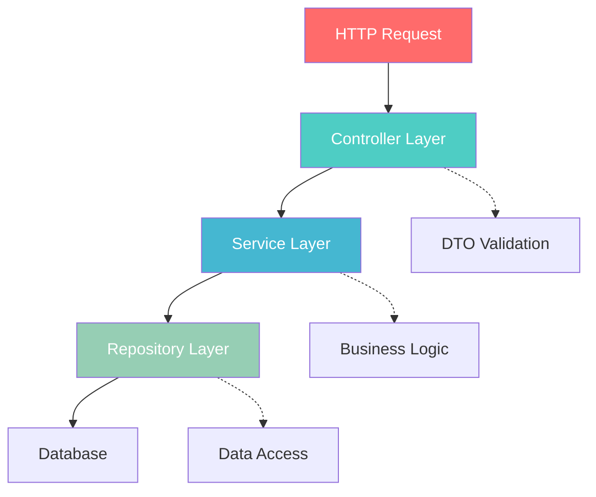
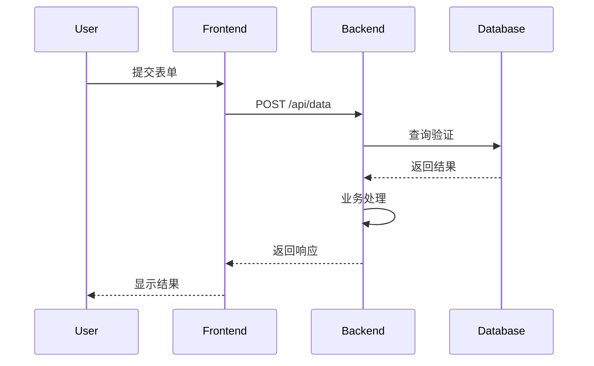
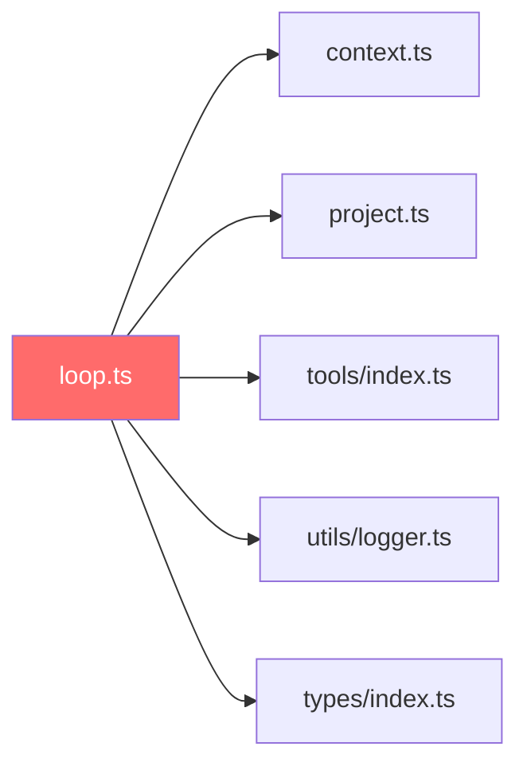
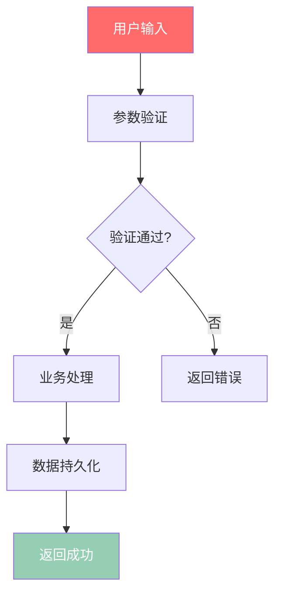

# 阶段2: 深度模块挖掘

> **时长**: 30-40分钟  
> **目标**: 对核心模块进行深度分析,提取架构设计和关键流程  
> **输入**: 阶段1的模块优先级列表  
> **输出**: 深度分析报告、数据流图、架构图

---

## 🎯 目标

对高优先级核心模块进行深度技术分析,提取:
- 模块职责和设计原理
- 数据流转和调用关系  
- 架构模式和设计思想
- 关键业务流程和技术实现

确保生成的文档包含详细的架构图、流程图和模块介绍，满足高质量wiki文档库的要求。

---

## 📋 执行步骤

### Step 2.1: 核心模块代码分析

针对每个高优先级模块执行深度分析:

#### 分析检查清单

```markdown
✅ 类/函数职责识别
- [ ] 导出的类/函数列表
- [ ] 每个类的职责 (单一职责原则验证)
- [ ] 公开API vs 内部实现
- [ ] 接口设计和抽象层次

✅ 依赖关系分析  
- [ ] 依赖了哪些模块 (import语句分析)
- [ ] 被哪些模块依赖 (反向引用搜索)
- [ ] 循环依赖检测
- [ ] 依赖关系可视化

✅ 设计模式识别
- [ ] 使用的设计模式 (单例/工厂/观察者/策略/装饰器等)
- [ ] 为什么使用该模式
- [ ] 模式实现的关键代码
- [ ] 模式带来的优势和代价

✅ 核心流程提取
- [ ] 主要方法的执行流程
- [ ] 异步调用链和Promise链
- [ ] 错误处理机制和异常边界
- [ ] 性能关键路径分析
```

#### 代码分析脚本

```bash
# 分析模块导出
function analyze_exports() {
  local file=$1
  echo "## 导出分析: $(basename $file)"
  
  # 提取导出声明
  grep -n "^export" "$file" | while read line; do
    echo "- $line"
  done
  
  # 提取类定义
  grep -n "^class\|^interface\|^type\|^enum" "$file" | while read line; do
    echo "- $line"
  done
}

# 分析依赖关系
function analyze_dependencies() {
  local file=$1
  echo "## 依赖分析: $(basename $file)"
  
  # 提取 import 语句
  grep -n "^import\|^from" "$file" | sed 's/.*import\|from//' | \
    sed "s/'//g; s/\"//g; s/.*\///; s/;//" | sort | uniq | while read dep; do
    echo "- 依赖: $dep"
  done
  
  # 反向搜索谁依赖了这个文件
  module_name=$(basename "$file" .ts)
  references=$(grep -r "import.*$module_name\|from.*$module_name" src/ | wc -l)
  echo "- 被引用次数: $references"
}
```

### Step 2.2: 数据流追踪

#### 数据流分析方法

```markdown
目标: 追踪关键数据在系统中的完整流转路径

追踪方法:
1. **识别核心数据结构** - 查找 interface/type 定义
2. **追踪数据创建点** - 构造函数、工厂方法、API响应
3. **追踪数据转换点** - mapping、transform、数据处理函数  
4. **追踪数据消费点** - 渲染、存储、输出、网络请求

输出要求:
- Mermaid Sequence Diagram 序列图
- 数据状态变化说明
- 关键转换逻辑标注
```

#### 数据流追踪脚本

```bash
# 追踪特定类型的数据流
function track_data_flow() {
  local data_type=$1
  local start_file=$2
  
  echo "追踪数据类型: $data_type"
  echo "起始文件: $start_file"
  
  # 查找数据定义
  grep -rn "interface.*$data_type\|type.*$data_type" src/ | head -5
  
  # 查找创建点
  echo "## 数据创建点"
  grep -rn "new.*$data_type\|$data_type.*=\|create$data_type" src/ | head -5
  
  # 查找使用点
  echo "## 数据使用点"
  grep -rn "$data_type" src/ | grep -v "interface\|type" | head -10
}

# 示例: 追踪用户数据流
track_data_flow "User" "src/types/user.ts"
```

### Step 2.3: 架构模式提取

#### 架构分析问题清单

```markdown
1. **分层架构分析**
   - 是否有明确的分层? (UI/业务/数据/基础设施)
   - 各层职责边界是否清晰?
   - 层间通信机制是什么? (事件、回调、消息队列)
   - 是否存在层间越权调用?

2. **模块化设计分析**
   - 模块划分原则是什么? (功能、领域、技术)
   - 模块间耦合度如何? (高内聚低耦合评估)
   - 是否支持插件化或可扩展?
   - 模块接口设计是否稳定?

3. **关键抽象分析**
   - 核心接口/抽象类有哪些?
   - 抽象的目的是什么? (解耦、扩展、测试)
   - 实现类有哪些? 是否符合里氏替换原则?
   - 抽象层次是否合理?

4. **设计原则验证**
   - 单一职责原则 (SRP) 符合度
   - 开闭原则 (OCP) 符合度  
   - 依赖倒置原则 (DIP) 符合度
   - 接口隔离原则 (ISP) 符合度
```

#### 架构图生成



### Step 2.4: 关键流程图生成

#### 必须生成流程图的场景

```markdown
1. **用户操作流程** (用户视角)
   - 用户输入 → 系统处理 → 输出结果
   - 涉及: 表单提交、按钮点击、导航跳转
   
2. **核心业务流程** (业务视角)  
   - 订单创建 → 支付 → 发货 → 完成
   - 涉及: 状态机转换、业务规则验证
   
3. **技术实现流程** (技术视角)
   - 请求接收 → 路由分发 → 业务处理 → 响应返回
   - 涉及: 中间件链、错误处理、异步操作

4. **数据流转流程** (数据视角)
   - 数据创建 → 转换处理 → 存储消费
   - 涉及: 数据格式转换、验证清洗
```

#### 流程图类型选择指南

```markdown
- **简单线性流程**: Mermaid Flowchart (流程图)
- **复杂交互流程**: Mermaid Sequence Diagram (序列图)  
- **状态转换流程**: Mermaid State Diagram (状态图)
- **决策分支流程**: Mermaid Flowchart with conditionals
- **并行处理流程**: Mermaid Flowchart with parallel paths
```

#### 序列图示例



---

## 📊 输出产物

```
wikirepo/analysis/
├── core-modules/
│   ├── loop-analysis.md           # Loop模块深度分析
│   ├── context-analysis.md        # Context模块深度分析
│   └── project-analysis.md         # Project模块深度分析
├── data-flow-diagrams/
│   ├── user-data-flow.mmd         # 用户数据流转
│   ├── message-flow.mmd           # 消息流转
│   └── tool-execution-flow.mmd    # 工具执行流程
├── architecture-patterns.md        # 架构模式总结
└── design-decisions.md            # 设计决策记录
```

### 1. 核心模块深度分析报告

**文件格式**: `core-modules/[模块名]-analysis.md`

```markdown
# Loop 模块深度分析

> 源码位置: `src/loop.ts:1-450`  
> 优先级: ⭐⭐⭐⭐⭐ (权重: 45)  
> 分析耗时: 8.2 分钟

## 📋 模块概览

### 核心职责
1. **AI 任务调度** - 管理AI任务的执行队列和优先级
2. **状态管理** - 维护会话状态和执行上下文  
3. **错误处理** - 捕获和处理执行过程中的异常
4. **性能监控** - 跟踪任务执行时间和资源使用

### 技术指标
- **代码行数**: 450 LOC
- **导出函数**: 5 个
- **依赖模块**: 8 个
- **被引用次数**: 15 次

## 🏗️ 架构设计

### 设计模式
- **观察者模式** - 用于状态变更通知
- **策略模式** - 不同的任务执行策略
- **工厂模式** - 创建不同类型的任务处理器

### 依赖关系


## 🔄 核心流程

### 主执行流程

```mermaid
sequenceDiagram
    participant User
    participant Loop
    participant Context
    participant Tools
    
    User->>Loop: 执行任务
    Loop->>Context: 获取上下文
    Context-->>Loop: 返回上下文数据
    Loop->>Tools: 调用工具
    Tools-->>Loop: 返回工具结果
    Loop->>Loop: 处理结果
    Loop-->>User: 返回最终响应
```

### 关键代码解析

#### 1. `executeTask()` 函数
**位置**: `src/loop.ts:150-200`

```typescript
async function executeTask(task: Task, context: Context): Promise<Result> {
  try {
    // 1. 验证任务参数
    validateTask(task);
    
    // 2. 准备执行上下文
    const executionContext = prepareContext(context, task);
    
    // 3. 执行任务逻辑
    const result = await runTaskLogic(task, executionContext);
    
    // 4. 处理执行结果
    return processResult(result);
  } catch (error) {
    // 5. 错误处理和恢复
    return handleError(error, task, context);
  }
}
```

**设计要点**:
1. 完整的错误处理链条
2. 上下文隔离设计
3. 异步任务管理
4. 资源清理机制

## 🎯 性能考虑

### 内存管理
- 使用 WeakMap 存储临时上下文
- 及时释放不再使用的引用
- 避免内存泄漏模式

### 执行效率
- 批量处理类似任务
- 使用缓存减少重复计算
- 优化关键路径执行时间

## 📝 使用示例

### 基础用法

```typescript
import { executeTask } from './loop';
import { createTask } from './types';

const task = createTask({
  type: 'analysis',
  input: '需要分析的代码',
  options: { depth: 'deep' }
});

const result = await executeTask(task, currentContext);
```

### 高级用法

```typescript
// 自定义任务处理器
Loop.registerHandler('custom-task', async (task, context) => {
  // 自定义处理逻辑
  return { success: true, data: processedData };
});
```

## ⚠️ 常见问题

### Q1: 任务执行超时怎么办?
A: 系统内置超时机制，默认30秒超时，可通过配置调整。

### Q2: 如何监控任务执行状态?
A: 使用 `Loop.getTaskStatus(taskId)` 查询任务状态。

### Q3: 支持并发执行吗?
A: 支持有限并发，默认最大并发数为5，可配置。

---

## 🔗 相关文档

- [架构总览](../architecture/overview.md)
- [Context 模块分析](./context-analysis.md)
- [数据流转图](../data-flow-diagrams/task-flow.mmd)
```

### 2. 数据流图文件

**文件格式**: `data-flow-diagrams/[数据流名称].mmd`



### 3. 架构模式总结

**文件格式**: `architecture-patterns.md`

```markdown
# 架构模式总结

## 🏗️ 整体架构

### 分层架构
项目采用清晰的三层架构:

| 层级 | 职责 | 核心模块 |
|------|------|----------|
| 表现层 | 处理HTTP请求,参数验证 | controllers/
| 业务层 | 业务逻辑,领域模型 | services/
| 数据层 | 数据访问,持久化 | repositories/

### 模块化设计
- **按功能划分** - 每个功能模块独立
- **接口驱动** - 定义清晰的模块接口
- **依赖注入** - 使用DI容器管理依赖

## 🎯 设计模式应用

### 1. 观察者模式
**应用场景**: 状态变更通知
**实现模块**: `src/observer.ts`
**优势**: 解耦状态生产者与消费者

### 2. 策略模式  
**应用场景**: 不同的任务执行策略
**实现模块**: `src/strategies/`
**优势**: 易于扩展新的执行策略

### 3. 工厂模式
**应用场景**: 创建不同类型的处理器
**实现模块**: `src/factories/`
**优势**: 封装对象创建逻辑
```

---

## 🔧 分析工具和技术

### AST 分析工具

```bash
# 使用 ts-morph 进行AST分析
import { Project } from "ts-morph";

const project = new Project();
const sourceFile = project.addSourceFileAtPath("src/loop.ts");

// 分析类结构
sourceFile.getClasses().forEach(cls => {
  console.log(`类: ${cls.getName()}`);
  console.log(`方法数: ${cls.getMethods().length}`);
});
```

### 依赖分析工具

```bash
# 使用 madge 生成依赖图
npx madge --extensions ts,tsx --image architecture-graph.svg src/

# 使用 dependency-cruiser 验证架构
npx dependency-cruiser --validate .dependency-cruiser.json src/
```

---

## 🎯 质量要求

- **分析深度**: 覆盖所有核心模块的90%+代码
- **准确性**: 代码引用准确到具体行号
- **完整性**: 包含所有重要流程和架构模式
- **可读性**: 图表清晰，说明详细
- **实用性**: 能为开发和维护提供实际价值

---

**下一阶段**: [阶段3: 结构化文档生成](../04-phase3-documentation-generation.md)