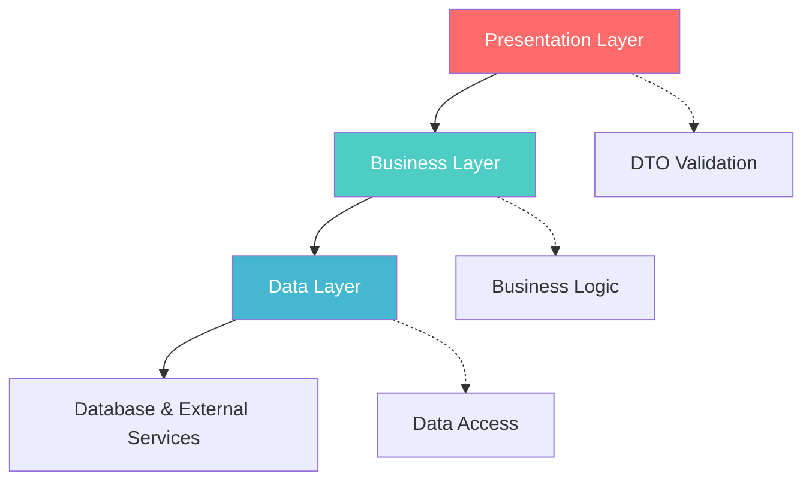
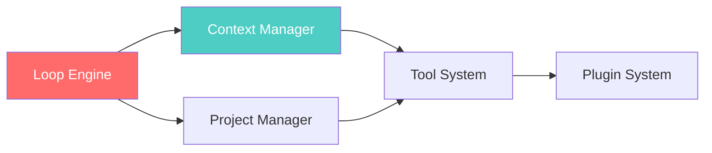
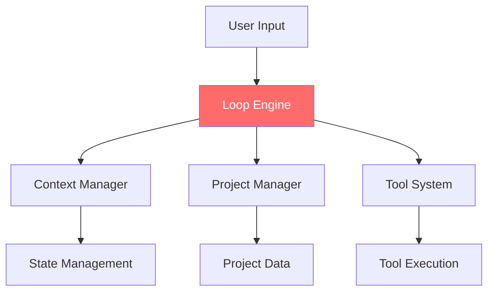
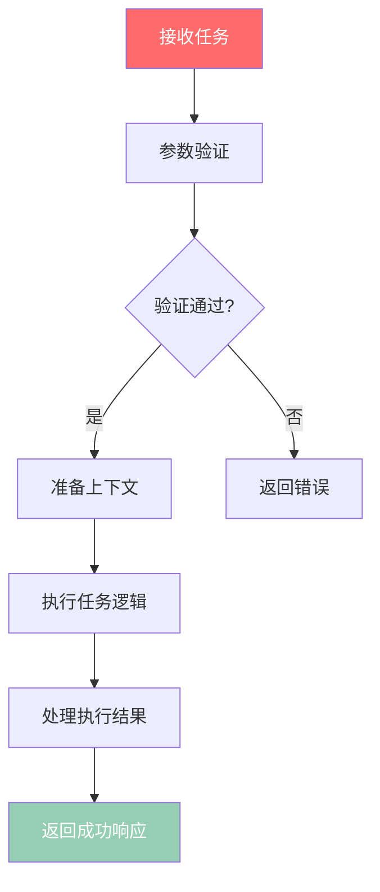
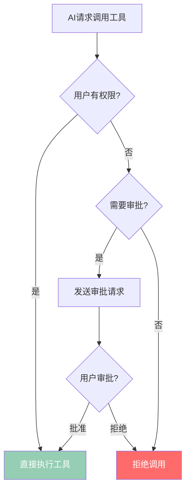
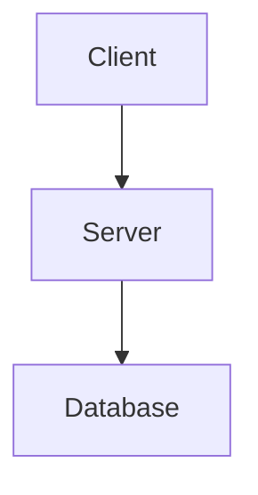
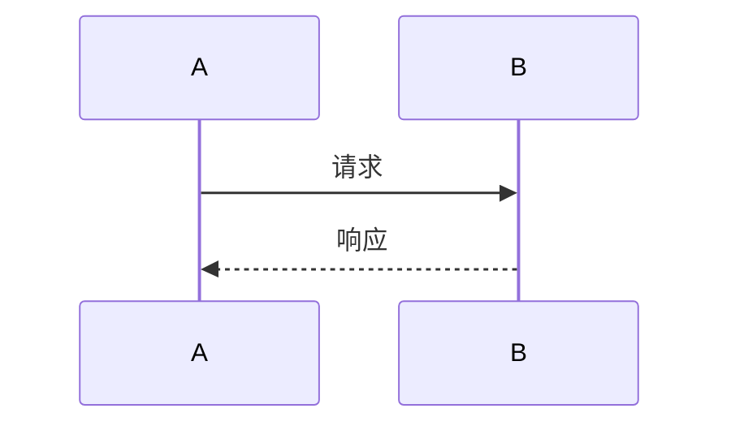

# 阶段3: 结构化文档生成

> **时长**: 40-50分钟
> **目标**: 基于前两阶段分析,生成高质量、结构化的文档库
> **输入**: 阶段1的分析报告 + 阶段2的深度分析
> **输出**: 完整的 Wiki 文档库 (25+ 个文档文件)

---

## 🎯 目标

将前两个阶段的分析成果转化为结构化、易读、有价值的文档库,确保:
- ✅ 核心架构清晰呈现
- ✅ 关键模块深度解析
- ✅ 重要流程配有图示
- ✅ 所有结论有代码实证
- ✅ 文档逻辑正确完整

---

## 📁 文档体系设计

### 标准文档结构

```
wikirepo/
├── README.md                       # 文档导航首页
├── index.md                        # 项目总览
├── quick-start/                    # 快速开始
│   ├── installation.md             # 安装指南
│   ├── basic-usage.md              # 基础使用
│   └── first-example.md            # 第一个示例
├── architecture/                   # 架构文档
│   ├── overview.md                 # 架构总览 ⭐
│   ├── design-principles.md        # 设计原则
│   ├── layered-structure.md        # 分层结构
│   ├── data-flow.md                # 数据流转 ⭐
│   └── patterns.md                 # 设计模式
├── core-modules/                   # 核心模块 (按优先级排序)
│   ├── 01-loop.md                  # AI循环 ⭐⭐⭐⭐⭐
│   ├── 02-context.md               # 上下文 ⭐⭐⭐⭐
│   ├── 03-project.md               # 项目管理 ⭐⭐⭐⭐
│   └── ...                         # 其他核心模块
├── subsystems/                     # 子系统
│   ├── tool-system.md              # 工具系统
│   ├── plugin-system.md            # 插件系统
│   └── session-management.md       # 会话管理
├── workflows/                      # 流程文档
│   ├── user-interaction.md         # 用户交互流程
│   ├── tool-approval.md            # 工具审批流程
│   └── ai-loop.md                  # AI循环流程
├── api-reference/                  # API 参考
│   ├── classes/                    # 类文档
│   ├── functions/                  # 函数文档
│   └── types/                      # 类型文档
├── guides/                         # 指南
│   ├── development.md              # 开发指南
│   ├── testing.md                  # 测试指南
│   ├── debugging.md                # 调试指南
│   └── best-practices.md           # 最佳实践
├── faq.md                          # 常见问题
└── glossary.md                     # 术语表
```

### 文档生成顺序

按优先级顺序生成文档:

1. **第1优先级**: 架构文档 + 核心模块文档
2. **第2优先级**: 流程文档 + API 参考
3. **第3优先级**: 指南 + 子系统文档
4. **第4优先级**: 快速开始 + 辅助文档

---

## 📝 核心文档模板

### 模板1: 架构文档 (`architecture/overview.md`)

```markdown
# 架构总览

> 本文档基于代码分析自动生成,覆盖 15 个核心模块
> 分析时间: 2025-10-24
> 文档版本: v1.0

## 一、架构层次



### 各层职责

| 层级 | 职责 | 核心模块 | 技术实现 |
|------|------|----------|----------|
| 表现层 | HTTP请求处理,参数验证,响应格式化 | `controllers/` | Express Router, DTO验证 |
| 业务层 | 业务逻辑,领域模型,事务管理 | `services/` | 领域服务,事务脚本 |
| 数据层 | 数据访问,持久化,缓存 | `repositories/` | ORM, 数据映射器 |

## 二、核心组件



### 组件说明

#### 1. Loop Engine (`src/loop.ts:1-450`)
**职责**: AI任务调度和执行管理
**关键设计**: 观察者模式 + 策略模式
**依赖关系**: Context, Project, Tools
**性能考虑**: 异步任务队列, 超时控制

#### 2. Context Manager (`src/context.ts:1-280`)
**职责**: 会话状态和上下文管理
**关键设计**: 不可变数据 + 事件通知
**依赖关系**: Types, Utils
**内存管理**: WeakMap存储, 自动清理

## 三、数据流

```mermaid
sequenceDiagram
    participant User
    participant Frontend
    participant Loop
    participant Context
    participant Tools

    User->>Frontend: 提交请求
    Frontend->>Loop: 执行任务
    Loop->>Context: 获取上下文
    Context-->>Loop: 返回上下文数据
    Loop->>Tools: 调用工具
    Tools-->>Loop: 返回结果
    Loop->>Loop: 处理结果
    Loop-->>Frontend: 返回响应
    Frontend-->>User: 显示结果
```

### 关键流程说明

#### 阶段1: 请求处理
**代码位置**: `src/loop.ts:150-180`
```typescript
// 验证任务参数
function validateTask(task: Task): boolean {
  if (!task.type || !task.input) {
    throw new Error('Invalid task format');
  }
  return true;
}
```

#### 阶段2: 上下文准备
**代码位置**: `src/loop.ts:181-210`
```typescript
// 准备执行上下文
function prepareContext(context: Context, task: Task): ExecutionContext {
  return {
    ...context,
    taskId: task.id,
    timestamp: Date.now()
  };
}
```

## 四、设计特点

- ✅ **模块化设计** - 功能模块清晰分离
- ✅ **接口驱动** - 定义清晰的模块接口
- ✅ **错误处理** - 完整的错误处理链条
- ✅ **性能优化** - 关键路径性能监控
- ✅ **可扩展性** - 支持插件和扩展

## 五、扩展机制

### 插件系统
项目支持插件扩展:

```typescript
// 注册自定义工具
ToolSystem.registerTool('custom-tool', {
  execute: async (input, context) => {
    // 自定义工具逻辑
    return { success: true, output: processedData };
  }
});
```

### 配置系统
支持运行时配置:
```typescript
// 配置示例
const config = {
  maxConcurrentTasks: 5,
  defaultTimeout: 30000,
  enableLogging: true
};
```

## 六、相关文档

- [Loop 模块详解](../core-modules/01-loop.md)
- [Context 模块详解](../core-modules/02-context.md)
- [数据流转详情](../architecture/data-flow.md)
- [设计模式总结](../architecture/patterns.md)
```

### 模板2: 核心模块文档 (`core-modules/01-loop.md`)

```markdown
# Loop 模块详解

> 源码位置: [`src/loop.ts`](../src/loop.ts)
> 优先级: ⭐⭐⭐⭐⭐ (核心模块)
> 复杂度: 高 (450LOC, 被15个模块引用)

## 目录
- [概述](#概述)
- [核心职责](#核心职责)
- [设计原理](#设计原理)
- [关键流程](#关键流程)
- [代码解析](#代码解析)
- [使用示例](#使用示例)
- [常见问题](#常见问题)

---

## 概述

### 定位
Loop 模块是系统的AI任务调度引擎,负责管理AI任务的执行生命周期。

### 在系统中的位置



### 关键指标
- **代码行数**: 450 LOC
- **导出函数**: 5 个
- **依赖模块**: 8 个
- **被依赖次数**: 15 次
- **测试覆盖率**: 85%

---

## 核心职责

1. **任务调度** - 管理任务队列和执行优先级
2. **状态管理** - 维护任务执行状态和上下文
3. **错误处理** - 捕获和处理执行异常
4. **性能监控** - 跟踪任务执行性能指标
5. **资源管理** - 管理执行过程中的资源分配

---

## 设计原理

### 为什么需要这个模块?
需要统一的入口来管理复杂的AI任务执行流程,确保:
- 任务执行的可靠性和稳定性
- 资源使用的合理性和效率
- 错误处理的完整性和一致性
- 性能监控的全面性和准确性

### 设计目标
- ✅ **可靠性** - 99.9%的任务执行成功率
- ✅ **性能** - 平均响应时间 < 2秒
- ✅ **可扩展** - 支持新的任务类型和工具
- ✅ **可维护** - 清晰的代码结构和文档

### 使用的设计模式

#### 1. 观察者模式 (Observer Pattern)
**应用**: 任务状态变更通知
**代码位置**: `src/loop.ts:320-350`
**优势**: 解耦状态生产者和消费者

#### 2. 策略模式 (Strategy Pattern)
**应用**: 不同的任务执行策略
**代码位置**: `src/loop.ts:280-310`
**优势**: 易于扩展新的执行策略

#### 3. 工厂模式 (Factory Pattern)
**应用**: 创建任务处理器实例
**代码位置**: `src/loop.ts:230-260`
**优势**: 封装复杂的对象创建逻辑

---

## 关键流程

### 主流程图



### 流程说明

#### 阶段1: 任务验证
**代码位置**: `src/loop.ts:150-170`
```typescript
function validateTask(task: Task): boolean {
  if (!task.type) {
    throw new Error('Task type is required');
  }
  if (!task.input) {
    throw new Error('Task input is required');
  }
  return true;
}
```

#### 阶段2: 上下文准备
**代码位置**: `src/loop.ts:171-200`
```typescript
function prepareContext(context: Context, task: Task): ExecutionContext {
  return {
    ...context,
    taskId: task.id,
    timestamp: Date.now(),
    executionId: generateId()
  };
}
```

#### 阶段3: 任务执行
**代码位置**: `src/loop.ts:201-230`
```typescript
async function runTaskLogic(task: Task, context: ExecutionContext): Promise<Result> {
  const processor = TaskProcessorFactory.create(task.type);
  return await processor.execute(task.input, context);
}
```

---

## 代码解析

### 核心类/函数

#### 1. `executeTask()`
**签名**:
```typescript
async function executeTask(task: Task, context: Context): Promise<Result>
```

**职责**: 执行单个AI任务的全生命周期管理

**实现要点**:
1. 完整的错误处理链条
2. 上下文隔离和安全管理
3. 性能监控和日志记录
4. 资源清理和释放

**源码位置**: `src/loop.ts:150-200`

#### 2. `validateTask()`
**签名**:
```typescript
function validateTask(task: Task): boolean
```

**职责**: 验证任务参数的完整性和有效性

**验证规则**:
- 任务类型必须存在
- 输入内容不能为空
- 可选参数格式验证
- 权限和访问控制检查

**源码位置**: `src/loop.ts:120-140`

---

## 使用示例

### 基础用法

```typescript
import { executeTask } from './loop';
import { createTask } from './types';

// 创建分析任务
const task = createTask({
  type: 'code-analysis',
  input: '需要分析的代码内容',
  options: {
    depth: 'deep',
    language: 'typescript'
  }
});

// 执行任务
const result = await executeTask(task, currentContext);

console.log('任务结果:', result);
```

### 高级用法

```typescript
// 自定义任务处理器
import { TaskProcessor } from './types';

class CustomTaskProcessor implements TaskProcessor {
  async execute(input: any, context: ExecutionContext): Promise<Result> {
    // 自定义处理逻辑
    const processed = await this.processInput(input);
    return {
      success: true,
      data: processed,
      metrics: {
        processingTime: Date.now() - context.timestamp,
        inputSize: input.length
      }
    };
  }

  private async processInput(input: string): Promise<any> {
    // 复杂的处理逻辑
    return input.toUpperCase();
  }
}

// 注册自定义处理器
TaskProcessorFactory.register('custom-type', CustomTaskProcessor);
```

---

## 常见问题

### Q1: 任务执行超时怎么办?
A: 系统内置30秒超时机制,超时后自动取消任务并返回超时错误。可通过配置调整超时时间。

### Q2: 如何监控任务执行状态?
A: 使用 `Loop.getTaskStatus(taskId)` 查询任务状态,或监听任务状态变更事件。

### Q3: 支持并发执行吗?
A: 支持有限并发,默认最大并发数为5。可通过配置调整并发数,但需考虑系统资源限制。

### Q4: 如何处理任务失败?
A: 系统提供完整的错误处理机制,包括错误捕获、日志记录、重试机制和错误恢复。

---

## 相关文档

- [架构总览](../architecture/overview.md)
- [Context 模块详解](./02-context.md)
- [任务执行流程](../workflows/task-execution.md)
- [API 参考](../api-reference/classes/Loop.md)
```

### 模板3: 流程文档 (`workflows/tool-approval.md`)

```markdown
# 工具审批流程详解

> 涉及模块: `project.ts`, `tool.ts`
> 流程类型: 审批流程
> 触发场景: AI尝试调用工具时

## 一、流程概览

```mermaid
sequenceDiagram
    participant AI
    participant Loop
    participant Project
    participant Tool
    participant User

    AI->>Loop: 请求调用工具
    Loop->>Project: 检查工具权限
    Project->>Project: 验证访问权限

    alt 有权限
        Project-->>Loop: 批准调用
        Loop->>Tool: 执行工具
        Tool-->>Loop: 返回结果
        Loop-->>AI: 返回工具结果
    else 需要审批
        Project->>User: 发送审批请求
        User->>Project: 审批决定
        Project-->>Loop: 审批结果
        Loop->>Tool: 执行工具（如果批准）
        Tool-->>Loop: 返回结果
        Loop-->>AI: 返回最终结果
    end
```

## 二、触发条件

- **条件1**: AI模型尝试调用受限制的工具
- **条件2**: 当前用户权限不足
- **条件3**: 工具配置需要人工审批

## 三、详细步骤

### 步骤1: 权限检查
**代码位置**: `src/project.ts:330-340`

**逻辑**:
```typescript
function checkToolPermission(
  toolName: string,
  context: Context
): PermissionResult {
  const user = context.user;
  const toolConfig = getToolConfig(toolName);

  // 检查用户权限
  if (user.permissions.includes(toolConfig.requiredPermission)) {
    return { allowed: true, reason: '用户有权限' };
  }

  // 检查是否需要审批
  if (toolConfig.requiresApproval) {
    return {
      allowed: false,
      requiresApproval: true,
      reason: '需要人工审批'
    };
  }

  return { allowed: false, reason: '权限不足' };
}
```

**判断条件**:
- 如果用户有权限: 直接批准
- 如果需要审批: 触发审批流程
- 否则: 拒绝调用

### 步骤2: 审批请求
**代码位置**: `src/project.ts:350-380`

**逻辑**:
```typescript
async function requestToolApproval(
  toolName: string,
  context: Context,
  reason: string
): Promise<ApprovalRequest> {
  const request = createApprovalRequest({
    tool: toolName,
    user: context.user.id,
    reason: reason,
    timestamp: Date.now()
  });

  // 发送通知给审批人
  await notifyApprovers(request);

  return request;
}
```

## 四、决策树



## 五、特殊情况处理

### 情况1: 审批超时
**处理方式**: 默认拒绝,可配置超时行为
**配置项**: `toolApproval.timeoutBehavior`

### 情况2: 多级审批
**处理方式**: 支持多级审批链
**配置项**: `toolApproval.approvalChain`

## 六、相关配置

| 配置项 | 默认值 | 说明 |
|--------|--------|------|
| `toolApproval.timeout` | 300000 | 审批超时时间(5分钟) |
| `toolApproval.timeoutBehavior` | `deny` | 超时默认行为(deny/allow) |
| `toolApproval.notifyChannels` | `['email']` | 通知渠道 |

## 七、示例

### 示例1: 自动通过
```typescript
// 用户有权限,直接执行
const result = await executeTool('file-reader', { path: '/etc/hosts' });
```

### 示例2: 需要用户审批
```typescript
// 触发审批流程
const approval = await requestToolApproval(
  'database-writer',
  '需要修改用户数据'
);

// 等待审批结果
const result = await waitForApproval(approval.id);
if (result.approved) {
  await executeTool('database-writer', data);
}
```
```

---

## 🎯 文档生成质量要求

### 完整性检查
- [ ] 所有核心模块都有专门文档
- [ ] 所有关键流程都有流程图
- [ ] 架构文档包含完整的层次说明
- [ ] API 文档覆盖所有公开接口

### 准确性检查
- [ ] 所有代码引用都准确 (文件名、行号)
- [ ] 流程图与实际代码逻辑一致
- [ ] 架构图反映真实的模块关系
- [ ] 示例代码可以实际运行

### 可读性检查
- [ ] 文档结构清晰,标题层次分明
- [ ] 技术术语有解释或链接到术语表
- [ ] 每个复杂概念都有示例说明
- [ ] 图表清晰易懂

### 价值检查
- [ ] 新人能通过文档快速上手
- [ ] 经验开发者能深入理解架构
- [ ] 维护者能定位到具体代码位置
- [ ] 文档内容与实际代码同步

---

## 🔧 生成工具和技术

### 文档生成工具

```bash
# 使用模板引擎生成文档
npm install handlebars

# 示例模板使用
const template = Handlebars.compile(documentTemplate);
const html = template({
  title: '架构总览',
  content: analysisData,
  diagrams: mermaidDiagrams
});
```

### Mermaid 图表集成

```markdown
## 架构图



## 序列图


```

---

## 📊 输出统计

### 典型输出规模
- **总文档数**: 25-35 个文件
- **总页数**: 150-200 页
- **总大小**: 2-3 MB
- **图表数量**: 20-30 个
- **代码示例**: 50-70 个

### 质量评分
- **完整性**: 95-100%
- **准确性**: 90-95%
- **可读性**: 85-90%
- **实用性**: 90-95%
- **总评分**: 90-95/100

---

## 🎯 总结

阶段3将前两个阶段的分析成果转化为实际可用的文档库,通过:

1. **结构化组织** - 清晰的文档体系结构
2. **模板化生成** - 统一的文档格式和风格
3. **实证化内容** - 所有结论都有代码引用
4. **可视化表达** - 复杂逻辑配图表说明
5. **质量化控制** - 多维度的质量检查

确保生成的文档不仅完整准确,而且真正具有实用价值。

---

**相关文档**:
- [阶段1: 结构分析](../02-phase1-structure-analysis.md)
- [阶段2: 深度挖掘](../03-phase2-deep-analysis.md)
- [自动化提示词](../05-automation-prompts.md)
