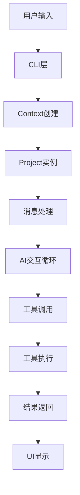

# 架构文档

## 系统架构概述

Neovate Code 采用模块化架构设计，各组件职责清晰，通过依赖注入和消息总线实现松耦合。整体架构可以分为以下几个层次：

1. **CLI层**: 命令行接口，处理用户输入和参数解析
2. **核心应用层**: 包含Context、Project等核心业务逻辑
3. **工具层**: 提供各种工具实现（读写、执行命令等）
4. **MCP集成层**: 与外部AI服务和工具的集成
5. **UI层**: 终端和浏览器UI组件
6. **插件层**: 支持功能扩展

## 核心组件

### 1. Context 上下文管理

Context 是整个应用的核心，作为依赖注入容器管理所有核心依赖：

- 配置管理
- 插件生命周期
- 路径管理
- MCP管理器

### 2. Project 项目核心

Project 类负责业务逻辑处理：

- 会话管理
- 消息处理
- AI交互循环
- 工具审批

### 3. 工具系统

工具系统是Neovate与文件系统、shell和其他系统交互的主要方式：

- 只读工具（read, ls, glob, grep, fetch）
- 写入工具（write, edit, bash）
- 待办工具（todo read/write）
- MCP工具

### 4. 会话管理

会话管理实现持久化和恢复功能，确保对话连续性。

### 5. MCP集成

通过Model Context Protocol集成外部AI服务和工具。

## 数据流

## 组件交互

### CLI与核心应用

CLI层负责解析命令行参数，创建Context实例，然后根据参数选择运行模式（交互式或安静模式）。

### Context与插件

Context在创建过程中会扫描和加载插件，并触发插件的钩子函数，允许插件扩展功能。

### Project与工具

Project在处理消息时会解析可用工具，并在AI交互循环中调用这些工具。

### 工具与MCP

工具系统支持通过MCP集成外部工具，扩展Neovate的功能。

## 设计原则

1. **模块化**: 各组件职责单一，易于维护和扩展
2. **依赖注入**: 通过Context管理依赖，降低耦合度
3. **安全性**: 完善的工具审批机制，防止危险操作
4. **可扩展性**: 支持插件和MCP工具扩展
5. **高性能**: 智能路由和差异化工具集提升性能

## 架构优势

- **灵活的配置管理**: 支持多层级配置（命令行、项目、全局）
- **完善的会话管理**: 支持会话持久化和恢复
- **强大的工具系统**: 提供丰富的工具集
- **安全的执行环境**: 多层安全检查和审批机制
- **良好的扩展性**: 插件系统和MCP集成支持功能扩展
